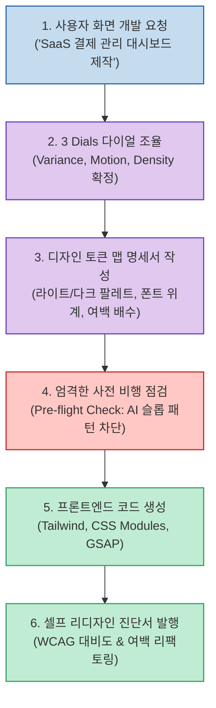

Claude Code, Cursor, Codex 등 최신 AI 코딩 도구들을 활용하면 백엔드 로직이나 데이터베이스 스키마는 눈 깜짝할 사이에 훌륭하게 작성됩니다. 하지만 웹 프론트엔드 화면을 만들라고 시키면 누구나 한 번쯤 깊은 탄식을 내뱉게 됩니다.

동작은 분명히 잘 되는데, 완성된 화면을 보면 하나같이 붕어빵으로 찍어낸 듯 촌스럽고 몰개성합니다. 기계적인 회색 그라데이션, 어색한 박스 여백, 뻔한 3단 카드 그리드, 대비가 엉망인 다크 모드 등 이른바 **'AI 슬롭(Generic AI Slop)'** 특유의 이질감이 화면을 뒤덮기 때문입니다.

이 문제를 해결하기 위해 등장한 오픈소스가 바로 GitHub 스타 8.9만 개를 돌파한 **Taste Skill (Leonxlnx/taste-skill)** 입니다. 모델을 새로 학습시키거나 비싼 SaaS를 구독할 필요 없이, 단 하나의 마크다운 스킬(`SKILL.md`)을 에이전트에 주입하여 전문 시니어 디자이너 수준의 감각(Taste)을 발휘하도록 강제하는 방법론을 살펴봅니다.

<!--more-->

## Sources

- [공식 웹사이트: tasteskill.dev](https://tasteskill.dev)
- [GitHub 저장소: Leonxlnx/taste-skill](https://github.com/Leonxlnx/taste-skill)
- [X(Twitter) 원문: @ClaudeCode_love 트윗](https://x.com/ClaudeCode_love/status/2101974215520121092)

---

## 1. AI 슬롭 방지 4단계 워크플로우 아키텍처

Taste Skill은 코드를 작성하기 전에 에이전트가 반드시 거쳐야 하는 **사전 비행 점검(Pre-flight Check)** 과 **디자인 규격화(Design System Mapping)** 를 강제합니다.



---

## 2. 3 Dials: AI의 심미성을 제어하는 세 가지 다이얼

Taste Skill의 핵심 설계 메커니즘은 직관적인 세 가지 축(3 Dials)으로 UI의 성격을 사전 조율하는 것입니다:

1. **Variance (변주도: 1 ~ 10)**:
   - 기계적인 바둑판 그리드를 벗어나는 정도를 결정합니다.
   - 높은 값을 주면 비대칭 분할 레이아웃, 오프셋 타이포그래피, 과감한 오버레이 카드를 채택하여 단조로움을 파괴합니다.
2. **Motion (동적 감도: 1 ~ 10)**:
   - 인터랙션 및 애니메이션의 깊이를 결정합니다.
   - 단순한 `hover:opacity-80` 대신, GSAP 또는 Framer Motion 기반의 스프링 물리 스케일링, 스태거드(Staggered) 리스트 등장 효과 등을 적용합니다.
3. **Density (정보 밀도: 1 ~ 10)**:
   - 금융 터미널처럼 고밀도로 많은 데이터를 담아야 하는지, 마케팅 랜딩 페이지처럼 넓은 여백(Negative Space)으로 호흡을 주어야 하는지 명확히 규정합니다.

---

## 3. 원클릭 설치 및 주요 서브 스킬

Claude Code, Cursor, Codex 환경에서 CLI 명령 한 줄로 즉시 설치할 수 있습니다:

```bash
# 전체 스킬 세트 설치
npx skills add https://github.com/Leonxlnx/taste-skill

# 메인 안티-슬롭 디자인 엔진만 핀포인트 설치
npx skills add https://github.com/Leonxlnx/taste-skill --skill "design-taste-frontend"
```

- **`design-taste-frontend`**: v2 핵심 프론트엔드 안티-슬롭 규칙 엔진 (Tailwind v4 대응).
- **`gpt-taste`**: GPT/Codex 모델 계열을 위한 더 엄격한 레이아웃 강제 모드.
- **`image-to-code`**: 디자이너의 레퍼런스 시안이나 스크린샷을 정밀 분석한 뒤 토큰 단위로 코드를 복원하는 이미지 퍼스트 파이프라인.
- **`redesign-existing-projects`**: 이미 촌스럽게 짜인 기존 레거시 프론트엔드 화면을 리팩토링할 때 자체 디자인 감사 리포트를 발행하고 개선하는 모듈.

---

## 4. 실무 도입 효과: 프롬프트 지침으로 완성하는 상용 품질

Taste Skill은 "더 똑똑한 신규 모델을 기다릴 필요 없이, 에이전트의 사고 절차를 규격화하는 것만으로 결과물의 품질을 극적으로 바꿀 수 있다"는 사실을 증명합니다. 

특히 1인 개발자나 풀스택 엔지니어가 전문 디자이너 없이 혼자서 프로덕트를 론칭할 때, 초기 인상(First Impression)을 결정짓는 UI의 세련미를 확보하는 데 필수적인 무기가 될 것입니다.
