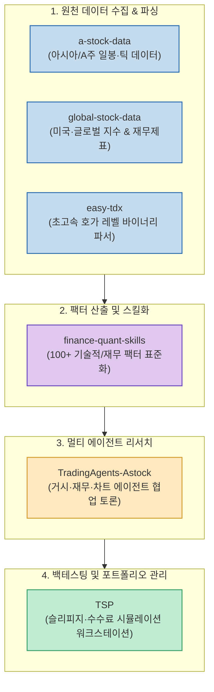

개인 투자자나 소규모 리서치 팀이 기관 수준의 정량 투자(Quant Trading) 시스템을 구축하려면 엄청난 데이터 비용과 복잡한 인프라 장벽에 부딪히게 됩니다. 블룸버그 터미널이나 유료 금융 API는 매월 수백만 원을 호가하며, 수집한 시계열 데이터를 백테스팅 엔진에 태우고 리서치 보고서를 작성하는 과정은 방대한 엔지니어링 노동을 요구합니다.

하지만 최근 오픈소스 생태계에서는 무료 공공 데이터 피드와 고속 파싱 라이브러리, 그리고 LLM 기반 멀티 에이전트 프레임워크가 결합하면서 **"1인 풀스택 AI 헤지펀드"** 시스템 구축이 현실화되고 있습니다.

X(Twitter)의 퀀트 엔지니어 **@_zheergen** 님이 엄선한 **AI 주식 퀀트 투자 6대 핵심 오픈소스** 를 파이프라인 단계별로 분류하고, 이를 조합해 실전 자동화 워크스테이션을 만드는 아키텍처를 소개합니다.

<!--more-->

## Sources

- [X(Twitter) 원문: @_zheergen 트윗](https://x.com/_zheergen/status/2101989431381225756)

---

## 1. 1인 AI 퀀트 시스템의 4단계 엔드투엔드 파이프라인

6대 프로젝트는 데이터 수집(Ingestion) ➔ 특징 추출(Feature Engineering) ➔ 멀티 에이전트 합의 리서치(Agentic Research) ➔ 백테스팅 및 실전 체결(Backtesting & Execution)의 4단계로 맞물려 유기적인 파이프라인을 이룹니다.

---

## 2. 6대 핵심 오픈소스 프로젝트 상세 분석

### 1) a-stock-data & global-stock-data: 통합 시계열 데이터 레이크
- **특징**: 국내외 개별 종목의 분봉/일봉/주봉 캔들과 재무제표(손익계산서, 대차대조표), 공시 데이터를 Parquet 또는 DuckDB 형식으로 로컬에 적재합니다.
- **장점**: 불안정한 유료 API에 종속되지 않고, 로컬 디스크에 완전한 오프라인 금융 시계열 데이터베이스를 무상으로 구축할 수 있습니다.

### 2) easy-tdx: C-Python 바인딩 초고속 호가 데이터 피더
- **특징**: 증권사 HTS의 로우 레벨 바이너리 프로토콜을 C 언어로 역직렬화하여 파이썬 판다스(Pandas) 데이터프레임으로 수 밀리초 만에 변환합니다.
- **장점**: 대용량 틱 데이터를 초고속으로 메모리에 적재하여 팩터 연산 시 병목을 없애줍니다.

### 3) finance-quant-skills: LLM 전용 퀀트 팩터 레지스트리
- **특징**: 이동평균선(SMA/EMA), 볼린저 밴드, 모멘텀, 변동성, 밸류에이션 지표 등 100여 개 이상의 전문 팩터 연산 함수를 도구(Tool Call) 형태로 패키징했습니다.
- **장점**: Claude Code나 LangChain 에이전트가 "삼성전자 60일 변동성과 PBR 추이를 계산해줘"라는 프롬프트를 받았을 때 파이썬 코드를 짤 필요 없이 즉시 함수를 호출해 결괏값을 뽑아냅니다.

### 4) TradingAgents-Astock: 가상 헤지펀드 멀티 에이전트 토론방
- **특징**: 단일 LLM에 의존하지 않고, **거시경제 애널리스트(Macro)**, **기본적 분석가(Fundamental)**, **기술적 차트 분석가(Technical)**, **리스크 관리관(Risk Officer)** 서브에이전트들이 서로의 의견에 반론을 제기하며 최종 매수/매도 결정을 내립니다.
- **장점**: 단일 모델의 편향(Bias)이나 환각으로 인한 무리한 베팅을 견제하고 다각도의 투자 검증 보고서를 도출합니다.

### 5) TSP (Trading System Platform): 엔터프라이즈급 백테스팅 엔진
- **특징**: 에이전트가 도출한 투자 전략을 지난 10~20년간의 과거 데이터에 대입하여 샤프 지수(Sharpe Ratio), 최대 낙폭(MDD), 회전율, 거래 비용을 엄격히 시뮬레이션합니다.
- **장점**: 현실적인 체결 지연과 슬리피지(Slippage)를 정밀 모델링하여 과최적화(Overfitting)의 덫을 방지합니다.

---

## 3. 실전 구축 및 파이프라인 조립 팁

1. **데이터 저장소 구성**: `a-stock-data`와 `global-stock-data`를 매일 장 마감 후 cron 스케줄로 실행하여 로컬 DuckDB에 일봉과 거래대금을 자동 적재합니다.
2. **에이전트 리서치 루프**: 저녁 시간에 `TradingAgents-Astock`을 구동하여 당일 거래대금 상위 50개 종목을 대상으로 4명의 에이전트 토론을 자동 실행합니다.
3. **주간 백테스트 검증**: 주말마다 `TSP`를 통해 도출된 포트폴리오의 과거 성과와 리스크 지표를 점검하고 리밸런싱 주문을 확정합니다.
