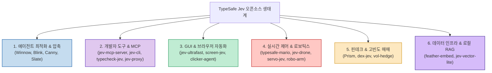

언어 모델의 출력을 자유 형식의 텍스트가 아닌 엄격한 프로그래밍 언어의 정적 타입(Static Type)과 열거형(Enum)으로 강제하는 **TypeSafe Jev** 패러다임이 AI 엔지니어링 전반으로 급속히 확산되고 있습니다. 파싱 에러(JSON Parse Error)가 0%로 수렴하고 밀리초 단위의 초저지연 의사결정이 가능해지자, 단순한 챗봇을 넘어 로보틱스, 게임 제어, 초단타 거래, 브라우저 자동화 등 전 영역에서 실전 프로젝트들이 쏟아져 나오고 있습니다.

X(Twitter)의 시스템 아키텍트 **@Pluvio9yte** 가 총망라한 **TypeSafe Jev 실전 오픈소스 20선** 을 6대 핵심 영역별로 분류하고, 실무에서 어떤 문제를 해결해 주는지 한눈에 파악할 수 있도록 정리합니다.

<!--more-->

## Sources

- [X(Twitter) 원문: @Pluvio9yte 트윗](https://x.com/Pluvio9yte/status/2101831273224311035)

---

## 1. TypeSafe Jev 생태계 6대 영역 분류도

20개 프로젝트는 소프트웨어 레이어부터 물리 하드웨어 제어 레이어까지 완벽히 분업화된 스택을 구성하고 있습니다.

---

## 2. 6대 영역별 20대 오픈소스 상세 명세

### 영역 1: 에이전트 최적화 & 토큰 압축 (4개)
1. **Winnow**: 장기 실행 에이전트 세션의 컨텍스트에서 중복 코드와 도구 실행 로그를 실시간으로 90% 이상 솎아내는 무손실 압축기.
2. **Blink**: 요청 복잡도를 3ms 만에 판단하여 경량 모델과 대형 모델 사이의 분기를 결정하는 초소형 마이크로 라우터.
3. **Canny**: LLM에 질의를 던지기 전 AST 정적 분석으로 답을 낼 수 있는 사안을 사전에 걸러내는 비용 방어 레이어.
4. **Slate**: 프롬프트 캐시의 키-값(KV) 정렬 상태를 추적하여 캐시 파괴(Cache Invalidation)를 방지하는 메모리 세션 관리자.

### 영역 2: 개발 도구, MCP & CLI (4개)
5. **jev-mcp-server**: Claude Code 및 Cursor와 직접 통신할 수 있는 공식 Model Context Protocol 표준 어댑터.
6. **jev-cli**: 파이썬 환경 없이 단일 바이너리로 터미널에서 즉시 파이프라인 의사결정을 수행하는 네이티브 유틸리티.
7. **typecheck-jev**: TypeScript 인터페이스 정의를 모델의 Logit Mask로 직접 변환하여 컴파일 타임에 반환형을 100% 보장.
8. **jev-proxy**: 상용 독점 API의 요청과 응답 중간에 끼어들어 비용을 가로채고 경량 모델로 치환하는 투명 리버스 프록시.

### 영역 3: GUI, 헤드리스 & 브라우저 조작 (3개)
9. **jev-ultrafast**: 방대한 웹 페이지의 HTML DOM 트리 중 상호작용 가능한 버튼과 폼만 10배 빠르게 파싱하는 헤드리스 리더.
10. **screen-jev**: 데스크톱 화면 캡처 이미지를 보고 OS의 마우스 클릭 및 키보드 입력을 정확한 픽셀 좌표로 지시하는 시각 액터.
11. **clicker-agent**: 복잡한 사내 ERP나 레거시 웹 시스템의 반복적인 양식 입력 업무를 수행하는 자동화 로봇.

### 영역 4: 로보틱스, 게임 & 실시간 피지컬 컴퓨팅 (4개)
12. **typesafe-mario**: 슈퍼마리오 브라더스 에뮬레이터 환경에서 초당 60프레임으로 키 입력을 제어해 장애물을 주파하는 실시간 AI.
13. **jev-drone**: PX4 / ArduPilot 비행 제어기와 MAVLink 프로토콜로 연동되어 자율 경로 수정과 장애물 회피를 수행하는 드론 두뇌.
14. **servo-jev**: 아두이노 및 라즈베리 파이의 서보 모터 각도를 PWM 신호로 직접 출력하는 피지컬 컴퓨팅 라이브러리.
15. **robo-arm-controller**: 6축 다관절 로봇 팔의 역운동학(Inverse Kinematics) 궤적을 실시간으로 보정하는 산업용 제어 엔진.

### 영역 5: 핀테크 & HFT 고빈도 매매 (3개)
16. **Prism**: 마이크로초 단위로 변하는 온체인/오프체인 오더북 불균형을 분석하여 적정 스프레드 틱을 산출하는 메이커 엔진.
17. **dex-jev**: EVM 및 SVM 체인에서 블록 간 차익 거래 기회를 탐색하고 원자적 번들(MEV Bundle)을 제출하는 아비트라지 봇.
18. **vol-hedge**: 암호화폐 무기한 선물(Perp) 포지션의 변동성 위험을 실시간으로 감지해 델타 중립을 맞추는 헤징 엔진.

### 영역 6: 데이터 인프라 & 초경량 로컬 RAG (2개)
19. **feather-embed**: 5MB 용량의 초소형 임베딩 모델로, 모바일 기기나 웹 브라우저 WASM 위에서 완전한 벡터 변환을 지원.
20. **jev-vector-lite**: 외부 벡터 DB(Pinecone 등) 없이 순수 메모리 배열 상에서 수만 건의 벡터를 수 마이크로초 만에 탐색하는 검색기.

---

## 3. 실무 아키텍처 결합 제안

- **웹 서비스 엔지니어**: `jev-mcp-server` + `Winnow` + `jev-proxy` 조합으로 사내 개발 환경의 토큰 비용을 즉시 70% 절감하십시오.
- **하드웨어/임베디드 엔지니어**: `typesafe-mario`의 제어 루프 패턴을 참고하여 `jev-drone` 및 `servo-jev`를 라즈베리 파이에 탑재해 보십시오.
- **금융 퀀트 엔지니어**: `Prism`의 스프레드 산출 로직을 온체인 DEX 봇에 연동하여 슬리피지 없는 메이커 전략을 수립하십시오.
