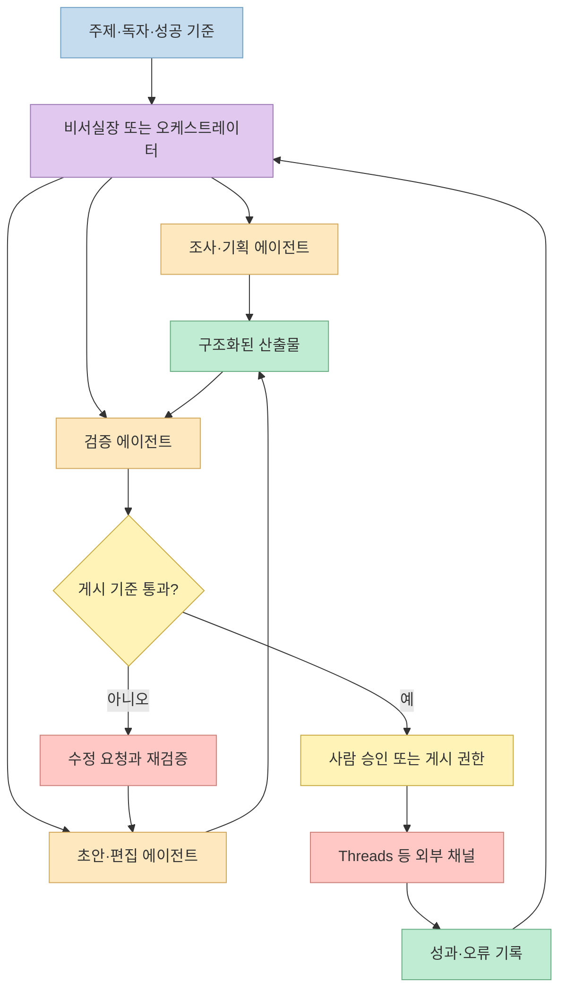
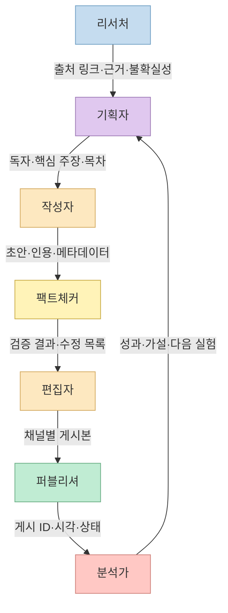
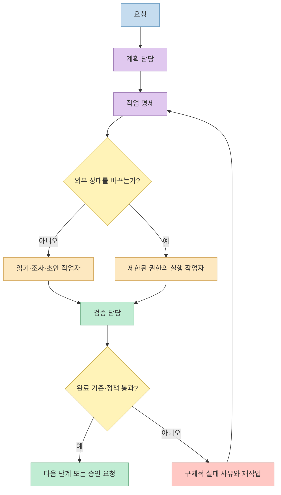
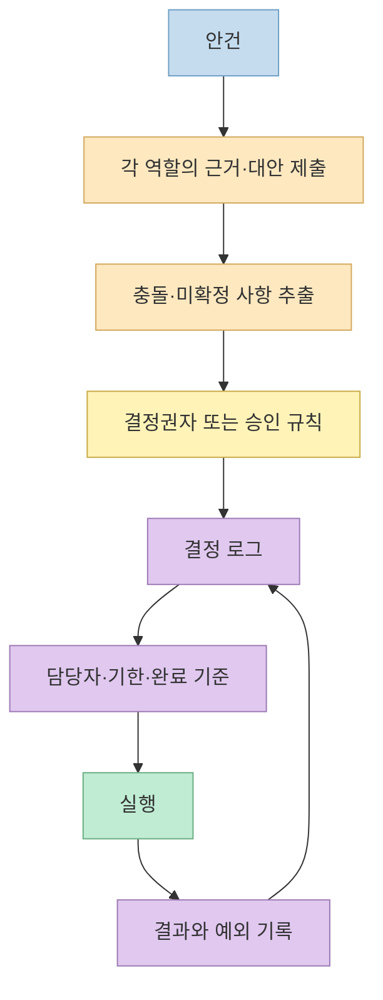
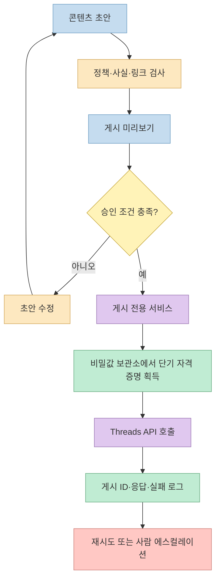
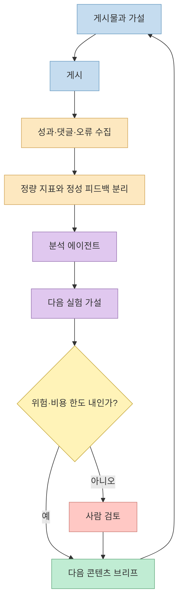
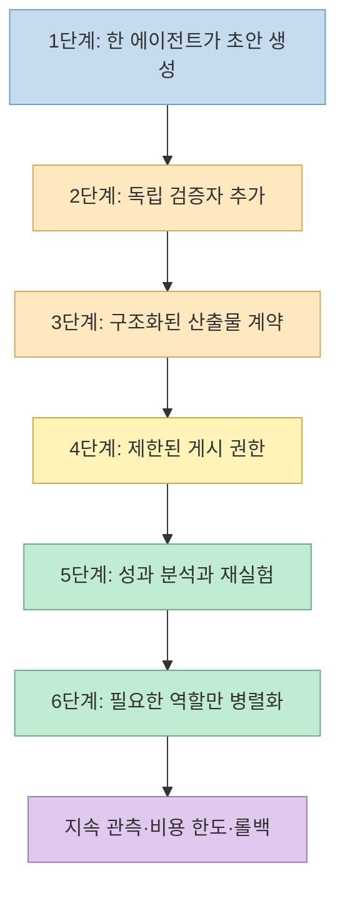
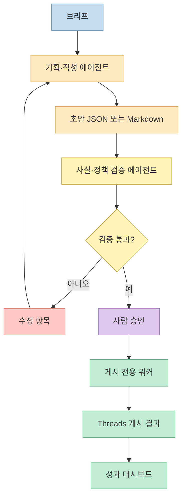

AI 에이전트를 많이 붙이는 일은 곧바로 자동화가 되는 일이 아니다. 각 에이전트에게 업무를 던지고 결과를 모으기만 하면, 같은 조사를 반복하거나 서로 모순되는 글을 만들고, 검수 책임도 사라진다. 중요한 것은 에이전트 수가 아니라 **누가 어떤 산출물을 만들고, 누가 검수하며, 어떤 조건에서 외부 서비스에 게시할지** 를 정하는 운영 구조다.

생존AI의 영상은 개발 경험이 많지 않은 사람의 관점에서 Claude와 GPT 계열 도구를 사용해 여러 AI 직원을 구성하고, 회의·업무 배정·검수·Threads 게시까지 연결하는 과정을 다룬다. 영상 설명에 따라 다루는 범위는 조직 구조, Claude와 Codex의 역할 분담, 계획과 실행, Meta for Developers를 통한 Threads 연결, 첫 게시 뒤 후속 분석과 영상 게시 자동화다. [영상 인트로](https://youtu.be/YAdZ-_mDeoo?t=0) [챕터 목록](https://youtu.be/YAdZ-_mDeoo?t=180)

<!--more-->

## Sources

- [원본 YouTube 영상](https://youtu.be/YAdZ-_mDeoo?si=DJ1kwLv-ADmpBK_x)
- [영상: AI 직원 조직과 역할·프로세스](https://youtu.be/YAdZ-_mDeoo?t=180)
- [영상: Claude·Codex로 계획 수립과 실행](https://youtu.be/YAdZ-_mDeoo?t=526)
- [영상: Meta for Developers와 Threads 연결](https://youtu.be/YAdZ-_mDeoo?t=997)
- [영상: 첫 게시 뒤 분석·영상 게시 자동화](https://youtu.be/YAdZ-_mDeoo?t=1590)
- [OpenAI: Agents API 개요](https://developers.openai.com/api/docs/guides/agents)
- [Anthropic: Claude Code 서브에이전트 활용](https://claude.com/blog/subagents-in-claude-code)
- [Meta for Developers: Threads 문서](https://developers.facebook.com/docs/threads/)

> **수집 메모:** YouTube MCP가 제공되지 않아 `youtube-summarizer` 대체 절차를 적용했습니다. 브라우저에서 영상 메타데이터·설명·챕터·자동 생성 자막 트랙을 확인했습니다. 다만 자막 트랙의 실제 본문은 YouTube 응답에서 비어 있었고, 공개 자막 미러도 접근 제한으로 실패했습니다. 따라서 영상 고유의 사실은 제목·설명·공개 챕터와 타임스탬프로 제한했다. 이 글의 설계 원칙은 해당 범위를 일반화한 실무 제안이며, 영상이 특정 구현을 했다고 단정하지 않는다.

## 1. 영상이 보여주는 것은 “AI 10명”보다 업무 파이프라인이다

영상의 출발점은 AI 직원들이 회의하고, 일을 나누고, 검수한 뒤 실제 SNS 게시까지 가는 흐름이다. 설명에는 “비서실장”이 업무를 배정하고 검수하며 Threads와 연결한다고 적혀 있다. [영상 설명과 인트로](https://youtu.be/YAdZ-_mDeoo?t=0)

이런 시스템을 이해할 때 “열 명을 동시에 실행한다”는 그림보다 산출물의 이동을 먼저 그리는 편이 낫다. 콘텐츠 자동화의 최소 단위는 다음 다섯 단계다.

1. **입력:** 주제, 독자, 채널, 금지 사항, 성공 기준을 받는다.
2. **생산:** 조사·기획·초안·시각 자료·게시물 변환처럼 서로 다른 산출물을 만든다.
3. **검증:** 사실성, 브랜드 톤, 링크, 저작권·보안·플랫폼 정책을 검사한다.
4. **승인:** 외부에 영향을 주는 게시·결제·삭제 같은 행동은 별도 게이트를 통과시킨다.
5. **관측:** 게시 후 성과와 실패 원인을 기록해 다음 작업의 입력으로 돌린다.



여기서 비서실장은 “가장 똑똑한 에이전트”가 아니라 **흐름의 계약을 관리하는 역할** 이다. 입력이 빠졌으면 생산을 시작하지 않고, 산출물이 계약 형식에 맞지 않으면 다음 단계로 넘기지 않으며, 게시 권한을 가진 도구와 초안을 쓰는 도구를 분리한다. 에이전트 수가 열 명이든 세 명이든 이 경계가 없으면 병렬화는 혼란을 더 빠르게 만들 뿐이다.

## 2. 역할은 직함이 아니라 입출력 계약으로 정의한다

영상은 약 3분부터 직원 역할과 업무 프로세스, Claude와 Codex의 역할 구분을 다룬다. [조직 구조 챕터](https://youtu.be/YAdZ-_mDeoo?t=180) 영상의 세부 역할표를 자막으로 확인할 수는 없으므로, 아래는 영상의 역할 분리 원칙을 콘텐츠 운영에 적용한 예시다.

각 역할에는 최소 네 가지를 적는다.

- **받는 것:** 어떤 입력 파일·URL·브리프를 읽는가
- **만드는 것:** 어떤 형식의 산출물을 반환하는가
- **하지 않는 것:** 권한 밖의 행동은 무엇인가
- **통과 기준:** 다음 단계로 넘길 수 있는 객관적 조건은 무엇인가



예를 들어 리서처의 결과를 “잘 조사해줘”라는 자연어로만 받으면, 작성자는 무엇이 검증된 사실이고 무엇이 아이디어인지 알 수 없다. 대신 아래처럼 결과 스키마를 고정한다.

```text
claim: 검증할 수 있는 한 문장
evidence: 원문 일부 또는 수치
source_url: 원자료 URL
confidence: high | medium | low
unknowns: 아직 확인하지 못한 점
```

이 형식은 특정 모델의 기능이 아니라 팀 운영 규칙이다. 각 에이전트가 다른 모델을 쓰더라도 결과를 교환할 수 있고, 검증자는 “문장이 그럴듯한가”가 아니라 `claim`마다 `source_url`이 존재하는지 검사할 수 있다.

## 3. Claude와 Codex를 나누는 기준은 제품명이 아니라 작업의 성질이다

영상은 약 8분 46초부터 Claude와 Codex로 계획서 초안을 만들고, 완성한 계획을 실행하는 과정을 다룬다. [계획·실행 챕터](https://youtu.be/YAdZ-_mDeoo?t=526) 영상 설명은 Claude와 GPT를 함께 사용한다고 밝히지만, 자막 본문이 확보되지 않았으므로 어느 도구가 어떤 세부 작업을 수행했는지까지는 이 글에서 단정하지 않는다.

대신 안전한 역할 배분 기준은 다음과 같다.

- **계획:** 요구사항을 구조화하고, 대안·리스크·완료 기준을 만든다.
- **실행:** 저장소 파일·명령·API 요청처럼 관찰 가능한 상태를 바꾼다.
- **검증:** 실행 결과를 독립적으로 읽고 요구사항·테스트·정책과 대조한다.

OpenAI의 현재 Agents 문서는 관리형 하네스와 SDK·Responses API의 차이를, Anthropic의 서브에이전트 문서는 격리된 컨텍스트에서의 전문 역할 위임을 설명한다. 둘 다 핵심은 특정 제품명이 아니라 **오케스트레이션 상태, 도구 권한, 결과 반환 형식** 을 설계해야 한다는 점이다. [OpenAI Agents API](https://developers.openai.com/api/docs/guides/agents) [Claude Code 서브에이전트](https://claude.com/blog/subagents-in-claude-code)



특히 “계획 담당이 실행 결과도 합격 처리한다”는 구조는 피하는 편이 좋다. 같은 맥락에서 계획하고 실행한 에이전트는 자신의 가정을 재확인하는 경향이 있다. 최소한 검증 단계에는 원 계획을 요약해 전달하고, 실행 로그·변경 diff·게시 미리보기처럼 관찰 가능한 증거를 별도로 읽게 해야 한다.

## 4. 회의는 대화가 아니라 결정 로그를 남겨야 한다

AI 직원이 “회의한다”는 말은 사람 회의처럼 긴 대화를 뜻할 필요가 없다. 자동화에 필요한 것은 발화 기록 전체가 아니라 다음 행동을 결정할 수 있는 최소한의 상태다.



결정 로그에는 적어도 다음을 남긴다.

- 결정한 내용과 근거 URL
- 고려했지만 버린 대안
- 담당 에이전트와 권한 범위
- 완료 조건과 검증 방법
- 재논의해야 하는 조건

이 기록이 없으면 다음 세션은 같은 질문을 다시 하고, 이전에 왜 어떤 결정을 했는지 잃어버린다. 반대로 로그를 너무 길게 모든 에이전트에게 주입하면 컨텍스트 비용만 커진다. 그래서 전문 역할에는 전체 회의록 대신 자신에게 필요한 결정과 근거만 전달하는 것이 좋다.

## 5. Threads 연결은 콘텐츠 생성과 게시 권한을 분리하는 문제다

영상은 약 16분 37초부터 Meta for Developers 계정을 만들고 회사 시스템에 Threads를 연결하는 과정을 다룬다. [Threads 연결 챕터](https://youtu.be/YAdZ-_mDeoo?t=997) 영상 설명은 실제 Threads 연결을 보여준다고 말한다. [영상 설명](https://youtu.be/YAdZ-_mDeoo?t=0)

Threads API의 실제 권한, 로그인·토큰 처리, 게시 가능한 형식은 변경될 수 있으므로 배포 전에는 Meta의 최신 공식 문서를 확인해야 한다. 핵심 설계 원칙은 API 호출 자체보다 **콘텐츠 초안을 만드는 권한과 실제 게시를 호출하는 권한을 한 에이전트에 몰아주지 않는 것** 이다. [Meta Threads 문서](https://developers.facebook.com/docs/threads/)



실무에서는 다음 네 가지를 별도 통제로 둔다.

1. **비밀값 격리:** 토큰을 프롬프트, Markdown, 대화 로그, 스킬 파일에 넣지 않는다.
2. **멱등성 키:** 네트워크 오류 뒤 재시도해도 같은 글이 두 번 올라가지 않게 한다.
3. **게시 대기열:** 즉시 게시 대신 예약·승인 상태를 둬서 사람이 취소할 시간을 남긴다.
4. **감사 로그:** 요청한 초안, 승인 주체, 최종 게시물 ID, API 오류를 연결해 보관한다.

## 6. “첫 게시 뒤 분석”이 있어야 자동화가 루프가 된다

영상은 약 26분 30초부터 첫 Threads 게시 뒤 두 번째 분석 작업을 요청하고, Threads 영상 게시 자동화 방법까지 다룬다. [분석·후속 자동화 챕터](https://youtu.be/YAdZ-_mDeoo?t=1590) 이것은 콘텐츠 생성 한 번을 자동화하는 것과 운영 루프를 만드는 것의 차이를 잘 보여준다.

게시 결과를 다음 작업에 쓰려면 “좋아요가 많았다” 같은 인상보다, 콘텐츠·채널·시간·대상 독자와 결과를 함께 묶어야 한다. 그래야 분석 에이전트가 상관관계를 과장하지 않고 다음 실험을 작게 제안할 수 있다.



좋은 다음 실험은 “더 자극적으로 써라”처럼 모호하지 않다. 예를 들어 `전문 용어를 줄인 첫 문장`, `링크를 댓글로 분리한 형식`, `영상 클립의 길이` 중 하나만 바꾸고, 비교할 지표와 관찰 기간을 적는다. 결과가 좋더라도 표본이 작거나 플랫폼 알고리즘 변화가 있었으면 확정 규칙이 아니라 가설로 보존한다.

## 7. 에이전트 수가 늘수록 필요한 운영 장치

에이전트 열 명은 비용·권한·조정 실패가 열 배가 될 수 있다는 뜻이기도 하다. 반복 업무의 자동화는 다음 순서로 확장하는 편이 안전하다.



처음부터 열 역할을 모두 만들 필요는 없다. 다음 질문에 “예”라고 답할 수 있는 역할만 분리한다.

- 이 역할이 병렬로 수행돼 전체 시간을 실제로 줄이는가?
- 다른 역할과 입출력 계약이 명확한가?
- 결과를 자동으로 검증하거나 사람에게 빠르게 검토시킬 수 있는가?
- 실패해도 권한·비용·브랜드 피해가 제한되는가?

대답이 불분명하면 먼저 한 에이전트의 명세와 검증기를 개선하는 편이 더 낫다. 멀티 에이전트는 지능을 공짜로 늘리는 기능이 아니라, 잘 나눈 업무에만 유효한 분산 시스템이다.

## 8. 최소 구현 청사진: 작게 시작해 게시까지 닫기

영상의 흐름을 그대로 참고하되, 처음 시도하는 사람은 다음처럼 세 역할로 시작할 수 있다.



이 구조가 안정된 뒤에만 리서처, 영상 요약자, SEO 편집자, 댓글 분류자, 성과 분석가를 추가한다. 특히 게시 직전에는 사람이 한 번 확인하는 것이 좋다. 승인 화면에는 최소한 최종 본문, 포함 링크, 첨부 미디어, 대상 계정, 예약 시각, 재시도 횟수를 보여줘야 한다.

## 핵심 요약

- 영상은 AI 직원들이 회의·업무 배정·검수·Threads 게시까지 이어지는 콘텐츠 운영 흐름을 다루며, 조직 구조·계획/실행·Threads 연결·후속 분석을 네 개 챕터로 제시한다. [챕터 목록](https://youtu.be/YAdZ-_mDeoo?t=180)
- 좋은 멀티 에이전트 시스템의 단위는 에이전트 수가 아니라 **입력, 산출물, 검증, 승인, 관측** 으로 닫힌 파이프라인이다.
- 역할은 직함이 아니라 받는 입력·만드는 결과·금지 행동·통과 기준으로 정의해야 한다.
- Claude, Codex 등 모델 이름보다 계획·실행·검증을 분리하고, 실행 결과를 독립적으로 검사하는 구조가 중요하다.
- Threads 연결에서는 초안 생성 권한과 실제 게시 권한을 분리하고, 비밀값 격리·멱등성·승인 대기열·감사 로그를 둬야 한다.
- 첫 게시 뒤 분석은 성과를 다음 실험의 가설로 바꾼다. 표본이 작거나 원인이 불명확한 결과는 영구 규칙으로 굳히지 않는다.
- 자막 본문을 확보하지 못했으므로 이 글은 영상 설명과 챕터로 확인되는 범위만 영상 고유의 사실로 사용했다. 영상에 나온 구체적 프롬프트·도구 설정·실패 사례는 직접 시청해 확인해야 한다.

## 결론

AI 에이전트 회사의 핵심은 “직원 수”가 아니다. 에이전트가 만들어야 할 산출물, 서로에게 넘길 정보, 실패 시 돌아갈 경로, 외부에 행동하기 전의 승인 장치를 명확히 하는 일이다. 이 네 가지가 없으면 열 명의 에이전트는 열 개의 불투명한 작업을 동시에 돌릴 뿐이다.

영상처럼 콘텐츠를 만들고 실제 Threads 게시까지 연결하려면, 먼저 작은 세 역할 파이프라인을 안정화하자. 초안은 자동화해도 게시 권한은 좁게 주고, 모든 결과를 로그로 남기며, 성과를 다음 가설로만 사용한다. 그렇게 쌓은 검증 가능한 루프가 생긴 뒤에야 에이전트 수를 늘리는 것이 안전하고 재현 가능한 확장 경로다.
