자연어로 의도(Intent)를 전달하고 인공지능이 코드를 직접 작성하는 **바이브 코딩(Vibe Coding)** 이 개발 패러다임을 송두리째 바꾸고 있습니다. 하지만 신나게 코드를 짜다 보면 누구나 맞닥뜨리는 치명적인 장벽이 있습니다. 바로 **"토큰 사용량 부족과 사용량 한도(Rate Limit) 도달"** 입니다.

월 20달러, 혹은 수십 달러의 구독료를 내고 챗GPT Plus나 Pro를 쓰면서도, 코딩에 몰입한 지 불과 2~3시간 만에 "사용 한도에 도달했습니다. 몇 시간 뒤에 다시 시도하세요"라는 메시지를 마주하면 작업의 맥이 끊겨버립니다.

인기 개발자 유튜브 채널 **'코드깎는노인'** 은 최근 영상에서 **"토큰을 단순히 아끼는 것을 넘어, 똑같은 한도 안에서 생산성을 3배 이상 끌어올리는 알뜰 토큰 관리 전략"** 을 제시했습니다. 

바이브 코더들이 알아야 할 컨텍스트 오염의 실체와 4대 실전 운용법을 분석합니다.

<!--more-->

## Sources

- [YouTube 영상: 코드깎는노인 - 챗GPT 알뜰하게 본전 뽑는 방법 | 바이브코딩](https://youtu.be/dKQQs-z_E64?si=uvQxo1UTiMouvGdt)

---

## 1. 컨텍스트 오염(Context Rot)과 토큰 증발의 메커니즘

많은 사용자가 "내가 방금 보낸 질문은 한 줄인데 왜 한도가 이렇게 빨리 닳지?"라고 의아해합니다. 이는 LLM의 상태 비저장(Stateless) 특성 때문입니다.

```mermaid
flowchart TD
    classDef badNode fill:#ffc8c4,stroke:#c53030,stroke-width:1.5px,color:#333;
    classDef goodNode fill:#c0ecd3,stroke:#38a169,stroke-width:1.5px,color:#333;
    classDef stepNode fill:#c5dcef,stroke:#2b6cb0,stroke-width:1.5px,color:#333;
    classDef warnNode fill:#fde8c0,stroke:#d69e2e,stroke-width:1.5px,color:#333;

    subgraph BadCase ["비효율적 패턴: 장기 누적 단일 대화방"]
        Q1["질의 1 (500토큰)"] --> A1["초기 코드 생성"]
        A1 --> Q2["질의 2: 에러 수정 (이전 대화 전체 재전송)"]
        Q2 --> A2["긴 에러 로그 & 전체 파일 출력"]
        A2 --> Qn["질의 N: 사소한 한 줄 수정<br>(과거 수만 토큰 누적 전송)"]
        Qn --> Limit["조기 Rate Limit 한도 도달<br>(컨텍스트 오염 & 환각 증가)"]
    end

    subgraph GoodCase ["최적화 패턴: 작업 단위별 요약 & 환기"]
        T1["기능 1 구현 완료"] --> Sum["핵심 인터페이스/상태 3줄 요약"]
        Sum --> NewChat["새 대화창 (Clean Context) 개설"]
        NewChat --> T2["요약본 + 대상 파일만 주입하여 기능 2 착수"]
        T2 --> Safe["토큰 75% 절감 & 한도 내 무한 연속 개발"]
    end

    class Q1,A1,Q2,A2,Qn stepNode;
    class Limit badNode;
    class Sum,T2 warnNode;
    class NewChat,Safe goodNode;
```

대화가 길어질수록 과거에 주고받은 불필요한 디버깅 로그, 파기된 코드 스니펫, 장문의 마크다운 설명이 매 요청마다 컨텍스트 창(Context Window)에 통째로 누적됩니다. 결국 사소한 한 줄을 고칠 때도 수만 토큰의 입출력 비용이 발생하여 한도가 순식간에 녹아내립니다.

---

## 2. 알뜰하게 본전 뽑는 4대 토큰 관리 원칙

### 1) 작업 단위별 새 대화방(New Chat) 분리와 상태 이관
- **핵심 실천법**: 하나의 채팅방에서 프로젝트 전체를 끝내려 하지 마십시오.
- **요약 환기 루틴**: 특정 모듈(예: 회원가입 API) 개발이 끝나면 에이전트에게 "지금까지 구현된 핵심 데이터 구조와 함수 시그니처를 5줄로 요약해줘"라고 지시합니다. 그 요약 텍스트만 복사해 **새 대화창(New Chat)** 을 열고 다음 기능(예: 결제 모듈)을 시작합니다. 이렇게 하면 컨텍스트가 100% 클린해져 토큰 소비가 1/5 수준으로 줄어듭니다.

### 2) 핀포인트 인터페이스 주입 (불필요한 파일 격리)
- **핵심 실천법**: 전체 소스 트리를 통째로 복사해 붙여넣지 마십시오.
- **타입 정의 중심 전달**: TypeScript 타입 정의(`*.d.ts` 또는 `types.ts`), DB 스키마, 혹은 수정할 함수의 입출력 인터페이스만 선별해 프롬프트에 주입합니다. 구현체(Implementation) 세부 내용은 에이전트에게 불필요한 노이즈일 뿐입니다.

### 3) 3시간 토큰 리셋 주기 역산 및 작업 배치
- **핵심 실천법**: 챗GPT의 사용량 한도는 보통 3시간 주기로 리셋됩니다.
- **작업 강도 스케줄링**:
  - **리셋 직전 30분**: 한도가 어차피 곧 갱신되므로, 남아있는 토큰 여유분을 활용해 대규모 전체 리팩토링이나 엣지 케이스 단위 테스트 생성 같은 무거운 태스크를 집중 배치합니다.
  - **리셋 직후**: 새 주기가 시작되면 기획 검토, 아키텍처 스케치 등 가벼운 추론 위주로 페이스를 조절합니다. (UsageScope 같은 토큰 상태 모니터링 메뉴바 앱 활용 권장)

### 4) 오픈소스 로컬 모델 및 경량 도구(Continue, Ollama)와의 하이브리드 결합
- **핵심 실천법**: 사소한 잡무까지 플래그십 클라우드 모델의 프리미엄 토큰을 낭비하지 마십시오.
- **역할 분담**: 단순 오타 수정, 콘솔 로그 추가, 정규표현식 생성, 문법 검사는 로컬 PC에서 돌아가는 Ollama나 무료 오픈소스 Continue 확장에 맡기고, 챗GPT의 고지능 토큰은 난해한 시스템 아키텍처 설계와 까다로운 비즈니스 로직에만 핀포인트로 투입합니다.

---

## 3. 실무적 의의: 토큰은 비용이 아닌 생산성의 연료

코드깎는노인이 강조하는 바이브 코딩의 본질은 **"토큰을 아끼느라 질문을 참는 것이 아니라, 낭비되는 누수를 틀어막아 진짜 가치 있는 코드 구현에 아낌없이 쏟아붓는 것"** 입니다.

컨텍스트 창의 오염을 주기적으로 청소하고, 작업 단위별로 깨끗한 상태를 유지하는 습관만 들여도, 동일한 챗GPT 구독 플랜으로 3배 이상의 소프트웨어를 완성해 낼 수 있습니다.
