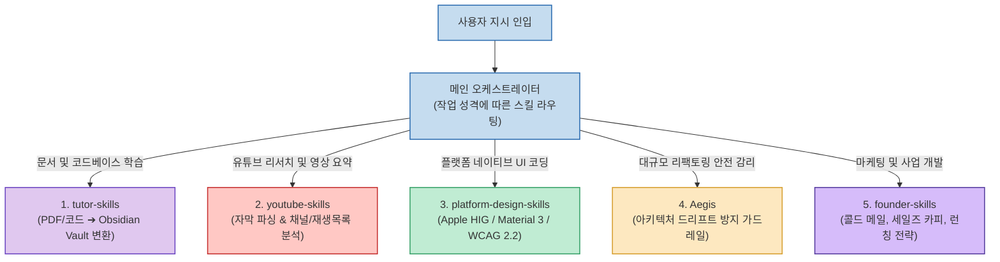

Claude Code나 최신 에이전트 런타임(OpenClaw, Hermes 등)을 사용할 때, 매번 백지상태에서 장문의 시스템 프롬프트를 작성하는 것은 비효율적입니다. 최근 오픈소스 커뮤니티에서는 특정 직무의 지식과 행동 프로토콜을 규격화한 **스킬 팩(`SKILL.md`)** 을 CLI 명령 한 줄로 장착하여 에이전트의 전문성을 즉시 끌어올리는 방식이 표준 워크플로우로 자리 잡았습니다.

X(Twitter)의 크립토/AI 인플루언서 **@cryptowluha** 가 엄선한 **5대 핵심 오픈소스 스킬셋** 은 범용 에이전트를 1:1 과외 튜터, 유튜브 콘텐츠 PD, 플랫폼 전문 디자이너, 아키텍처 감리관, 1인 창업가의 그로스 마케팅 팀으로 완벽히 분업화해 줍니다. 

각 스킬의 상세 기능과 설치법, 그리고 실무 아키텍처 결합 전략을 정리합니다.

<!--more-->

## Sources

- [X(Twitter) 원문: @cryptowluha 게시글](https://x.com/cryptowluha/status/2102375290013933730)
- [tutor-skills GitHub 저장소](https://github.com/bevibing/tutor-skills)
- [youtube-skills GitHub 저장소](https://github.com/ZeroPointRepo/youtube-skills)
- [platform-design-skills GitHub 저장소](https://github.com/ehmo/platform-design-skills)
- [Aegis GitHub 저장소](https://github.com/GanyuanRan/Aegis)
- [founder-skills GitHub 저장소](https://github.com/ognjengt/founder-skills)

---

## 1. 전문 직무별 소형 에이전트 분업 아키텍처

모든 일을 하나의 거대 에이전트에 맡기는 대신, 명확한 작업 범위와 도구 권한을 가진 전문 서브에이전트들에게 작업을 위임하는 분업 구조입니다.

---

## 2. 5대 핵심 스킬셋 상세 명세

### 1) tutor-skills: 문서를 옵시디언 지식 베이스로 바꾸는 개인 과외 튜터
- **특징**: 수백 페이지에 달하는 기술 PDF, 공식 문서, 복잡한 깃허브 코드베이스를 분석하여 개념별 마크다운 노트와 양방향 링크(`[[WikiLinks]]`), 플래시카드를 갖춘 **옵시디언(Obsidian) 스터디 볼트** 로 자동 빌드합니다.
- **실무 효용**: 새로운 라이브러리나 낯선 프레임워크를 빠르게 학습해야 하는 엔지니어에게 최적의 온보딩 경험을 제공합니다.
- **설치**: `npx skills add https://github.com/bevibing/tutor-skills`

### 2) youtube-skills: 영상 기획과 리서치를 자동화하는 콘텐츠 PD
- **특징**: YouTube Transcript API를 연동하여 특정 영상의 자막 추출, 특정 채널의 인기 영상 스캔, 재생목록 일괄 파싱 및 경쟁사 콘텐츠 비교 분석을 에이전트 도구로 제공합니다.
- **실무 효용**: 영상 제작 크리에이터가 트렌드 분석과 대본 초안 리서치에 소모하던 시간을 90% 이상 단축합니다.
- **설치**: `npx skills add https://github.com/ZeroPointRepo/youtube-skills`

### 3) platform-design-skills: 450+ 룰을 탑재한 멀티플랫폼 디자이너
- **특징**: Apple Human Interface Guidelines(iOS, macOS, visionOS 등), Google Material Design 3, 웹 접근성 표준(WCAG 2.2)을 웹 크롤링하여 구축한 450개 이상의 플랫폼 가이드라인을 내장했습니다.
- **실무 효용**: 에이전트가 각 OS 환경의 네이티브 인터랙션 관례(터치 타깃 크기, 폰트 위계, 다크 모드 대비)를 완벽히 준수하는 프론트엔드 코드를 작성하도록 강제합니다.
- **설치**: `npx skills add https://github.com/ehmo/platform-design-skills`

### 4) Aegis: 아키텍처 드리프트를 차단하는 수석 소프트웨어 감리관
- **특징**: 자율 코딩 에이전트가 긴 작업 도중 기존 시스템 아키텍처를 임의로 왜곡하거나 테스트를 우회하는 '코드 드리프트(Code Drift)' 현상을 사전에 방어합니다.
- **실무 효용**: 베이스라인을 먼저 확정하고(Baseline-first), 증거 기반으로 변경 사항을 검증(Evidence-verified)하여 대규모 리팩토링 시 안전성을 보장합니다.
- **설치**: `npx skills add https://github.com/GanyuanRan/Aegis`

### 5) founder-skills: 1인 창업가를 위한 포춘 500대 그로스 팀
- **특징**: 초기 창업가나 솔로프러너가 매일 직면하는 카피라이팅, 콜드 아웃바운드 이메일, 제품 헌트(Product Hunt) 런칭 전략, 전환율 최적화 등 20여 종의 핵심 마케팅 스킬을 모았습니다.
- **실무 효용**: 마케팅 팀이 없는 1인 빌더가 프로덕트 런칭과 고객 유치 과정을 대기업 수준의 템플릿과 프로세스로 실행할 수 있습니다.
- **설치**: `npx skills add https://github.com/ognjengt/founder-skills`

---

## 3. 실무 도입 체크리스트: 단일 거대 에이전트를 버려라

모든 작업을 단 하나의 만능 에이전트에게 맡기면 권한 과잉과 환각이 발생하기 쉽습니다. 실무 도입 시 다음 기준을 검토하십시오:

- **작업 빈도**: 매일 또는 매주 반복되는가?
- **공수 절감**: 실제로 사람의 시간을 몇 시간 이상 아껴주는가?
- **시스템 경계**: 최소 권한 원칙(Principle of Least Privilege)에 따라 에이전트에게 필요한 도구만 격리 부여되었는가?
- **검증 가능성**: 에이전트의 산출물을 사람이 직관적으로 합격/불합격 판정할 수 있는가?

위 4가지 항목에 모두 부합할 때 각 직무별 스킬을 결합한 멀티 에이전트 파이프라인을 구축하십시오.
