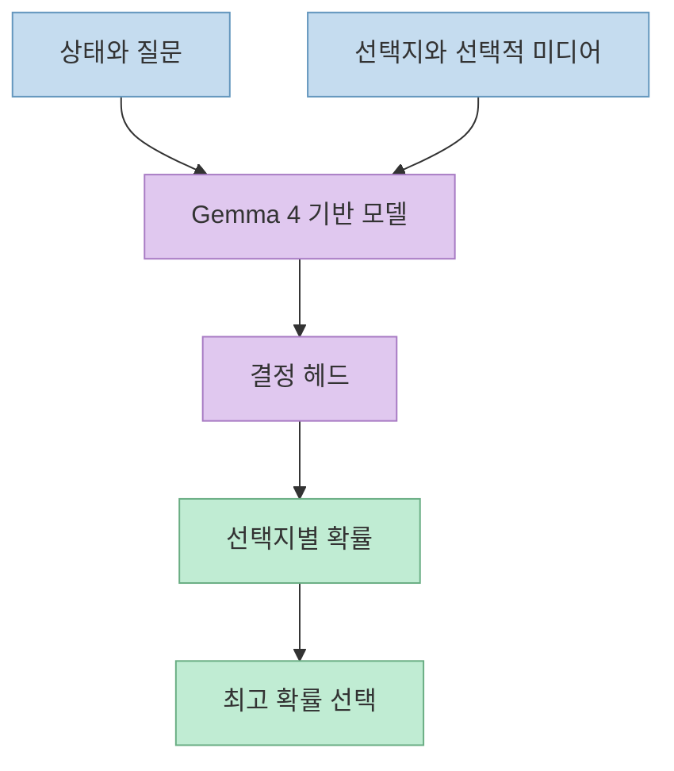
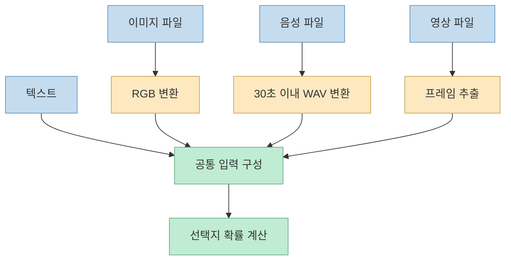
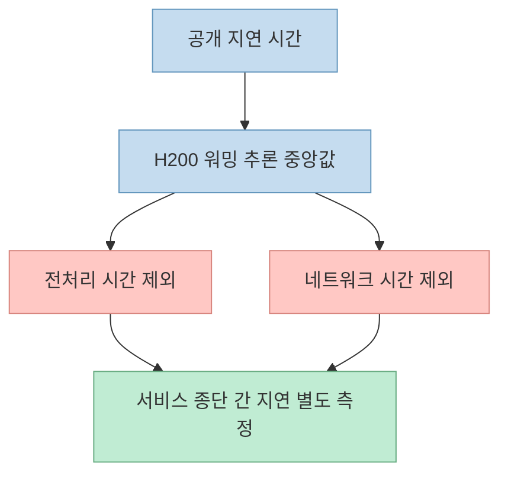

AI 에이전트가 매번 긴 설명을 생성해야 하는 것은 아니다. 상황을 읽고 정해진 행동 중 하나를 고르는 일이라면, 선택지별 확률을 돌려주는 분류기가 더 직접적인 인터페이스일 수 있다. Threads에서 소개한 **Jev-Omni** 는 이 방식을 텍스트뿐 아니라 이미지·음성·영상 입력으로 확장한 공개 모델이다. 다만 게시글의 짧은 속도 수치만으로 실제 서비스 성능이나 다른 모델 대비 우위를 판단해서는 안 된다.

<!--more-->

## Sources

- [원본 Threads 게시글](https://www.threads.com/share/BATaOFc-7q/)
- [Jev-Omni 공식 모델 카드](https://huggingface.co/akhilaaa3/Jev-Omni)
- [공개 추론 로더 `jev_omni.py`](https://huggingface.co/akhilaaa3/Jev-Omni/blob/main/jev_omni.py)
- [결정 헤드 설정 `decision_config.json`](https://huggingface.co/akhilaaa3/Jev-Omni/blob/main/decision_config.json)

## 무엇을 반환하는 모델인가

Jev-Omni는 Gemma 4 12B IT를 바탕으로 만든 **멀티모달 의사결정 분류기** 다. 입력은 현재 상태(`state`), 질문(`question`), 2개 이상의 선택지(`options`), 그리고 필요하면 미디어 파일이다. 출력은 자연어 해설이 아니라 각 선택지의 확률, 가장 높은 확률의 선택지, 그 확률값이다. 예를 들어 회의 시작 전인지 묻는 질문에 `Yes`와 `No`를 주면 두 선택지의 확률을 받는 식이다. 이는 모델 카드의 사용 예제와 공개 로더의 반환값에서 직접 확인된다.

공개 코드에 따르면 로더는 사용자 메시지에 텍스트와 미디어를 함께 넣고, 마지막 은닉 상태를 분류 헤드에 전달한 뒤 `softmax`로 확률을 만든다. 즉, 후보별 문장을 길게 생성해 비교하는 방식이 아니다. 다만 여기서 나오는 **확률은 모델의 예측값** 이며, 특정 운영 환경에서 항상 정확하다는 보장은 아니다. 모델 카드에는 Medium 평가의 ECE가 0.0400이라고 적혀 있지만, 다른 데이터 분포에서도 동일한 보정 수준이 유지된다고 해석해서는 안 된다.

## 네 가지 입력을 어떻게 처리하나

텍스트는 상태·질문·선택지만 전달한다. 이미지 파일은 RGB 이미지로 열고, 영상은 공개 로더가 프레임을 추출해 이미지 시퀀스로 넣는다. 음성은 `ffmpeg`로 단일 채널 16kHz WAV로 변환한다. 공식 모델 카드의 기본 안내는 **음성 최대 30초, 영상 16프레임** 이다. 따라서 긴 녹음이나 긴 영상의 전체 맥락을 손실 없이 이해한다고 가정할 수 없다.

이 설계는 에이전트의 다음 행동 선택, 화면 상태 판별, 짧은 미디어 클립의 범주 판단처럼 **질문과 후보 행동을 미리 정의할 수 있는 작업** 에 적합해 보인다. 반대로 자유 형식의 설명 작성, 긴 영상의 세부 사건 추적, 목록 밖의 정답 탐색에는 이 인터페이스만으로 부족하다. 이는 모델의 출력 구조에서 도출한 활용 판단이지, 해당 사용 사례별 성능을 검증했다는 뜻은 아니다.

## 성능 수치를 읽을 때 빠뜨리기 쉬운 조건

원본 게시글은 H200에서 텍스트 약 83ms, 이미지 26ms, 13초 음성 31ms를 소개한다. 공식 모델 카드에는 여기에 **16프레임 영상 504ms** 도 포함되어 있다. 이 값들은 워밍된 H200에서 최적화된 백엔드 요청 20회의 **중앙값** 이다. 특히 전처리와 네트워크 시간은 제외된다. 따라서 파일 업로드부터 결과 수신까지 걸리는 종단 간 지연 시간으로 인용하면 잘못이다.

모델 카드가 제시한 평가 결과는 DecisionBench Medium 87.57%(80개 시나리오·293개 질문), JevBench 86.15%(195개 그룹·231개 결정), MMAU 63.10%(1,000개 질문), MVBench 53.10%(14개 과제·2,786개 질문)이다. 앞의 두 수치는 시나리오/그룹을 동일 가중으로 평균한 정확도이며, 표의 micro accuracy와는 계산 방식이 다르다. 다른 모델과 나란히 실린 수치도 평가 프로토콜이 다를 수 있다고 모델 카드가 경고한다. 독립 재현 결과가 아니라 **프로젝트가 공개한 측정치** 로 읽는 편이 정확하다.

## 로컬에서 쓰기 전 확인할 제약

공식 빠른 시작 문서는 CUDA GPU를 요구하며, FP32 가중치가 실행 오버헤드 전부터 약 50GB를 사용한다고 안내한다. 공개 로더도 현재 CUDA가 아니면 오류를 낸다. 따라서 오픈 가중치 모델이라고 해서 일반 노트북에서 곧바로 가볍게 실행되는 것은 아니다. 음성 입력에는 `ffmpeg`도 필요하다.

분류 헤드는 코드상 2~256개 선택지를 받지만, 모델 카드는 **20개 이하에서 가장 잘 지원** 되며 그 이상에서 품질이 확립되지 않았다고 밝힌다. 실전에선 후보 행동을 작고 명확하게 정의하고, 확률 임계값과 보류·사람 검토 경로를 별도로 설계해야 한다. 또한 이 프로젝트는 Jev와 유사한 유형의 독립 모델이지, TypeSafe AI의 Jev 공식 버전이나 호환 드롭인으로 소개되지 않는다. 모델 카드의 라이선스는 Apache-2.0이지만 데이터셋 권리는 별도로 확인해야 한다.

## 실전 적용 포인트

1. 먼저 입력 미디어의 길이와 질문·선택지의 범위를 고정한다. 영상 16프레임, 음성 30초 같은 처리 한계를 넘는 자료는 사전에 분할하거나 다른 경로로 처리해야 한다.
2. 검증 데이터에서 정확도뿐 아니라 확률 보정, 낮은 확신 구간, 오분류 비용을 측정한다. 선택지 밖의 답이 가능한 상황에는 별도의 `판단 보류` 후보나 상위 검토 절차를 둔다.
3. 실제 배포 장비에서 전처리·모델 로딩·추론·네트워크를 모두 포함한 지연 시간을 측정한다. 공개 H200 수치를 서비스 SLA로 그대로 가져오지 않는다.

## 핵심 요약

- Jev-Omni는 텍스트·이미지·음성·영상 입력에서 미리 정한 선택지별 확률을 반환한다.
- 게시글의 밀리초 수치는 워밍된 H200의 추론 중앙값이며, 전처리와 네트워크 시간이 빠져 있다.
- CUDA와 큰 메모리가 필요하고, 20개 초과 선택지의 품질은 확립되지 않았다.
- Jev의 공식 멀티모달 버전이 아니라 독립적으로 공개된 모델이다.

## 결론

Jev-Omni의 핵심은 AI 에이전트의 일부 판단을 **긴 문장 생성이 아닌 구조화된 확률 출력** 으로 바꾸는 데 있다. 가능성은 흥미롭지만, 공개 벤치마크와 짧은 지연 시간은 출발점일 뿐이다. 실제 적용 여부는 자체 데이터의 오분류 비용과 종단 간 성능을 검증한 뒤 결정해야 한다.
