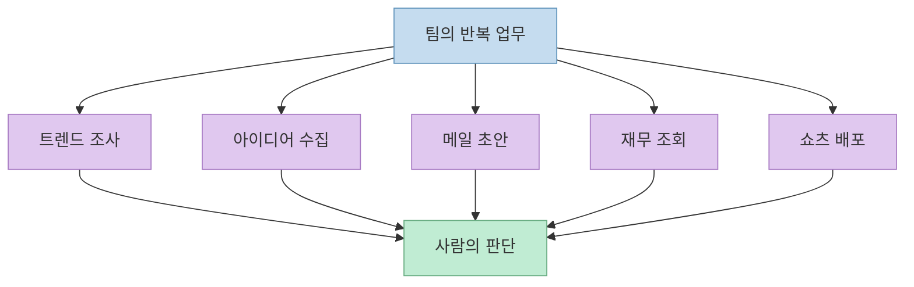
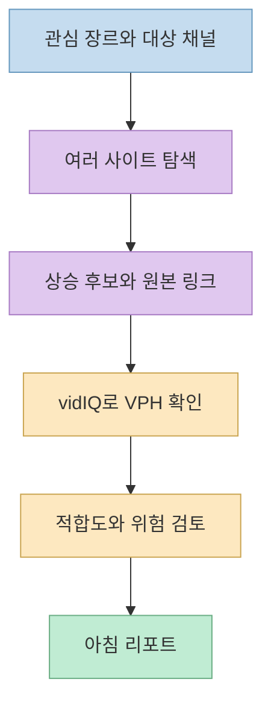
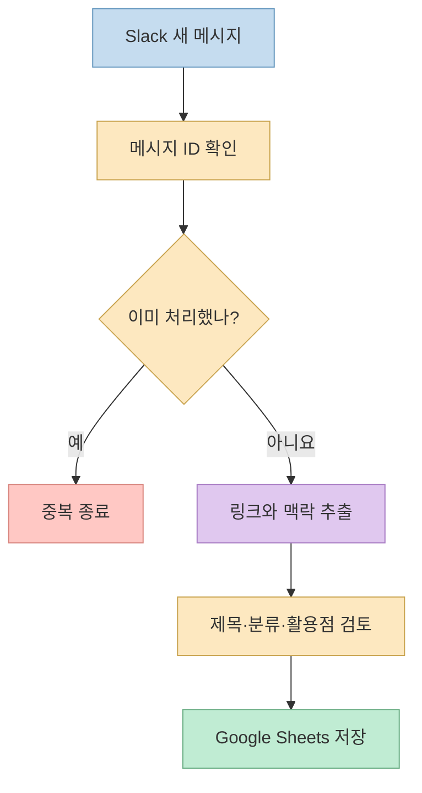
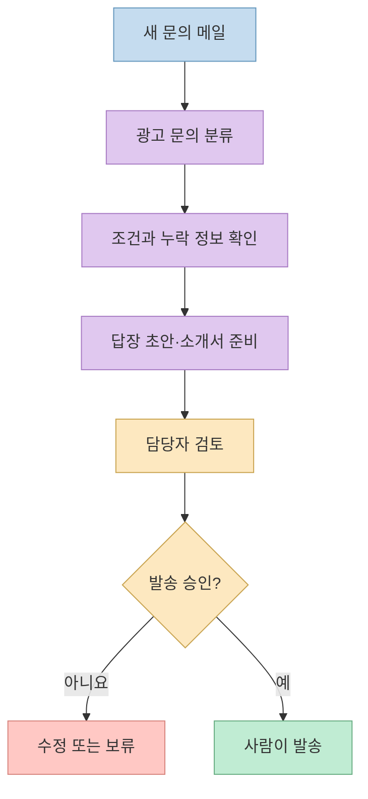
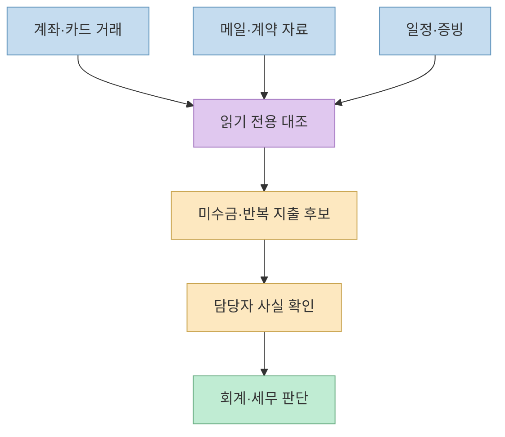
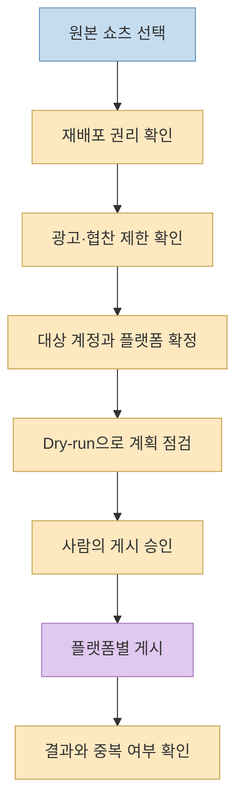

콘텐츠 팀이 반복해서 하는 일은 촬영만이 아니다. 유행을 찾고, 아이디어 링크를 모으고, 광고 문의를 분류하고, 지출을 확인하고, 같은 영상을 여러 플랫폼에 올려야 한다. 조코딩은 엔조이커플 사무실의 맥미니에 Codex와 업무 도구를 연결해 이 반복 작업을 다섯 흐름으로 나눠 시연했다. 핵심은 “AI 직원 한 명이 모든 것을 알아서 한다”가 아니라 **입력·트리거·검토·실행 권한을 업무별로 설계하는 것** 이다. [영상의 문제 정의](https://youtu.be/F9ppxTBO_mM?t=72) [전체 정리](https://youtu.be/F9ppxTBO_mM?t=1177)

<!--more-->

## Sources

- [조코딩 영상: 264만 구독자 엔조이커플 회사에 맥미니 AI 직원 세팅](https://youtu.be/F9ppxTBO_mM?si=rBOjNyLg0XBSSNwM)
- [조코딩의 영상별 프롬프트·상세 가이드](https://jocoding.net/macbookguyver/enjoycouple/)

## 1. 먼저 업무를 다섯 개의 작은 자동화로 나눈다

영상에서 팀이 제시한 고민은 트렌드 리서치, 아이디어 기록, 광고 문의 메일, 재무·회계 정보 확인, 쇼츠 재배포다. 조코딩은 별도 에이전트 플랫폼을 추가하는 대신, 영상에서 사용하는 Codex와 연결 도구로 작업을 구성했다. 브라우저·컴퓨터 조작을 간단한 계산기 실행으로 먼저 시험한 뒤 본격적인 자동화로 넘어간다. 이는 권한과 연결 상태를 확인하는 워밍업이지, “컴퓨터의 모든 작업이 무조건 안전하게 자동 실행된다”는 보증이 아니다. [업무 목록](https://youtu.be/F9ppxTBO_mM?t=115) [도구 소개와 조작 테스트](https://youtu.be/F9ppxTBO_mM?t=198)

각 흐름의 트리거도 서로 다르다. 트렌드는 **매일 정해진 시각** 에 돌아가고, 아이디어 수집은 **Slack 새 메시지** 가 들어올 때 실행되며, 메일 초안은 **새 광고 문의** 를 처리한다. 재무 조회는 사람이 질문하는 방식이고, 멀티 업로드는 새 쇼츠를 게시한 뒤 명령으로 시작한다. 이 차이를 먼저 정해야 같은 데이터를 반복 처리하거나 의도하지 않은 외부 행동을 줄일 수 있다. [예약 작업](https://youtu.be/F9ppxTBO_mM?t=424) [Slack 이벤트](https://youtu.be/F9ppxTBO_mM?t=518) [업로드 명령](https://youtu.be/F9ppxTBO_mM?t=1093)

## 2. 트렌드 조사는 ‘발견’과 ‘검증’을 분리한다

첫 번째 흐름은 브라우저로 여러 사이트의 상승 신호를 찾아 엔조이커플에 맞는 후보를 추린다. 촬영 중 팀이 커플·먹방·챌린지·코미디 외에 **육아** 도 관심 주제로 추가하는 장면은 중요한 힌트다. 트렌드 자체보다 **우리 채널과의 적합도** 가 먼저 정의되어야 한다. 공개된 상세 가이드는 후보별 원본 링크, 상승 근거, 적합도, 주의점을 기록하고 확인하지 못한 값은 “확인 불가”로 남기도록 제안한다. [관심 장르 조정](https://youtu.be/F9ppxTBO_mM?t=265) [브라우저 탐색](https://youtu.be/F9ppxTBO_mM?t=296)

브라우저에서 찾은 후보는 vidIQ의 유튜브 데이터를 통해 다시 검토한다. 영상은 **VPH(Views per Hour, 시간당 조회수)** 를 지금 상승하는 포맷을 판단하는 단서로 사용하고, 유사 채널의 제목 구조와 반복 포맷을 살펴본다. 높은 VPH가 곧 장기적인 성공이나 우리 채널의 성과를 보장하는 것은 아니다. 주제 적합성, 브랜드 안전, 원본 콘텐츠를 그대로 베끼지 않는다는 조건을 함께 검토해야 한다. 잘 작동한 조사 순서는 매일 아침 리포트로 예약한다. [vidIQ 검증](https://youtu.be/F9ppxTBO_mM?t=350) [VPH 설명](https://youtu.be/F9ppxTBO_mM?t=390) [리포트 예약](https://youtu.be/F9ppxTBO_mM?t=424)

## 3. Slack 아이디어는 메시지 이벤트로 구조화한다

기존에는 직원이 본 링크가 메신저 대화 위로 밀려 다시 찾기 어려웠다. 영상에서는 Slack의 아이디어 채널에 링크를 올리면 자동화가 반응하고, 제목·카테고리·내용·활용 포인트를 Google Sheets에 기록하는 모습을 보여준다. 연결 후에는 봇을 해당 채널에 초대해야 메시지를 볼 수 있다. 영상에서 “처리 중” 표시와 시트의 분류 결과를 직접 확인한다. [아이디어 누락 문제](https://youtu.be/F9ppxTBO_mM?t=468) [이벤트 설정](https://youtu.be/F9ppxTBO_mM?t=518) [시트 결과](https://youtu.be/F9ppxTBO_mM?t=553)

여기서 중요한 설계는 “일정 시간마다 채널 전체를 다시 읽기”보다 **새 메시지 한 건을 처리하는 이벤트 방식** 이다. 상세 가이드는 메시지 ID나 정규화한 URL로 중복을 막고, 시작·완료·오류 상태를 남기는 방식을 권한다. 제목이나 카테고리를 자동 추출하더라도 링크 내용이 접근 불가이거나 모호하면 빈 값 또는 검토 필요로 처리해야 한다. 이 마지막 안전 규칙은 영상의 시연을 실무에서 안정화하기 위한 가이드의 제안이다. [이벤트 방식 설명](https://youtu.be/F9ppxTBO_mM?t=518) [상세 가이드](https://jocoding.net/macbookguyver/enjoycouple/)

## 4. 광고 문의 메일은 ‘초안’에서 멈춘다

엔조이커플은 많은 문의에 일일이 답하기 어렵지만, **허락 없이 메일을 보내면 안 된다** 는 조건을 가장 중요하게 제시한다. 시연은 Gmail 연결 후 광고·단가 문의를 읽고, 기존 톤을 참고해 답장과 소개서 첨부를 준비하되 **임시저장(Draft)** 까지만 만드는 방식이다. 실제 발송은 담당자가 내용을 확인하고 직접 누른다. 영상의 테스트 메일에는 단가를 확정하기 위한 정보가 부족했고, 초안은 필요한 정보를 되묻는 방향으로 작성됐다. [발송 금지 요구](https://youtu.be/F9ppxTBO_mM?t=619) [Draft 흐름](https://youtu.be/F9ppxTBO_mM?t=643) [테스트 메일 확인](https://youtu.be/F9ppxTBO_mM?t=688)

실무에서는 단가·일정·광고 범위를 메일에 없는 내용으로 지어내지 않는 규칙이 필수다. 문의 유형별 분류, 첨부파일 존재 여부, 수신자와 발신자, 누락 정보 질문을 점검한 뒤 사람이 발송한다. 영상은 자동화 규칙을 자연어로 수정하는 장면도 보여주지만, 규칙을 바꾼 뒤에는 샘플 메일로 다시 시험해야 한다. [규칙 수정](https://youtu.be/F9ppxTBO_mM?t=720) [상세 가이드](https://jocoding.net/macbookguyver/enjoycouple/)

## 5. 재무 데이터는 연결보다 대조와 권한이 중요하다

영상은 Clobe에 연결된 계좌·카드 정보를 AI에서 조회하는 흐름을 소개한다. 조코딩은 메일에 있는 입금 약속과 거래 내역을 대조해 미수금 후보를 찾았던 개인 경험을 말하고, 구독료처럼 반복되는 지출도 질문으로 확인하는 예를 든다. 이는 **가능한 활용 예시** 이지, 영상에서 모든 미수금을 정확하게 찾아냈다는 검증은 아니다. 서비스의 가격이나 연결 메뉴도 바뀔 수 있으므로 실제 사용 전 공식 안내를 확인해야 한다. [입금 대조 아이디어](https://youtu.be/F9ppxTBO_mM?t=747) [Clobe 연결](https://youtu.be/F9ppxTBO_mM?t=802) [구독료 질문](https://youtu.be/F9ppxTBO_mM?t=949)

시연에서는 Clobe의 MCP 연결 안내를 Codex에 주어 연결용 플러그인을 만들고, 연결 후 재무 질문을 한다. 거래 상대 이름만으로 행사·광고 계약을 확정할 수 없기 때문에 메일, 일정, 세금계산서 등의 근거를 대조해야 한다는 설명도 나온다. 따라서 첫 적용은 읽기 전용 조회로 제한하고, 조회 가능한 계좌·기간·사용자를 좁히며, 회계·세무 판단과 실제 송금은 담당자 확인을 거쳐야 한다. [플러그인 생성](https://youtu.be/F9ppxTBO_mM?t=854) [자료 대조 설명](https://youtu.be/F9ppxTBO_mM?t=918)

## 6. 쇼츠 멀티 업로드는 권리·계정·중복 게시를 먼저 확인한다

마지막 흐름은 기존 쇼츠 멀티 업로더 예시 코드를 팀의 플랫폼에 맞게 수정하는 것이다. 영상에서는 유튜브에 올린 쇼츠를 기반으로 인스타그램·틱톡·네이버 클립 등에도 게시하도록 구성하고, 플랫폼 로그인은 사람이 처리한다. 광고·협찬 영상에는 플랫폼별 게시 범위가 다를 수 있어 의심 영상은 제외하는 규칙도 넣었다. 이후 최신 쇼츠 한 건의 멀티 업로드를 명령해 게시 결과를 확인한다. [예시 코드와 커스터마이즈](https://youtu.be/F9ppxTBO_mM?t=963) [광고 영상 제외](https://youtu.be/F9ppxTBO_mM?t=1073) [실제 게시 확인](https://youtu.be/F9ppxTBO_mM?t=1104)

이 자동화를 재사용할 때는 영상·음원·광고 계약의 **재배포 권리** 를 확인해야 한다. 첫 실행은 게시 계획만 보여주는 dry-run으로 시험하고, 게시 대상 계정·페이지를 명시하며, 실패처럼 보일 때는 재시도 전에 실제 게시 여부를 확인한다. 그렇지 않으면 중복 게시나 잘못된 계정 게시가 발생할 수 있다. 이 안전장치는 영상 설명란의 상세 가이드가 제시하는 실전 보완책이다. [계정·채널 선택](https://youtu.be/F9ppxTBO_mM?t=1043) [상세 가이드](https://jocoding.net/macbookguyver/enjoycouple/)

영상 끝에는 휴대폰과 사무실 맥미니를 원격 연결해 밖에서도 지시할 수 있는 화면이 나온다. 다만 **원격 연결 시연** 과 **휴대폰에서 특정 업무가 성공적으로 실행됐다는 검증** 은 구분해야 한다. 상시 켜 두는 장비는 접근 권한과 로그인 세션을 보호하고, 외부 발송·실제 게시 같은 고위험 명령에는 승인 단계를 유지하는 편이 안전하다. [원격 연결](https://youtu.be/F9ppxTBO_mM?t=1150)

## 실전 적용 포인트

1. 한꺼번에 다섯 흐름을 켜지 말고, 읽기 전용 트렌드 리포트부터 한 건씩 검증한다. [트렌드 시연](https://youtu.be/F9ppxTBO_mM?t=247)
2. 매일 실행할지, 새 메시지·메일에 반응할지, 사람이 명령할지를 업무별로 구분한다. [예약](https://youtu.be/F9ppxTBO_mM?t=424) [이벤트](https://youtu.be/F9ppxTBO_mM?t=518)
3. 모든 결과에 원본 링크·처리 상태·중복 식별자를 남기고, 확인할 수 없는 값은 추측하지 않는다. [아이디어 저장](https://youtu.be/F9ppxTBO_mM?t=553)
4. 메일 발송·재무 확정·외부 게시에는 초안 또는 dry-run과 사람의 승인 단계를 둔다. [메일 초안](https://youtu.be/F9ppxTBO_mM?t=638) [멀티 업로드](https://youtu.be/F9ppxTBO_mM?t=1073)

## 핵심 요약

- 이 사례의 자동화는 **브라우저 조사 → 데이터 검증 → 정기 리포트**, **Slack 이벤트 → 시트 저장**, **메일 → Draft**, **재무 데이터 → 읽기 전용 질문**, **쇼츠 → 권리 확인 후 멀티 게시** 로 나뉜다. [영상 전체 정리](https://youtu.be/F9ppxTBO_mM?t=1177)
- 자동화 성공의 기준은 AI가 클릭을 대신했는지가 아니라, 결과를 사람이 검증하고 위험한 외부 행동을 통제할 수 있는지다. [발송 승인 강조](https://youtu.be/F9ppxTBO_mM?t=635)
- 영상은 현장 시연이며, 시간 절감·인건비 절감 발언을 일반화된 성능 측정치로 받아들여서는 안 된다. [출연자의 소감](https://youtu.be/F9ppxTBO_mM?t=1198)

## 결론

맥미니와 Codex를 연결하는 것만으로 ‘직원’이 완성되지는 않는다. 영상이 보여주는 실질적인 설계는 **작업을 작은 흐름으로 분해하고, 각 흐름에 트리거와 검증 조건을 붙이며, 발송·게시·재무 판단에는 사람이 남아 있는 구조** 다. 이 원칙을 지키면 콘텐츠 팀이 반복 업무를 줄이면서도 통제권을 유지할 수 있다. [전체 사례](https://youtu.be/F9ppxTBO_mM?t=1177)
