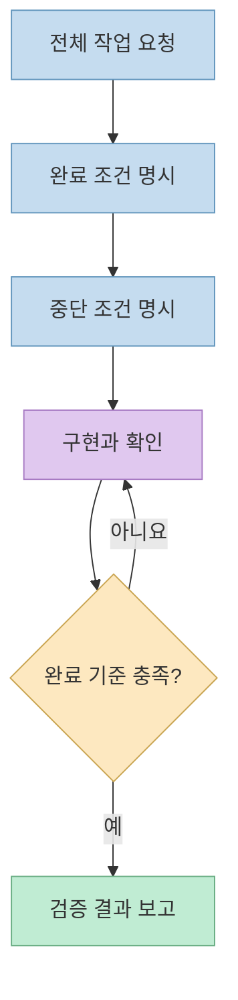
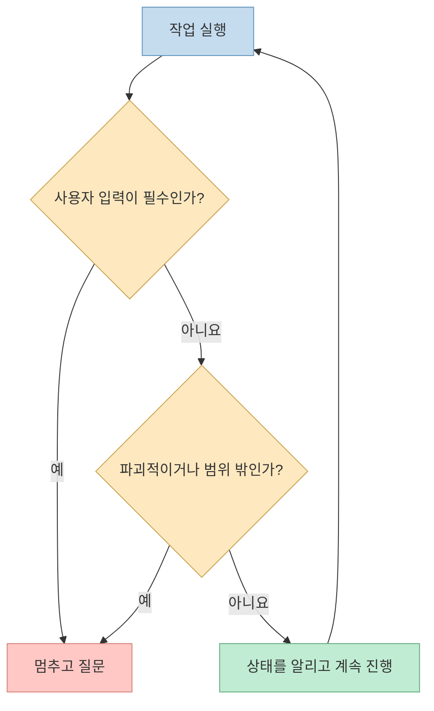
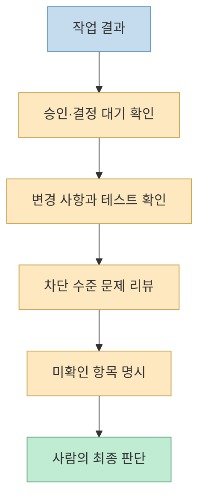

Opus 5.5에서 중요한 변화는 프롬프트에 화려한 사고 지시를 덧붙이는 일이 아니다. **작업의 끝을 정의하고, 중간에 멈춰야 할 조건을 정하며, 마지막에 검증할 증거를 요구하는 일** 이다. Anthropic의 Addy Osmani가 공개한 플레이북은 Claude 앱과 Claude Code에서 이 세 가지를 어떻게 실천할지 설명한다. 이 글은 원문의 권장사항을 작업 흐름에 맞춰 재구성한 가이드다.

<!--more-->

## Sources

- [Anthropic 원문: Getting the most out of Opus 5.5 in Claude and Claude Code](https://claude.dev/blog/getting-the-most-out-of-opus-5-5/)

## 1. 프롬프트는 ‘생각하라’보다 ‘완료 기준’을 말해야 한다

원문은 긴 작업을 **하나의 완결된 요청** 으로 전달하라고 권한다. 예를 들어 단순히 “결제 API를 새 클라이언트로 바꿔줘”라고 하는 대신, 모든 엔드포인트가 새 클라이언트를 사용하고, 옛 코드는 제거되며, 테스트가 통과해야 완료라고 명시한다. 동시에 테스트 실패 원인을 설명할 수 없는 경우처럼 **언제 멈춰서 물어볼지** 도 적는다. 이 구조는 모델이 다음 단계가 남았는데도 중간 보고만 남기고 멈추는 일을 줄이는 데 목적이 있다.

Opus 5.5는 답변 전에 스스로 사고량을 조절하므로, 원문은 “신중하게 생각해”, “단계별로 생각해” 같은 문구를 습관적으로 넣지 말라고 한다. Anthropic의 채팅 제품 테스트에서는 이런 문구를 빼자 답변 시작이 빨라졌고, 품질 저하는 뚜렷하지 않았다고 한다. 이는 모든 과제에서 속도와 품질이 동일하다는 보편적 벤치마크가 아니라 **해당 테스트의 관찰** 이다. 짧은 답이 필요하면 “바로 답해줘”라고 결과 형식을 지시하고, Claude Code의 사고량은 원문이 안내하는 `effort` 설정으로 조정한다.

디자인 요청도 추상적인 “평범하지 않게”보다 **피해야 할 구체적 패턴** 을 나열하는 편이 낫다고 원문은 설명한다. 예컨대 원하지 않는 배경색, 제목 장식, 섹션 번호, 버튼 형태를 지정하고 나온 결과를 본 뒤 제외 목록을 수정한다. 이는 모델의 기본 디자인 습관을 무조건 피하라는 뜻이 아니라, 원하는 결과를 판단할 수 있는 기준을 제공하라는 뜻이다.

## 2. Claude Code의 긴 실행은 ‘계속할 때’와 ‘멈출 때’를 나눠야 한다

원문에 따르면 Opus 5.5는 긴 다단계 작업을 더 오래 이어가지만, 진행 보고를 하면서 불필요하게 멈출 수도 있다. `CLAUDE.md`에는 입력이 필요 없는 단계는 계속 진행하고, **사용자의 결정이 없으면 진행할 수 없거나 삭제·강제 푸시처럼 되돌리기 어려운 작업 전에는 멈춘다** 는 짧은 규칙을 둘 수 있다. 계속 진행하라는 규칙과 파괴적인 명령에 대한 권한 확인은 함께 유지해야 한다. 반대로 페어 프로그래밍에서는 매번 짧은 계획과 회고를 요구하는 규칙이 적합할 수 있다.

실행 중 새 조건이 생각나면 Claude Code가 작업하는 동안 후속 메시지를 보내 기존 실행에 반영할 수 있다. 큰 저장소를 감사하거나 마이그레이션할 때는 서비스별로 **서브에이전트에 작업을 나누고, 각 결과의 증거를 다시 확인하라** 는 것이 원문의 권장사항이다. 분업 자체가 검증을 대체하지 않는다는 점이 중요하다. 오래 걸리는 작업에서는 체크리스트를 파일에 남기고 완료 항목을 갱신하면, 긴 대화가 요약되어도 남은 일을 확인하기 쉽다.

## 3. 완료 보고보다 ‘미확인 사항’과 증거를 먼저 읽는다

긴 실행이 끝나면 원문은 요약의 맨 앞에서 **모델이 사용자에게 기다리는 결정이나 승인** 을 찾으라고 한다. 그다음 변경 사항과 발견 사항을 읽는다. 팀에서 일정한 형식이 필요하다면 `CLAUDE.md`에 `Blocked on me`, `Changed`, `Found`처럼 최종 보고의 제목을 지정할 수 있다.

코드 변경에는 사람의 리뷰 전에 모델의 리뷰를 한 번 더 요청한다. 단순한 “검토해줘”보다 **병합을 막을 문제만**, 파일·줄 번호·실패 이유·재현 방법과 함께 적으라고 요구하면 검토 대상이 분명해진다. 원문은 초기 테스터의 인상도 소개하지만, 그 일화를 보편적인 버그 탐지 성능 수치로 받아들이면 안 된다. 연구·분석 작업에서는 찾지 못했거나 확인할 수 없었던 항목과 확인한 위치를 함께 표시하게 한다.

## 4. Claude 앱에서는 원본 자료와 산출물 형태를 직접 지정한다

차트·스크린샷·슬라이드를 분석할 때는 수치를 다시 타이핑하기보다 **원본 이미지를 첨부하고 구체적인 질문** 을 하는 편이 좋다고 원문은 권한다. 그림의 화살표가 어느 상자를 연결하는지, 달력에서 일정이 언제 시작하는지처럼 공간 관계가 중요한 경우 특히 그렇다. 긴 계획서나 발표 자료는 숫자·날짜·이름의 내부 모순을 찾아 위치와 함께 보고하게 할 수 있다.

문서나 스프레드시트가 최종 목표라면 개요가 아니라 **공유할 수 있는 완성 파일** 을 요청한다. 긴 대화에서 짧은 후속 질문을 했는데 이전 답까지 반복 검토해 느려진다면, 프로젝트 지침에 앞선 답변은 일단 마무리된 것으로 취급하라고 적을 수 있다. 다만 후속 분석이 앞선 결론의 오류를 밝혀낼 수 있는 프로젝트에서는 이 지침을 빼야 한다. 사용 전 모델 선택기에서 Opus 5.5가 선택되었는지도 확인한다.

## 5. 모델 전환 알림과 빠른 모드를 구별한다

원문은 안전성 검사에 의해 일부 메시지가 표시되면 Claude 앱·Claude Code의 작업이 **이전 모델로 전환될 수 있다** 고 안내한다. 앱에서는 모델 선택기, Claude Code에서는 `/model`로 현재 모델을 확인·변경한다. Claude Code에서는 `Esc`를 두 번 눌러 마지막 메시지를 수정하거나, 잘못 표시된 경우 `/feedback`으로 신고할 수 있다. 자동 전환 전에 묻도록 설정하는 옵션도 있다. 검사 대상에는 현재 메시지뿐 아니라 대화 내 파일과 검색 결과도 포함될 수 있으므로, 단순히 마지막 질문만 보고 원인을 단정하지 말아야 한다.

모델의 내부 사고 과정을 그대로 출력하라고 요구하는 대신, **접근법을 선택한 이유를 짧게 설명해 달라** 고 요청한다. 원문은 내부 추론 재현 요청이 거절될 수 있는 범주라고 명시한다.

Claude Code의 `/fast`는 Opus 5.5의 **같은 모델을 더 빠르게 응답받는 모드** 로 소개된다. 사람과 모델이 번갈아 답을 읽는 상호작용에 적합하지만, 원문 기준 출시 시점에는 연구 프리뷰이며 추가 사용량 설정이 필요하고 일반 모드보다 토큰당 비용이 높다. 따라서 무조건 켜 두기보다, 사람이 각 응답을 기다리는 작업에서 시간 절감 효과와 비용을 함께 비교해야 한다.

## 실전 적용 포인트

1. 요청 첫 문단에 작업 범위, 완료 기준, 중단·질문 조건을 함께 적는다.
2. 긴 코드 작업에는 계속 진행 규칙과 파괴적 작업 전 정지 규칙을 동시에 둔다.
3. 큰 감사는 분업하되, 서브에이전트의 결론을 파일·줄·재현 근거로 검증한다.
4. 최종 보고에서는 사용자 결정을 기다리는 항목, 테스트 결과, 미확인 사항을 먼저 확인한다.
5. 이미지 분석에는 원본을, 문서 작성에는 원하는 최종 파일 형식을 직접 제공한다.

## 핵심 요약

- Opus 5.5에는 막연한 사고 지시보다 **명확한 완료 조건** 이 더 실용적이다.
- 긴 실행에는 계속 진행할 조건과 반드시 멈출 조건을 함께 정해야 한다.
- 결과를 믿기 전에 사용자 승인 대기, 테스트, 차단 수준 문제, 미확인 사항을 확인한다.
- 모델 전환 알림과 `/fast`의 비용·사용 조건은 작업 흐름의 일부로 이해해야 한다.

## 결론

Opus 5.5 활용법의 핵심은 모델을 더 길게 생각하게 만드는 주문이 아니라 **검증 가능한 작업 계약** 을 설계하는 것이다. 완료 기준을 주고 자율 실행을 허용하되, 위험한 행동에서는 멈추고, 마지막에는 근거와 한계를 확인하는 운영 방식이 원문의 일관된 메시지다.
