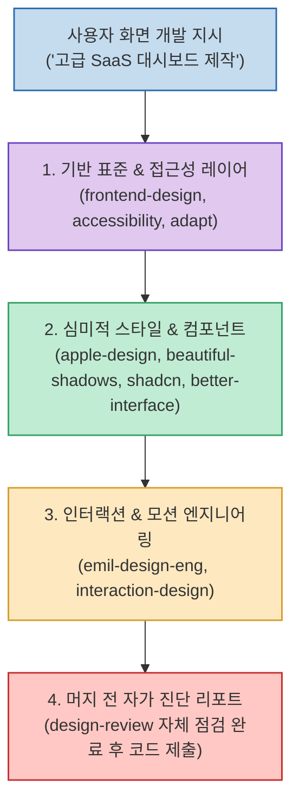

Claude Code나 Cursor 같은 AI 코딩 에이전트에게 프론트엔드 개발을 지시하면 기능적으로는 완벽하게 동작하는 코드를 뽑아냅니다. 하지만 막상 브라우저를 열어보면 누구나 한숨을 내쉬게 됩니다.

투박하고 텁텁한 인공적인 검은 그림자, 기계적인 3단 카드 그리드, 폰트 크기와 줄간격(Line-height)의 부조화, 어색한 호버 효과 등 이른바 **'AI 특유의 촌스러운 슬롭(Generic AI Slop)'** 이 화면 가득 묻어나기 때문입니다.

Awwwards 심사위원이자 YC 출신 제품 디자이너인 **Kailash (@kail_designs)** 는 프론트엔드 디자인 오픈소스 레지스트리인 **ui-skills.com** 에서 엄선한 **10대 핵심 UI 디자인 스킬** 을 공개했습니다. 

Anthropic, Emil Kowalski, Addy Osmani, Meng To, shadcn 등 전 세계 최정상급 디자이너들의 감각과 규칙을 단 몇 줄의 마크다운 스킬(`SKILL.md`)로 에이전트에 주입하여 프로덕션 상용 품질의 프론트엔드를 뽑아내는 비결을 정리합니다.

<!--more-->

## Sources

- [X(Twitter) 원문: @kail_designs 게시글](https://x.com/kail_designs/status/2102265246325047711)
- [ui-skills.com 공식 레지스트리](https://www.ui-skills.com)

---

## 1. 프론트엔드 디자인 스킬 레이어 아키텍처

10대 스킬은 웹 접근성과 뼈대 마크업부터 심미적 스타일링, 마이크로 인터랙션, 코드 머지 전 감사 리포트까지 4개의 레이어로 유기적으로 맞물려 동작합니다.



---

## 2. 10대 핵심 UI 디자인 스킬 상세 분석

### 1) frontend-design (`anthropics/frontend-design`)
- **역할**: Anthropic 공식 표준 프론트엔드 설계 엔진.
- **특징**: 시맨틱 HTML5 구조와 유지보수가 용이한 모던 CSS flex/grid 레이아웃을 엄격히 강제하여 코드베이스의 기본기를 다집니다.

### 2) apple-design (`emilkowalski/apple-design`)
- **역할**: Apple 특유의 절제된 미니멀리즘과 여백의 미학 주입.
- **특징**: 세계적인 인터랙션 디자이너 Emil Kowalski가 정립한 디자인 원칙. 과도한 장식을 배제하고 절제된 타이포그래피 위계와 정교한 패딩/마진 비율을 적용합니다.

### 3) beautiful-shadows (`mengto/beautiful-shadows`)
- **역할**: 인공적인 검은 그림자를 걷어내는 감성 다층 섀도우.
- **특징**: DesignCode 창립자 Meng To의 다층 앰비언트 그림자 기법. 단일 `box-shadow` 대신 투명도와 블러가 다른 3중 레이어를 겹쳐 자연스러운 공간감(Elevation)과 유리 질감을 만듭니다.

### 4) accessibility (`addyosmani/accessibility`)
- **역할**: Google Chrome 리드가 작성한 WCAG 2.2 웹 접근성 준수.
- **특징**: Addy Osmani의 실무 가이드. 키보드 탭 이동 포커스 링, 스크린 리더용 ARIA 레이블, WCAG AAA 명도 대비를 에이전트가 코딩 중에 자동 충족합니다.

### 5) design-review (`superfuture/design-review`)
- **역할**: 시니어 디자이너의 코드 머지 전 자체 진단 리포트.
- **특징**: 코드를 완성하기 직전, 시각적 불일치, 정렬 오차, 과도한 색상 사용을 AI 스스로 비판적으로 점검하고 리팩토링 체크리스트를 발행합니다.

### 6) emil-design-eng (`emilkowalski/emil-design-eng`)
- **역할**: 디테일이 살아있는 마이크로 인터랙션 엔지니어링.
- **특징**: 버튼 클릭 시의 물리적 스프링 텐션, 툴팁 등장 트랜지션, 가속도 커브(Easing) 등 프론트엔드 장인들의 인터랙션 패턴을 코드로 주입합니다.

### 7) shadcn (`shadcn-ui/shadcn`)
- **역할**: Radix UI + Tailwind 기반 표준 컴포넌트 조립.
- **특징**: shadcn/ui 생태계의 철학을 준수하며, 새로운 컴포넌트를 만들 때 기존 테마 토큰과 충돌 없이 일관된 컴포넌트 합성을 보장합니다.

### 8) adapt (`pbakaus/adapt`)
- **역할**: 모바일-태블릿-데스크톱 유동적 반응형 레이아웃.
- **특징**: 데스크톱 화면만 신경 쓰다 모바일이 깨지는 현상을 방지하며, 컨테이너 쿼리와 유동 폰트 스케일링으로 모든 뷰포트에 완벽히 적응합니다.

### 9) better-interface (`jakubkrehel/better-interface`)
- **역할**: 1px의 시각 노이즈를 다듬는 디테일 교정기.
- **특징**: 코너 래디우스(border-radius) 일치, 보더 투명도, 텍스트 줄간격, 정보 밀도(Density)를 미세 조정해 완성도를 끌어올립니다.

### 10) interaction-design (`wshobson/interaction-design`)
- **역할**: 살아 숨 쉬는 제스처 및 피드백 UX 설계.
- **특징**: 단순 마우스 호버를 넘어 즉각적인 비주얼 반응과 로딩 스켈레톤 상태를 매끄럽게 연결합니다.

---

## 3. 원클릭 설치 및 추천 조합 가이드

프로젝트 성격에 맞춰 터미널에서 필요한 스킬을 선별하여 즉시 장착할 수 있습니다:

```bash
# 조합 A: 고급 미니멀 SaaS 대시보드 구축 시
npx skills add https://www.ui-skills.com/skills/emilkowalski/apple-design
npx skills add https://www.ui-skills.com/skills/mengto/beautiful-shadows
npx skills add https://www.ui-skills.com/skills/jakubkrehel/better-interface

# 조합 B: 엔터프라이즈 B2B 웹 애플리케이션 구축 시
npx skills add https://www.ui-skills.com/skills/shadcn-ui/shadcn
npx skills add https://www.ui-skills.com/skills/addyosmani/accessibility
npx skills add https://www.ui-skills.com/skills/superfuture/design-review
```

전문 디자이너의 지식 베이스를 에이전트에 미리 연결해 두는 것만으로도, 추가적인 디자인 비용 없이 상용 프로덕트 수준의 프론트엔드 결과물을 얻을 수 있습니다.
