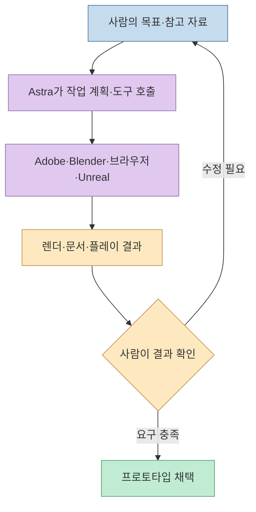
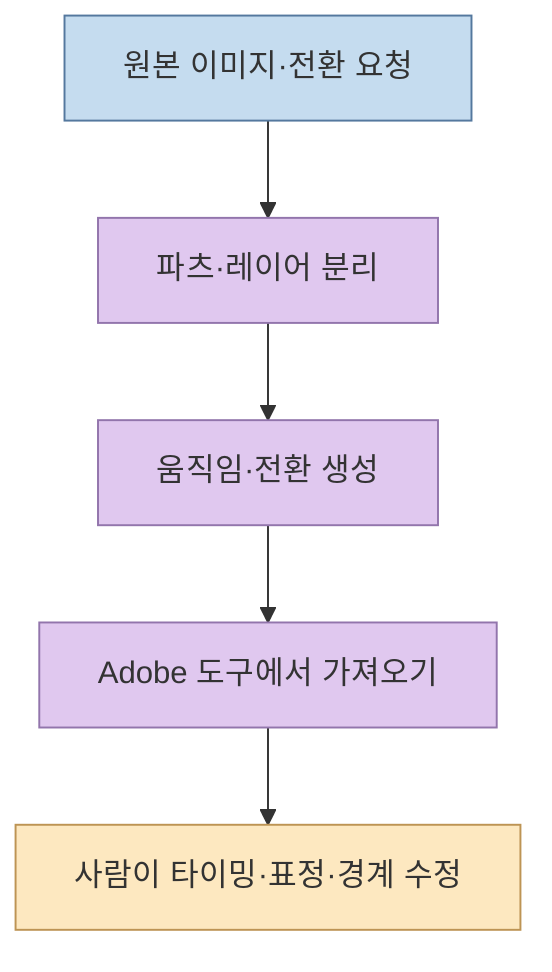
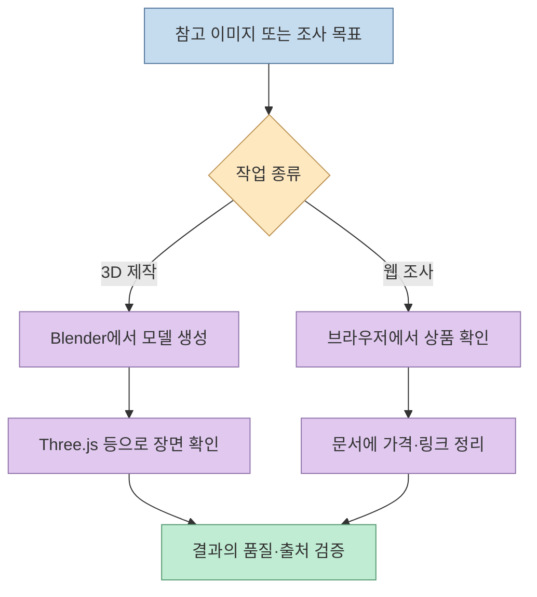
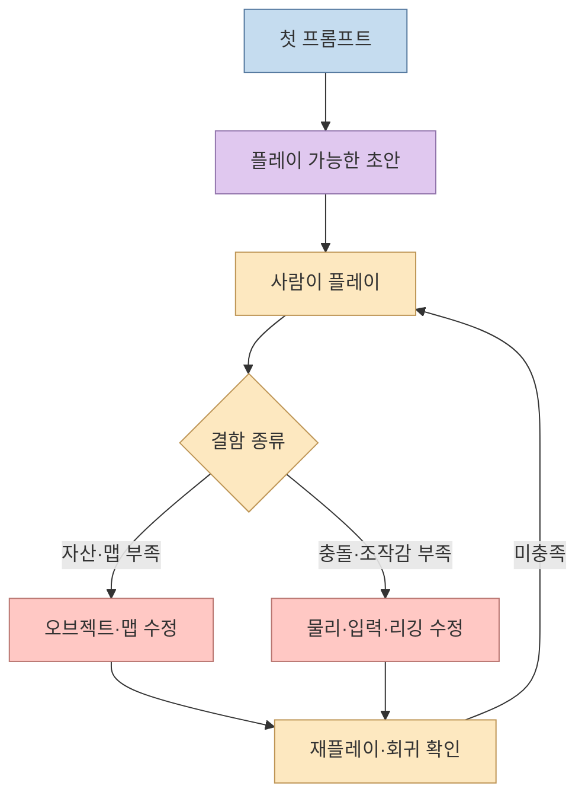

AI가 "게임을 만들어준다"는 말은 무엇을 뜻할까? 코드를 작성하는지, 3D 자산을 만들고 도구에 연결하는지, 아니면 실제로 플레이해 문제를 고치는지에 따라 난도가 달라진다. [저세상개발자의 영상](https://youtu.be/tKhY2I1Bl1M?si=yLnyIZUXKvkb6O6R)은 "아스트라"로 애니메이션·영상 편집, Blender 작업, 브라우저 가격 조사, Unreal Engine 게임 프로토타입을 시험한다. 영상의 강점은 성공 장면만 모은 광고가 아니라 **마리오풍 3D 게임에서 움직임과 조작감이 끝내 부족했던 과정**도 보여준다는 점이다. [도입부](https://youtu.be/tKhY2I1Bl1M?t=0), [한계 시연](https://youtu.be/tKhY2I1Bl1M?t=293)

<!--more-->

## Sources

- [원본 YouTube 영상: 아스트라로 게임 개발과 영상 편집을 해 보자!](https://youtu.be/tKhY2I1Bl1M?si=yLnyIZUXKvkb6O6R)
- [OpenAI 공식 GPT-6 Astra 모델 문서](https://developers.openai.com/api/docs/models/gpt-6-astra) · [컴퓨터 사용 도구 안내](https://developers.openai.com/api/docs/guides/tools-computer-use)

이 글의 작업 사례와 평가는 **영상의 한국어 자동 생성 자막과 발표자의 설명**을 근거로 한다. 자막에는 도구명·캐릭터명 등의 인식 오류가 있어, 확실하지 않은 고유명사는 추측해 채우지 않았다. 파일 구조, 실제 프로젝트의 코드 품질, 실행 환경은 별도 검증하지 않았다.

## 1. 영상이 시험한 것은 모델 단독 성능보다 도구를 잇는 작업 흐름이다

영상에서는 아스트라에게 이미지를 주고 Adobe 도구에서 편집 가능한 애니메이션을 요청하고, Blender와 브라우저를 조작하게 하며, Blender·Unreal Engine 연동으로 게임을 만든다. **모델 하나가 영상 렌더러나 게임 엔진을 대체했다는 의미가 아니다.** 모델의 지시 해석과 외부 도구의 생성·실행 기능이 결합한 결과로 보는 편이 정확하다. OpenAI의 공식 문서도 GPT-6 Astra를 코딩·컴퓨터 사용 같은 다단계 작업에 쓰는 모델로 소개한다. [영상 00:15](https://youtu.be/tKhY2I1Bl1M?t=15), [01:39](https://youtu.be/tKhY2I1Bl1M?t=99), [02:13](https://youtu.be/tKhY2I1Bl1M?t=133), [02:58](https://youtu.be/tKhY2I1Bl1M?t=178), [공식 모델 문서](https://developers.openai.com/api/docs/models/gpt-6-astra)

따라서 결과를 읽을 때는 세 질문을 분리해야 한다. **무슨 입력을 줬나**, **어떤 외부 도구를 연결했나**, **생성물을 직접 열어 테스트했나**다. 영상은 여러 시연을 보여주지만, 동일 조건의 대조군이나 반복 시행을 갖춘 벤치마크는 아니다. "한 번의 프롬프트"라는 표현도 해당 장면의 초기 생성 범위를 뜻할 뿐, 이후 기능 추가·수정까지 모두 한 번에 끝났다는 뜻은 아니다. [Blender 첫 생성 01:39](https://youtu.be/tKhY2I1Bl1M?t=99), [게임 첫 생성 02:58](https://youtu.be/tKhY2I1Bl1M?t=178), [추가 수정 05:29](https://youtu.be/tKhY2I1Bl1M?t=329)

## 2. 영상 편집: 결과 영상보다 수정 가능한 중간 산출물이 핵심이다

처음 시연에서 발표자는 이미지 하나로 After Effects에 가져갈 수 있는 애니메이션을 요청한다. 발표자 설명에 따르면 아스트라는 이미지를 파츠·레이어로 나누고 캐릭터가 팔을 드는 움직임을 만들었다. 이어 서로 다른 이미지를 연결하는 애니메이션과, 춤 동작을 캐릭터에 적용하는 작업도 시험한다. **각 예시의 파일 형식이나 레이어 구조는 자막만으로 확인할 수 없으므로** "완전한 편집 프로젝트를 자동 생성했다"고 확대해석하지는 않는다. [영상 00:15](https://youtu.be/tKhY2I1Bl1M?t=15), [00:27](https://youtu.be/tKhY2I1Bl1M?t=27), [00:36](https://youtu.be/tKhY2I1Bl1M?t=36)

Premiere 시연에서는 두 이미지 사이의 **카드 뒤집기 전환**을 여러 속도·길이로 만들도록 요청하고, 발표자가 이를 Premiere에 적용해 원하는 전환을 연출했다고 설명한다. 발표자는 레이어·프레임·파츠별 분리가 되면 생성 후 Adobe 도구에서 세부 조정을 이어갈 수 있다는 점을 높이 평가한다. 이 사례의 실무적 의미는 "영상 파일 하나를 뽑아준다"보다 **후편집이 가능한 작업 단위를 얻는다**는 데 있다. 다만 각 프리셋의 재사용성이나 다른 버전의 Adobe 앱과의 호환성은 이 영상만으로 검증되지 않는다. [영상 00:53](https://youtu.be/tKhY2I1Bl1M?t=53), [01:09](https://youtu.be/tKhY2I1Bl1M?t=69), [01:16](https://youtu.be/tKhY2I1Bl1M?t=76)

실제로 평가한다면, 완성 화면 외에 **파츠 경계가 자연스러운지, 수정 가능한 레이어가 유지되는지, 전환 길이를 바꿀 때 깨지지 않는지**를 확인해야 한다. 이는 영상에 나온 작업 형태에서 도출한 검수 기준이지, 영상이 이 모든 검사를 완료했다는 뜻은 아니다.

## 3. 3D와 브라우저: 시각 판단은 실행 환경에 의존한다

Blender MCP를 연결한 뒤 발표자는 참고 이미지를 주고 건물 형태의 3D 모델을 만들게 한다. 다른 장면에서는 Blender와 Three.js를 함께 써서 섬·배·파도 애니메이션을 구성한다. 이 둘은 **이미지로부터 3D 구조를 만드는 작업**과 **3D 장면을 웹에서 움직이게 하는 작업**이 연결된 사례다. 영상에서는 결과가 빠르게 나왔다고 하지만, 모델의 메시 수, 토폴로지, 텍스처 품질, 프레임 속도 같은 제작 지표는 제시되지 않는다. [영상 01:39](https://youtu.be/tKhY2I1Bl1M?t=99), [01:56](https://youtu.be/tKhY2I1Bl1M?t=116)

브라우저 시연에서는 쇼핑 사이트에서 포켓몬 카드 가격을 찾아 비교하고, 이미지와 링크를 Google Docs에 정리하도록 지시한다. 발표자는 아스트라가 브라우저를 조작해 자료를 모았다고 설명한다. 이런 작업은 단순 검색보다 **페이지 이동 → 항목 확인 → 가격·링크 추출 → 문서 정리**의 다단계 수행에 가깝다. 반면 사이트가 동적으로 변하고 상품 종류·상태·배송비가 다르면 가격 비교가 틀릴 수 있다. 따라서 자동 작성된 표나 문서는 원문 링크와 수집 시점으로 재검증해야 한다. [영상 02:13](https://youtu.be/tKhY2I1Bl1M?t=133), [02:22](https://youtu.be/tKhY2I1Bl1M?t=142), [02:37](https://youtu.be/tKhY2I1Bl1M?t=157), [OpenAI 컴퓨터 사용 안내](https://developers.openai.com/api/docs/guides/tools-computer-use)

## 4. 게임 세 가지: 프로토타입의 성공과 조작감의 실패를 같이 본다

첫 게임은 Minecraft를 닮은 블록 월드다. 발표자는 Blender와 Unreal Engine을 연결한 뒤 간단한 요청으로 블록, 월드, 하단 UI, 블록 채굴·배치가 가능한 초안을 만들었다고 말한다. 이후 **동물과 검을 추가**하도록 별도로 지시했다. 직접 플레이했을 때 공격 반응은 있었지만 충돌 판정은 아쉬웠다고 평가한다. 즉, 초기에 월드를 구성하는 것과 게임플레이를 안정적으로 완성하는 것은 다른 단계다. [영상 02:58](https://youtu.be/tKhY2I1Bl1M?t=178), [03:14](https://youtu.be/tKhY2I1Bl1M?t=194), [03:30](https://youtu.be/tKhY2I1Bl1M?t=210), [03:41](https://youtu.be/tKhY2I1Bl1M?t=221)

둘째는 길 건너기 게임이다. 오리·차량·나무를 만들고 Unreal Engine에서 이동, 차량의 반복 움직임, 충돌 시 게임 오버가 작동하는 장면을 보여준다. 발표자는 플레이 중 뚜렷한 오류를 보지 못했다고 평가한다. 하지만 이는 **영상 속 한 번의 플레이 관찰**이지, 모든 환경에서 오류가 없다는 품질 보증은 아니다. 반복 플레이, 점수 처리, 모바일 입력, 배포 빌드까지 확인한 근거도 자막에는 없다. [영상 04:10](https://youtu.be/tKhY2I1Bl1M?t=250), [04:25](https://youtu.be/tKhY2I1Bl1M?t=265), [04:33](https://youtu.be/tKhY2I1Bl1M?t=273)

셋째 마리오풍 3D 월드는 **한 번에 되는 것의 한계**를 가장 잘 보여준다. 처음 결과물은 작은 맵, 단순한 캐릭터 형태, 적의 움직임이 없는 기본 플랫폼이었다. 발표자는 맵 확장과 적 이동을 다시 지시하고, 그다음 리깅·가속·급정지 같은 조작감을 요구한다. 화면상 일부 동작은 추가됐지만, 본인이 기대한 마리오 특유의 손맛에는 못 미쳤다고 평가한다. 이 사례를 "게임 제작 실패"로 단순화할 필요도, "한 줄로 완성"했다고 포장할 필요도 없다. **공간 구성은 빠르지만 캐릭터의 정교한 모션·물리·조작은 반복 검수 대상**이라는 관찰이 더 정확하다. [영상 04:53](https://youtu.be/tKhY2I1Bl1M?t=293), [05:22](https://youtu.be/tKhY2I1Bl1M?t=322), [05:29](https://youtu.be/tKhY2I1Bl1M?t=329), [05:42](https://youtu.be/tKhY2I1Bl1M?t=342), [05:57](https://youtu.be/tKhY2I1Bl1M?t=357)

## 5. 영상의 속도 비교는 경험담이지 통제된 벤치마크는 아니다

후반부에 발표자는 예전 영상 작업에서는 중간 결과를 보며 구체적 지시를 여러 차례 주느라 **4시간 이상** 걸렸고, 최근 Astra를 사용한 다른 애니메이션 작업은 전체 틀을 잡는 데 **1시간 이내**였다고 말한다. 두 사례는 작업물·도구·시점이 다르므로 이 숫자로 정확한 속도 향상률을 계산할 수 없다. 다만 발표자가 느낀 차이는 **에이전트가 화면을 확인하고 다음 동작을 이어가는 과정에서 사람의 세부 지시 부담이 줄었다**는 것이다. [영상 06:47](https://youtu.be/tKhY2I1Bl1M?t=407), [07:17](https://youtu.be/tKhY2I1Bl1M?t=437), [07:29](https://youtu.be/tKhY2I1Bl1M?t=449), [07:36](https://youtu.be/tKhY2I1Bl1M?t=456)

영상 전체로 보면 "프롬프트가 짧다"는 사실보다 **결과를 직접 보고 다음 수정을 요청할 수 있는 루프**가 중요하다. 모델이 화면을 다시 확인한다는 설명도 발표자의 관찰이다. 작업 시간, 사용한 모델 설정, 도구 버전, 실패한 시도 횟수가 정량적으로 공개되지 않았으므로 개인 경험을 일반적 성능 보증으로 확대하지 말아야 한다. [영상 06:35](https://youtu.be/tKhY2I1Bl1M?t=395), [06:47](https://youtu.be/tKhY2I1Bl1M?t=407), [07:49](https://youtu.be/tKhY2I1Bl1M?t=469)

## 실전 적용 포인트

1. **도구 연결을 먼저 정의한다.** Adobe 편집 파일, Blender 장면, Unreal 게임 중 어떤 산출물이 필요한지 명시한다. 모델이 도구에 접근할 권한과 자료도 갖춰야 한다.
2. **첫 결과는 프로토타입으로 취급한다.** 영상·3D는 레이어와 자산의 수정 가능성을, 게임은 충돌·입력·프레임 속도와 반복 플레이를 확인한다.
3. **수정 요청을 관찰 가능한 결함으로 쓴다.** "더 좋게"보다 "이동 가속이 없고 적이 움직이지 않는다"처럼 재현 가능한 문제를 전달한다.
4. **시간 절약은 같은 과제로 비교한다.** 프롬프트 작성, 도구 설정, 수동 수정, 검수까지 포함해 전후 작업 시간을 기록한다.
5. **유명 게임·캐릭터 시연을 상용 결과물로 혼동하지 않는다.** 데모의 기능 확인과 실제 배포 가능성은 별도 검토가 필요하다.

## 핵심 요약

- 영상은 Astra가 **Adobe·Blender·브라우저·Unreal Engine을 잇는 작업 흐름**을 수행하는 여러 사례를 보여준다.
- 편집에서 눈여겨볼 부분은 완성 영상만이 아니라 **후수정 가능한 파츠·레이어와 전환 프리셋**이다.
- 게임은 블록 월드와 길 건너기 프로토타입이 빠르게 나왔지만, 마리오풍 3D 조작감과 일부 충돌 판정은 반복 수정 후에도 한계가 있었다.
- 발표자의 시간 비교는 흥미로운 경험담이지만, 조건이 다른 사례이므로 객관적인 속도 벤치마크로 볼 수 없다.

## 결론

이 영상이 보여주는 변화는 "한 문장으로 완성품을 만든다"보다 **사람이 의도를 제시하고, 모델이 여러 도구에서 초안을 만들고, 다시 보고 고치는 사이클이 짧아진다**는 데 있다. 어디까지 쓸 수 있는지는 첫 생성 속도가 아니라 수정 가능성과 실제 실행 테스트로 판단해야 한다.
