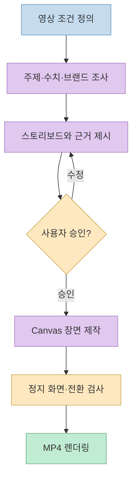
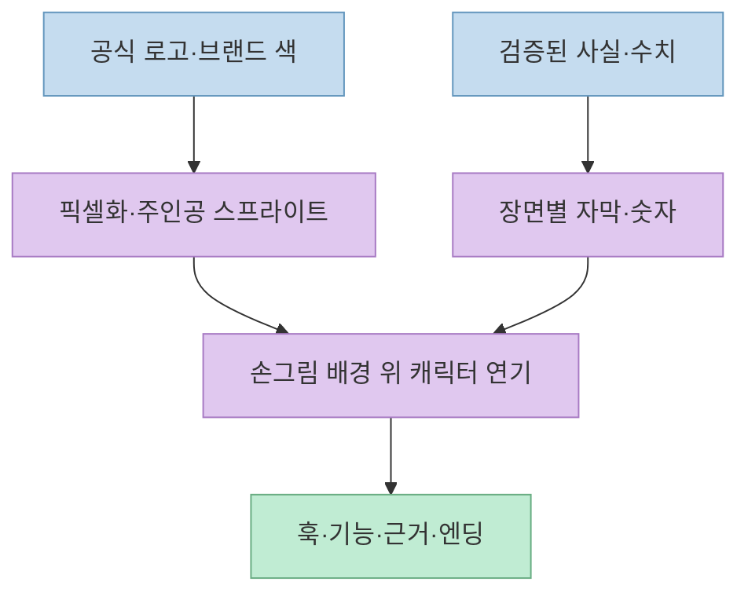
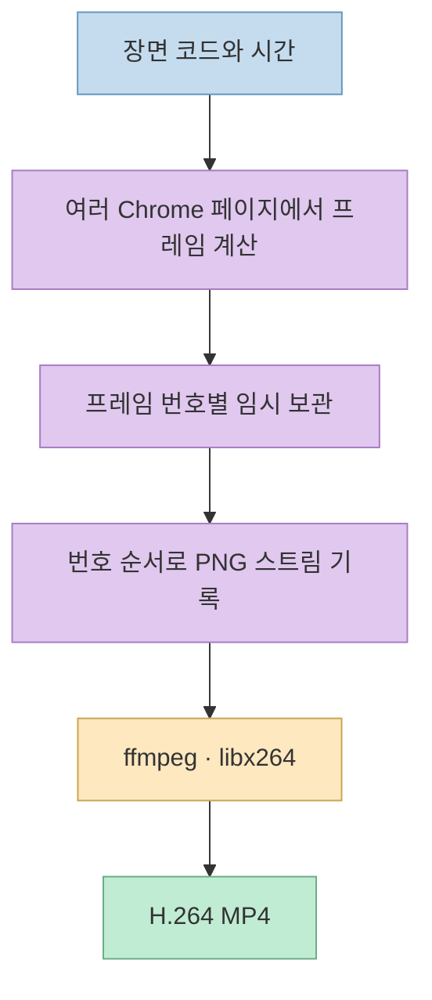
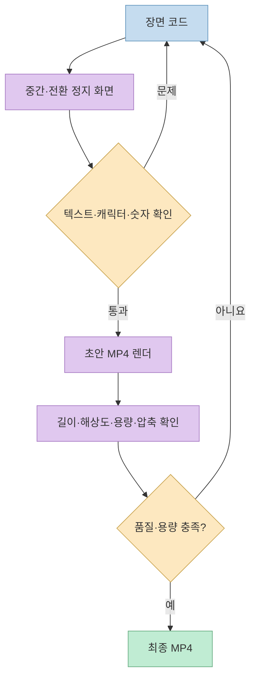

제품 소개 영상을 AI에게 맡길 때 가장 어려운 부분은 화면 효과보다 **무엇을 사실로 말할지, 어떤 장면으로 보여줄지, 결과를 어떻게 검수할지** 다. [handdrawn-promo-video](https://github.com/Changroro/handdrawn-promo-video)는 회사·제품·웹사이트 같은 주제를 조사해 손그림 Canvas 애니메이션과 8비트 캐릭터가 등장하는 짧은 MP4 홍보 영상으로 만드는 에이전트 스킬이다. 단순한 프롬프트 모음이 아니라 조사, 스토리보드 승인, 장면 구현, 정지 화면 검사, 최종 렌더링까지 이어지는 작업 절차와 코드 템플릿을 제공한다.

<!--more-->

## Sources

- [handdrawn-promo-video GitHub 저장소](https://github.com/Changroro/handdrawn-promo-video)
- [README: 설치·용도·요구사항](https://github.com/Changroro/handdrawn-promo-video/blob/main/README.md)
- [SKILL.md: 전체 제작 절차](https://github.com/Changroro/handdrawn-promo-video/blob/main/SKILL.md)
- [조사 프로토콜](https://github.com/Changroro/handdrawn-promo-video/blob/main/references/research.md)
- [스토리보드·시각 문법](https://github.com/Changroro/handdrawn-promo-video/blob/main/references/storyboard.md)
- [렌더러 구현](https://github.com/Changroro/handdrawn-promo-video/blob/main/template/render.mjs)
- [QA 체크리스트](https://github.com/Changroro/handdrawn-promo-video/blob/main/references/qa-checklist.md)

## 스킬의 핵심은 ‘바로 렌더’가 아니라 승인 가능한 제작 파이프라인

저장소의 `SKILL.md`는 먼저 영상 길이, 화면 비율, 캐릭터, 화면 언어를 정하도록 한다. 그다음 주제의 공식 사이트와 보도자료·브랜드 자산을 조사하고, 영상에 쓸 수치와 문구의 출처를 확인한다. **스토리보드와 사용 수치를 사용자에게 보여주고 승인받은 뒤에야** 작업 폴더와 장면 코드를 만든다. 완성 후에도 정지 화면과 전환 프레임을 검사한 뒤 MP4를 렌더한다. 따라서 이 스킬은 무인 자동 생성기라기보다, 사람의 판단 지점을 명시한 제작 워크플로다. [SKILL.md](https://github.com/Changroro/handdrawn-promo-video/blob/main/SKILL.md)



이 순서는 숫자 오류를 막기 위한 장치이기도 하다. 조사 프로토콜은 같은 이름의 회사·서비스를 혼동하지 않도록 도메인·대표자·위치 중 복수 단서로 대상을 확인하고, **큰 글씨로 노출할 핵심 숫자는 원문 문장과 다시 대조** 하라고 한다. 기준 연도가 불명확한 매출·인원 수나 공동사업 전체 예산을 한 회사의 실적으로 쓰지 않도록 요구한다. 불일치하는 숫자는 임의로 고르지 않고 사용자 판단 대상으로 남긴다. [조사 프로토콜](https://github.com/Changroro/handdrawn-promo-video/blob/main/references/research.md)

## 손그림 배경과 픽셀 캐릭터를 어떻게 조합하나

시각 언어의 중심은 **rough.js로 그린 선의 흔들림** 과 **8비트 미니 캐릭터** 의 대비다. 문서에서는 선 모양을 초당 약 10회 바꾸는 `line boil`, 종이 질감과 어두운 배경의 교대, 실제 로고의 픽셀화와 마스코트 변환을 제안한다. 보조 캐릭터는 주제와 관련된 3~6개를 선정하며, AI 주제용 캐릭터 세트는 `template/minis-ai.js`에 준비돼 있다. 브랜드 로고와 워드마크는 실제 자산을 쓰고, 색은 기본 잉크·종이·어두운 배경·밝은 배경에 소수의 강조색으로 제한한다. [스토리보드 문서](https://github.com/Changroro/handdrawn-promo-video/blob/main/references/storyboard.md) [Canvas API](https://github.com/Changroro/handdrawn-promo-video/blob/main/references/kit-api.md)

장면은 훅, 로고/주인공 등장, 문제·역사, 핵심 기능, 숫자 보드, 엔딩 등으로 구성할 수 있다. 문서는 15초·30초·45~60초 길이별 대략적인 호흡을 제안하고, 엔딩 로고와 URL을 적어도 1.5초 유지하라고 안내한다. 이는 고정된 영상 템플릿이 아니라 **사람이 읽을 시간과 장면 전환의 리듬을 계획하기 위한 기준** 이다. [스토리보드 문서](https://github.com/Changroro/handdrawn-promo-video/blob/main/references/storyboard.md)



## Canvas 장면은 시간 함수로 정의하고 프레임을 결정적으로 뽑는다

템플릿의 `index.html`은 `window.VIDEO = { w, h, fps, dur }`로 캔버스 크기와 길이를 지정하고, `rough.js`·`kit.js`·장면 코드 `main.js`를 로드한다. `main.js`는 각 장면의 시작·끝 시간과 그 구간을 그리는 함수를 `boot()`에 등록한다. `kit.js`는 손그림 선, 텍스트, 카메라 이동, 플래시·잉크 전환, 픽셀 캐릭터를 위한 함수들을 제공한다. 시간 `t`와 프레임 번호로 화면을 재현할 수 있어, 특정 시점의 이미지를 뽑아 검사하기 쉽다. [기본 HTML](https://github.com/Changroro/handdrawn-promo-video/blob/main/template/index.html) [장면 뼈대](https://github.com/Changroro/handdrawn-promo-video/blob/main/template/main.js) [kit API](https://github.com/Changroro/handdrawn-promo-video/blob/main/references/kit-api.md)

렌더러 `render.mjs`는 로컬 HTTP 서버로 템플릿을 제공한 뒤 headless Chrome의 여러 페이지에서 프레임을 병렬로 계산한다. 계산이 끝난 프레임은 **번호 순서대로** PNG 바이트를 `ffmpeg`에 파이프하고, `libx264`로 H.264 MP4를 만든다. `stills` 모드에서는 지정한 시간의 PNG만 저장해 빠르게 검토한다. 병렬 작업을 하면서도 출력 순서를 보존하는 것이 핵심이다. [렌더러 구현](https://github.com/Changroro/handdrawn-promo-video/blob/main/template/render.mjs)



## 설치와 실행: 필요한 것은 스킬뿐 아니라 렌더링 환경

README는 Claude Code·Codex 등에서 `npx skills add Changroro/handdrawn-promo-video -g`로 스킬을 설치하거나, Claude Code 플러그인 마켓플레이스 또는 수동 복제를 선택하도록 안내한다. 실제 제작에는 **Node.js 18 이상과 npm, `libx264`를 포함한 ffmpeg, Google Chrome, `uv`** 가 필요하다. 템플릿의 npm 의존성은 `roughjs`와 `playwright-core`다. 폰트는 실행 시 Google Fonts와 jsDelivr에서 받으며 저장소에 포함되지 않는다. [README](https://github.com/Changroro/handdrawn-promo-video/blob/main/README.md) [템플릿 의존성](https://github.com/Changroro/handdrawn-promo-video/blob/main/template/package.json)

```sh
npx skills add Changroro/handdrawn-promo-video -g
```

설치 후에는 “우리 회사 소개 영상을 30초로 만들어줘”처럼 주제와 원하는 결과를 요청한다. 스킬이 길이·화면 비율·캐릭터·화면 언어를 확인하고 조사·승인 단계를 진행한다. 승인 없이 사실·숫자·브랜드 자산을 임의로 확정하는 일은 이 스킬의 의도된 흐름이 아니다. 기본 영상은 무음이며, README가 언급하는 ‘30초·1080p에서 약 8MB’는 프로젝트가 제시한 예시 수준이지 모든 장면·해상도에서 보장되는 크기가 아니다. [README](https://github.com/Changroro/handdrawn-promo-video/blob/main/README.md) [SKILL.md](https://github.com/Changroro/handdrawn-promo-video/blob/main/SKILL.md)

## 검수에서 확인할 것과 현재 템플릿의 주의점

QA 문서는 장면 중간과 전환 직전·직후의 정지 화면을 뽑아 텍스트 잘림, 캐릭터 겹침, 줌 중 라벨 이탈, 폰트 글리프 누락을 검사하도록 한다. 초안 MP4를 만든 뒤에는 `ffprobe`로 길이·해상도·fps·크기를 확인하고, 전환 시점의 프레임을 다시 추출해 압축 흔적을 살핀다. 기본 목표는 **30초당 10MB 이하** 이며, 파일이 크면 `CRF`를 올리거나 배경 노이즈를 줄이는 방법을 제시한다. [QA 체크리스트](https://github.com/Changroro/handdrawn-promo-video/blob/main/references/qa-checklist.md)



**현재 공개 템플릿의 프레임 처리에는 30fps가 하드코딩돼 있다.** `render.mjs`는 ffmpeg 입력 프레임률을 30으로 지정하고, 정지 화면의 초를 프레임으로 바꿀 때도 `×30`을 사용한다. 따라서 `window.VIDEO.fps`만 다른 값으로 바꾸면 렌더 결과와 미리보기 시간이 일치하지 않을 수 있다. 스킬이 9:16·1:1·1440p 옵션을 안내하더라도, 실제 출력 캔버스 크기와 장면 좌표·폰트 크기는 해당 비율에서 별도로 검증해야 한다. 이 부분은 문서의 약속을 부정하는 것이 아니라 **기본 코드에서 확인되는 구현 경계** 다. [렌더러 코드](https://github.com/Changroro/handdrawn-promo-video/blob/main/template/render.mjs) [기본 영상 설정](https://github.com/Changroro/handdrawn-promo-video/blob/main/template/index.html)

로고·캐릭터에도 권리 확인이 필요하다. 저장소의 AI 캐릭터는 비공식 팬아트이며 제품명과 상표는 각 권리자에게 있다. 회사 로고를 영상에 쓸 권리, 제3자 기사·수치의 정확성, 내려받는 폰트의 라이선스는 실제 게시 전에 검토해야 한다. 저장소 코드의 라이선스는 MIT다. [README의 자산 주의사항](https://github.com/Changroro/handdrawn-promo-video/blob/main/README.md) [LICENSE](https://github.com/Changroro/handdrawn-promo-video/blob/main/LICENSE)

## 실전 적용 포인트

1. 제작 전에 대상 기업·제품을 확정하고 공식 출처에서 로고, 핵심 문구, 사용 가능한 숫자를 모은다.
2. 15초·30초 등 길이에 맞춰 장면별 핵심 메시지를 한 줄로 제한하고, 큰 숫자는 원문과 재대조한다.
3. 스토리보드와 등장 캐릭터를 승인받은 뒤 장면 코드를 만든다.
4. 정지 화면과 전환 프레임을 먼저 확인하고, 초안 MP4의 기술 사양을 점검한다.
5. 기본 30fps 외 설정이나 세로형 영상은 템플릿의 하드코딩과 좌표계를 확인한 뒤 시험 렌더한다.

## 핵심 요약

- handdrawn-promo-video는 **자료 조사 → 승인 → Canvas 제작 → QA → H.264 렌더링** 을 묶은 에이전트 스킬이다.
- rough.js 손그림과 픽셀 캐릭터를 섞고, Chrome에서 계산한 프레임을 순서대로 ffmpeg에 전달한다.
- 영상의 숫자·브랜드 자산·장면 구성은 사람이 승인하는 절차가 핵심이다.
- 기본 렌더러는 30fps를 가정하므로 다른 프레임률·화면 비율은 별도 검증이 필요하다.

## 결론

이 저장소의 강점은 특정 ‘손그림 효과’ 자체보다, 출처가 있는 홍보 메시지를 **검토 가능한 장면과 재현 가능한 프레임 렌더링** 으로 연결한 데 있다. 실제 배포에서는 승인된 사실과 자산을 사용하고, 출력 영상의 가독성·사양·권리를 마지막까지 확인해야 한다.
