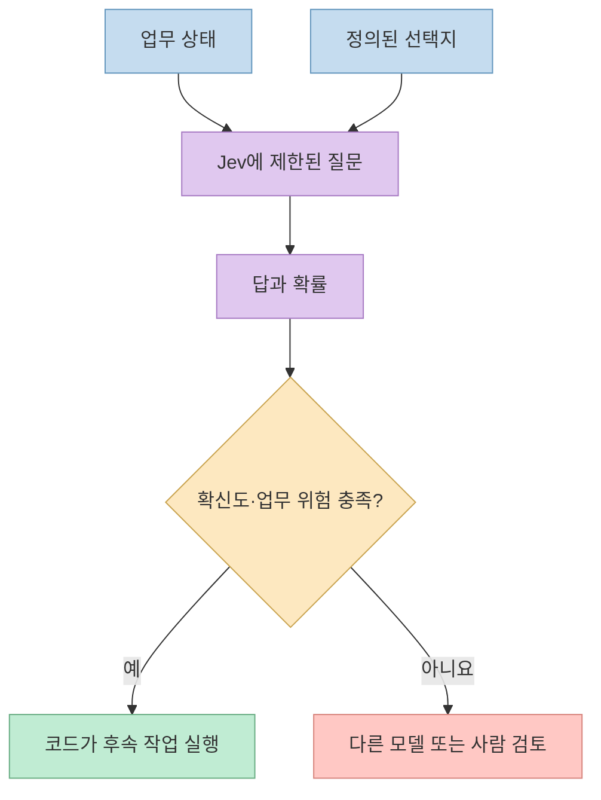
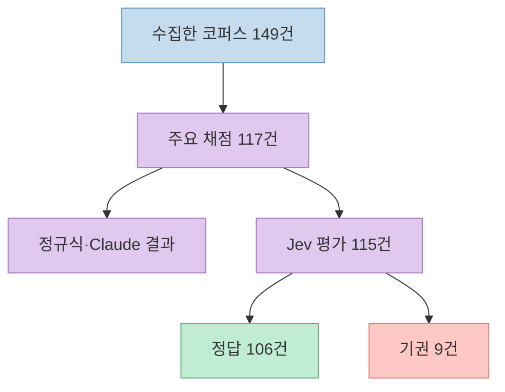
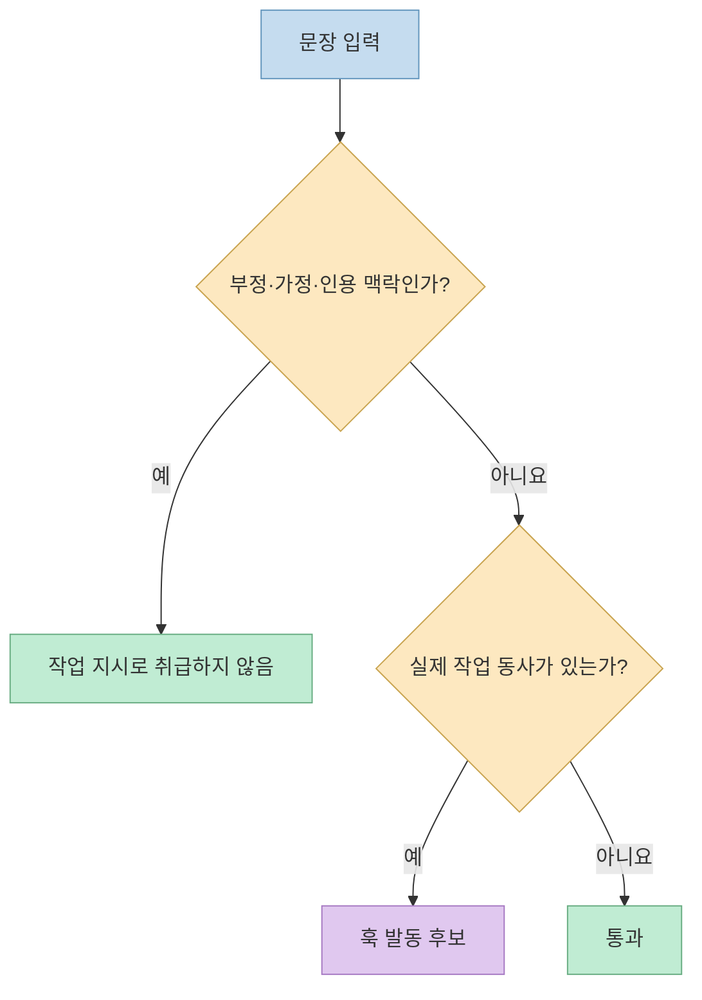
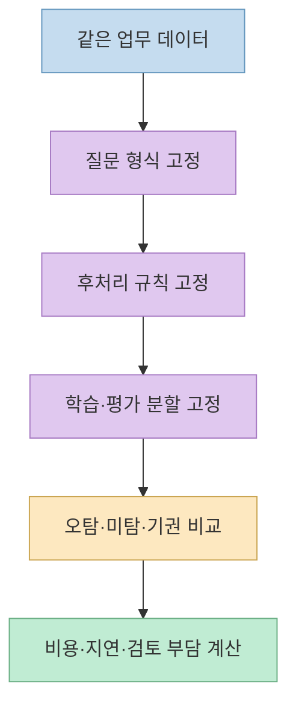
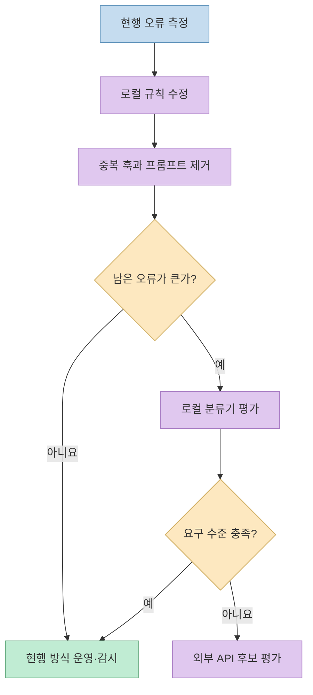

새 AI 모델이 훨씬 빠르고 싸다는 발표가 나오면 기존 분류기를 곧바로 교체하고 싶어진다. 하지만 실제 업무에서 중요한 질문은 “어느 모델이 더 인상적인가”가 아니라 **지금 시스템의 어떤 오류를 줄여야 하는가** 다. 퀀텀점프클럽(QJC)은 판단 전용 모델 Jev를 여덟 차례 심사하고도 도입을 보류했다. 평가 과정에서 발견한 가장 값진 개선은 새 모델이 아니라 기존 정규식 훅의 오탐을 고친 일이었다. 이 글은 [QJC의 Threads 게시글](https://www.threads.com/share/BAm7XnAE-J/)과 [상세 보고서](https://qjc.app/blog/jev-adoption-audit)를 중심으로 그 판단 과정을 재구성한다.

<!--more-->

## Sources

- [원본 Threads 게시글](https://www.threads.com/share/BAm7XnAE-J/)
- [QJC의 8라운드 Jev 도입 심사 보고서](https://qjc.app/blog/jev-adoption-audit)
- [TypeSafe AI의 Jev 소개](https://typesafe.ai/blog/introducing-system-one-models-and-jev)
- [독립 피싱 메일 벤치마크 원자료·방법](https://github.com/anisselbd/jev-phishing-bench)
- [Jevals 독립 평가 데이터](https://github.com/Jevals/jevals-data)

## Jev는 무엇을 대체할 수 있고, 무엇은 못 하나

TypeSafe AI가 2026년 9월 15일 공개한 Jev는 자유 문장을 생성하는 채팅 모델이 아니라 **미리 정한 선택지·점수·예/아니오의 구조화된 결정** 을 반환하는 모델이다. 개발자는 상태와 질문, 허용 가능한 답의 범위를 정의하고, 모델은 그 범위의 답과 확률을 낸다. TypeSafe는 입력 100만 토큰당 0.042달러, 출력 토큰 과금 없음, 70~500ms 수준의 응답 시간을 소개한다. 모두 벤더가 공개한 가격·성능 조건이므로 실제 네트워크, 질문 길이, 배치 방식에서 재측정해야 한다. [TypeSafe 공식 소개](https://typesafe.ai/blog/introducing-system-one-models-and-jev)

**형식 오류가 없다는 주장과 판단 오류가 없다는 주장은 다르다.** 정해 둔 스키마 밖의 값을 내지 않더라도, 잘못된 선택지를 높은 확률로 고를 수 있다. 벤더도 자체 벤치마크 워크플로를 모델 역량팀이 만들었고 편향 가능성이 있으며, 큰 속도·비용 향상 배수는 실사용의 상단에 가까울 수 있다고 명시한다. 따라서 QJC처럼 실제 업무의 입력을 별도로 평가해야 한다. [TypeSafe의 평가 주의사항](https://typesafe.ai/blog/introducing-system-one-models-and-jev)

## 149건을 모았지만 모든 수치의 분모는 같지 않다

QJC는 개발 환경에서 쓰는 **행동 감지 훅** 의 사례 149건을 모아 기존 정규식, 로컬 소형 모델, Jev, Claude 모델을 비교했다고 보고한다. 공개된 요약에서 정규식 훅은 **117건 중 69건 정답·오탐 43건**, Jev는 **115건 중 106건 정답·오탐 0건·기권 9건**, Claude Haiku 4.5와 Sonnet 5는 각각 **117건 전부 정답** 이다. 로컬 kev 0.5B는 87건 정답으로 소개되지만, 본문 요약만으로는 동일 분모의 모든 세부 지표를 재구성하기 어렵다. 서로 다른 분모를 무시하고 단일 정확도 순위처럼 읽어서는 안 된다. 이 수치는 QJC의 **자체 과제에 대한 자체 보고** 이며 공개 요약만으로 독립 재현한 결과는 아니다. [QJC 심사 보고서](https://qjc.app/blog/jev-adoption-audit)

Jev가 기권한 9건은 QJC 조직 내부에서만 쓰는 고유 명칭과 관련됐다고 한다. 확신도 0.8 이상 구간의 **정밀도 1.00** 은 눈여겨볼 만하지만, 그 구간의 **커버리지는 전체의 약 60%** 라고 보고됐다. “60%만 확신했다”와 “9건을 기권했다”는 서로 다른 측정치다. 나머지 40%가 모두 기권했다는 뜻이 아니다. 고확신 구간에만 자동 실행을 허용한다면, 나머지를 누가 얼마나 자주 처리해야 하는지까지 운영 비용으로 계산해야 한다. [QJC 심사 보고서](https://qjc.app/blog/jev-adoption-audit)

Claude의 117건 만점도 곧바로 모든 배포 조건에서의 우월함을 뜻하지 않는다. 보고서는 배치 처리와 개별 질문 방식의 차이를 언급하고, 어려운 12건을 한 건씩 다시 물었을 때도 Claude가 모두 맞혔다고 한다. 그러나 **12건은 작고, 한 팀의 훅 분류 과제** 다. 이 결과는 해당 도입 결정에는 중요하지만 다른 도메인이나 데이터 분포로 일반화할 수 없다. [QJC 심사 보고서](https://qjc.app/blog/jev-adoption-audit)

## 가장 큰 개선은 기존 정규식 훅을 고친 데서 나왔다

심사 도중 감사 리포트에 인용한 예시 문장 자체가 기존 훅을 발동시켰다. QJC의 전수 점검에 따르면 일부 훅은 부정문·가정문·설명 문장을 실제 작업 지시로 잘못 읽었다. 예를 들어 “만들지 말고”에 포함된 동사만 보고 제작 요청으로 분류하는 식이다. 이 때문에 기존 정규식 훅에서 오탐 43건이 발견됐다. [QJC 심사 보고서](https://qjc.app/blog/jev-adoption-audit)

QJC는 부정·가정·설명 표현을 먼저 거르는 층과 실제 작업 동사를 찾는 층으로 정규식을 나눠 수정했다고 보고한다. 그 결과 **수정 대상으로 집계한 오탐 42건이 0건** 이 됐고, 해당 테스트에서는 새 미탐이 늘지 않았다고 한다. 처음 발견한 43건과 수정 대상 42건은 집계 범위가 다르게 제시되므로, “43건 모두 해결”로 바꿔 쓰지 않는다. 수정은 2026년 9월 22일 네 개 훅에 적용됐다고 한다. 새 모델 비용을 지불하기 전에 현재 시스템의 오류를 측정하면, 훨씬 간단한 해결책이 나올 수 있다는 사례다. [QJC 심사 보고서](https://qjc.app/blog/jev-adoption-audit)

## 질문을 바꾸면 모델 비교 자체가 달라진다

QJC가 인용한 별도 피싱 메일 연구는 이 문제를 더 뚜렷하게 보여준다. 연구자의 공개 저장소에 따르면 **전체 2,000통에 대한 단일 직접 판정** 에서는 Jev 62.6%, Claude Haiku 4.5 81.3%였다. 반면 **다섯 개 신호를 묻고 조합 규칙을 학습한 뒤 보류한 1,000통에서 평가** 하면 Jev 95.0%, Haiku 93.2%였다. 후자의 정확도 차이는 해당 연구의 쌍별 검정에서 유의하지 않았고, AUROC는 Haiku 쪽이 더 높았다. [피싱 벤치마크 원자료](https://github.com/anisselbd/jev-phishing-bench)

여기서 조심할 점은 **62.6→95.0%가 질문만 다섯 개로 쪼개서 생긴 순수 효과로 입증된 것은 아니라는 것** 이다. 단일 판정은 전체 2,000통에서 측정했고, 다섯 신호의 합성은 데이터 절반에서 임계값·가중치를 정한 후 나머지 절반에서 측정했다. 질문 구조, 조합 규칙, 평가 부분집합이 함께 달라졌다. 정확한 교훈은 “다섯 질문이면 Jev가 95%가 된다”가 아니라, **질문·후처리·데이터 분할을 고정하지 않은 모델 비교는 쉽게 뒤집힌다** 는 것이다. [피싱 벤치마크 방법](https://github.com/anisselbd/jev-phishing-bench)

## 도입 판단은 호출 요금이 아니라 전체 손실로 한다

QJC는 자체 심사에서 Jev 호출비를 **0.24센트(0.0024달러)**, Claude 비용을 몇 달러 수준으로 제시한다. 동시에 초기 비용 배수 계산에는 하네스 오버헤드가 섞여 있어 재측정이 필요하다고 밝힌다. 따라서 이 사례를 근거로 보편적인 “몇 배 저렴하다”는 결론을 만들 수 없다. 중요한 것은 Jev가 기권한 9건과 놓칠 수 있는 업무 판단의 비용이 몇 달러 차액보다 클 수 있다는 **QJC의 과제별 판단** 이다. [QJC 심사 보고서](https://qjc.app/blog/jev-adoption-audit)

이 심사에서 도출할 수 있는 운영 순서는 다음과 같다. **① 현재 시스템의 오탐·미탐을 측정한다 → ② 로컬 규칙을 고친다 → ③ 중복 훅·프롬프트를 줄인다 → ④ 필요하면 로컬 분류기를 시험한다 → ⑤ 그래도 남는 판단에 외부 모델 API를 검토한다.** 각 단계에서 모델 정답률만이 아니라 기권 후 사람 검토량, 잘못된 자동 실행의 피해, 데이터 반출 조건, 지연 시간도 함께 기록해야 한다. 이는 QJC가 보고서에서 제시한 순서를 실무 평가 항목으로 풀어 쓴 것이다. [QJC 심사 보고서](https://qjc.app/blog/jev-adoption-audit)

## 실전 적용 포인트

1. 실제 업무 문장으로 평가 세트를 만들고 부정문·인용문·내부 고유명사를 반드시 포함한다. [QJC의 오탐 분석](https://qjc.app/blog/jev-adoption-audit)
2. 모든 후보를 **같은 항목·같은 질문·같은 후처리·같은 평가 분할** 에서 비교한다. 조건이 바뀌면 별도 실험으로 표기한다. [피싱 벤치마크 방법](https://github.com/anisselbd/jev-phishing-bench)
3. 정밀도와 함께 커버리지·기권율을 기록하고, 기권 시 사람이나 상위 모델로 보내는 비용을 계산한다. [QJC의 Jev 평가](https://qjc.app/blog/jev-adoption-audit)
4. 벤더 홍보 수치와 자체 업무 수치, 독립 벤치마크 수치를 섞어 단일 순위로 만들지 않는다. [TypeSafe의 주의사항](https://typesafe.ai/blog/introducing-system-one-models-and-jev) [Jevals 독립 데이터](https://github.com/Jevals/jevals-data)

## 핵심 요약

- Jev의 구조화 출력과 저렴한 호출비는 분명한 장점이지만, 형식 안정성은 정답을 보장하지 않는다.
- QJC의 자체 훅 과제에서는 Jev가 **115건 중 106건 정답·9건 기권**, Claude 모델들이 **117건 중 117건 정답** 으로 보고됐다. 분모와 처리 방식 차이를 함께 읽어야 한다.
- 심사의 직접적인 개선 효과는 기존 정규식 훅의 오탐을 발견하고 수정한 데서 나왔다.
- 외부 벤치마크의 62.6%와 95.0%는 질문뿐 아니라 조합·평가 조건도 다른 수치다.

## 결론

QJC가 Jev를 보류한 결론은 “Jev가 나쁘다”가 아니다. **이 팀의 현재 훅 분류 작업에서는 기존 방식의 오탐을 먼저 고치는 편이 더 값졌고, 남은 업무 판단은 다른 모델이 더 잘 처리했다** 는 사례별 판단이다. 새 모델의 채택 여부를 결정하기 전에, 현재 오류의 종류와 비용부터 재는 습관이 더 오래가는 자산이 된다.
