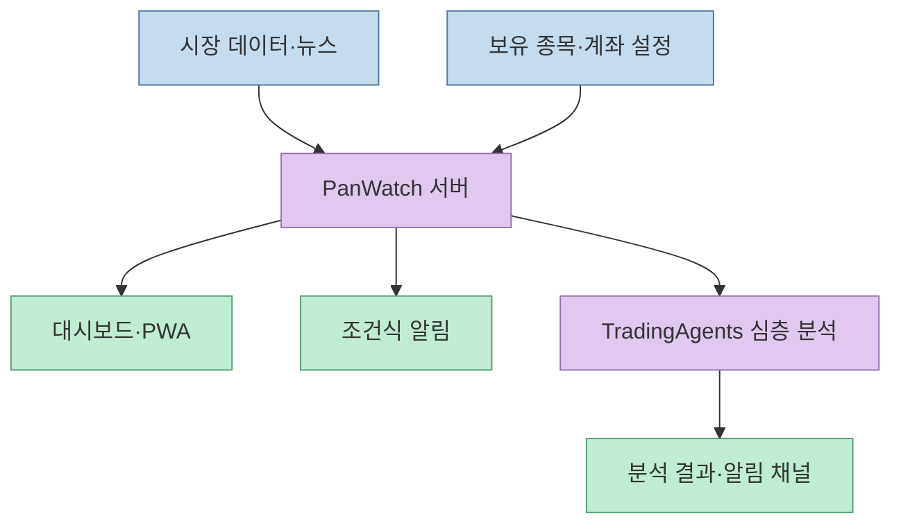
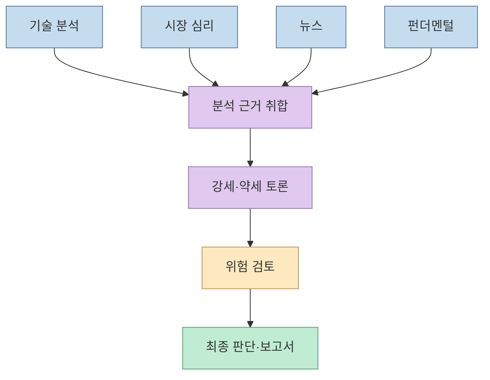
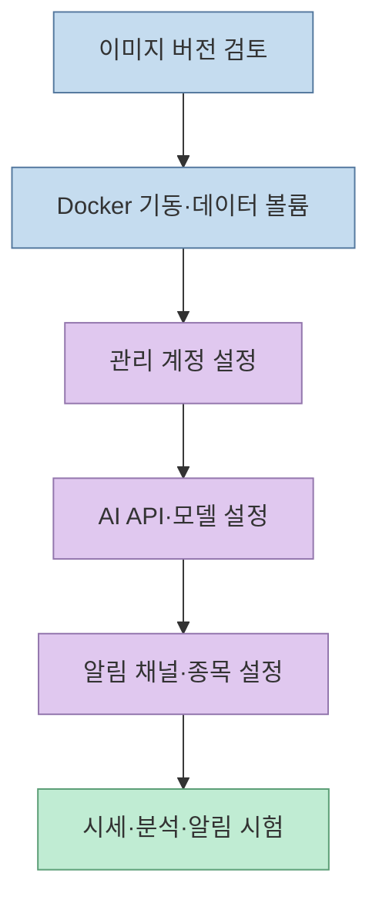
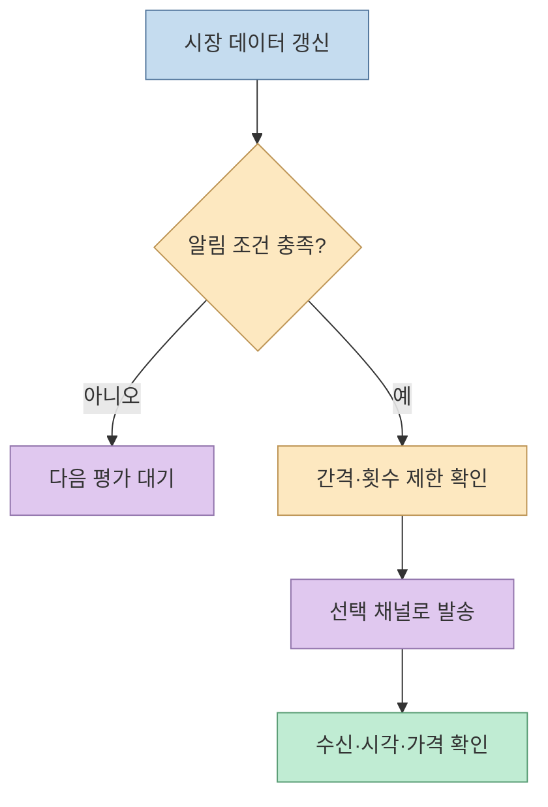

[@think.5x의 Threads 글](https://www.threads.com/share/BAUNmYZKhJ/)은 주식 모니터링 도구 **PanWatch**를 네 가지 특징으로 소개한다. AI 애널리스트의 토론, Docker 배포, 조건식 알림, 다중 계좌·PWA다. 실제 프로젝트의 [공식 저장소](https://github.com/TNT-Likely/PanWatch)를 확인하면 기능의 큰 줄기는 맞지만, “분석 한 번에 약 0.05달러”와 “데이터가 밖으로 나가지 않는다”는 말에는 중요한 전제가 붙는다. 이 글은 제품이 **무엇을 자동화하는지**, **어디까지 검증됐는지**, **직접 운영할 때 무엇을 확인해야 하는지**를 구분한다.

<!--more-->

## Sources

- [원문 Threads 공유 링크](https://www.threads.com/share/BAUNmYZKhJ/) · [원문 게시글](https://www.threads.com/@think.5x/post/DdqZ948n--C)
- [PanWatch GitHub 저장소와 README](https://github.com/TNT-Likely/PanWatch)
- [PanWatch 시장 데이터 모듈 문서](https://github.com/TNT-Likely/PanWatch/blob/main/packages/marketdata/README.md) · [TradingAgents 연동 코드](https://github.com/TNT-Likely/PanWatch/blob/main/src/modules/automation/tradingagents/agent.py)
- [TradingAgents 원본 프레임워크](https://github.com/TauricResearch/TradingAgents)

## 1. PanWatch는 매매 봇보다 모니터링·분석 작업대에 가깝다

PanWatch는 중국 A주·홍콩주·미국주를 대상으로 시세 모니터링, 보유 종목 관리, 기술 지표, AI 분석, 알림을 한곳에 모으는 자가 호스팅 웹 앱이다. 공식 README는 여러 계좌를 구분해 자산을 합산하고, 모의투자 화면과 모바일 PWA도 제공한다고 설명한다. 이는 **증권사 계좌를 자동 연결하거나 주문을 실제로 집행한다는 뜻은 아니다.** 계좌별 보유 정보 입력·동기화 범위와 주문 실행 여부는 별도로 확인해야 한다. [PanWatch README](https://github.com/TNT-Likely/PanWatch/blob/main/README.md)



README가 언급하는 기술 지표에는 MA, MACD, RSI, KDJ 등이 있다. 이런 지표는 관측 값을 정리하는 도구이지 수익을 보장하는 예측기는 아니다. 시장·종목에 따라 데이터 제공 범위와 지연도 달라질 수 있으므로, 실제 의사결정 전 원천 시세와 거래소 시간을 대조하는 편이 안전하다. [PanWatch README](https://github.com/TNT-Likely/PanWatch/blob/main/README.md), [시장 데이터 모듈 문서](https://github.com/TNT-Likely/PanWatch/blob/main/packages/marketdata/README.md)

## 2. “애널리스트 4명”은 전체 의사결정 과정의 첫 단계다

Threads의 첫 번째 포인트는 기술·심리·뉴스·펀더멘털 담당 AI 네 종류가 각자 분석하고 토론한다는 것이다. [PanWatch README](https://github.com/TNT-Likely/PanWatch/blob/main/README.md)는 이 네 분석 결과가 **강세·약세 토론, 위험 검토, 포트폴리오 매니저의 최종 판단**으로 이어진다고 설명한다. 기반인 [TradingAgents](https://github.com/TauricResearch/TradingAgents)도 애널리스트, 토론 담당 연구원, 트레이더, 위험 관리, 포트폴리오 매니저를 역할별로 구분한다. 따라서 “AI 네 명의 다수결”보다는 **서로 다른 근거를 역할별로 검토하는 다단계 LLM 워크플로**라고 이해하는 편이 정확하다.



PanWatch의 [연동 코드](https://github.com/TNT-Likely/PanWatch/blob/main/src/modules/automation/tradingagents/agent.py)는 선택할 분석가와 토론 라운드, LLM 시간 제한·토큰 제한 등을 구성하고, 결과와 추정 비용을 기록한다. 결과가 단계별로 나온다고 해서 시장의 불확실성이 사라지는 것은 아니다. 네 역할이 **같은 부정확한 시세나 뉴스**를 받으면 여러 에이전트가 같은 오류를 그럴듯하게 강화할 수 있다. TradingAgents 원본도 연구용 프레임워크이며 성과는 모델·기간·데이터 품질 등에 따라 달라지고 투자 조언이 아니라고 명시한다. [TradingAgents README](https://github.com/TauricResearch/TradingAgents)

## 3. 배포는 짧지만, 운영 설정까지 한 줄은 아니다

Threads의 두 번째 포인트인 Docker 실행 명령은 공식 README에도 있다. 컨테이너를 띄우면 `http://localhost:8000`에서 첫 계정을 설정할 수 있다. 다만 **AI 제공자, 알림 채널, 보유 종목·Agent 설정**은 웹 화면에서 추가로 구성해야 한다. README는 첫 실행 시 Chromium 다운로드가 필요할 수 있고 몇 분 걸릴 수 있다고도 안내한다. [PanWatch 설치 안내](https://github.com/TNT-Likely/PanWatch/blob/main/README.md)

```bash
docker run -d \
  --name panwatch \
  -p 8000:8000 \
  -v panwatch_data:/app/data \
  sunxiao0721/panwatch:latest
```

이 명령은 **문서에 나온 예시**이며 여기서 실행하거나 이미지를 검증하지는 않았다. `latest` 태그는 내용이 바뀔 수 있으므로 운영 환경에서는 검토한 버전 태그 또는 이미지 다이제스트를 고정하는 편이 재현성에 유리하다. 또한 예시의 `-p 8000:8000`은 호스트의 네트워크 인터페이스에 포트를 공개할 수 있으므로, 개인 테스트라면 접근 범위를 제한하고 외부 공개 시 인증·HTTPS·방화벽을 점검해야 한다. 이는 Docker 배포 방식에 대한 운영상 권고다.



## 4. 조건식 알림과 여러 계좌: 편의 기능의 검증 지점

세 번째 포인트인 알림은 가격·등락률·거래대금·거래량 비율 등의 조건을 `AND` 또는 `OR`로 묶는 방식이다. 공식 문서는 거래 시간 적용 여부, 알림 간격 제한, 하루 최대 발송 수, 반복 방식과 채널 선택도 설명한다. Telegram, 기업용 WeChat, DingTalk, Feishu, Bark, 사용자 정의 웹훅 등이 명시돼 있다. **조건이 맞았다는 사실과 매매 적기라는 판단은 다르다.** 또한 외부 알림 채널을 사용하면 메시지 내용이 해당 서비스로 전송된다. [PanWatch README](https://github.com/TNT-Likely/PanWatch/blob/main/README.md)

네 번째 포인트인 다중 계좌 화면은 계좌별 보유 종목을 구분하면서 총자산을 함께 볼 수 있게 하는 기능이다. PWA는 브라우저 화면을 홈 화면에 설치해 앱처럼 접근하는 방식으로 소개된다. 여기서도 **대시보드의 합산 값이 증권사 원장과 자동으로 일치한다는 보장은 없다.** 통화 변환, 수수료, 갱신 시점, 입력 누락을 사용자가 확인해야 한다. 이는 원본 기능 설명에서 도출한 검증 항목이지 프로젝트가 특정 오류를 일으킨다는 뜻은 아니다. [PanWatch README](https://github.com/TNT-Likely/PanWatch/blob/main/README.md)



## 5. 비용과 데이터 보안: 홍보 문구의 조건을 분리한다

Threads와 README는 심층 분석 비용을 **회당 약 0.05달러**로 소개한다. README의 표현은 기본 `deepseek-chat` 설정을 전제로 한 예시다. 실제 비용은 사용하는 모델과 제공자의 요금, 입력 문맥·출력 길이, 토론 라운드, 실패 후 재시도에 따라 달라진다. [연동 코드](https://github.com/TNT-Likely/PanWatch/blob/main/src/modules/automation/tradingagents/agent.py)에도 토론 라운드와 토큰 제한, 비용 기록 경로가 있다. 따라서 이 수치를 **고정 가격이나 독립 검증된 평균**으로 인용하지 말고 자신의 설정에서 사용량 기록과 청구서를 대조해야 한다. [PanWatch README](https://github.com/TNT-Likely/PanWatch/blob/main/README.md)

“내 서버에 올리니 데이터가 밖으로 나가지 않는다”는 말도 그대로 받아들이기 어렵다. 보유 정보 저장소는 로컬 볼륨일 수 있지만, README는 OpenAI 호환 **외부 AI API** 설정과 Telegram 등의 **외부 알림 채널**을 안내한다. [시장 데이터 모듈](https://github.com/TNT-Likely/PanWatch/blob/main/packages/marketdata/README.md) 역시 여러 공급자에게 시세를 요청한다. 이 문서들로부터 추론하면 실제 외부 전송 범위는 선택한 AI 제공자·데이터 공급자·알림 채널에 따라 달라진다. 로컬 Ollama 같은 모델을 선택하면 LLM 요청의 외부 전송은 줄일 수 있겠지만, 전체 시스템의 네트워크 통신이 사라지는 것은 아니다. [PanWatch README](https://github.com/TNT-Likely/PanWatch/blob/main/README.md)

## 실전 적용 포인트

1. **모의 데이터로 시작한다.** 실제 계좌 정보와 API 키를 넣기 전에 테스트 종목으로 시세 갱신·알림 지연·중복 발송을 확인한다.
2. **출처와 시각을 기록한다.** 분석 시 사용한 시세·뉴스가 언제 수집됐는지 확인하고, 거래소 정보와 비교한다. 데이터 공급자 장애나 대체 경로도 점검한다.
3. **모델 비용을 측정한다.** 같은 종목을 여러 번 실행해 토큰 사용량·실제 청구액·실패율을 비교한다. README의 예시 금액을 예산으로 고정하지 않는다.
4. **네트워크 경계를 그린다.** AI API, 시장 데이터, Telegram·웹훅으로 어떤 정보가 나가는지 확인하고, 계정·볼륨 백업·포트 공개 범위를 관리한다.
5. **투자 판단은 분리한다.** AI의 토론 결과는 검토 자료로 취급하고, 손익과 위험 한도에 대한 결정은 사람이 한다.

## 핵심 요약

- PanWatch는 **시장 모니터링·다중 계좌·조건식 알림·TradingAgents 분석**을 한 화면에 묶는 자가 호스팅 프로젝트다.
- 네 명의 분석가가 전부가 아니다. 분석 뒤 강세·약세 토론과 위험 검토, 최종 판단 단계가 이어진다.
- Docker 한 줄은 서버 시작 단계이며, AI 제공자와 알림 채널 등은 별도 설정이 필요하다.
- **회당 약 0.05달러와 완전한 데이터 비유출은 보장된 속성이 아니다.** 모델·통신 설정을 직접 검증해야 한다.

## 결론

PanWatch의 가치는 AI가 수익을 예측한다는 주장보다 **흩어진 시장 관찰과 분석 근거를 한 작업 흐름에 모으는 데** 있다. 직접 운영한다면 기능 목록보다 데이터의 시점, 외부 전송 경로, 실제 비용, 알림 신뢰성을 먼저 검증하자. 이 글은 도구 구조를 설명하는 기술 문서이며 투자 권유가 아니다.
