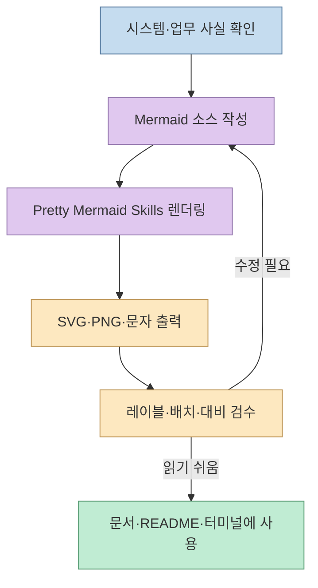
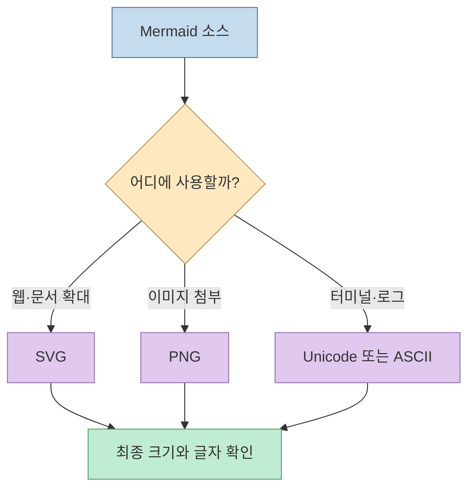
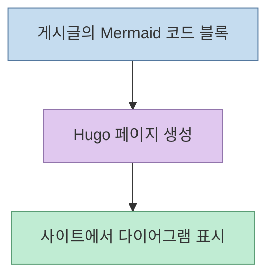
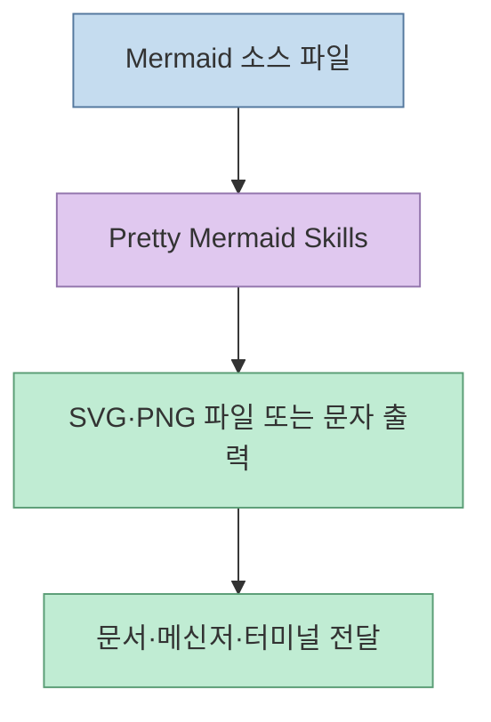

AI 코딩 에이전트가 Mermaid 코드를 생성해도 **그림이 읽기 좋은지**는 별개의 문제다. [@mori_mement0의 Threads 글](https://www.threads.com/share/BAXKGcKOoa/)은 이 간극을 메우는 도구로 **Pretty Mermaid Skills**를 소개한다. 원본 저장소를 확인하면 이 스킬은 Mermaid 소스를 받아 테마가 적용된 SVG·PNG 또는 터미널용 문자 다이어그램으로 출력하는 Node.js 기반 작업 흐름이다. 핵심은 "그림을 자동으로 예쁘게 만든다"는 약속보다 **소스 → 렌더링 → 결과 확인**을 에이전트의 작업에 포함시키는 데 있다.

<!--more-->

## Sources

- [원문 Threads 공유 링크](https://www.threads.com/share/BAXKGcKOoa/) · [원문 게시글](https://www.threads.com/@mori_mement0/post/DdpuE8KGECu)
- [Pretty Mermaid Skills GitHub 저장소](https://github.com/imxv/Pretty-mermaid-skills) · [README](https://github.com/imxv/Pretty-mermaid-skills/blob/main/README.md) · [SKILL.md](https://github.com/imxv/Pretty-mermaid-skills/blob/main/SKILL.md)
- [렌더링 스크립트](https://github.com/imxv/Pretty-mermaid-skills/blob/main/scripts/render.mjs) · [의존성 선언](https://github.com/imxv/Pretty-mermaid-skills/blob/main/package.json) · [기반 라이브러리 beautiful-mermaid](https://github.com/lukilabs/beautiful-mermaid)

## 1. 스킬의 역할은 Mermaid 작성이 아니라 결과물까지 이어주는 것이다

Mermaid는 텍스트로 흐름·관계·상태를 표현한다. 그런데 코드를 만들었다는 사실만으로 노드 간격, 긴 레이블, 색 대비, 모바일 화면에서의 가독성이 해결되지는 않는다. Threads 작성자도 AI가 만든 Mermaid가 복잡하거나 겹쳐 보이는 경험에서 이 스킬에 관심을 가졌다고 말한다. 이는 **사용 경험과 기대를 담은 소개**이지, 기존 렌더러보다 우수하다는 비교 실험은 아니다. [Threads 원문](https://www.threads.com/@mori_mement0/post/DdpuE8KGECu)

[원본 `SKILL.md`](https://github.com/imxv/Pretty-mermaid-skills/blob/main/SKILL.md)의 절차는 작업에 맞는 다이어그램 형식을 고르고, Mermaid 소스를 준비한 뒤, 출력 형식과 테마를 선택해 렌더링하고, 결과를 검사하도록 구성돼 있다. 기존 `.mmd` 파일을 변환할 수도 있고, 에이전트에게 새 그림을 만들게 할 수도 있다. 그러나 **내용의 정확성**은 별도로 검토해야 한다. 깔끔한 SVG도 잘못된 시스템 구조를 설명할 수 있기 때문이다.



## 2. SVG·PNG·ASCII를 용도에 맞춰 고른다

현재 원본 저장소의 [README](https://github.com/imxv/Pretty-mermaid-skills/blob/main/README.md)와 [`SKILL.md`](https://github.com/imxv/Pretty-mermaid-skills/blob/main/SKILL.md)는 **SVG, PNG, ASCII·Unicode** 출력을 안내한다. SVG는 확대 가능한 문서·웹용, PNG는 이미지 첨부나 래스터 형식만 받는 곳, 문자 출력은 터미널·로그·텍스트 채널에 어울린다. `--format ascii`에서 Unicode 박스 문자가 기본이며, 제한적인 환경에서 순수 ASCII가 필요하면 `--use-ascii`를 사용한다. PNG는 별도의 브라우저 캡처가 아니라 [스크립트의 SVG→PNG 변환 경로](https://github.com/imxv/Pretty-mermaid-skills/blob/main/scripts/render.mjs)를 거친다.



지원 범위는 무한하지 않다. 저장소는 **flowchart, sequence, state, class, ER, XY 차트**의 여섯 종류와 15개 내장 테마를 명시한다. `tokyo-night`, `github-light`, `dracula` 같은 테마를 고르거나 색을 직접 지정할 수 있고, 여러 파일을 한 번에 변환하는 배치 스크립트도 제공한다. 반면 모든 Mermaid 문법·확장 기능이 동일하게 동작한다고 가정하면 안 된다. 프로젝트에서 사용하는 특수 구문은 샘플을 먼저 렌더링해 확인해야 한다. [README](https://github.com/imxv/Pretty-mermaid-skills/blob/main/README.md), [SKILL.md](https://github.com/imxv/Pretty-mermaid-skills/blob/main/SKILL.md), [beautiful-mermaid 원본](https://github.com/lukilabs/beautiful-mermaid)

## 3. “브라우저 없이 로컬 렌더링”의 정확한 의미

이 스킬의 장점은 렌더링에 Chrome이나 DOM을 띄우지 않아도 된다는 점이다. 기반인 [`beautiful-mermaid`](https://github.com/lukilabs/beautiful-mermaid)는 브라우저 DOM 의존성 없는 SVG·문자 렌더링을 제공하고, 스킬은 Node.js CLI로 이를 감싼다. PNG 출력에는 [`@resvg/resvg-js`](https://github.com/imxv/Pretty-mermaid-skills/blob/main/package.json)가 쓰인다. 따라서 **브라우저 불필요 ≠ 추가 소프트웨어 불필요**다. 저장소는 Node.js 16 이상을 요구하고, 스크립트는 의존성이 없으면 첫 실행 때 `npm install`을 시도한다. 오프라인·제한된 CI에서는 의존성을 미리 준비해야 한다. [README](https://github.com/imxv/Pretty-mermaid-skills/blob/main/README.md), [렌더링 스크립트](https://github.com/imxv/Pretty-mermaid-skills/blob/main/scripts/render.mjs), [package.json](https://github.com/imxv/Pretty-mermaid-skills/blob/main/package.json)

원본 README의 설치 명령은 다음과 같다. 이 글에서는 **설치하거나 실행하지 않았으며**, 실제 적용 전 저장소의 `SKILL.md`와 스크립트가 현재 환경에서 실행될 내용을 확인해야 한다. [`scripts/render.mjs`의 예시](https://github.com/imxv/Pretty-mermaid-skills/blob/main/scripts/render.mjs)는 스킬 디렉터리에서 실행하는 상대 경로를 사용하므로, 다른 디렉터리라면 경로를 조정해야 한다.

```bash
npx skills add https://github.com/imxv/pretty-mermaid-skills --skill pretty-mermaid

# 설치된 스킬 디렉터리에서 실행하는 예시
node scripts/themes.mjs
node scripts/render.mjs --input diagram.mmd --output diagram.svg --theme tokyo-night
node scripts/render.mjs --input diagram.mmd --output diagram.png --format png --theme tokyo-night
node scripts/render.mjs --input diagram.mmd --format ascii --use-ascii
```

실행 뒤에는 SVG 파일이 정상적인 `<svg>`로 시작하는지, PNG가 이미지로 열리는지, 문자 출력이 터미널에서 깨지지 않는지 확인한다. 특히 한글 레이블, 긴 문장, 좁은 화면은 자동 테마만으로 해결되지 않을 수 있다. 원본 스킬도 레이아웃이 중요한 경우 시각 검사와 간격 옵션 조정을 권한다. [SKILL.md](https://github.com/imxv/Pretty-mermaid-skills/blob/main/SKILL.md)

## 4. Hugo의 Mermaid 코드 블록과는 목적이 다르다

이 블로그는 이미 `mermaid` 코드 블록을 렌더링한다. 게시글 안에서 **소스를 유지하며 표시**하려는 목적이라면 기존 방식이 단순하다. Pretty Mermaid Skills는 다이어그램을 **별도 SVG·PNG 파일로 전달하거나 터미널에서 확인**해야 할 때 가치가 있다. 스킬을 설치한다고 Hugo의 렌더링 파이프라인이 자동으로 바뀌지는 않는다. 두 방법은 경쟁 관계라기보다 출력 대상이 다르다.

기존 블로그 표시 흐름은 다음과 같다.



별도 파일을 만들어 공유할 때는 다음 흐름을 쓴다.



## 실전 적용 포인트

1. **먼저 정보를 줄인다.** 화면이 복잡하면 테마보다 노드 수와 레이블 길이를 줄이고, 비교 그림은 나란히 놓지 말고 세로로 분리한다.
2. **한 가지 출력 형식부터 시험한다.** 문서에는 SVG, 메신저 첨부에는 PNG, 터미널에는 Unicode·ASCII를 선택한다.
3. **같은 소스로 테마를 비교한다.** 어두운 테마와 밝은 테마를 출력해 실제 배경에서 글자 대비와 화살표 가독성을 확인한다.
4. **자동 렌더링 뒤에도 눈으로 본다.** 문법 오류뿐 아니라 의미, 줄바꿈, 겹침, 작은 화면에서의 폭을 검사한다.
5. **기존 파이프라인을 무조건 바꾸지 않는다.** 웹에서 Mermaid 코드 블록이 충분하다면 정적 이미지가 필요한 경우에만 스킬을 사용한다.

## 핵심 요약

- Pretty Mermaid Skills는 Mermaid 소스를 **SVG·PNG·터미널용 문자 그림**으로 만드는 로컬 Node.js 스킬이다.
- 15개 테마와 여섯 종류의 다이어그램을 제공하지만, 모든 Mermaid 구문과 가독성을 자동 보장하지는 않는다.
- 브라우저는 필요 없지만 Node.js와 패키지 의존성은 필요하다. 기존 Hugo Mermaid 표시와 정적 파일 출력은 별개의 흐름이다.

## 결론

이 스킬의 실용적인 가치는 "예쁜 그림"이라는 추상적 약속보다, AI가 만든 Mermaid를 **사용할 곳에 맞는 결과물로 내보내고 확인하는 단계**를 명확히 해준다는 데 있다. 가장 먼저 고칠 것은 렌더러가 아니라 다이어그램의 정보 구조일 수 있다.
