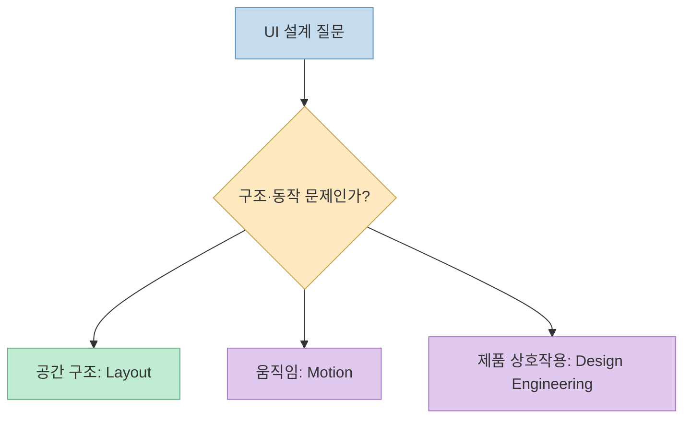
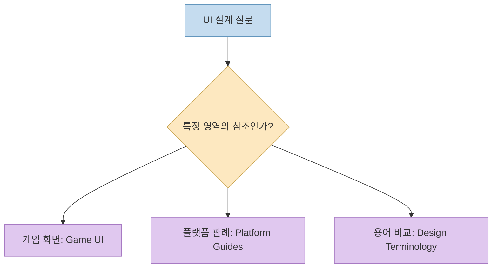
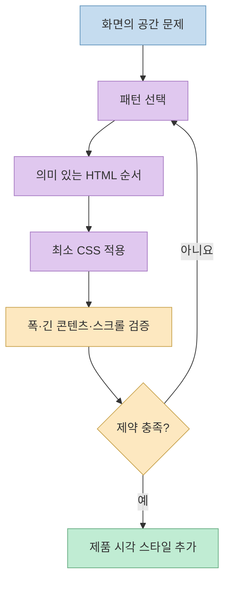
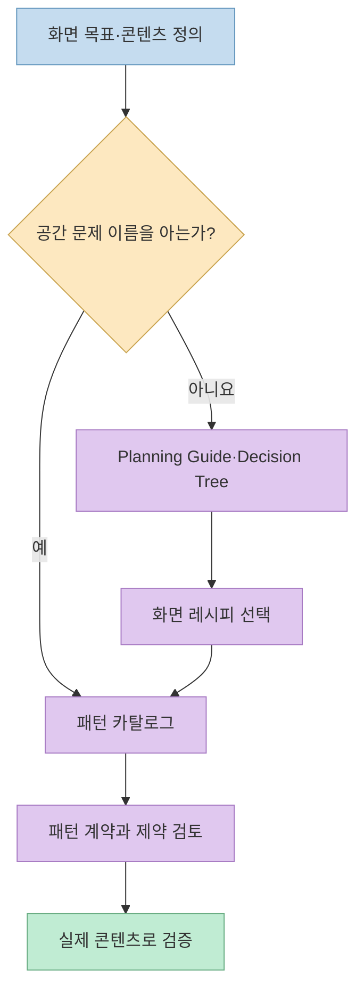
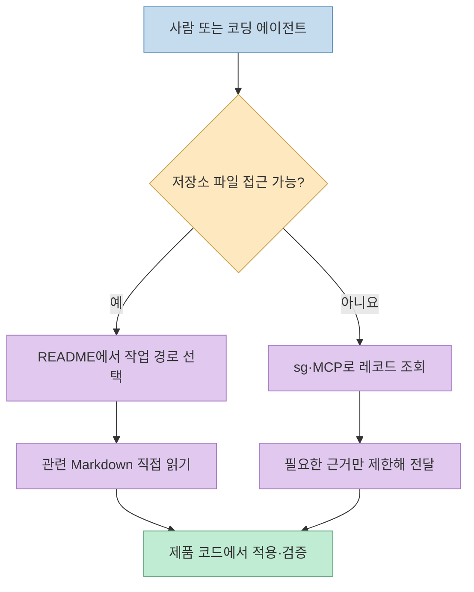
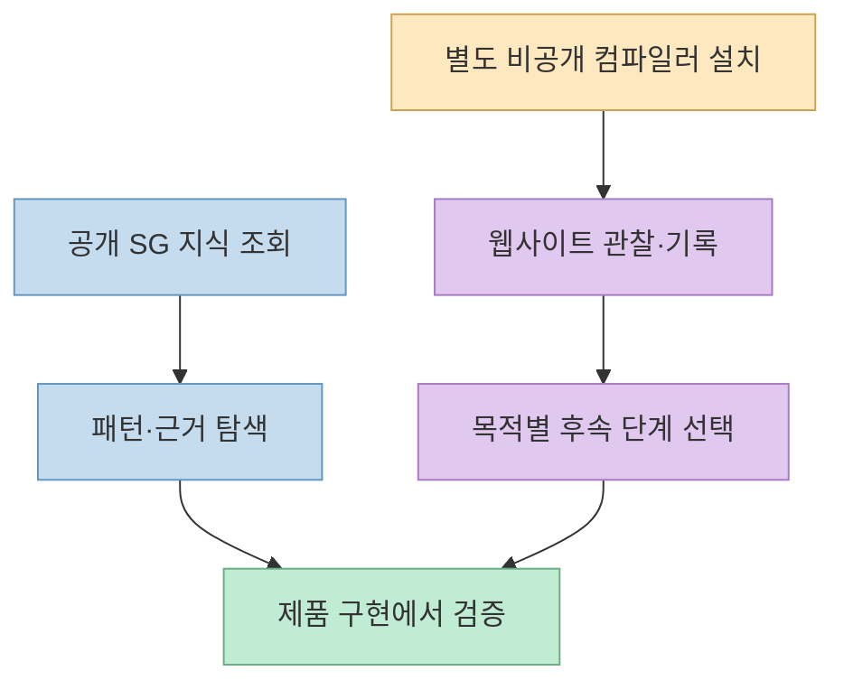

화면을 만들 때 필요한 것은 예쁜 CSS 조각만이 아니다. 콘텐츠 순서, 스크롤 주체, 좁은 화면의 동작, 접근성, 그리고 “왜 이 구조가 적합한가”를 설명할 근거가 필요하다. [StyleGallery](https://github.com/changeroa/StyleGallery)는 이런 지식을 재사용 가능한 레이아웃 패턴과 설계 가이드로 나누고, 각 문서의 적용 범위와 검증 경계를 관리하는 저장소다. 이름에 ‘Style’이 들어가지만 **완성된 브랜드 테마나 범용 디자인 토큰을 배포하는 프로젝트는 아니다.**

<!--more-->

## Sources

- [StyleGallery GitHub 저장소](https://github.com/changeroa/StyleGallery)
- [README: 목적·진입점·빠른 시작](https://github.com/changeroa/StyleGallery/blob/main/README.md)
- [DOMAINS.md: 여섯 도메인의 소유 범위](https://github.com/changeroa/StyleGallery/blob/main/DOMAINS.md)
- [Layout 도메인과 패턴 계약](https://github.com/changeroa/StyleGallery/blob/main/layout/index.md)
- [Agent-Native CLI·MCP 안내](https://github.com/changeroa/StyleGallery/blob/main/consumer-reference/agent-native/README.md)
- [웹사이트 컴파일러 연결 안내](https://github.com/changeroa/StyleGallery/blob/main/scripts/compiler/README.md)

## 핵심 개념: ‘디자인’을 하나의 폴더에 섞지 않는다

저장소는 지식을 **Layout, Motion, Design Engineering, Game UI, Platform Guides, Design Terminology** 의 여섯 도메인으로 구분한다. Layout은 배치·크기·정렬·스크롤 같은 공간 문제를 맡는다. Motion은 움직임의 명명과 검토, Design Engineering은 제품 수준의 인터페이스 판단, Game UI는 게임 화면의 구조, Platform Guides는 특정 플랫폼 관례의 비교, Design Terminology는 디자인 용어 간 관계를 맡는다. 이 구분은 어떤 문서가 무엇을 말할 수 있고 무엇을 말해서는 안 되는지를 정하는 **소유권 계약** 이다. [도메인 명세](https://github.com/changeroa/StyleGallery/blob/main/DOMAINS.md)





예를 들어 사이드바가 본문 옆에서 언제 아래로 감겨야 하는지는 Layout 문제다. 버튼의 브랜드 색이나 그림자, 애니메이션을 같은 재사용 패턴에 끼워 넣지 않는다. 플랫폼별 네이티브 관례도 웹 접근성 규칙을 대체하는 보편 법칙으로 취급하지 않는다. 이렇게 경계를 정하면 패턴이 여러 제품에서 재사용될 때 제품 고유의 시각 언어가 함께 유입되는 일을 줄일 수 있다. [Layout 범위](https://github.com/changeroa/StyleGallery/blob/main/layout/index.md) [도메인 명세](https://github.com/changeroa/StyleGallery/blob/main/DOMAINS.md)

## 레이아웃 패턴은 ‘CSS 코드’보다 문제와 제약을 먼저 적는다

StyleGallery의 Layout 패턴은 **하나의 주된 공간 문제** 를 해결하는 최소 HTML/CSS 구조를 목표로 한다. 패턴 문서에는 사용 시점, HTML, CSS, 핵심 속성, 제약·변경 지점, 스크롤 소유권, 접근성·소스 순서, 브라우저 폴백, 안티패턴이 따라붙는다. 단순히 화면이 비슷하다고 코드를 복사하는 대신, 그 구조가 어떤 조건에서 성립하는지 확인하게 한다. 패턴 카탈로그에는 `stack`, `sidebar`, `ram-grid`, `cover` 같은 공간 구조가 분류돼 있다. [Layout 패턴 계약](https://github.com/changeroa/StyleGallery/blob/main/layout/index.md) [패턴 카탈로그](https://github.com/changeroa/StyleGallery/blob/main/CATALOG.md)

구체적으로 [`sidebar` 패턴](https://github.com/changeroa/StyleGallery/blob/main/patterns/split-sidebar/sidebar.md)은 좁은 보조 영역과 넓은 본문이 공간이 부족할 때 자연스럽게 감기도록 `flex-wrap`, `flex-basis`, `min-inline-size`를 조합한다. 문서는 내부 스크롤 컨테이너가 없다는 점과 DOM 순서·키보드 포커스 순서를 시각 배치 때문에 뒤집지 말라는 점도 명시한다. [`ram-grid`](https://github.com/changeroa/StyleGallery/blob/main/patterns/grid-repetition/ram-grid.md)는 반복 항목의 열 수가 가용 폭에 따라 달라지게 하고, 고정된 기기 이름의 브레이크포인트를 먼저 박아 넣지 않는다. 두 예 모두 색·글꼴·그림자를 재사용 CSS의 책임에서 제외한다.



## 패턴 이름을 모를 때는 계획 → 레시피 → 카탈로그 순서로 찾는다

처음부터 `sidebar` 같은 패턴 이름을 알고 있어야 하는 것은 아니다. 저장소의 [Layout Planning Guide](https://github.com/changeroa/StyleGallery/blob/main/GUIDE.md)는 먼저 사용자의 주된 작업, 본문과 보조 콘텐츠, 스크롤 주체, 화면 전체 문제인지 컴포넌트 내부 문제인지를 묻는다. 그다음 화면 모델에 맞는 레시피를 고르고, 실제 콘텐츠 제약과 맞지 않는 패턴만 바꾼다. 홈페이지, 대시보드, 폼 흐름, 목록–상세 화면 등의 [레시피](https://github.com/changeroa/StyleGallery/tree/main/recipes)는 여러 패턴을 조합하는 출발점이지 반드시 따라야 하는 완성 디자인이 아니다.

예를 들어 [Homepage 레시피](https://github.com/changeroa/StyleGallery/blob/main/recipes/homepage.md)는 방문자의 이해·증거 확인·행동 결정을 기준으로 섹션의 역할을 나눈다. 첫 화면과 본문 폭, 반복 그리드, CTA 묶음에 맞는 패턴을 추천하지만, 문서 중심 페이지나 설정 화면에 마케팅 페이지 구조를 강요하지 말라고 명시한다. 화면의 정보 순서와 스크롤 책임을 먼저 고정한 뒤, 색과 사진 같은 제품 스타일을 올리는 구조다. [Homepage 레시피](https://github.com/changeroa/StyleGallery/blob/main/recipes/homepage.md)



## CLI와 MCP는 ‘지식 조회’와 ‘실행 도구’를 구분해야 한다

README 기준 StyleGallery는 **Node.js 22 이상** 에서 실행한다. 전역 설치 없이 시작할 때는 `npx stylegallery discover --format json`을, 자주 쓸 때는 `npm install --global stylegallery` 후 `sg discover --format json`을 사용한다. `discover`는 인터페이스를 확인하고, `resolve`는 StableRef로 특정 레코드를 찾으며, `claims`는 주장과 관련 근거를 분리해 보여준다. `context`는 크기를 제한한 컨텍스트 패키지, `ops`는 지원 작업 목록을 반환한다. `sg-material`은 별도의 Markdown 검색·조회 경로다. 이들은 저장소 문서를 에이전트가 찾고 참조하는 통로이지, 읽은 내용을 자동으로 정답으로 승인하는 장치는 아니다. [README 빠른 시작](https://github.com/changeroa/StyleGallery/blob/main/README.md) [Agent-Native 설명](https://github.com/changeroa/StyleGallery/blob/main/consumer-reference/agent-native/README.md)

```sh
npx stylegallery discover --format json
npx --package stylegallery sg-material search --query "sticky layout" --paths-only --limit 5
```

에이전트가 저장소 파일을 직접 읽을 수 있다면, README와 작업별 경로에서 **가장 좁은 문서로 이동하는 방식** 이 기본이다. 파일 경로를 모를 때만 `sg-material search --paths-only`로 후보를 좁히고, `context`는 파일에 직접 접근하지 못하거나 제한된 근거 패키지를 전달해야 할 때 쓴다. 메인 `stylegallery-mcp`와 별도의 `stylegallery-material-mcp`가 있지만, 지식 조회는 읽기 전용이라는 경계를 유지한다. [README 작업 경로](https://github.com/changeroa/StyleGallery/blob/main/README.md) [MCP 안내](https://github.com/changeroa/StyleGallery/blob/main/consumer-reference/agent-native/README.md)



## 웹사이트 컴파일러는 기본 패키지의 ‘원클릭 클론’이 아니다

README에는 `sg compile`, `timeline`, `transcribe`, `gate`, `build` 같은 웹사이트 관찰·재구성 명령도 있다. 그러나 [컴파일러 설치 문서](https://github.com/changeroa/StyleGallery/blob/main/scripts/compiler/README.md)에 따르면 실제 컴파일러는 **별도 비공개 저장소** 로, 접근 가능한 계정이 설치하고 `SG_COMPILER_ROOT`를 설정해야 한다. 공개 npm 패키지에는 컴파일러 소스나 브라우저 바이너리가 포함되지 않는다. 컴파일러 설정이 없어도 지식 조회 명령은 사용 가능하다.

컴파일러 단계의 역할도 구분된다. `compile`은 장면·프레임을 수집하지만 그 자체로 완성 페이지를 만들지 않는다. `transcribe`는 관찰 문서를 만들고, `sale`은 원본 문구를 구조 설명으로 바꾸며, `build`는 제한된 자료를 사용하는 판매용 미리보기 경로다. 문서는 `build`를 일반적인 충실 복제 도구로 쓰지 말라고 설명한다. 일부 단계에는 인증된 모델 CLI와 비용이 필요할 수 있으므로, 공개 레이아웃 지식 탐색과 별도 실행 파이프라인을 혼동하면 안 된다. [웹사이트 컴파일러 안내](https://github.com/changeroa/StyleGallery/blob/main/scripts/compiler/README.md)



## 검증과 라이선스의 경계

`quality/` 계층은 레이아웃·접근성·시각적 주장에 대해 **원칙 → 주장 → 맥락 → 근거 → 검증 절차 → 적용 경계** 를 밝히도록 안내한다. 이는 저장소 문서가 모든 제품에서 보편적으로 옳다고 선언하는 것과 다르다. 실제 제품에서는 좁은 화면, 긴 텍스트, 키보드 포커스, 스크롤 동작을 다시 확인해야 한다. 자동 검사만으로 시각 품질이나 접근성 전체를 입증할 수 없다는 점도 이 구조의 전제다. [Quality Gates](https://github.com/changeroa/StyleGallery/blob/main/quality/index.md) [Layout 검증 원칙](https://github.com/changeroa/StyleGallery/blob/main/layout/index.md)

저장소의 **소스 코드에는 MIT**, **Markdown 문서에는 CC BY 4.0** 이 각각 적용된다. 외부 자료에서 각색한 콘텐츠는 원저작권과 `NOTICE`의 경계를 별도로 확인해야 한다. 문서나 패턴을 제품 문서에 재사용할 때는 코드와 문서의 라이선스를 하나로 뭉뚱그리지 않는 편이 안전하다. [코드 라이선스](https://github.com/changeroa/StyleGallery/blob/main/LICENSE) [문서 라이선스](https://github.com/changeroa/StyleGallery/blob/main/LICENSE-DOCS)

## 실전 적용 포인트

1. 먼저 “필요한 것이 배치·스크롤 구조인지, 모션인지, 플랫폼 관례인지”를 구분해 해당 도메인으로 이동한다.
2. 레이아웃 이름을 모르면 Planning Guide와 레시피로 화면의 공간 책임을 정의한 뒤 카탈로그에서 패턴을 고른다.
3. 패턴의 CSS만 가져오지 말고 DOM 순서, 스크롤 소유권, 폭 제약과 폴백까지 함께 확인한다.
4. 에이전트에는 필요한 문서 경로 또는 근거가 연결된 작은 컨텍스트만 제공하고, 실제 제품의 접근성·반응형 결과는 별도로 검증한다.
5. 웹사이트 컴파일 명령은 비공개 컴파일러 접근권과 설치 상태를 확인한 뒤 별도 작업으로 취급한다.

## 핵심 요약

- StyleGallery는 **여섯 도메인으로 경계를 나눈 UI 지식 저장소** 이며, 완성형 테마나 범용 시각 스타일 시스템이 아니다.
- Layout 패턴은 최소 HTML/CSS와 함께 공간 문제, 제약, 스크롤·접근성 조건을 문서화한다.
- `sg` CLI·MCP는 지식 조회를 제공하고, 웹사이트 컴파일은 별도 설치가 필요한 실행 경로다.
- 적용의 마지막 단계는 언제나 실제 제품 콘텐츠와 브라우저에서의 검증이다.

## 결론

StyleGallery의 가치는 “좋아 보이는 CSS를 많이 모았다”는 데 있지 않다. **어떤 문제에 어떤 패턴을 적용할지, 그 판단의 근거가 어디까지 유효한지, 적용 후 무엇을 확인할지** 를 문서와 기계 인터페이스로 연결한 데 있다. UI를 생성하는 에이전트나 팀이 쓰더라도 이 경계를 지켜야 재사용이 복제가 아닌 설계가 된다.
