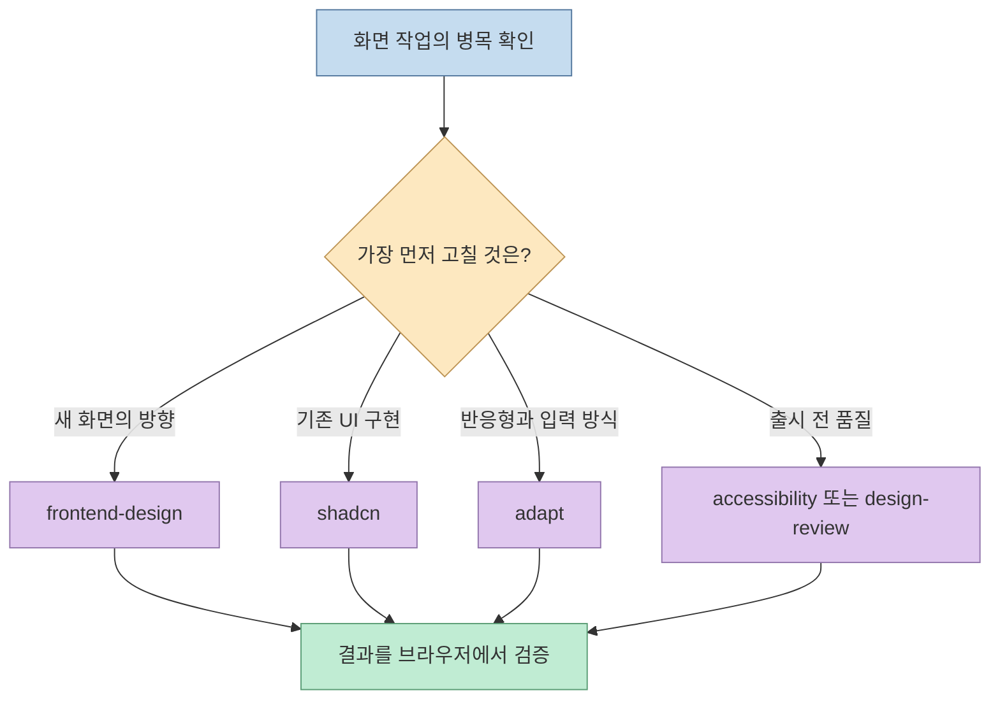
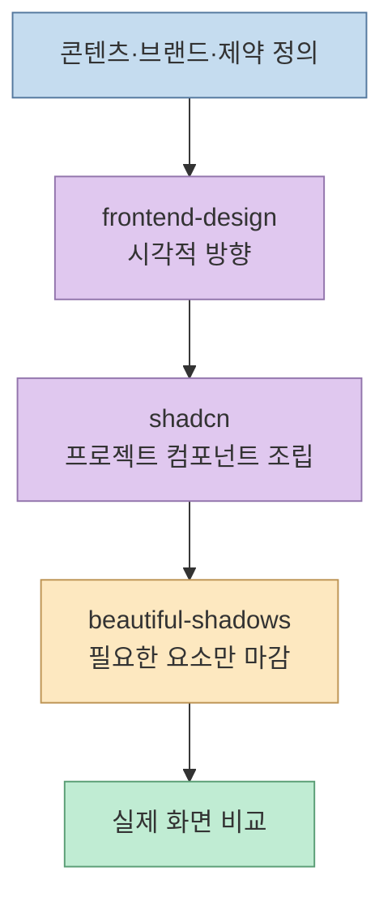
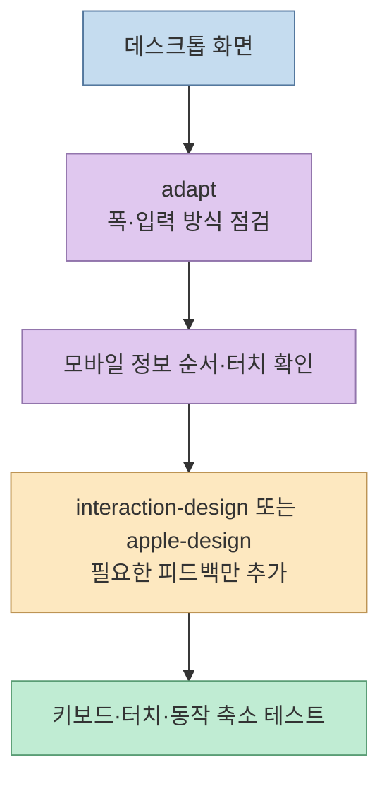
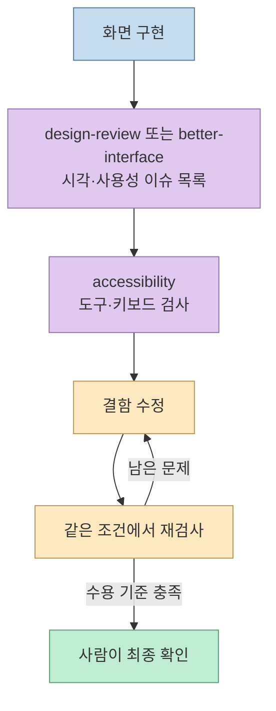

UI 스킬 목록을 보면 열 개를 한꺼번에 설치하고 싶어진다. 하지만 [@RoundtableSpace의 게시글](https://x.com/RoundtableSpace/status/2102650420904505453)이 제시한 것은 **성능 비교 결과가 아니라 열 개의 링크** 다. 각 스킬은 화면 생성, 컴포넌트 조립, 모션, 접근성, 리뷰처럼 해결하는 문제가 다르다. 같은 목록은 [앞선 소개 글](/post/2026/09/2026-09-23-ten-essential-ui-skills-frontend-design-claude-code/)에서도 다뤘으므로, 여기서는 중복 소개보다 **어떻게 골라서 쓰고 검증할지** 에 집중한다.

<!--more-->

## Sources

- [원문: @RoundtableSpace의 UI 스킬 10개 게시글](https://x.com/RoundtableSpace/status/2102650420904505453)
- [Frontend Design](https://www.ui-skills.com/skills/anthropics/frontend-design) · [Apple Design](https://www.ui-skills.com/skills/emilkowalski/apple-design) · [Beautiful Shadows](https://www.ui-skills.com/skills/mengto/beautiful-shadows)
- [Accessibility](https://www.ui-skills.com/skills/addyosmani/accessibility) · [Design Review](https://www.ui-skills.com/skills/superfuture/design-review) · [Emil Design Eng](https://www.ui-skills.com/skills/emilkowalski/emil-design-eng)
- [Shadcn](https://www.ui-skills.com/skills/shadcn-ui/shadcn) · [Adapt](https://www.ui-skills.com/skills/pbakaus/adapt) · [Better Interface](https://www.ui-skills.com/skills/jakubkrehel/better-interface) · [Interaction Design](https://www.ui-skills.com/skills/wshobson/interaction-design)

목록 페이지와 원본 저장소의 설명은 스킬의 **의도와 지시 내용** 을 보여준다. 특정 프로젝트에서 실제로 디자인 품질이 개선된다는 독립적인 측정 결과로 해석해서는 안 된다.

## 1. 열 개가 아니라 네 가지 일을 고른다

스킬을 제품명 대신 작업 단계로 나누면 중복이 보인다. `frontend-design`은 새로운 화면의 시각적 방향을 잡는 데, `shadcn`은 해당 생태계의 컴포넌트를 찾고 조립하는 데 맞춰져 있다. `beautiful-shadows`는 그림자라는 좁은 문제를 다룬다. 세 가지는 같은 일을 하는 대체재가 아니다. [Frontend Design](https://www.ui-skills.com/skills/anthropics/frontend-design), [Shadcn](https://www.ui-skills.com/skills/shadcn-ui/shadcn), [Beautiful Shadows](https://www.ui-skills.com/skills/mengto/beautiful-shadows)

다른 네 스킬은 상호작용과 마감에 집중한다. `apple-design`은 제스처·스프링·중단 가능한 전환처럼 Apple 플랫폼의 상호작용에서 가져온 패턴을 설명한다. **Apple의 공식 스킬이라는 뜻은 아니다.** `emil-design-eng`은 더 넓은 디자인 엔지니어링 관점, `interaction-design`은 상태 피드백·전환·로딩·제스처, `better-interface`는 여러 품질 영역을 함께 보는 개선 흐름에 가깝다. [Apple Design](https://www.ui-skills.com/skills/emilkowalski/apple-design), [Emil Design Eng](https://www.ui-skills.com/skills/emilkowalski/emil-design-eng), [Interaction Design](https://www.ui-skills.com/skills/wshobson/interaction-design), [Better Interface](https://www.ui-skills.com/skills/jakubkrehel/better-interface)

## 2. 제작과 구현: 생성 스킬과 컴포넌트 스킬을 구분한다

새 랜딩 페이지라면 먼저 콘텐츠 우선순위, 브랜드 톤, 참고 화면, 금지할 시각 패턴을 작업 지시로 정한다. 그다음 `frontend-design`으로 화면의 방향을 잡는다. 해당 스킬은 평범한 AI 생성 화면을 피하고 구별되는 프로덕션급 프런트엔드를 만드는 것을 목표로 한다. 다만 스킬을 호출했다는 사실만으로 결과의 독창성이나 사용성이 보장되지는 않는다. [Frontend Design 원문](https://www.ui-skills.com/skills/anthropics/frontend-design)

기존 shadcn/ui 프로젝트라면 `shadcn`의 역할은 다르다. 현재 프로젝트의 컴포넌트를 검색하고 필요한 것을 추가·조합하거나 오류를 고치는 작업을 안내한다. 따라서 **이미 있는 컴포넌트와 토큰을 재사용해야 하는 구현 단계** 에 적합하다. 모든 프런트엔드에 shadcn/ui를 새로 도입하라는 뜻으로 읽을 필요는 없다. [Shadcn 원문](https://www.ui-skills.com/skills/shadcn-ui/shadcn)

`beautiful-shadows`는 그림자 크기와 레이어를 조절하는 Tailwind 중심의 좁은 스킬이다. 전체 레이아웃이 결정된 뒤 카드·팝오버의 깊이감이 문제일 때만 쓰는 편이 낫다. 그림자 처방으로 정보 구조의 문제를 고칠 수는 없다. [Beautiful Shadows 원문](https://www.ui-skills.com/skills/mengto/beautiful-shadows)

## 3. 상호작용과 적응: 움직임은 목적이 있어야 한다

모션이 부족한 화면이라도 세 스킬을 동시에 요청할 필요는 없다. 제스처 중심의 드래그·스와이프·시트가 핵심이면 `apple-design`, 컴포넌트 상태와 제품의 촉감까지 폭넓게 다듬으려면 `emil-design-eng`, 버튼 반응·로딩·알림의 피드백이 불명확하면 `interaction-design`부터 고른다. 움직임의 목적은 사용자가 **무엇이 바뀌었는지 이해하도록 돕는 것** 이다. 과한 전환은 지연과 혼란을 만들 수 있으며, 동작 축소 선호도 함께 확인해야 한다. [Apple Design](https://www.ui-skills.com/skills/emilkowalski/apple-design), [Emil Design Eng](https://www.ui-skills.com/skills/emilkowalski/emil-design-eng), [Interaction Design](https://www.ui-skills.com/skills/wshobson/interaction-design)

`adapt`는 데스크톱 화면을 단순히 줄이는 대신 뷰포트, 기기 맥락, 입력 방식에 맞게 UI를 조정하는 스킬이다. 이 목록의 설명은 웹 UI를 대상으로 한다. 모바일에서는 한 줄로 줄어든 카드보다 정보의 순서를 다시 짜거나 터치 대상을 조정하는 편이 적절할 수 있다. 구체적 처방은 실제 화면과 사용 맥락을 보고 결정해야 한다. [Adapt 원문](https://www.ui-skills.com/skills/pbakaus/adapt)

## 4. 검수: 리뷰와 접근성은 같은 검사가 아니다

`design-review`는 계층·타이포그래피·간격·색상·모션·반응형·접근성을 살피고, 발견 사항을 우선순위와 수정안으로 정리하는 리뷰 스킬이다. `better-interface`는 접근성·레이아웃·문구·타이포그래피 등 여러 영역의 개선을 묶는 흐름으로 설명된다. 둘 다 넓은 범위의 검토에 쓰이므로, 같은 화면을 무작정 두 번 검토하기보다 **찾고 싶은 결함과 원하는 출력 형식** 을 정하고 하나를 선택하는 것이 실용적이다. 이는 두 스킬 설명을 비교한 적용 제안이지 우열 평가가 아니다. [Design Review](https://www.ui-skills.com/skills/superfuture/design-review), [Better Interface](https://www.ui-skills.com/skills/jakubkrehel/better-interface)

`accessibility`는 더 명확한 검증 목적이 있다. 스킬 설명은 WCAG 2.2 관련 문제를 확인하고, 가능한 경우 Lighthouse·Chrome DevTools 같은 도구와 접근성 트리·키보드 탐색으로 문제를 찾아 수정 후 다시 검사하도록 안내한다. **자동 검사 점수 100점이 곧 WCAG 적합성을 입증하지는 않는다.** 실제 탭 순서, 포커스 표시, 이름·역할·상태, 대비, 동작 축소 등은 사람의 확인이 필요하다. [Accessibility 원문](https://www.ui-skills.com/skills/addyosmani/accessibility)

## 5. 설치 전에는 링크보다 원본 지시 파일을 본다

목록 사이트는 발견의 출발점이다. 실제 설치 명령은 각 스킬 페이지가 안내하는 원본 GitHub 저장소를 가리킨다. 설치 전에 저장소의 `SKILL.md`와 참조 스크립트를 읽어 **실행할 명령, 읽는 파일, 외부로 보내는 데이터, 의존 스킬** 을 확인하자. 예를 들어 `better-interface`는 다른 `better-*` 스킬로 작업을 넘기는 흐름을 설명하므로, 필요한 하위 스킬이 없는 환경에서는 기대한 절차가 달라질 수 있다. [Better Interface 원문](https://www.ui-skills.com/skills/jakubkrehel/better-interface)

이 점은 추상적인 경고가 아니다. [Design Review의 원본 `SKILL.md`](https://github.com/Superfuture/design-review/blob/main/design-review/skills/design-review/SKILL.md)에는 리뷰 시작 시 익명 사용 이벤트를 외부 엔드포인트로 전송하는 명령이 포함돼 있다. 이를 여기서 실행하지 않았고, 전송 범위가 실제 환경에서 어떻게 동작하는지도 검증하지 않았다. 네트워크 요청이 허용되지 않는 프로젝트라면 이런 지시를 설치 전에 검토하고 사용 여부를 결정해야 한다.

한꺼번에 열 개를 더하는 대신, 한 화면과 한 결함을 정하고 필요한 스킬 한두 개만 시범 적용한다. 설치 방법 역시 사용 중인 에이전트, 저장소 버전, 보안 정책에 맞는지 원본 문서에서 확인한다. 스킬은 **검증을 대체하는 품질 인증서가 아니라 에이전트의 작업 지침** 이다.

## 실전 적용 포인트

1. **기준 화면을 남긴다.** 수정 전 데스크톱·모바일 화면과 현재 결함을 기록한다.
2. **병목에 맞는 스킬만 고른다.** 새 화면이면 `frontend-design`, 기존 shadcn/ui 구현이면 `shadcn`, 반응형 문제면 `adapt`, 출시 전에는 `accessibility` 또는 리뷰 스킬을 선택한다.
3. **검증 조건을 먼저 적는다.** 예를 들어 모바일에서 가로 스크롤이 없고, 키보드만으로 주요 작업을 완료하며, 포커스가 보이고, 동작 축소 설정에서도 핵심 피드백이 전달되어야 한다.
4. **전후를 같은 조건에서 비교한다.** 스크린샷뿐 아니라 실제 상호작용, 키보드 탐색, 오류 상태를 확인한다. 개선되지 않은 부분은 스킬을 더 설치하기보다 작업 지시나 디자인 제약을 수정한다.

## 핵심 요약

- 열 개는 동일한 효능의 묶음이 아니다. **생성·구현·상호작용·검수** 중 현재 병목을 고른다.
- `frontend-design`과 `shadcn`은 각각 시각적 방향과 컴포넌트 작업에, `accessibility`와 리뷰 스킬은 서로 다른 검증 목적에 가깝다.
- 목록의 품질 주장은 실험 결과가 아니다. 원본 지시 파일을 확인하고 실제 화면에서 전후를 비교해야 한다.

## 결론

이 목록을 가장 잘 활용하는 방법은 열 개를 설치하는 것이 아니라 **한 가지 문제를 정의하고, 맞는 스킬을 적용한 뒤, 브라우저에서 검증하는 것** 이다. 좋은 UI는 스킬의 개수보다 명확한 제약과 반복 가능한 검수에서 나온다.
