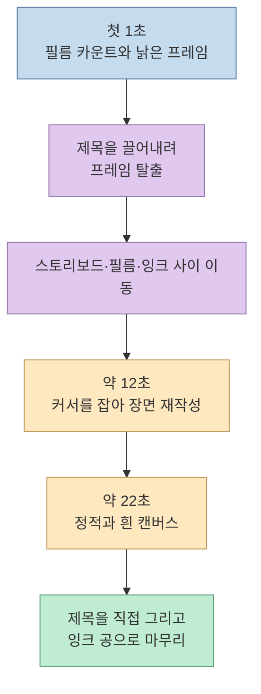
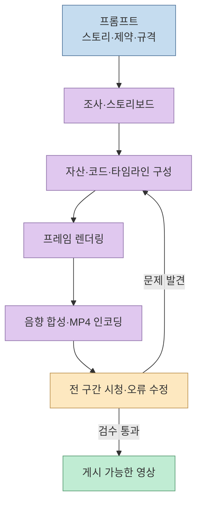
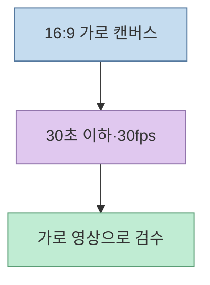
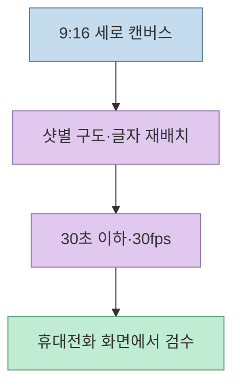

"Claude Code와 아이디어만 있으면 유튜브 쇼츠를 무한 생성한다"는 [Threads 게시글](https://www.threads.com/share/_wQ0M-0xL/)은 1930년 만화 캐릭터가 필름을 찢고 2026년 화면으로 탈출하는 **30초 이하 애니메이션 프롬프트**를 댓글에 공개했다. 이 프롬프트는 단순히 "멋진 영상"을 주문하지 않는다. 첫 1초의 훅, 12초의 화면 개입, 22초의 정적, 마지막 제목 장면까지 사건·움직임·소리를 촘촘하게 지정한다. 그러나 완성 영상의 제작 코드와 실행 기록은 공개 글에서 확인되지 않고, **16:9 출력 요구는 YouTube Shorts의 정사각형·세로 화면 기준과 맞지 않는다.** 무엇이 강력한 지시인지, 무엇이 아직 검증되지 않은 주장인지 분리해 보자. [프롬프트 댓글](https://www.threads.com/@ai__frontier/post/DdroHtYE7N-), [YouTube 공식 안내](https://support.google.com/youtube/answer/15424877?hl=en)

<!--more-->

## Sources

- [원문 Threads 공유 링크](https://www.threads.com/share/_wQ0M-0xL/) · [원문 게시글](https://www.threads.com/@ai__frontier/post/DdrNOH9DvDX) · [작성자의 프롬프트 댓글](https://www.threads.com/@ai__frontier/post/DdroHtYE7N-)
- [작성자가 연결한 Naver Premium 글의 공개 구간](https://contents.premium.naver.com/quantopia/koreanfinancetimes/contents/260924232451108td)
- [Anthropic의 Claude Code 개요](https://code.claude.com/docs/en/overview) · [Claude Opus 5.5 소개](https://www.anthropic.com/claude-opus-5-5)
- [YouTube의 Shorts 형식 안내](https://support.google.com/youtube/answer/15424877?hl=en) · [Fleischer Studios의 원작·권리 안내](https://fleischerstudios.com/publicdomain)

**자료 범위:** Threads 본문과 작성자의 댓글에 게시된 프롬프트를 확인했다. 연결된 Naver 글은 구독자 전용 구간이 있어 **공개된 본문만** 참고했다. 게시글의 짧은 예시 영상은 결과물을 보여주지만, 원본 프로젝트 파일·렌더 명령·실행 로그·반복 생성 성공률은 확인할 수 없다. 따라서 이 글은 **프롬프트의 구조와 재현 시 검증할 조건**을 설명하며, 동일 결과가 한 번에 나온다는 성능 보증을 하지 않는다.

## 1. 프롬프트는 이야기를 시간과 화면의 물리 법칙으로 쪼갠다

작성자의 긴 댓글은 주인공을 1930년 《Dizzy Dishes》 시기의 초기 Betty로 한정한다. 흑백에 가까운 필름 속 캐릭터가 제목 글자를 잡아당기고 프레임을 찢어 현대 화면으로 나오는 설정이다. 이후 연필선, 잉크, 필름 스트립, 반복 배경, 프레임 건너뛰기, 글자가 소품이 되는 장면을 연쇄적으로 지시한다. 이 장치의 핵심은 **매체 자체를 이야기 속 물체로 만드는 것**이다. 연도가 문이 되고 필름이 계단이 되므로, 역사 정보를 설명 자막으로 붙이는 대신 장면의 동작에 녹이려 한다. [프롬프트 댓글](https://www.threads.com/@ai__frontier/post/DdroHtYE7N-)

프롬프트는 화면만 지정하지 않는다. 초반에는 낡은 영사기와 손그림 느낌을 유지하고, 탈출 후에야 색을 늘리며, 영사기 클릭·종이 긁힘·잉크 튐·급정지 같은 소리를 장면 전환에 맞춘다. 또한 **내레이션보다 움직임으로 이야기를 전달**하도록 요구한다. 이는 짧은 영상에서 훅과 정보 전달을 동시에 해결하려는 연출 설계다. 반대로 요소가 너무 많아 주인공의 실루엣과 동작을 놓칠 위험도 있으므로, 프롬프트가 직접 "빠른 움직임에서도 읽혀야 한다"는 제약을 둔다. [프롬프트 댓글](https://www.threads.com/@ai__frontier/post/DdroHtYE7N-)

## 2. “한 번의 프롬프트”는 제작 파이프라인의 생략어다

댓글의 마지막 지시는 **시대 참고자료 조사 → 30초 시퀀스 계획 → 샷별 스토리보드 → 애니메이션 초안 → 최종 렌더링** 순서다. 즉 하나의 입력문 안에 여러 단계의 작업을 압축한 것이다. Anthropic의 공식 설명에 따르면 Claude Code는 파일을 읽고 수정하며 명령을 실행하는 코딩 에이전트다. 프롬프트가 "No skills. No MCP"라고 적었다는 사실은 **스킬·MCP 사용을 금지했다는 뜻**이지, Claude Code가 파일·셸 명령·기본 도구 없이 모델 내부에서 MP4를 직접 생성했다는 증거는 아니다. 실제 어떤 렌더러와 라이브러리가 사용됐는지는 게시물만으로 확인할 수 없다. [프롬프트 댓글](https://www.threads.com/@ai__frontier/post/DdroHtYE7N-), [Claude Code 개요](https://code.claude.com/docs/en/overview)

연결된 [Naver 글의 공개 구간](https://contents.premium.naver.com/quantopia/koreanfinancetimes/contents/260924232451108td)은 이 결과를 전용 영상 생성 모델의 일회성 출력보다 **프레임을 코드로 그리는 접근**으로 설명한다. 수정할 장면을 코드에서 찾고 고칠 수 있다는 장점이 있다는 **작성자의 설명**이다. 다만 전체 코드와 재현 절차가 공개 구간에 없으므로 구체적인 렌더링 방식, 캐릭터 일관성, 수정 비용을 독립적으로 확인할 수는 없다. "한 번에"와 "무한"도 제작 시간·사용량 한도·품질 검수의 비용을 생략한 홍보 표현으로 읽어야 한다. [Threads 본문](https://www.threads.com/@ai__frontier/post/DdrNOH9DvDX)

## 3. 30초·30fps는 맞지만, 16:9는 쇼츠 목표와 충돌한다

원문 프롬프트는 **최대 30초, 최종 30fps, 16:9, MP4**를 요구한다. 정확히 30초를 30fps로 만든다면 산술적으로 최대 900프레임이다. 프롬프트 중간에 등장하는 "24 FPS"는 화면 속에 띄우는 **연출 요소**로 쓰였으며, 최종 출력 프레임 속도 30fps와 혼동하면 안 된다. 길이·코덱·화면 비율은 서로 다른 출력 계약이다. [프롬프트 댓글](https://www.threads.com/@ai__frontier/post/DdroHtYE7N-)

문제는 **화면 비율**이다. [YouTube 공식 안내](https://support.google.com/youtube/answer/15424877?hl=en)에 따르면 현재 Shorts로 분류되는 영상은 길이가 3분 이하이면서 **정사각형 또는 세로 비율**이어야 한다. 도움말은 긴 일반 영상으로 분류되게 하려면 16:9 같은 넓은 화면 비율을 쓰라고도 안내한다. 따라서 게시글의 원본 프롬프트를 그대로 따르면 **짧은 가로 영상**을 만들 수는 있어도 Shorts 피드용 영상이라는 목표에는 맞지 않는다. 이는 플랫폼 규칙과 프롬프트를 대조한 결론이다.

가로 영상을 먼저 만들고 9:16으로 잘라낼 수도 있지만, 이 프롬프트는 캐릭터가 필름 경계와 화면 전체를 뛰어다니도록 설계돼 있다. 단순 크롭은 중요한 행동이나 글자를 잘라낼 수 있다. Shorts가 목표라면 **최초 스토리보드부터 세로 안전 영역, 화면 중앙의 주인공, 제목 위치**를 다시 설계하는 편이 낫다. 가로판과 세로판을 모두 만들려면 별도의 화면 구성과 두 번의 검수가 필요하다. 이는 원문 프롬프트의 가로 화면 연출을 Shorts 규격에 맞추기 위한 제작상 제안이다. [프롬프트 댓글](https://www.threads.com/@ai__frontier/post/DdroHtYE7N-), [YouTube 공식 안내](https://support.google.com/youtube/answer/15424877?hl=en)

가로판의 출발 계약은 다음과 같다.

Shorts용 계약은 **별도로** 잡아야 한다.

## 4. 초기 디자인 지정은 권리 문제를 자동으로 해결하지 않는다

프롬프트는 1930년 《Dizzy Dishes》 시기의 귀가 처진 초기 캐릭터만 쓰고, 후대의 디자인·로고는 쓰지 말라고 반복한다. [Fleischer Studios](https://fleischerstudios.com/betty1)도 이 작품을 해당 캐릭터의 첫 영화 등장으로 설명한다. 따라서 "1930년 버전으로 한정"은 **서로 다른 시대의 디자인을 섞지 않으려는 명확한 제작 제약**이다. 그러나 생성된 모든 장면이 실제 초기 디자인만 사용했는지는 결과 파일을 장면별로 대조해야 알 수 있다. [프롬프트 댓글](https://www.threads.com/@ai__frontier/post/DdroHtYE7N-)

권리 판단은 별개다. [Fleischer Studios의 안내](https://fleischerstudios.com/publicdomain)는 1930년 원작의 퍼블릭 도메인 논의와 **후대에 발전한 캐릭터 표현·상표의 권리**를 구분한다. 따라서 프롬프트에 "후대 버전을 쓰지 마라"고 썼다는 이유만으로 음악, 타이틀, 캐릭터 표현, 상업 이용이 모두 문제없다고 단정할 수 없다. 특히 실제 공개·수익화를 계획한다면 관할 지역과 사용 형태에 맞춰 권리 자료를 따로 확인해야 한다. 이 글은 특정 사용의 적법성을 판단하지 않는다.

## 실전 적용 포인트

1. **한 편의 계약부터 확정한다.** 세로 Shorts인지 가로 홍보 영상인지 먼저 고르고, 화면 비율·길이·fps·파일 형식을 프롬프트에 함께 적는다.
2. **샷별 산출물을 요청한다.** 장면 목표, 화면 중심, 전환, 소리, 텍스트를 시간대별로 정리한 스토리보드를 먼저 확인한다.
3. **제작 경로를 기록한다.** 어떤 파일·도구·명령으로 MP4를 만들었는지 남겨야 문제가 난 구간만 고칠 수 있다. "No skills. No MCP"만으로 재현 경로가 설명되지는 않는다.
4. **전체 영상을 검수한다.** 첫 1초의 훅뿐 아니라 12초 전환, 22초 정적, 마지막 제목·음향, 빠른 장면의 캐릭터 식별성과 글자 가독성을 확인한다.
5. **품질과 권리를 분리한다.** 영상이 재미있어도 화면 비율, 음악·디자인 출처, 후대 캐릭터 요소 혼입 여부는 별도의 검사 항목이다.

## 핵심 요약

- 공유 프롬프트의 장점은 **시간대별 사건·매체를 활용한 시각적 행동·소리·검수 가능한 출력 조건**을 한 번에 지정한 것이다.
- "한 번에 무한 생성"은 검증된 재현성 지표가 아니다. 실제 도구 구성, 코드, 실패율, 수정 횟수는 공개 자료만으로 확인할 수 없다.
- **16:9 가로 MP4는 YouTube Shorts 형식과 맞지 않는다.** Shorts가 목표라면 세로판을 처음부터 별도로 설계해야 한다.
- 1930년 디자인 한정은 유용한 제약이지만, 상업적 사용 권리를 자동으로 보장하지 않는다.

## 결론

이 사례에서 배울 것은 특정 캐릭터를 복제하는 문장이 아니라, **아이디어를 샷·움직임·음향·출력 규격·검수 절차로 분해하는 방법**이다. 좋은 긴 프롬프트도 목적 플랫폼의 규격과 재현 가능한 제작 경로를 빠뜨리면 "딸깍 한 번"의 성공 사례로 일반화할 수 없다.
