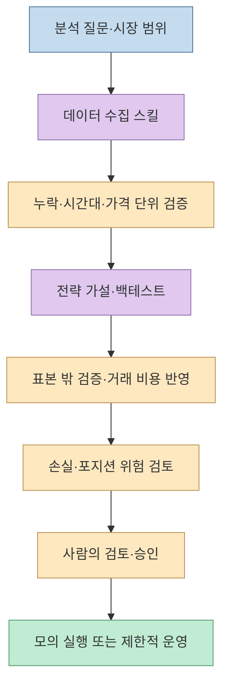
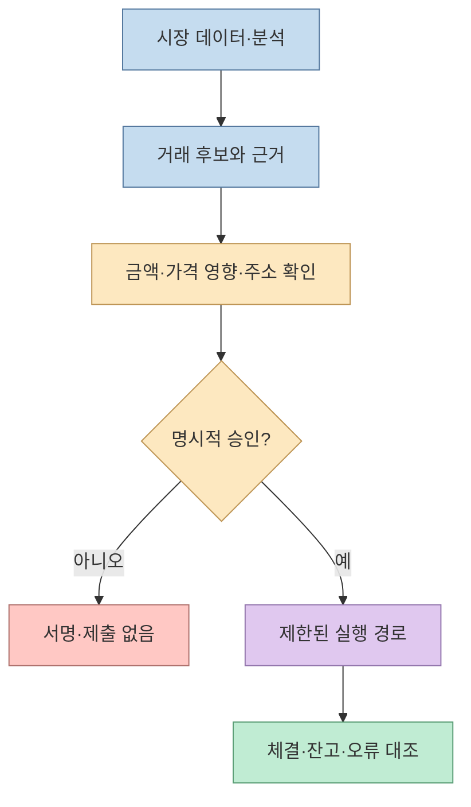
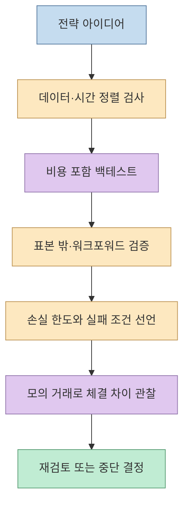

“무료 Claude 트레이딩 스킬 67개”라는 [Threads 게시글](https://www.threads.com/share/BAZfoqB2w-/)은 [agiprolabs/claude-trading-skills](https://github.com/agiprolabs/claude-trading-skills) 저장소를 소개한다. 게시글 작성자의 댓글은 트레이딩·DeFi·퀀트 금융용 Agent Skills 모음이며 Claude Code, Cursor, Codex, Gemini CLI 등에서 쓸 수 있다고 덧붙인다. **2026년 9월 25일 확인한 저장소에는 `skills/` 하위 디렉터리가 68개**다. 한 개가 늘어난 숫자보다 중요한 질문은 따로 있다. 이 스킬들이 *무슨 분석을 돕는지*, *어디서 실제 자금이 움직일 수 있는지*, *결과를 어떻게 검증할지*다.

<!--more-->

## Sources

- [원문 Threads 공유 링크](https://www.threads.com/share/BAZfoqB2w-/) · [게시글](https://www.threads.com/@quantscience_/post/Ddtb9uFHIiL) · [저장소를 연결한 작성자 댓글](https://www.threads.com/@quantscience_/post/DdtcLw2FLc0) — Threads 공유 페이지는 직접 크롤링이 불안정해 Jina Reader의 공개 페이지 추출본으로 본문·댓글을 확인했다.
- [Claude Trading Skills 저장소](https://github.com/agiprolabs/claude-trading-skills) · [거래 실행 스킬](https://github.com/agiprolabs/claude-trading-skills/blob/main/skills/dex-execution/SKILL.md) · [위험 관리 스킬](https://github.com/agiprolabs/claude-trading-skills/blob/main/skills/risk-management/SKILL.md) — 구성, 사용 예시, 안전 요구사항
- [Agent Skills 형식 명세](https://agentskills.io/specification) · [SEC의 자동 투자 도구 안내](https://www.investor.gov/introduction-investing/general-resources/news-alerts/alerts-bulletins/investor-alerts/investor-56) — 스킬의 구조와 자동화 도구의 한계

**자료 범위:** 저장소 문서와 공개 파일을 검토했으며 스킬을 설치하거나 스크립트를 실행하고, API 키·지갑을 연결하거나 실제 거래를 하지는 않았다. 저장소의 예제와 “작동한다”는 소개는 개별 전략의 수익성 또는 현재 API 호환성을 검증한 결과가 아니다. 아래 내용은 도구 평가를 위한 기술 설명이지 투자 권유가 아니다.

## 1. ‘트레이딩 AI’보다 ‘작업별 지침과 스크립트 묶음’에 가깝다

[Agent Skills 명세](https://agentskills.io/specification)에 따르면 스킬의 최소 단위는 메타데이터와 지침을 담은 `SKILL.md` 파일이며, 필요하면 실행 스크립트와 참고 문서를 함께 둔다. 즉 스킬을 설치했다고 새로운 예측 모델의 가중치를 받거나 수익을 내는 알고리즘이 자동으로 학습되는 것은 아니다. 에이전트가 특정 과제에 맞는 절차와 코드·참고 자료를 읽도록 **작업 맥락을 패키징**하는 형식이다.

이 저장소는 그 형식을 시장 데이터 API, 온체인 분석, 백테스트, 위험 관리, 거래 실행, 예측시장, 세무·회계 등으로 확장한다. 예를 들어 `birdeye-api`는 데이터 접근, `ohlcv-processing`은 시계열 정리, `walk-forward-validation`은 시간 순서에 맞춘 검증, `risk-management`는 손실·노출 통제, `dex-execution`은 Solana 스왑 흐름을 다룬다. 이들은 **한 전략의 연속된 단계가 될 수는 있어도, 서로 대체 가능한 ‘수익 비법’ 68개는 아니다.** [저장소 README](https://github.com/agiprolabs/claude-trading-skills)

## 2. 67개와 68개: 소셜 게시글은 스냅샷이고 저장소는 변한다

원문 본문과 첫 댓글은 **67개**라고 쓰지만, 연결된 [GitHub README](https://github.com/agiprolabs/claude-trading-skills)는 **68개**라고 소개한다. 현재 GitHub의 `skills/` 디렉터리 목록을 세어도 68개다. 이는 게시 시점과 확인 시점 사이에 저장소가 바뀌었거나 게시 문구가 갱신되지 않았다는 설명과 양립한다. 어느 쪽인지 확정할 변경 기록은 이 글에서 검증하지 않았으므로, “원문은 67, 확인한 저장소는 68”로 구분한다.

이 차이는 설치 안내를 읽을 때도 중요하다. README는 **Claude Code 플러그인 설치**와 **Agent Skills 호환 도구로의 수동 복사**를 별개 경로로 제시한다. “Claude”라는 이름이 붙었어도 모든 도구에서 같은 플러그인 명령이 작동한다는 뜻은 아니다. 다른 도구를 쓴다면 해당 도구가 `SKILL.md`를 어디에서 찾고, 스크립트 실행과 승인 절차를 어떻게 다루는지 확인해야 한다. 저장소의 “30개 이상 도구 호환”은 프로젝트의 설명이며, 이 글에서 각 도구를 모두 설치해 시험하지는 않았다. [저장소 설치 안내](https://github.com/agiprolabs/claude-trading-skills#getting-started), [Agent Skills 명세](https://agentskills.io/specification)

## 3. 연구 스킬과 거래 실행 스킬은 권한이 다르다

읽기 전용 시장 데이터 조회·차트 생성과 **지갑 서명·주문 전송**은 위험 수준이 다르다. 예컨대 [저장소의 `dex-execution` 지침](https://github.com/agiprolabs/claude-trading-skills/blob/main/skills/dex-execution/SKILL.md)은 견적 조회 → 사용자에게 수량·최소 수령량·가격 영향 표시 → **명시적 확인** → 거래 생성·서명·제출 → 체결 확인의 순서를 제시한다. 같은 문서에는 기본 모의 실행, 개인키 비기록, 토큰 주소 확인을 안전 요구사항으로 둔다. 이것은 저장소 작성자가 의도한 보호 절차이지, 모든 에이전트 실행 환경에서 자동으로 강제되는 보안 경계는 아니다.

그래서 **설치 전에는 외부 코드와 지침을 읽고, 설치 후에는 읽기·분석용 권한과 거래 실행 권한을 분리**하는 편이 안전하다. `SKILL.md`와 `scripts/`는 에이전트가 따르거나 실행할 수 있는 자산이다. 모의 데이터와 읽기 전용 API로 먼저 시험하고, 개인키·거래소 키는 분석 단계에 제공하지 않는다. SEC는 자동 투자 도구가 개인의 재무 상황을 충분히 반영하지 못할 수 있고, 입력 정보와 가정에 따라 결과가 달라진다고 경고한다. [Agent Skills 명세](https://agentskills.io/specification), [SEC 안내](https://www.investor.gov/introduction-investing/general-resources/news-alerts/alerts-bulletins/investor-alerts/investor-56)

## 4. 백테스트 숫자보다 데이터와 실패 조건을 먼저 검증한다

저장소에는 `vectorbt`, `backtrader`, `walk-forward-validation`, `risk-management` 스킬이 따로 있다. 이는 백테스트를 돌리는 것과 결과를 신뢰하는 것이 다른 단계임을 보여준다. 과거 데이터에서 좋은 수익 곡선이 나와도 **미래 정보가 입력에 섞였는지, 수수료·슬리피지·유동성을 반영했는지, 같은 기간에 전략을 반복 조정했는지**를 확인해야 한다. 저장소 README도 분석·연구용 도구이며 금융 조언이 아니라고 명시한다. FINRA는 과거 데이터를 적용한 백테스트가 미래 성과를 예측하거나 과거 거래를 완전히 재현하지 못한다고 설명한다. [저장소 README](https://github.com/agiprolabs/claude-trading-skills), [FINRA 설명](https://syndication.finra.org/content/smart-questions-ask-about-smart-beta-products-part-2)

[위험 관리 스킬](https://github.com/agiprolabs/claude-trading-skills/blob/main/skills/risk-management/SKILL.md)은 최대 낙폭, 일간 손실 한도, 집중도와 서킷브레이커 같은 틀을 제공한다. 다만 문서에 적힌 특정 손실·배분 수치를 모든 투자자에게 적합한 기준으로 복사하면 안 된다. 사용자의 자금 목적과 손실 감내 범위, 대상 시장과 체결 구조가 다르기 때문이다. 숫자는 **전략 가정의 예시**로 읽고, 실제 운영 기준은 별도 검증과 승인 아래 정해야 한다. [위험 관리 스킬](https://github.com/agiprolabs/claude-trading-skills/blob/main/skills/risk-management/SKILL.md), [SEC의 자동 도구 한계 안내](https://www.investor.gov/introduction-investing/general-resources/news-alerts/alerts-bulletins/investor-alerts/investor-56)

## 실전 적용 포인트

1. **목적에 맞는 2~3개만 고른다.** 예를 들어 시장 데이터 분석이라면 데이터 수집·OHLCV 정리·시각화부터 보고, 실거래 실행 스킬은 설치 단계에서 제외한다.
2. **저장소와 스킬 파일을 검토한다.** `SKILL.md`의 지침, 실행 스크립트, 의존성, 외부 API와 키 요구사항을 읽고 특정 커밋을 기준으로 재현 가능하게 기록한다.
3. **데모 → 과거 데이터 → 표본 밖 데이터 → 모의 거래** 순서로 검증한다. 각 단계에서 데이터 품질, 비용과 위험 한도를 확인한다.
4. **실제 주문에는 별도 승인 경계를 둔다.** 견적과 거래 대상을 사람에게 보여주고, 명시적 승인 없이는 서명·제출하지 않는 흐름을 실행 환경에서도 강제한다.
5. **세무·규제 문서는 지역별로 다시 확인한다.** 저장소에는 미국식 신고 예시도 포함돼 있으므로 한국 사용자에게 그대로 적용할 수 있다고 가정하지 않는다.

## 핵심 요약

- Threads는 **67개**, 확인 시점의 GitHub 저장소는 **68개** 스킬을 안내한다.
- Agent Skills는 **지침·참고 자료·선택적 실행 코드의 패키지**이지, 수익을 보장하는 모델이 아니다.
- 데이터·백테스트 스킬과 지갑 서명·주문 실행 스킬은 **권한을 분리**해야 한다.
- 과거 성과보다 데이터 누수, 거래 비용, 표본 밖 검증, 모의 실행과 손실 제한을 먼저 점검해야 한다.

## 결론

이 저장소의 가치는 흩어진 시장 데이터·퀀트 분석·위험 관리 절차를 재사용 가능한 스킬로 묶었다는 데 있다. 하지만 ‘68개를 설치했다’는 사실은 전략의 유효성도, 현재 API 호환성도, 안전한 실거래도 증명하지 않는다. **연구 도구로 좁게 시작해 검증 범위를 넓히고, 자금 이동은 분리된 승인 절차 뒤에 두는 것**이 이 모음을 활용하는 현실적인 방법이다.
