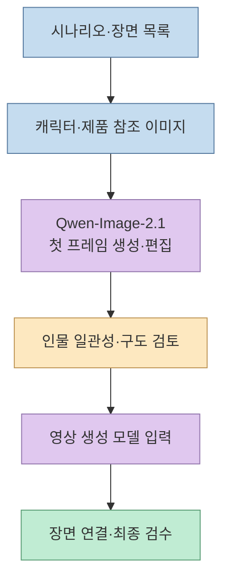
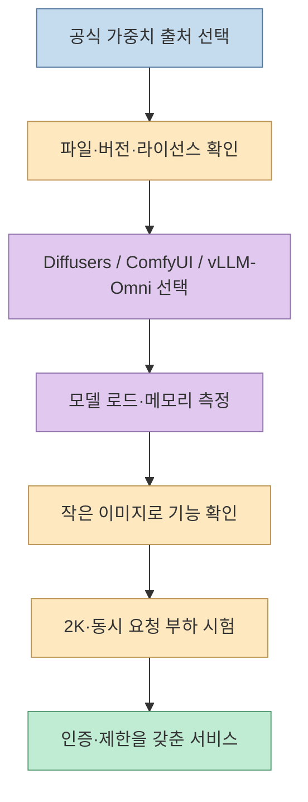
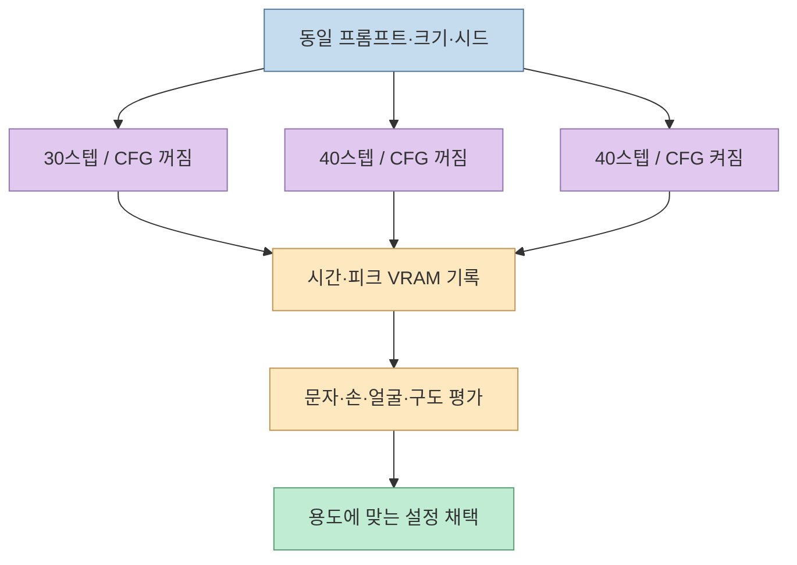

[X 게시글](https://x.com/Pluvio9yte/status/2103147283290427900)은 Qwen-Image-2.1을 단일 RTX 4090에 배포하고 2048픽셀 이미지를 30스텝, 약 3분에 만들었다고 전한다. 작성자는 이를 GPT Image 2.5의 로컬 대안으로 보고, AI 단편 영상의 첫 프레임 제작에 추천한다. **2K 지원과 로컬 실행 경로는 공식 문서로 확인된다.** 다만 3분이라는 속도, 두 모델의 화질 우열, "검열이 없다"는 평가는 작성자의 경험·주장이지 일반적으로 검증된 결론은 아니다. 이 글은 실제 배포에 필요한 선택과 검증 지점을 나눠 정리한다.

<!--more-->

## Sources

- [원문 X 게시글](https://x.com/Pluvio9yte/status/2103147283290427900) — 단일 4090 배포, 33GB 가중치, 30스텝·약 3분, CFG 비활성화 등의 사용자 사례
- [Qwen-Image-2.1 공식 저장소](https://github.com/QwenLM/Qwen-Image-2.1) · [공식 모델 카드](https://huggingface.co/Qwen/Qwen-Image-2.1) — 기능, 권장 크기, Diffusers·ComfyUI·서빙 경로, 라이선스
- [Diffusers의 Qwen-Image-2.1 안내](https://github.com/huggingface/diffusers/blob/main/docs/source/en/api/pipelines/qwenimage21.md) · [파이프라인 구현](https://github.com/huggingface/diffusers/blob/main/src/diffusers/pipelines/qwenimage21/pipeline_qwenimage21.py) — 기본 스텝과 CFG 조건
- [ComfyUI v0.37.0 릴리스](https://github.com/Comfy-Org/ComfyUI/releases/tag/v0.37.0) · [OpenAI의 GPT-Image-2.5 Sunburst 모델 문서](https://developers.openai.com/api/docs/models/gpt-image-2.5-sunburst) — 버전과 비교 대상 확인

**자료 범위:** 원문에 실린 두 결과 이미지는 통제된 모델 비교 실험이 아니다. 게시글에는 GPU 메모리 사용량, 오프로딩 설정, 전체 프롬프트와 동일 조건의 GPT Image 결과가 없어 화질·속도 우열을 재현할 수 없다. 아래의 시간·용량 수치는 공식 벤치마크가 아닌 **게시글 작성자의 환경에서 보고한 값**으로 취급한다.

## 1. 모델이 공식적으로 지원하는 범위

Qwen 팀은 Qwen-Image-2.1을 **텍스트 이미지 생성과 이미지 편집을 하나로 묶은 모델**로 소개한다. 시각 생성 구성요소는 7B 매개변수이며, 입력 이미지 최대 10장 참조, 투명 배경 RGBA 생성, 국소 편집을 지원한다. 공식 권장 크기는 정사각형 **2048×2048**, 가로 16:9 **2752×1536**, 세로 9:16 **1536×2752** 등이다. 여기서 "네이티브 2K"는 이 크기로 생성하도록 설계됐다는 뜻이지, 모든 프롬프트에서 다른 모델보다 우수하다는 뜻은 아니다. [Qwen 공식 저장소](https://github.com/QwenLM/Qwen-Image-2.1)

첫 프레임 이미지가 필요한 영상 작업에서는 텍스트 생성만 보지 말고 **참조 이미지 편집**도 살펴볼 만하다. 인물·제품의 외형을 유지한 채 배경이나 구도를 조정하고, 장면별 첫 프레임을 생성하는 흐름이다. 다만 동일 캐릭터가 후속 비디오 생성에서 계속 유지되는지는 이미지 모델만으로 보장되지 않는다. 그 검증은 별도 영상 모델과 전체 제작 파이프라인의 몫이다. [Qwen 공식 저장소](https://github.com/QwenLM/Qwen-Image-2.1)

## 2. 로컬 배포는 다운로드·런타임·서비스를 나누어 봐야 한다

원문은 국내 네트워크에서 ModelScope로 가중치 조각을 내려받고, Diffusers 소스를 별도 미러에서 구하라고 권한다. 이는 작성자의 **다운로드 경로 최적화 경험**이다. 공식 Qwen 저장소도 가중치를 [Hugging Face](https://huggingface.co/Qwen/Qwen-Image-2.1)와 [ModelScope](https://modelscope.cn/models/Qwen/Qwen-Image-2.1)에 제공한다. 어느 쪽이 빠른지는 네트워크 환경에 달려 있다. 소스 미러를 쓸 때는 원본과 커밋·버전이 일치하는지도 확인해야 한다. [Qwen 공식 저장소](https://github.com/QwenLM/Qwen-Image-2.1)

실행 방식은 세 갈래다.

- **Diffusers:** 공식 예시는 `QwenImage21Pipeline`을 사용하며 PyTorch, Transformers, 최신 Diffusers, Accelerate를 요구한다. 생성 기본값은 40스텝이다. 환경을 코드로 관리하거나 API를 직접 감싸고 싶을 때 적합하다. [Qwen 빠른 시작](https://github.com/QwenLM/Qwen-Image-2.1#quick-start)
- **ComfyUI:** 그래프형 워크플로에 적합하다. [v0.37.0 릴리스 노트](https://github.com/Comfy-Org/ComfyUI/releases/tag/v0.37.0)에 Qwen-Image 2.1 지원 추가가 명시돼 있다. 따라서 원문 작성자의 0.32 환경에서 모델을 바로 못 썼다는 설명은 버전 차이로 이해할 수 있다. 기존 설치를 무작정 교체하기보다 워크플로와 모델 파일 호환성을 함께 확인한다.
- **vLLM-Omni:** 공식 저장소에 `vllm serve Qwen/Qwen-Image-2.1 --omni`와 `/v1/images/generations` 호출 예시가 있다. 이미지를 서비스 형태로 요청할 목적이라면, 임의의 서버를 만들기 전에 이 경로의 하드웨어·버전 요건을 평가할 수 있다. [Qwen 서빙 예시](https://github.com/QwenLM/Qwen-Image-2.1#online-serving)

원문은 **가중치가 총 약 33GB이고 시작 시 로드에 약 2분**이 걸렸다고 한다. 다운로드·디스크 용량과 **GPU VRAM 요구량은 같은 수치가 아니다.** 2K 생성의 피크 메모리는 가중치 외 활성값, VAE, 텍스트 인코더, 캐시, 동시 요청에 좌우된다. 공식 모델 카드는 `enable_model_cpu_offload()` 예시를 제공하므로, 단일 GPU에 곧바로 올라가지 않는다면 오프로딩을 시도할 수 있다. 대신 메모리를 덜 쓰는 설정이 응답 시간에는 불리할 수 있다. [모델 카드의 메모리 최적화](https://huggingface.co/Qwen/Qwen-Image-2.1#memory-optimization)

서비스 시작 때 모델을 적재한다는 원문의 조언은 **첫 요청이 긴 로딩 시간 때문에 타임아웃되는 상황**을 피하려는 설계다. 다만 시작 시간을 앞당겨 지불하는 것이지 계산 비용을 없애는 것은 아니다. 준비 상태가 되기 전에는 요청을 받지 않도록 하고, 첫 생성 시간과 이후 생성 시간을 따로 측정해야 한다.

## 3. CFG와 3분 수치는 어떻게 해석해야 하나

공식 Diffusers 파이프라인의 기본값은 `num_inference_steps=40`, `true_cfg_scale=1.0`이다. `true_cfg_scale > 1`과 `negative_prompt`를 함께 줄 때 CFG가 켜진다. 공식 안내는 이때 **스텝당 작업량이 두 배**가 된다고 설명한다. 따라서 원문의 "CFG를 끄고 30스텝으로 2048 이미지 약 3분"은 공식 기본 40스텝보다 적은 반복으로 잰 **하나의 측정 사례**다. 30스텝의 결과 품질과 40스텝 결과는 별도 비교가 필요하며, 다른 카드·설정에서도 3분이 나온다고 추정할 수 없다. [Diffusers 안내](https://github.com/huggingface/diffusers/blob/main/docs/source/en/api/pipelines/qwenimage21.md), [파이프라인 기본값](https://github.com/huggingface/diffusers/blob/main/src/diffusers/pipelines/qwenimage21/pipeline_qwenimage21.py)

## 4. GPT Image 2.5와의 비교에서 빠진 조건

작성자는 Qwen 결과가 GPT Image 2.5에 뒤지지 않고 특정 "노이즈"가 없다고 평가한다. 그러나 **동일 프롬프트, 원본 입력, 출력 크기, 품질 설정, 평가 샘플 수와 블라인드 평가**가 없다면 일반적인 품질 비교로 확장할 수 없다. OpenAI 문서의 [GPT-Image-2.5 Sunburst](https://developers.openai.com/api/docs/models/gpt-image-2.5-sunburst)는 여러 품질 설정을 지원한다. 원문이 어떤 모델 변형과 설정을 썼는지도 명확하지 않다. 특히 "노이즈"는 압축 아티팩트인지, 피부·재질 표현의 취향인지 정의가 없어 재현 가능한 지표가 아니다.

비교 목적이 **영상 첫 프레임**이라면 사진 한 장의 인상보다 실제 사용 기준으로 점검하는 편이 낫다. 캐릭터가 샷 간 동일하게 보이는지, 화면 안 글자가 정확한지, 후속 영상 모델이 인물·손·배경을 안정적으로 이어가는지, 재생성에 드는 시간과 비용이 얼마인지 기록한다. 원문의 "Qwen-Image-2.1 + MiniMax-h3가 인기 제작 파이프라인이 될 것"이라는 문장은 **전망**이며, 이 조합의 통합 성능 자료가 게시글에 제시된 것은 아니다. [원문](https://x.com/Pluvio9yte/status/2103147283290427900)

## 5. "로컬이면 제한이 없다"는 운영 결론이 아니다

로컬 추론에서는 외부 이미지 생성 API의 요청별 검토 경로와 다른 통제권을 가질 수 있다. 하지만 그것이 모델 자체의 모든 동작을 설명하거나 **법적·계약상·서비스 운영상의 책임이 사라진다**는 뜻은 아니다. 특히 공개 API로 제공한다면 인증, 요청 제한, 로그의 개인정보 처리, 악용 신고와 출력물 검토 정책을 따로 설계해야 한다. 또 모델 카드의 라이선스는 **Qwen Research License Agreement**다. "오픈소스니까 모든 상업적 사용이 자유롭다"고 가정하지 말고 실제 사용 조건을 확인해야 한다. [모델 카드·라이선스](https://huggingface.co/Qwen/Qwen-Image-2.1#license)

## 실전 적용 포인트

1. **목적부터 고른다.** 단발 제작이면 ComfyUI 워크플로, 코드 통합이면 Diffusers, 다중 요청 서비스면 공식 서빙 경로를 먼저 검토한다.
2. **최소 실행부터 성공시킨다.** 공식 가중치와 호환 버전을 확인하고 작은 해상도에서 한 장을 생성한 뒤 2K로 올린다. 메모리 부족은 CPU 오프로딩 등으로 해결하되 속도 변화를 재측정한다.
3. **수치를 분리해 기록한다.** 다운로드 시간, 모델 적재 시간, 첫 요청, 후속 요청, 30·40스텝 시간, 피크 메모리를 각각 남긴다. 원문의 2분·3분을 목표치로 단정하지 않는다.
4. **사용 목적대로 품질을 평가한다.** 동일 장면 여러 장으로 캐릭터·문자·구도·후속 영상 연결성을 보고, GPT Image와 비교한다면 양쪽 모델·품질 설정을 공개한다.
5. **공개 전에 운영 통제를 붙인다.** 라이선스 조건을 확인하고 서비스 접근 제어·오남용 대응 방안을 마련한다.

## 핵심 요약

- Qwen-Image-2.1의 **2K 생성·이미지 편집·투명 배경·다중 참조**는 공식 문서에 나온 기능이다.
- **ComfyUI v0.37.0** 릴리스에 모델 지원이 명시돼 있으며, Diffusers는 기본 **40스텝·CFG 비활성화**다.
- **4090에서 33GB 적재 약 2분, 2048픽셀 30스텝 약 3분**은 원문 작성자의 환경에서 나온 수치다. 가중치 용량은 VRAM 요구량과 다르다.
- "GPT Image 2.5와 동급", "노이즈 없음", "제한 없음"은 통제된 비교나 운영 정책을 대신할 수 없다.

## 결론

이 게시글의 실용적 핵심은 **로컬 이미지 모델을 첫 프레임 제작 파이프라인에 넣고, 로딩·버전·CFG 같은 실제 배포 병목을 짚었다**는 데 있다. 공식 지원 범위를 출발점으로 삼되, 속도와 화질은 자기 하드웨어와 프롬프트에서 다시 측정하고, 공개 서비스라면 라이선스와 운영 통제까지 설계해야 재현 가능한 워크플로가 된다.
