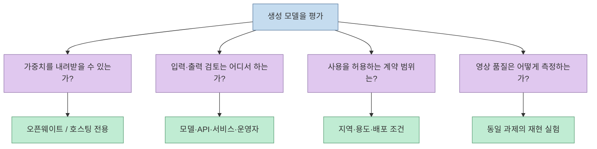
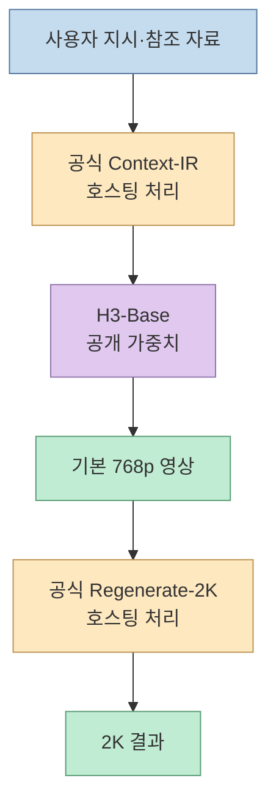
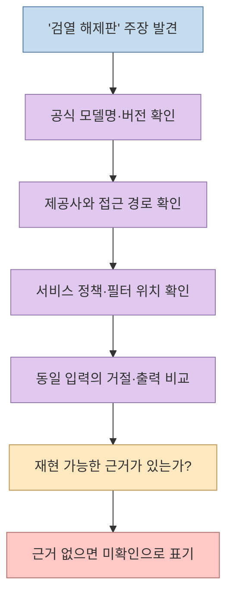

[X 게시글](https://x.com/agi_aibusi/status/2103271411104305344)은 흔히 한데 묶이는 ‘무검열 모델’을 둘로 나눈다. **MiniMax H3처럼 가중치를 공개한 모델**과 **Seedance 같은 폐쇄형 서비스의 검열 해제판이라고 불리는 것**이다. 작성자는 후자의 성능이 훨씬 뛰어나다고 주장한다. 하지만 이 문장에는 *모델을 소유·실행할 수 있는가*, *서비스가 어떤 콘텐츠를 걸러내는가*, *어떤 결과가 더 좋은가*라는 서로 다른 질문이 섞여 있다. 공식 자료를 기준으로 무엇이 확인되고 무엇이 확인되지 않았는지 분리해 보자.

<!--more-->

## Sources

- [원문 X 게시글](https://x.com/agi_aibusi/status/2103271411104305344) — 두 범주와 성능 우위 주장. X 직접 접근은 차단되어 공개 게시글의 텍스트를 X 신디케이션 경로로 확인했다. 게시글 끝의 ‘예시는 아래에’가 가리키는 후속 목록은 이 자료 범위에서 확인하지 못했다.
- [MiniMax H3 공식 발표](https://www.minimax.io/news/minimax-h3-open-source) · [공식 커뮤니티 라이선스](https://huggingface.co/MiniMaxAI/MiniMax-H3/blob/main/LICENSE) · [라이선스 Q&A](https://huggingface.co/MiniMaxAI/MiniMax-H3/blob/main/docs/QA-about-License.md)
- [ByteDance Seedance 2.5 공식 발표](https://seed.bytedance.com/en/blog/one-take-creation-flexible-referencing-introducing-seedance-2-5) · [BytePlus의 Seedance 서비스 보호 조치 설명](https://www.byteplus.com/en/blog/dreamina-seedance2-0) · [BytePlus 콘텐츠 필터 FAQ](https://docs.byteplus.com/en/docs/modelark/content_pre_filter_faq)

**자료 범위:** ‘무검열’은 공식 제품 분류가 아니라 원문 작성자의 표현이다. 원문은 특정 ‘검열 해제판’의 제공사, 모델 버전, 접근 방식, 평가 데이터와 테스트 결과를 제시하지 않는다. 따라서 이 글은 그런 버전의 존재나 성능을 검증했다고 주장하지 않으며, 우회 방법도 다루지 않는다.

## 1. 가중치 공개와 콘텐츠 검토는 다른 축이다

**오픈웨이트**는 배포된 모델 가중치를 조건에 따라 내려받아 독립적인 환경에서 실행할 수 있다는 뜻이다. 반면 **콘텐츠 검토**는 입력 프롬프트, 참조 자료, 생성 결과나 계정 행동을 서비스가 심사하는 절차다. 로컬로 모델을 실행하면 특정 호스팅 API의 사전·사후 필터를 거치지 않을 수 있다. 그렇다고 가중치가 공개된 모델이 기술적으로 모든 요청에 응한다거나, 라이선스·서비스 약관·법적 책임이 사라진다는 뜻은 아니다. MiniMax도 공개 가중치와 자사 API를 구분해 설명하면서, API에는 안전 통제를 적용한다고 밝힌다. [MiniMax 공식 발표](https://www.minimax.io/news/minimax-h3-open-source), [라이선스 Q&A](https://huggingface.co/MiniMaxAI/MiniMax-H3/blob/main/docs/QA-about-License.md)

‘검열’이라는 한 단어도 무엇이 작동하는지 구분해야 한다. 출력 자체가 프롬프트에 잘 응하지 않는 **모델 동작**과, 정책 위반으로 응답을 막는 **서비스 필터**, 권한과 위험을 관리하는 **운영 정책**은 같은 현상이 아니다. 따라서 어떤 사이트에서 생성이 됐거나 거절됐다는 경험만으로 내부 모델이 달라졌다고 결론낼 수 없다. BytePlus는 자사 Seedance 제공 환경에 콘텐츠 필터와 워터마크 등의 보호 조치가 있다고 설명한다. [BytePlus 공식 설명](https://www.byteplus.com/en/blog/dreamina-seedance2-0)

## 2. MiniMax H3: 가중치가 공개돼도 ‘무제한 사용’은 아니다

MiniMax는 H3의 **H3-Base 가중치**를 공개했다. 기본 생성은 짧은 변 기준 768픽셀이며, 공식 2K 결과를 만드는 **H3-Context-IR**과 **H3-Regenerate-2K**는 별도 호스팅 구성요소다. 즉 가중치 공개와 공식 서비스의 전체 기능 공개는 동일하지 않다. 자사 API에서는 입력과 향상된 프롬프트 등에 자동 검토가 적용될 수 있다고 공식 발표에 적혀 있다. [MiniMax H3 공식 발표](https://www.minimax.io/news/minimax-h3-open-source)

한국 독자에게는 **라이선스의 지역 조건**이 특히 중요하다. [MiniMax H3 커뮤니티 라이선스](https://huggingface.co/MiniMaxAI/MiniMax-H3/blob/main/LICENSE)는 적용 지역에서 **대한민국, 미국, 영국, EU를 제외**한다고 명시한다. 공식 [Q&A](https://huggingface.co/MiniMaxAI/MiniMax-H3/blob/main/docs/QA-about-License.md)는 제외 지역에서 오픈웨이트를 배포·사용하려면 별도 허가를 신청할 수 있고, 공식 API는 안전 통제하에 제공한다고 설명한다. 따라서 ‘가중치가 공개돼 있으니 한국에서 곧바로 로컬 배포해도 된다’고 해석하면 안 된다. 이는 공개된 계약 문구의 요약이며, 구체적 사용 가능 여부는 해당 라이선스와 제공사 안내를 직접 확인해야 한다.

또한 라이선스는 제3자에게 H3 기반 서비스를 제공할 때 합리적인 기술·조직적 보호 조치를 유지·시험하고, 안전장치를 의도적으로 약화하거나 우회하도록 허용하지 말라고 요구한다. 원문의 ‘무검열’이라는 별칭과 실제 계약 조건 사이에 큰 간격이 있음을 보여주는 사례다. [MiniMax H3 커뮤니티 라이선스](https://huggingface.co/MiniMaxAI/MiniMax-H3/blob/main/LICENSE)

## 3. Seedance: ‘검열 해제판’은 검증된 모델 이름이 아니다

ByteDance는 [Seedance 2.5 발표](https://seed.bytedance.com/en/blog/one-take-creation-flexible-referencing-introducing-seedance-2-5)에서 지멍 AI와 Doubao Pro 등 서비스 이용 경로를 소개한다. [BytePlus](https://www.byteplus.com/en/blog/dreamina-seedance2-0)는 Seedance 2.0의 ModelArk API 제공과 콘텐츠 필터·워터마크·사용 정책을 설명한다. 따라서 적어도 **공식 서비스에는 보호 조치가 존재한다.** 원문의 ‘폐쇄형 모델의 검열 해제판’이 공식 모델 변경인지, 제3자 서비스의 정책 차이인지, 단지 비공식 명칭인지는 공개된 게시글만으로 확인되지 않는다.

BytePlus의 [콘텐츠 필터 FAQ](https://docs.byteplus.com/en/docs/modelark/content_pre_filter_faq)는 인물의 얼굴·음성 유사성을 검사하는 출력 필터 사례를 설명한다. 이는 **모델 가중치 자체**, **API의 필터**, **최종 사용자가 접하는 서비스**를 구분해야 하는 이유다. 어떤 한 서비스의 거절률이 낮아졌다는 관찰만으로, 폐쇄형 모델의 내부 안전 훈련이 제거됐거나 다른 가중치가 사용됐다고 단정할 수 없다.

## 4. ‘후자가 훨씬 강하다’는 성능 비교가 성립하려면

원문은 폐쇄형의 ‘검열 해제판’이 오픈웨이트보다 성능이 월등하다고 말한다. 하지만 **무슨 버전끼리, 어떤 작업에서, 어떤 설정으로 비교했는지**가 없다. MiniMax H3의 로컬 Base와 공식 2K 서비스만 해도 구성요소가 다르다. Seedance 역시 버전과 이용 경로를 고정해야 한다. 768p 로컬 출력과 2K 호스팅 결과를 한 장씩 비교한다면 ‘가중치 공개 여부’가 아니라 해상도·후처리·서비스 파이프라인까지 한꺼번에 비교하게 된다. [MiniMax H3 구성](https://www.minimax.io/news/minimax-h3-open-source), [Seedance 2.5 발표](https://seed.bytedance.com/en/blog/one-take-creation-flexible-referencing-introducing-seedance-2-5)

검증하려면 같은 장면 지시와 참조 자료를 넣고, 출력 길이·해상도·화면비·생성 횟수와 실패 기준을 맞춰야 한다. 그다음 **동작의 자연스러움, 인물·소품 일관성, 지시 이행, 음성·영상 동기, 거절률**을 따로 평가한다. 거절률은 접근 정책을, 나머지 항목은 생성 품질을 주로 반영하므로 하나의 ‘성능’ 점수로 뭉치지 않는 편이 낫다. 이 평가 절차는 원문에서 제공된 결과가 아니라 **주장을 시험하기 위한 제안**이다.

## 실전 적용 포인트

1. **네 가지를 따로 기록한다.** 가중치 공개 여부, 사용 지역·용도를 포함한 라이선스, API·서비스의 검토 정책, 실제 생성 품질을 분리한다.
2. **제공사 경로를 확인한다.** ‘무검열’ 같은 비공식 표기만으로 공식 모델 버전이나 정책 변경을 추정하지 않는다. 안전장치 우회를 약속하는 제3자 서비스는 출처·권한·개인정보 처리부터 검증한다.
3. **H3는 계약부터 본다.** 한국에서 오픈웨이트를 쓰려는 경우 공식 라이선스의 지역 제외 조항과 별도 허가 경로를 먼저 확인한다. API 이용과 가중치 자체의 배포는 같은 권리가 아니다.
4. **품질 실험은 동일 조건으로 한다.** 공식·제3자 경로, 모델 버전, 해상도, 성공·거절 결과를 함께 기록해 비교 착시를 줄인다.

## 핵심 요약

- **오픈웨이트 여부**와 **콘텐츠 필터 유무**는 서로 다른 속성이다.
- MiniMax H3는 H3-Base 가중치를 공개하지만, 공식 2K 파이프라인 일부는 호스팅되고 커뮤니티 라이선스에는 **한국을 포함한 지역 제외 조건**이 있다.
- 공식 Seedance 제공 경로에는 콘텐츠 보호 조치가 있다. 원문이 말한 ‘검열 해제판’의 실체와 성능 우위는 제시된 자료로 확인되지 않는다.
- ‘무검열’이라는 말 대신 **어떤 모델·버전·서비스·계약·평가 결과인지**를 확인해야 한다.

## 결론

원문의 구분은 ‘모델을 직접 실행하는 것’과 ‘폐쇄형 서비스를 다른 방식으로 이용하는 것’을 혼동하지 말자는 출발점으로는 유용하다. 그러나 두 경우를 모두 ‘무검열 모델’로 부르면 **기술적 통제, 서비스 정책, 라이선스, 품질**을 오히려 흐리게 만든다. 특히 한국에서 MiniMax H3 가중치를 다룰 때는 성능보다 먼저 공식 지역 조건을 확인해야 한다.
