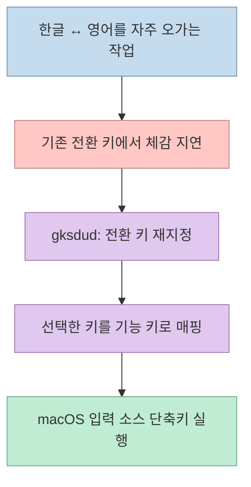
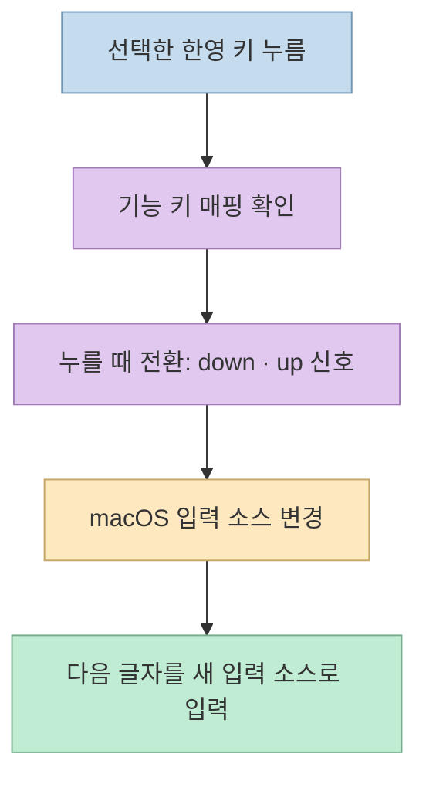
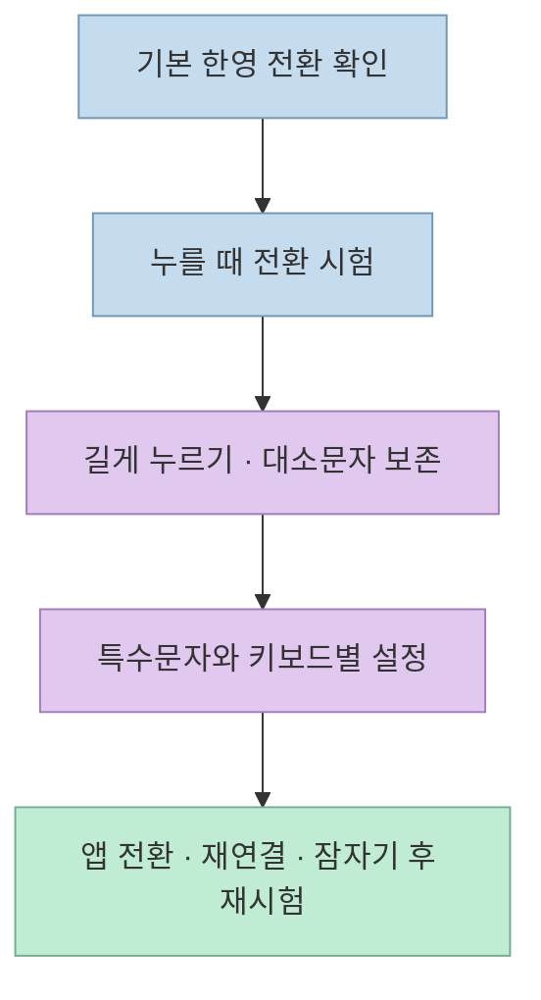

개발 작업에서 한글 설명과 영문 코드·명령어를 오갈 때 한영 전환이 한 박자 늦거나 첫 글자가 이전 언어로 들어가면 흐름이 끊긴다. [Threads 게시글](https://www.threads.com/share/BASEdsA6Ii/)은 “올해 최고의 개발”이라며 Mac용 유틸리티 [gksdud](https://github.com/codingnoye/gksdud)를 소개한다. 과장된 평가는 개인 의견이지만, 앱의 목표는 분명하다. **선택한 키를 한영 전환 키로 쓰고, 전환이 키를 놓을 때까지 기다리지 않도록 하는 것** 이다.

프로젝트는 “씹힘 없고 빠릿빠릿하다”고 설명하지만, 누구에게나 지연이 0이 된다는 독립 성능 측정은 공개 README에서 확인되지 않는다. 이 글은 개발자가 공개한 동작 원리와 실제 설치 후 확인할 조건을 나눠 살펴본다.

<!--more-->

## Sources

- [원문 Threads 공유 링크](https://www.threads.com/share/BASEdsA6Ii/)
- [원문 게시글의 정규 주소](https://www.threads.com/@taewoo.lee.315/post/Ddz12dnk52v)
- [gksdud 공식 GitHub 저장소](https://github.com/codingnoye/gksdud)
- [gksdud 최신 릴리스](https://github.com/codingnoye/gksdud/releases/latest)
- [gksdud 기여·검증 안내](https://github.com/codingnoye/gksdud/blob/main/CONTRIBUTING.md)
- [Apple: Mac 한국어 입력기 사용 설명서](https://support.apple.com/ko-kr/guide/korean-input-method/him001/104/mac/26)

## 무엇을 해결하나: 한영 키와 전환 시점

macOS에는 기본 입력 소스 전환 방법이 있다. Apple 안내에 따르면 Caps Lock으로 라틴·비라틴 입력 소스를 오가거나, `Control-Space`로 이전 입력 소스를 선택할 수 있다. 따라서 gksdud가 새로운 한글 입력기를 만드는 것은 아니다. 기존 시스템의 **입력 소스 전환 단축키를 원하는 물리 키에 연결** 하고, 사용자가 빠르게 타이핑할 때 느끼는 전환 시점을 조정하는 유틸리티에 가깝다. [Apple 한국어 입력기 안내](https://support.apple.com/ko-kr/guide/korean-input-method/him001/104/mac/26), [gksdud README](https://github.com/codingnoye/gksdud)

README는 우측 `⌘` 같은 키를 한영 키로 선택할 수 있다고 설명한다. 내부적으로 선택한 키를 **F19(기본 대상 기능 키)** 에 매핑하고 macOS의 **‘이전 입력 소스 선택’** 단축키도 같은 기능 키로 맞춘다. 즉, 입력 소스를 독자적으로 구현하거나 한글·영문 입력기 자체를 교체하지 않는다. 이 방식은 기존에 Karabiner와 시스템 설정을 수동으로 조합해 하던 일을 앱 하나의 설정으로 묶은 것이다. [gksdud README](https://github.com/codingnoye/gksdud), [공개 코드](https://github.com/codingnoye/gksdud/blob/main/main.swift)

## 핵심 동작: 키를 누르는 순간 전환하기

프로젝트가 강조하는 옵션은 **‘누를 때 전환’** 이다. 이 옵션을 사용하면 선택한 키를 누르는 시점에 기능 키의 `keyDown`과 `keyUp` 이벤트를 연달아 만들어 macOS에 전환을 요청한다. 일반적인 키 해제 시점을 기다렸다가 반응하는 방식과 다르게, 첫 영문 또는 한글 글자가 이전 입력 소스로 들어가는 체감 문제를 줄이려는 설계다. 공개 코드의 주석도 텍스트 키를 버퍼링하는 대신 예약된 기능 키 이벤트만 합성한다고 설명한다. [gksdud README](https://github.com/codingnoye/gksdud), [공개 코드](https://github.com/codingnoye/gksdud/blob/main/main.swift)

이 동작에는 macOS **접근성 권한** 이 필요하다. README도 더 빠른 전환을 원하면 권한을 허용한 뒤 ‘누를 때 전환’을 켜라고 안내한다. 권한이 없거나 이벤트 감시가 정상 동작하지 않으면 기대한 개선이 나타나지 않을 수 있다. 접근성 권한은 입력 이벤트를 다루는 앱에 주는 강한 권한이므로, 설치 출처와 앱이 요청하는 동작을 이해한 뒤 허용하는 편이 좋다. [gksdud README](https://github.com/codingnoye/gksdud), [공개 코드](https://github.com/codingnoye/gksdud/blob/main/main.swift)

## 부가 기능과 적용 범위

README에는 한영 키를 **길게 눌러 대소문자 상태를 바꾸는 기능** 과, 영문 대문자 상태에서 한글로 갔다가 돌아와도 대소문자를 보존하는 옵션이 있다. 메뉴 막대에 현재 입력 상태를 보여 주고, 한글 상태의 `Option` 특수문자 입력을 다루는 기능도 소개한다. 모두 사용자의 기존 입력 습관과 충돌할 수 있으므로 한 번에 켜기보다 한영 전환부터 안정화한 뒤 각각 시험하는 편이 낫다. [gksdud README](https://github.com/codingnoye/gksdud)

저장소의 [변경 기록](https://github.com/codingnoye/gksdud/blob/main/CHANGELOG.md)은 키보드별 On·Default·Off 선택, 장치 재연결 후 설정 보존, 충돌과 실패 알림 같은 개선도 다룬다. 다만 변경 기록에는 **아직 출시되지 않은 항목** 도 섞여 있으므로, 설치한 버전에서 실제로 쓸 수 있는 기능은 [해당 릴리스](https://github.com/codingnoye/gksdud/releases/latest)와 앱 설정 화면을 기준으로 확인해야 한다. 여러 키보드나 Karabiner 가상 키보드를 쓰는 환경에서는 어느 HID 장치에 매핑이 적용됐는지도 점검해야 한다. [기여·검증 안내](https://github.com/codingnoye/gksdud/blob/main/CONTRIBUTING.md)

## 실전 적용 포인트: 설치보다 입력 검증이 중요하다

공식 README는 Homebrew Cask 명령 `brew install --cask codingnoye/tap/gksdud` 또는 [릴리스 ZIP](https://github.com/codingnoye/gksdud/releases/latest) 설치를 안내한다. 앱은 **자체 서명** 상태여서 macOS가 첫 실행을 차단할 수 있으며, 개발자는 시스템 설정의 개인정보 보호 및 보안 화면에서 실행을 허용하라고 안내한다. 보안 경고를 무조건 우회하기보다 **공식 저장소와 배포 파일을 확인한 뒤** 사용 여부를 결정해야 한다. [gksdud README](https://github.com/codingnoye/gksdud), [최신 릴리스](https://github.com/codingnoye/gksdud/releases/latest)

설치 후에는 메뉴 막대 아이콘에서 키를 지정하고, 한글·영어가 번갈아 나오는 짧은 문장을 **천천히 한 번, 빠르게 여러 번** 입력해 보자. 특히 전환 직후 첫 글자, 다른 앱으로 이동한 뒤 전환, 길게 누르기와 Caps Lock, 외장 키보드 연결·해제, 잠자기에서 돌아온 직후를 확인한다. 저장소의 기여 안내도 자동 테스트가 실제 기기별 입력 타이밍까지 증명하지는 못하므로 별도의 수동 검증이 필요하다고 명시한다. [gksdud README](https://github.com/codingnoye/gksdud), [기여·검증 안내](https://github.com/codingnoye/gksdud/blob/main/CONTRIBUTING.md)

이미 다른 키 매핑 도구나 복잡한 입력 소스 단축키를 쓰고 있다면 설정 충돌을 먼저 확인한다. 문제가 생기면 앱의 활성화를 끄고 원래 단축키·매핑이 복원됐는지 확인한 뒤 다른 매핑 도구를 다시 켜는 순서가 안전하다. 소스 코드는 관리하던 매핑과 단축키를 복원하려고 설계돼 있지만, 모든 외부 도구 조합에서 자동 복구가 보장된다고 단정할 수는 없다. [공개 코드](https://github.com/codingnoye/gksdud/blob/main/main.swift), [기여·검증 안내](https://github.com/codingnoye/gksdud/blob/main/CONTRIBUTING.md)

## 핵심 요약

- gksdud는 Mac 한영 전환 키를 **F19 등 기능 키와 시스템의 입력 소스 단축키에 연결** 하는 유틸리티다.
- ‘누를 때 전환’은 키를 누르는 시점에 전환 신호를 보내 **첫 글자 씹힘의 체감 문제를 줄이려는 설계** 다. 독립적인 지연 수치가 공개된 것은 아니다.
- 대소문자 보존, 길게 누르기, 메뉴 막대 표시, 특수문자 옵션은 필요한 것부터 차례로 시험해야 한다.
- 접근성 권한과 자체 서명 앱의 설치·보안 경고를 이해하고, 여러 키보드·다른 매핑 앱과의 충돌을 확인해야 한다.

## 결론

Threads의 “최고의 앱”이라는 평가는 주관적이지만, gksdud가 겨냥한 문제는 작고 구체적이다. Mac에서 한영 전환 뒤 첫 글자가 자주 잘못 들어간다면 **전환 키 매핑과 키를 누르는 시점의 이벤트 처리** 가 자신의 환경에서 도움이 되는지 시험해 볼 만하다. 다만 설치 성공보다 중요한 것은 실제로 쓰는 키보드와 앱들에서 전환이 안정적으로 반복되는지 확인하는 일이다.
