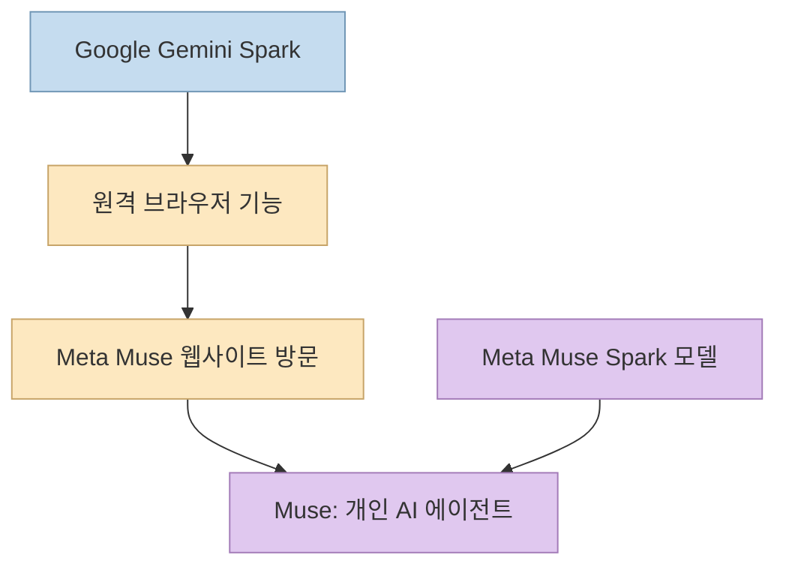
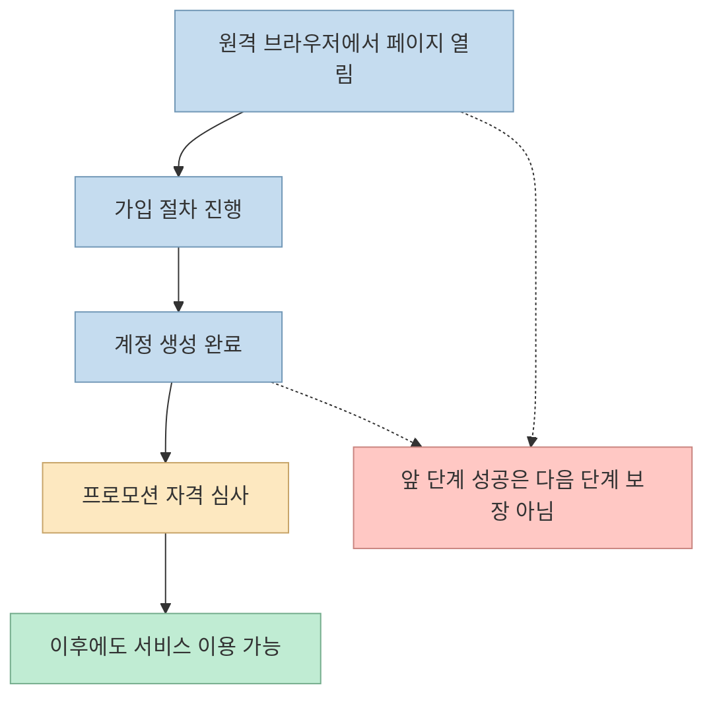
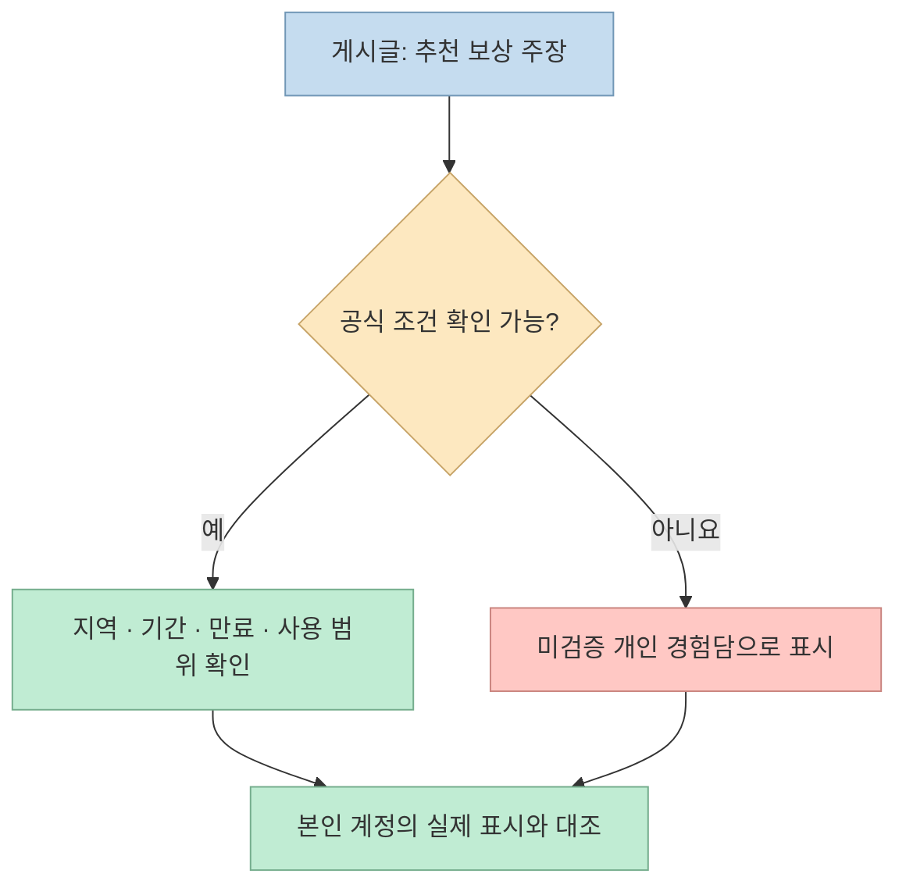

한 [Threads 게시글](https://www.threads.com/share/BAEnLf7BRy/)은 한국에서 Meta의 개인 AI 에이전트 **Muse**에 가입했다며, **Gemini Spark의 원격 브라우저** 를 이용한 경험과 추천 코드로 **10억 토큰** 을 받았다는 내용을 공유한다. 새 서비스에 관심이 있다면 눈길이 가는 이야기지만, 개인의 가입 성공 사례와 **공식 지원 지역·지속적인 계정 자격·프로모션 보장** 은 다른 문제다.

Meta의 공식 발표는 Muse가 **미국에서 우선 출시 중** 이라고 적는다. Google 문서는 Gemini Spark에 로컬 Chrome과 별개인 원격 브라우저가 있음을 확인해 주지만, 그 브라우저가 특정 국가에서 실행되거나 다른 서비스의 지역 제한을 안전하게 통과시켜 준다고 보장하지는 않는다. [Meta 발표](https://about.fb.com/news/2026/09/introducing-muse-personal-ai-agent/), [Google 도움말](https://support.google.com/gemini/answer/17094507)

<!--more-->

## Sources

- [원문 Threads 공유 링크](https://www.threads.com/share/BAEnLf7BRy/)
- [원문 게시글의 정규 주소](https://www.threads.com/@artviiw/post/DdzDnFsjxSr)
- [Meta: Muse 공식 출시 발표](https://about.fb.com/news/2026/09/introducing-muse-personal-ai-agent/)
- [Meta: Muse 공식 페이지](https://ai.meta.com/muse/)
- [Google: Gemini Spark 원격 브라우저 도움말](https://support.google.com/gemini/answer/17094507)
- [Muse 추가 서비스 약관](https://muse.ai/terms)

## 세 이름부터 구분하기: Muse, Muse Spark, Gemini Spark

**Muse** 는 Meta의 개인 AI 에이전트 제품이다. Meta에 따르면 전용 클라우드 가상 머신과 브라우저에서 사용자를 대신해 웹 작업을 하고, 승인과 연결 권한을 관리하도록 설계됐다. **Muse Spark** 는 Meta가 Muse를 구동한다고 소개하는 모델 계열이다. 반면 **Gemini Spark** 는 Google의 별도 개인 에이전트 기능이다. Threads 글에서 말하는 “Gemini Spark로 Muse에 가입”은 Google 도구의 브라우저로 Meta 제품의 웹사이트에 접근했다는 뜻이지, 두 Spark가 같은 서비스이거나 공식적으로 연결됐다는 의미가 아니다. [Meta 발표](https://about.fb.com/news/2026/09/introducing-muse-personal-ai-agent/), [Google 도움말](https://support.google.com/gemini/answer/17094507)

Meta는 2026년 9월 8일 발표에서 Muse를 iOS·Android·`muse.ai`를 통해 **미국에서 순차 출시** 한다고 명시했다. 게시글 작성자가 한국에서 접속과 가입을 마쳤다는 주장은 **개인 경험담** 으로 다룰 수 있지만, 그 사례가 곧 한국을 공식 지원한다는 발표는 아니다. 또한 현재 접속 가능 여부와 장기 사용 가능 여부도 구분해야 한다. [Meta 공식 발표](https://about.fb.com/news/2026/09/introducing-muse-personal-ai-agent/), [원문 게시글](https://www.threads.com/@artviiw/post/DdzDnFsjxSr)

## 원격 브라우저로 가입했다는 주장에서 검증된 부분

Google 공식 도움말에는 Gemini Spark가 사용자의 **로컬 Chrome** 을 이용할 수도 있고, 로컬 브라우저와 분리된 **원격 브라우저** 를 이용할 수도 있다고 적혀 있다. 원격 브라우저에서 웹사이트가 로그인을 요구하면 작업을 멈추고 사용자가 직접 제어할 수 있다. 따라서 Threads의 “원격 브라우저”와 “직접 제어”라는 개념 자체는 Google 제품 설명과 맞는다. [Google 도움말](https://support.google.com/gemini/answer/17094507)

그러나 Google 문서는 그 원격 브라우저의 **출구 국가나 IP를 선택·고정할 수 있다** 고 설명하지 않는다. 그러므로 특정 사용자의 접속 경험을 일반화해 “한국에서는 이 방법으로 누구나 가입할 수 있다”고 안내할 근거가 없다. 서비스가 가입 화면을 보여 주더라도 Meta가 해당 지역 계정의 장기 이용을 허용한다는 보증도 아니다. **접속 성공 → 가입 승인 → 지역 자격 확인 → 지속 이용** 은 서로 다른 단계다. [Google 도움말](https://support.google.com/gemini/answer/17094507), [Meta 공식 발표](https://about.fb.com/news/2026/09/introducing-muse-personal-ai-agent/)

보안 측면에서는 로그인 정보나 결제 정보를 **에이전트 대화창에 입력하지 말라** 는 Google의 경고가 중요하다. 인증이 필요하다면 브라우저 제어를 넘겨받아 웹페이지에서 직접 입력하고, 제공할 계정 권한과 연결 범위를 확인해야 한다. 특히 가입을 위해 평소 쓰지 않는 이메일을 새로 만든 경우에는 이후 계정 복구 수단과 인증 이메일 수신 가능 여부까지 챙겨야 한다. [Google 도움말](https://support.google.com/gemini/answer/17094507)

## “10억 토큰”과 추천 코드: 개인 계정의 표시만으로는 부족하다

원문은 추천 코드를 입력하면 **10억 토큰** 을 받을 수 있고, 작성자 계정에서 수령을 확인했다고 주장한다. 그러나 확인한 [Meta의 공개 출시 발표](https://about.fb.com/news/2026/09/introducing-muse-personal-ai-agent/)와 [Muse 공개 약관](https://muse.ai/terms)에는 이 추천 혜택의 **대상 지역, 적용 기간, 지급 조건, 토큰의 사용 범위와 만료** 를 설명하는 공개 근거를 찾지 못했다. 따라서 이 글은 해당 코드를 가입 혜택으로 추천하거나 “누구나 10억 토큰을 받는다”고 적지 않는다. 프로모션이 있다 해도 최종 기준은 Muse 제품 안에서 현재 사용자에게 표시되는 조건과 공식 안내다. [원문 게시글](https://www.threads.com/@artviiw/post/DdzDnFsjxSr)

“토큰”이라는 단어만으로 현금 가치나 API 크레딧과 동일하다고 가정해서도 안 된다. Muse 앱 안의 사용량 단위인지, 어떤 작업에 적용되는지, 소진·만료 조건이 있는지는 해당 프로모션의 공식 조건 없이는 확정할 수 없다. Meta의 공개 발표는 기본적인 Muse 사용이 무료이고 더 많은 사용을 위한 구독 계획이 있다고 설명하지만, 이 문구가 곧 원문에서 말한 추천 토큰의 권리나 조건을 입증하지는 않는다. [Meta 공식 발표](https://about.fb.com/news/2026/09/introducing-muse-personal-ai-agent/)

## 실전 적용 포인트: 한국 사용자라면 무엇을 확인할까

1. **공식 출시 지역부터 확인한다.** 글 작성 시점의 Meta 발표는 미국 출시를 명시한다. 한국 지원 여부는 접속 성공담보다 Meta의 현재 제품 안내를 우선한다. [Meta 공식 발표](https://about.fb.com/news/2026/09/introducing-muse-personal-ai-agent/)
2. **지역 제한을 우회하는 방법을 안정적인 가입 경로로 취급하지 않는다.** 원격 브라우저는 Google이 제공하는 별도 실행 환경이지만, 특정 위치의 IP나 Meta 계정 자격을 보장하지 않는다. 타 서비스의 지역·계정 정책을 충족하는지 스스로 확인해야 한다. [Google 도움말](https://support.google.com/gemini/answer/17094507), [Muse 약관](https://muse.ai/terms)
3. **민감한 인증 정보는 대화창에 넣지 않는다.** Google은 로그인·결제 정보를 작업 스레드에 입력하지 말고 필요한 경우 브라우저를 직접 제어하라고 안내한다. [Google 도움말](https://support.google.com/gemini/answer/17094507)
4. **추천 혜택은 계정 화면과 공식 조건으로 재확인한다.** 게시글의 10억 토큰과 추천 코드는 작성자의 주장이다. 혜택 수량뿐 아니라 사용 범위와 유효 기간이 명시됐는지 확인해야 한다. [원문 게시글](https://www.threads.com/@artviiw/post/DdzDnFsjxSr)

## 핵심 요약

- **Meta Muse** 는 실제로 출시된 개인 AI 에이전트이며, 공식 발표는 **미국 우선 출시** 를 명시한다.
- **Gemini Spark 원격 브라우저** 는 Google 공식 기능이지만, 특정 국가 IP와 Muse 가입 자격을 보장하는 수단으로 설명돼 있지 않다.
- 게시글의 한국 가입 성공과 **10억 토큰 수령** 은 개인 경험담이다. 공개 공식 자료만으로 모든 한국 사용자에게 재현되거나 지급된다고 확인할 수 없다.
- 계정·프로모션·개인정보 조건을 확인하기 전에는 추천 코드를 혜택 보장처럼 받아들이지 않는 편이 안전하다.

## 결론

이 게시글은 새로운 서비스에 대한 **접근 경험** 을 공유하지만, 한국 정식 지원이나 추천 혜택의 보편적 유효성을 입증하지는 않는다. 관심이 있다면 우회 절차를 따라 하기보다 Meta의 지원 지역과 Muse 내부의 최신 혜택 조건을 먼저 확인하고, 계정 정보를 입력하는 순간에는 브라우저 제어와 권한 범위를 신중히 다루자.
