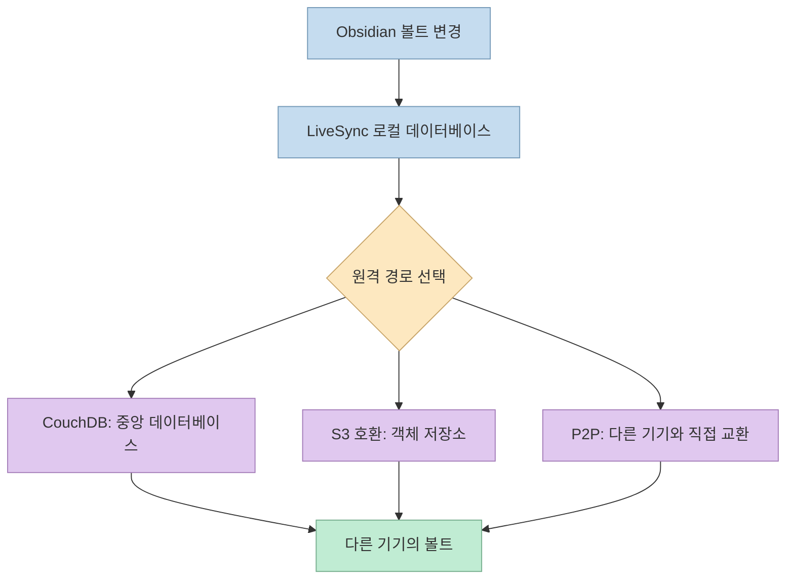
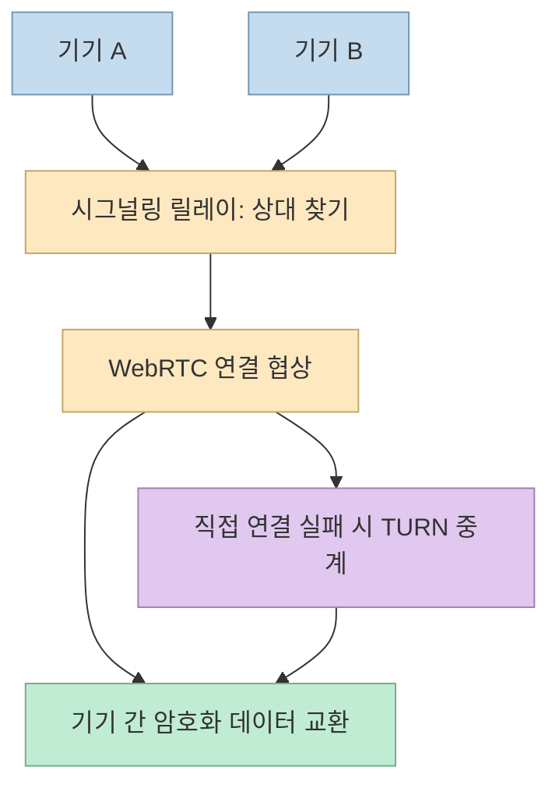
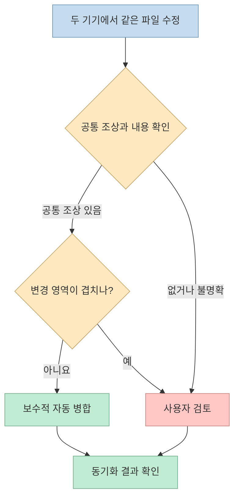
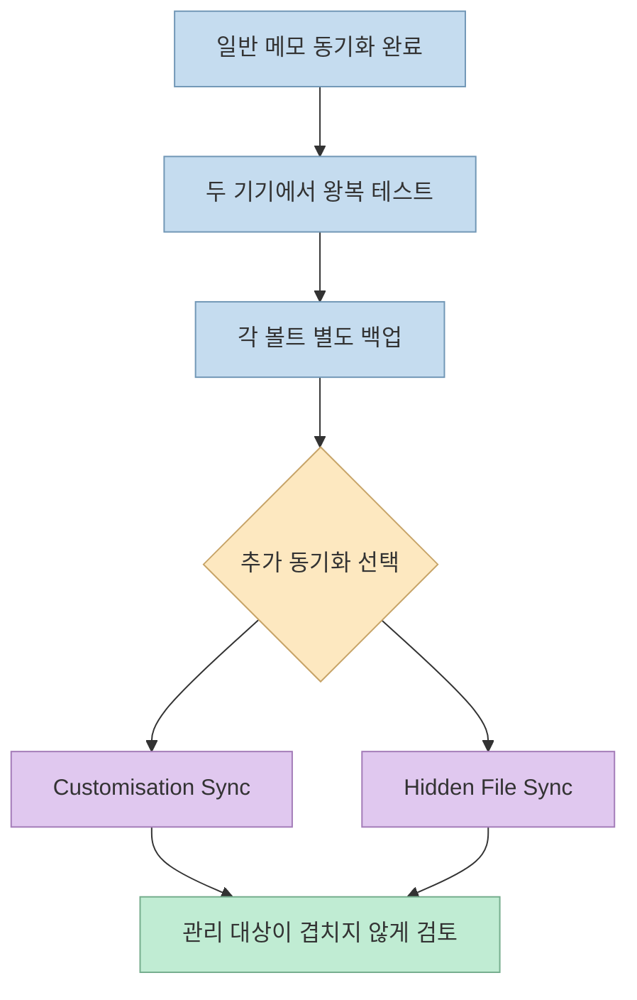

휴대폰에서 적은 Obsidian 메모를 컴퓨터에서 이어 쓰고 싶지만 공식 동기화 구독 대신 직접 데이터를 관리하고 싶을 수 있다. [X 게시글](https://x.com/Ryrenz/status/2104044613082206383)은 이때 사용할 수 있는 커뮤니티 플러그인 **Self-hosted LiveSync**를 소개한다. 공식 저장소를 확인하면 이 플러그인은 CouchDB, S3 호환 객체 저장소, WebRTC P2P라는 여러 경로로 볼트를 동기화하고, 단순한 충돌의 자동 병합과 종단 간 암호화를 지원한다. [프로젝트 README](https://github.com/vrtmrz/obsidian-livesync)

그러나 “월 구독료를 아낀다”는 말은 **서버·저장소·백업·장애 대응을 직접 책임지는 선택** 과 함께 읽어야 한다. 세 방식은 모두 같은 “실시간 동기화”가 아니며, 동기화가 곧 백업도 아니다.

<!--more-->

## Sources

- [원문 X 게시글](https://x.com/Ryrenz/status/2104044613082206383)
- [Self-hosted LiveSync 공식 저장소와 README](https://github.com/vrtmrz/obsidian-livesync)
- [공식 빠른 설정 가이드](https://github.com/vrtmrz/obsidian-livesync/blob/main/docs/quick_setup.md)
- [동기화 설정 문서](https://github.com/vrtmrz/obsidian-livesync/blob/main/docs/settings.md)
- [P2P 통신 구조](https://github.com/vrtmrz/obsidian-livesync/blob/main/docs/p2p.md)
- [충돌 해결 명세](https://github.com/vrtmrz/obsidian-livesync/blob/main/docs/specs_conflict_resolution.md)
- [Obsidian Sync 요금제 안내](https://obsidian.md/help/sync/plans)

## 저장 위치에 따라 달라지는 세 가지 동기화 경로

Self-hosted LiveSync는 Obsidian 호환 플랫폼에서 실행되는 커뮤니티 플러그인이다. 기본적으로 기기의 볼트 변경 사항을 플러그인의 로컬 데이터베이스에 반영하고, 선택한 원격 경로를 통해 다른 기기와 교환한다. **CouchDB** 는 중앙 데이터베이스를 운영하는 방식이고, **MinIO·S3·Cloudflare R2 같은 객체 저장소** 는 저장 공간을 원격으로 사용하는 방식이다. 저장소나 서버를 “직접” 관리한다는 범위는 집의 서버부터 유료 클라우드까지 달라질 수 있다. [프로젝트 README](https://github.com/vrtmrz/obsidian-livesync), [설정 문서](https://github.com/vrtmrz/obsidian-livesync/blob/main/docs/settings.md)

**P2P** 는 중앙에 볼트 사본을 저장하는 서버 없이 기기 사이에서 WebRTC로 데이터를 교환한다. 그렇다고 중간 서비스가 전혀 필요 없는 것은 아니다. 두 기기가 서로를 찾고 연결하려면 **시그널링 릴레이** 가 필요하며, 직접 연결이 막힌 네트워크에서는 선택적으로 **TURN 서버** 가 암호화된 트래픽을 중계한다. 공개 시그널링 릴레이는 프로젝트가 편의로 제공하지만 가용성 보장은 없고 연결 시각·네트워크 주소 같은 메타데이터를 볼 수 있다. 다른 기기가 메모를 받으려면 해당 데이터를 가진 기기 중 적어도 하나가 온라인이어야 한다. 이 방식은 항상 켜져 있는 중앙 저장소나 백업의 대체재가 아니다. [P2P 문서](https://github.com/vrtmrz/obsidian-livesync/blob/main/docs/p2p.md)

동기화 시점도 구분해야 한다. 공식 설정 문서의 **LiveSync 모드** 는 CouchDB 또는 WebRTC P2P 원격 경로에서 지속적 양방향 동기화에 사용할 수 있지만, **S3 호환 객체 저장소에는 지원되지 않는다**. 객체 저장소 경로에서는 주기적 동기화나 저장·열기·시작 이벤트를 이용하는 방식을 검토해야 한다. 따라서 “S3에 올리면 어느 기기에서나 즉시 반영된다”는 가정은 설정 방식에 따라 틀릴 수 있다. [동기화 설정 문서](https://github.com/vrtmrz/obsidian-livesync/blob/main/docs/settings.md)

## 암호화와 충돌 처리: 지원한다는 말의 범위

플러그인은 **종단 간 암호화(E2EE)** 를 지원하며, 공식 빠른 설정 가이드는 일반적인 새 볼트에서 이를 켜고 강한 **볼트 암호화 암호** 를 지정하도록 안내한다. 다른 기기에 설정을 전달하는 **Setup URI** 에는 암호화된 연결 설정과 자격 증명이 들어가며, 이를 여는 암호는 볼트 암호화 암호와 별개다. 두 암호와 URI를 안전하게 보관하고 URI와 해제 암호를 같은 채널로 보내지 않는 것이 좋다. E2EE 기능이 존재한다고 해서 사용자가 암호 설정을 생략해도 데이터가 자동으로 보호된다고 해석해서는 안 된다. [빠른 설정 가이드](https://github.com/vrtmrz/obsidian-livesync/blob/main/docs/quick_setup.md)

충돌도 “언제나 자동 해결”은 아니다. 공식 README는 **단순한 충돌을 자동 병합** 한다고 설명한다. [충돌 해결 명세](https://github.com/vrtmrz/obsidian-livesync/blob/main/docs/specs_conflict_resolution.md)는 두 버전에 공통 조상이 있고 텍스트 또는 구조화 데이터의 변경이 겹치지 않으면 보수적인 3방향 병합을 시도한다고 적는다. 반대로 서로 다른 기기가 같은 경로에 별개의 파일을 만들었거나, 병합에 필요한 이력이 없거나, 한쪽 삭제와 다른 쪽 수정이 충돌하면 사용자 판단이 필요할 수 있다. 바이너리 파일 역시 텍스트처럼 의미를 이해해 자동 병합할 수 없다. 자동 병합은 충돌 검토를 줄여 주는 기능이지, 데이터 손실이 불가능하다는 보증이 아니다.

## 설정·테마·플러그인까지 옮길 때의 주의점

일반 메모 외에 설정, 코드 스니펫, 테마, 플러그인도 동기화할 수 있다. 그러나 이는 기본 메모 동기화에 그냥 딸려 오는 단일 옵션이 아니다. README는 **Customisation Sync(Beta)** 또는 **Hidden File Sync** 를 별도 기능으로 설명한다. 공식 Hidden File Sync 가이드는 먼저 메모가 양방향으로 정상 동기화되는지 확인하고, 백업한 뒤 선택한 숨김 파일에 대해 초기화 방향을 정하라고 한다. 두 기능이 같은 파일을 동시에 관리하도록 설정해서는 안 된다. 특히 `.obsidian` 내부 파일은 실행 중인 설정과 플러그인 상태를 바꿀 수 있어 새 기기에 무조건 덮어쓰면 위험하다. [프로젝트 README](https://github.com/vrtmrz/obsidian-livesync), [Hidden File Sync 가이드](https://github.com/vrtmrz/obsidian-livesync/blob/main/docs/tips/hidden-file-sync.md)

## 실전 적용 포인트: 비용보다 먼저 실패 복구 경로를 만든다

1. **볼트를 먼저 백업하고 다른 동기화 도구를 끈다.** 공식 README와 빠른 설정 가이드는 기존 Obsidian Sync·iCloud 등 같은 볼트에 쓰는 다른 동기화 서비스를 LiveSync와 병행하지 말라고 경고한다. 또한 Self-hosted LiveSync는 **공식 Obsidian Sync와 호환·상호 연동되지 않는다**. 기존 서비스를 켜 둔 채 같은 볼트를 이중 동기화하는 전환은 피해야 한다. [프로젝트 README](https://github.com/vrtmrz/obsidian-livesync), [빠른 설정 가이드](https://github.com/vrtmrz/obsidian-livesync/blob/main/docs/quick_setup.md)
2. **먼저 한 방식만 고른다.** 항상 접근 가능한 중앙 사본이 필요하면 CouchDB나 객체 저장소를, 중앙 보관 없이 기기가 서로 만날 때 교환해도 된다면 P2P를 검토한다. P2P는 두 기기를 켜 두어야 하고, 모바일 운영체제가 백그라운드 Obsidian을 중단할 수 있다. 객체 저장소는 LiveSync 모드가 아니라는 점도 고려한다. [P2P 문서](https://github.com/vrtmrz/obsidian-livesync/blob/main/docs/p2p.md), [설정 문서](https://github.com/vrtmrz/obsidian-livesync/blob/main/docs/settings.md)
3. **첫 기기에서 메모 한 개로 왕복 검증한 뒤 두 번째 기기를 추가한다.** 공식 가이드는 준비된 원격 서비스와 Setup URI로 첫 기기를 설정하고, 정상 동작하는 첫 기기에서 두 번째 기기용 Setup URI를 새로 만들어 양방향 동기화를 확인하도록 안내한다. 모바일에서는 원격 연결에 **HTTPS** 가 필요하다. [빠른 설정 가이드](https://github.com/vrtmrz/obsidian-livesync/blob/main/docs/quick_setup.md)
4. **구독료와 자체 운영비를 따로 계산한다.** [Obsidian 공식 도움말](https://obsidian.md/help/sync/plans)에 따르면 Obsidian Sync는 별도 구독 요금제가 필요하다. LiveSync 플러그인은 MIT 라이선스지만, CouchDB 서버나 S3/R2 저장소, 트래픽, 백업, TLS 인증서, 유지보수에는 비용이나 시간이 든다. 기존 유료 구독을 대체할 수 있다는 것과 전체 비용이 반드시 0원이라는 것은 다르다. [프로젝트 README](https://github.com/vrtmrz/obsidian-livesync), [Obsidian Sync 요금제 안내](https://obsidian.md/help/sync/plans)
5. **버전 요구사항을 확인한다.** 공식 README에 따르면 Self-hosted LiveSync **1.0은 Obsidian 1.7.2 이상** 을 요구한다. X 게시글이 언급한 GitHub 스타 수와 월간 릴리스 수는 시점에 따라 변하므로 설치 판단의 핵심 근거보다는 [릴리스 페이지](https://github.com/vrtmrz/obsidian-livesync/releases)의 현재 안정판·알려진 문제를 확인하는 편이 낫다. [프로젝트 README](https://github.com/vrtmrz/obsidian-livesync)

## 핵심 요약

- Self-hosted LiveSync는 Obsidian 볼트를 **CouchDB·S3 호환 저장소·WebRTC P2P** 로 동기화하는 MIT 라이선스 커뮤니티 플러그인이다.
- P2P에도 시그널링 릴레이가 필요하며, 중앙 사본이 없어 **온라인 기기와 독립 백업** 이 중요하다.
- E2EE와 단순 충돌 자동 병합은 지원하지만, **암호 설정과 해결 불가능한 충돌 검토** 는 사용자의 몫이다.
- 공식 Obsidian Sync와 함께 같은 볼트에 적용하지 말고, 일반 메모부터 검증한 뒤 설정·테마 동기화를 추가해야 한다.
- 공식 서비스 구독료를 피할 수 있어도 **서버 비용과 운영 책임** 은 남는다.

## 결론

Self-hosted LiveSync는 “무료 Obsidian Sync 복제품”이라기보다 **저장 위치와 동기화 경로를 직접 선택하는 도구** 다. 개인 정보 통제와 자체 운영이 우선이라면 충분히 매력적이지만, 먼저 백업과 작은 왕복 테스트를 끝내고 기기·서버 장애 시 복구할 방법을 준비한 뒤 실사용 볼트로 옮기는 것이 안전하다.
