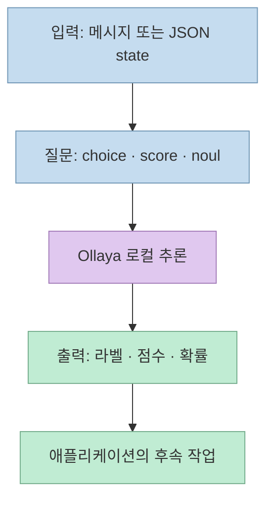
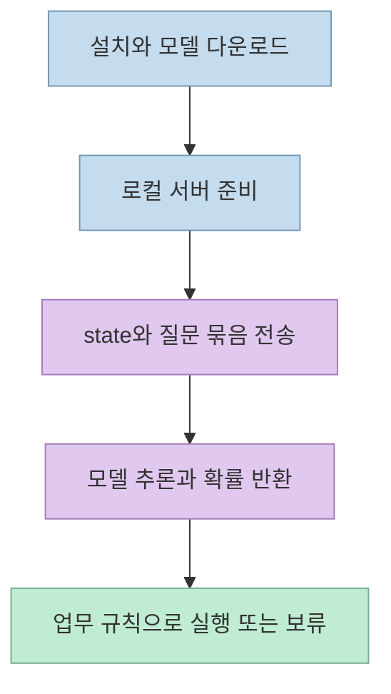
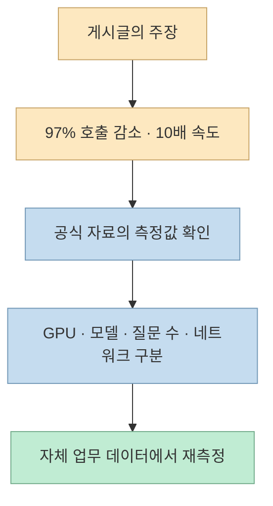
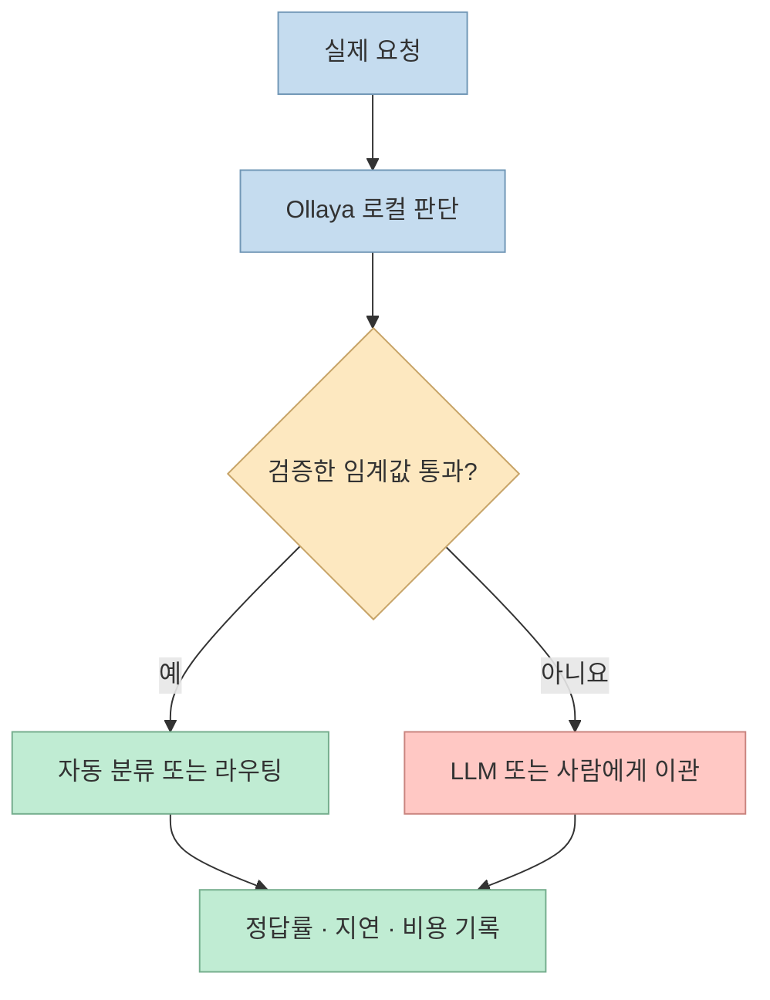

에이전트가 매번 큰 언어 모델에 묻는 질문이 모두 자유로운 문장 생성을 요구하지는 않는다. “이 요청은 환불인가?”, “긴급한가?”, “어느 작업 흐름으로 보낼까?”처럼 정해진 선택지에서 답을 고르는 일이라면, 로컬에서 실행하는 **결정 모델(decision model)** 이 대안이 될 수 있다. [Ollaya](https://ollaya.dev/)는 이런 모델을 이름으로 받아 내려받고 실행하며 API로 제공하는 오픈소스 런타임이다.

다만 [소개 X 게시글](https://x.com/Dontgiveup_26/status/2103972951121125505)의 “LLM 호출 97% 삭감”, “속도 10배”, “몇 밀리초”는 **게시글의 주장** 이다. Ollaya 공식 자료에서 확인되는 수치와 측정 환경은 다르다. 이 글은 제품이 실제로 하는 일과 절감 효과를 검증하는 방법을 분리한다.

<!--more-->

## Sources

- [원문 X 게시글](https://x.com/Dontgiveup_26/status/2103972951121125505)
- [Ollaya 공식 사이트](https://ollaya.dev/)
- [Ollaya GitHub 저장소](https://github.com/ollaya-dev/ollaya)
- [Ollaya 빠른 시작](https://ollaya.dev/docs/quickstart)
- [Ollaya API 문서](https://ollaya.dev/docs/api)

## Ollaya가 하는 일: 문장 생성이 아닌 구조화된 판단

Ollaya의 입력은 처리할 `state`(문자열 또는 JSON)와 `questions`다. 질문은 선택지 하나를 고르는 `choice`, 단계별 점수를 구하는 `score`, 참일 가능성을 묻는 `noul` 등으로 정의한다. 출력은 생성된 답변 문장이 아니라 질문별 **라벨·점수·확률** 이다. 결정은 토큰을 한 개씩 생성하는 방식이 아니라 모델의 추론 결과에서 읽는다. 따라서 일반 LLM의 답변 작성, 계획 수립, 코드 생성까지 Ollaya로 대체한다는 뜻은 아니다. 실제로 `/api/generate`, `/api/chat`, `/api/embed` 같은 Ollama의 텍스트 엔드포인트는 404를 반환한다. [빠른 시작](https://ollaya.dev/docs/quickstart), [API 문서](https://ollaya.dev/docs/api)



예를 들어 고객 문의를 `billing`·`account`·`other` 중 하나로 분류하고, 별도의 질문으로 긴급도를 평가할 수 있다. **어떤 답이 맞는지** 와 **그 답으로 실제 작업을 자동 실행할지** 는 구분해야 한다. 후자는 애플리케이션이 임계값과 업무 규칙으로 결정한다. Ollaya는 TypeSafe 호환 `/v1/systemone`·`/v1/decisions`와 자체 `/api/decide`를 제공한다. 이름이 비슷해도 Ollaya는 Ollama 또는 TypeSafe와 제휴한 제품이 아니다. [공식 사이트](https://ollaya.dev/), [API 문서](https://ollaya.dev/docs/api)

## 로컬 에이전트에 연결하는 방법

공식 빠른 시작에 따르면 `ollaya run`은 서버가 꺼져 있으면 시작하고, 첫 실행에서는 모델을 내려받아 적재한다. 따라서 “명령어 한 줄”은 **모델 파일을 이미 갖고 있고 하드웨어가 준비된 상태의 추론 시간** 과 같지 않다. 공식 문서는 예시 모델 `winnow:e4b`의 다운로드 크기를 **8GB** 로 적고, NVIDIA GPU가 없다면 CPU에서도 실행하기 쉬운 `laya`로 시작하라고 안내한다. 설치 방식과 지원 플랫폼은 [다운로드 안내](https://ollaya.dev/download)에서 확인할 수 있다. [빠른 시작](https://ollaya.dev/docs/quickstart)

아래는 공식 문서의 요청 형태를 참고한 **예시** 이며, 이 글에서 직접 실행해 측정한 결과는 아니다. 설치와 `ollaya run laya`를 마친 뒤 로컬 서버의 `/api/decide`에 질문을 보낸다.

```bash
ollaya run laya "이번 달 요금이 두 번 청구됐습니다. 환불해주세요."

curl http://localhost:11435/api/decide -d '{
  "model": "laya",
  "state": "이번 달 요금이 두 번 청구됐습니다. 환불해주세요.",
  "questions": {
    "intent": {
      "type": "choice",
      "instructions": "요청의 종류는 무엇인가?",
      "criteria": {
        "refund": "중복 청구나 환불 요청",
        "account": "계정 및 로그인 문제",
        "other": "그 외 요청"
      }
    }
  }
}'
```

`laya`는 언어에 따라 대상 모델을 고르는 라우터이므로, 실제 응답의 `model` 필드는 `laya:en`이나 다국어 대상 모델처럼 요청을 처리한 모델을 가리킬 수 있다. 자체 API는 모델을 자동으로 다운로드하지 않으므로 애플리케이션 배포에서는 모델을 미리 준비하거나 `/api/pull`을 명시적으로 호출해야 한다. 서버 기본 주소는 `127.0.0.1:11435`이며, 외부에 공개할 계획이라면 인증과 노출 범위를 별도로 설계해야 한다. [빠른 시작](https://ollaya.dev/docs/quickstart), [API 문서](https://ollaya.dev/docs/api)



## “97% 절감·10배 속도”는 무엇을 뜻해야 하나

소개 게시글의 수치는 Ollaya의 모든 사용 사례에서 보장되는 성능으로 해석하면 안 된다. [공식 사이트의 공개 벤치마크](https://ollaya.dev/)에는 `winnow:e4b`가 **RTX 4090**에서 질문 5개를 묶은 HTTP 요청을 중앙값 **89ms**에 처리하고, typed-decisions 정확도 **0.722**를 기록했다고 적혀 있다. 비교 대상으로 제시한 TypeSafe Jev는 정확도 **0.738**, 호스팅 API 요청 중앙값 **236~276ms**다. 이 공개값끼리의 지연 시간 비율은 약 **2.7~3.1배** 지만, Jev 수치에는 네트워크가 포함되고 실행 환경도 달라 공정한 동일 조건 비교가 아니다. 공식 사이트도 이 차이를 명시한다. 더 작은 `laya:en`의 **10ms** 역시 RTX 4090에서 잰 다른 모델의 수치이며, 같은 벤치마크 정확도는 **0.361**이다. 모델과 정확도를 바꿔가며 가장 빠른 수치만 가져와 “Ollaya가 10배 빠르다”고 결론 낼 수 없다. [공식 사이트](https://ollaya.dev/)



**LLM 호출 97% 절감** 은 결정 모델만 설치한다고 자동으로 성립하지 않는다. 이는 전체 요청 중 약 97%를 로컬 판단으로 종료하고 나머지 약 3%만 LLM으로 보내는 **라우팅 정책의 결과** 여야 한다. 이 비율을 높이려다 잘못된 자동 판단이 늘어날 수 있다. 또한 “클라우드 API 비용 0원”은 해당 경로에서 유료 API를 호출하지 않을 때의 과금 설명이지, 로컬 컴퓨팅·전력·운영 비용이 사라진다는 뜻은 아니다. 공개 벤치마크는 제품이 제시한 특정 테스트 분할의 결과이고, 게시글의 97% 감소율을 독립적으로 입증하지 않는다. [원문 게시글](https://x.com/Dontgiveup_26/status/2103972951121125505), [공식 사이트](https://ollaya.dev/)

Mac 사용자라면 GPU 조건도 중요하다. 공식 플랫폼 설명상 Apple Silicon에서 **laya와 nli는 MLX를 통해 Apple GPU** 를 쓰지만, 그 밖의 모델은 Mac에서 CPU로 실행된다. 따라서 RTX 4090의 89ms를 MacBook에서 기대할 지연 시간으로 옮겨 적을 수 없다. [공식 사이트](https://ollaya.dev/)

## 실전 적용 포인트: 확신이 낮을 때는 상위 경로로 넘긴다

적합한 첫 대상은 반복량이 많고 선택지가 분명한 작업이다. 예를 들어 문의 유형 분류, 긴급도 판단, 안전성 검사, 어떤 도구나 모델을 호출할지의 라우팅이다. 모델의 답을 바로 실행하기보다 **신뢰 기준을 통과한 경우에만 자동 처리** 하고, 애매한 요청은 기존 LLM 또는 사람에게 넘기는 편이 안전하다. API의 `confidence`는 선택지 확률에서 계산한 정규화 값이며, 모델마다 보정 방식이 다르다. 따라서 `0.9`를 모든 모델에서 “정답 확률 90%”로 읽지 말고, **자체 라벨 데이터로 모델별 임계값을 정해야 한다**. `noul`은 별도의 `confidence` 필드 없이 참일 확률을 반환한다. [API 문서](https://ollaya.dev/docs/api)



도입 평가에서는 같은 요청 집합에 기존 방식과 로컬 라우팅 방식을 모두 돌려 **LLM 이관율, 오분류율, 위험한 오자동화율, p50·p95 지연 시간, 요청당 총비용** 을 함께 비교해야 한다. 모델 첫 적재 시간과 대기열 시간도 별도로 기록한다. Ollaya API 문서에 따르면 **동일하게 적재된 모델은 한 번에 요청 하나를 처리하고 후속 요청은 대기** 하므로, 질문을 여러 HTTP 호출로 쪼개기보다 한 `state`에 대한 질문들을 한 요청으로 묶는 편이 낫다. 처리량이 많은 환경에서는 이 대기열이 “몇 밀리초”라는 단일 추론 시간보다 실제 사용자 지연을 좌우할 수 있다. [API 문서](https://ollaya.dev/docs/api)

## 핵심 요약

- Ollaya는 로컬에서 구조화된 질문에 답하는 **결정 모델 런타임** 이다. 일반 LLM의 문장 생성기를 그대로 대체하지 않는다.
- 공식 공개 수치는 특정 모델·데이터셋·하드웨어의 결과다. 게시글의 **97%·10배를 보편적 성능으로 확인할 근거는 없다**.
- 비용 절감 여부는 모델 자체보다 **자동 처리 임계값, LLM 이관율, 오류 비용** 에 달려 있다.
- MacBook에서의 실제 속도는 모델별 CPU·GPU 실행 경로와 자체 워크로드로 다시 재야 한다.

## 결론

Ollaya의 흥미로운 점은 모든 에이전트 판단을 거대한 LLM에 맡기지 않고, **작고 반복적인 결정을 별도 로컬 경로로 분리** 할 수 있다는 데 있다. 시작할 때는 한 가지 분류 업무만 골라 기존 답과 나란히 검증하자. 정확도와 위험을 유지하면서 LLM 이관율과 종단 간 지연이 줄어드는지 확인한 뒤에야 “몇 % 절감”이라는 숫자를 붙일 수 있다.
