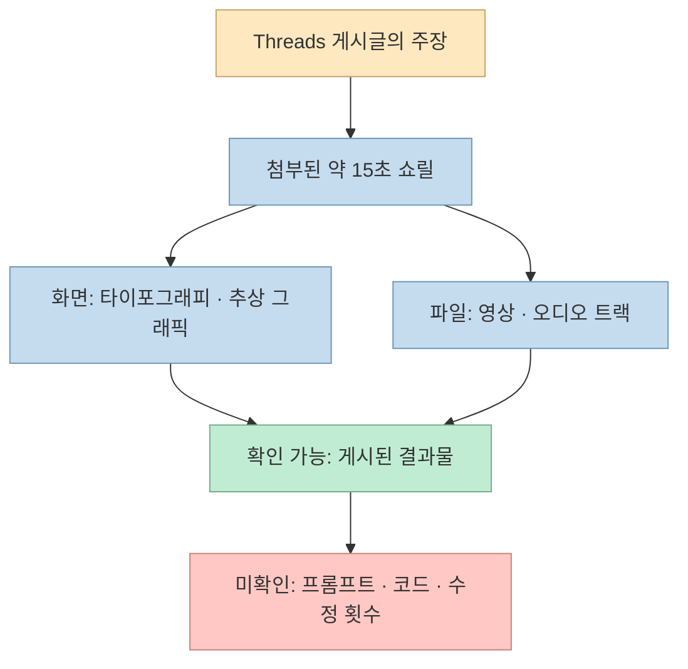
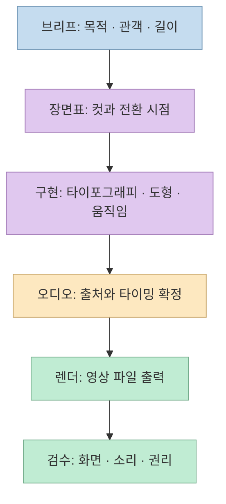
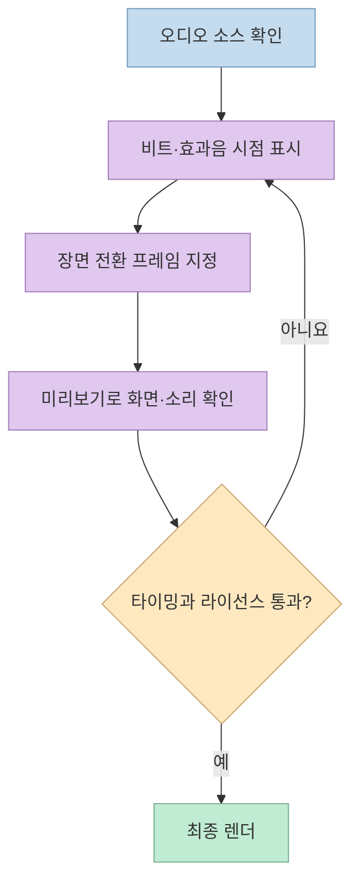

“바이브 코딩에서 바이브 모션그래픽으로.” [Threads 게시글](https://www.threads.com/share/BArKE9hczY/)은 Claude Opus 5.5를 영상과 사운드를 다루는 감독처럼 소개하며 약 15초짜리 모션그래픽 쇼릴을 보여 준다. 실제 첨부 영상에는 강한 타이포그래피, 액체처럼 보이는 추상 형상, 네온 터널, 여러 장면을 한 화면에 모은 구성이 빠르게 이어지고 오디오 트랙도 포함돼 있다.

흥미로운 데모인 것은 맞지만, **완성된 영상만으로 제작 도구·프롬프트·수정 횟수·오디오의 출처까지 증명되지는 않는다**. 이 글은 게시글에서 관찰할 수 있는 것과 재현을 위해 별도로 확인해야 할 것을 분리한다.

<!--more-->

## Sources

- [원문 Threads 공유 링크](https://www.threads.com/share/BArKE9hczY/)
- [원문 게시글의 정규 주소](https://www.threads.com/@qjc.ai/post/DdyRn7aCF-H)
- [Anthropic: Claude Opus 5.5 소개](https://www.anthropic.com/claude-opus-5-5)
- [Anthropic: Opus 모델 안내](https://www.anthropic.com/claude/opus)
- [Remotion: Composition 기본 개념](https://www.remotion.dev/docs/the-fundamentals)
- [Remotion: 타이밍과 트리밍](https://www.remotion.dev/docs/timing)
- [Remotion: 렌더 명령](https://www.remotion.dev/docs/cli/render)

## 이 쇼릴에서 실제로 볼 수 있는 것

원문은 “영상 업계의 지각 변동”, “영상 + 사운드”, “Opus 5.5는 천재 수준의 감독”이라고 주장한다. 첨부된 영상의 길이는 약 **15.1초**이며, 컨테이너에는 **H.264 영상과 AAC 오디오 트랙** 이 들어 있다. 장면은 큰 글자의 등장, 반사·변형되는 추상 형상, 발광 기하학 도형, 장면들을 격자로 나열한 마무리처럼 짧은 쇼릴의 리듬을 따른다. 이는 **게시된 결과물의 관찰** 이지, 어느 도구가 몇 번의 시도로 만들었는지에 관한 증거는 아니다. [원문 게시글과 첨부 영상](https://www.threads.com/@qjc.ai/post/DdyRn7aCF-H)

특히 오디오 트랙이 있다는 사실만으로 **사운드까지 Opus 5.5가 직접 생성했다** 고 말할 수 없다. 어떤 음악·효과음을 썼는지, 직접 제작했는지, 다른 생성 도구나 음원을 사용했는지 원문에는 설명이 없다. 마찬가지로 영상에 “Claude”라는 글자가 보이더라도 원본 프로젝트 파일이나 작업 로그가 공개되지 않았다면 모델 단독 제작 여부를 판정할 수 없다. [원문 게시글](https://www.threads.com/@qjc.ai/post/DdyRn7aCF-H)

## “바이브 모션그래픽”을 실무 언어로 바꾸면

Anthropic의 공식 설명에서 Opus 5.5의 중심 사용 사례는 **코딩·에이전트 작업·지식 작업** 이다. 따라서 이 사례를 기술적으로 해석할 때는 “텍스트 모델이 MP4를 마법처럼 직접 내보냈다”보다, **기획을 코드·장면·타이밍 지시로 구체화하고 별도의 렌더링 경로로 영상을 완성하는 작업** 을 먼저 떠올리는 편이 안전하다. 다만 이 문장은 가능한 제작 방식에 대한 **추론** 이며, Threads 영상의 실제 제작 도구가 무엇인지는 확인되지 않았다. [Anthropic의 Opus 5.5 소개](https://www.anthropic.com/claude-opus-5-5), [Opus 모델 안내](https://www.anthropic.com/claude/opus)

예를 들어 [Remotion](https://www.remotion.dev/docs/the-fundamentals) 같은 코드 기반 영상 도구에서는 장면을 React 컴포넌트로 정의하고 `fps`, 프레임 수, 화면 크기를 가진 `Composition`으로 등록한다. 프레임 번호에 맞춰 글자 위치·불투명도·색·카메라 효과를 변화시키고, 오디오를 타임라인에 배치한 다음 [렌더 명령](https://www.remotion.dev/docs/cli/render)으로 MP4를 만들 수 있다. **이는 재현을 위한 한 가지 예시이지, 원문 영상이 Remotion으로 제작됐다는 주장이 아니다.**

이렇게 보면 프롬프트의 핵심은 “멋있게 만들어 줘”가 아니라 **무엇이 언제 바뀌고, 소리와 어느 지점에서 맞물려야 하는지** 를 지정하는 것이다. 15초 쇼릴이라면 초반의 시선 끌기, 중간의 기술 과시, 마지막의 이름·메시지 고정처럼 장면마다 역할을 줄 수 있다. 전환이 아무리 화려해도 텍스트를 읽을 시간이 없거나 브랜드 메시지가 남지 않으면 상업적 영상으로서는 목표를 놓칠 수 있다. 이는 원문 제작 과정에 대한 사실 진술이 아니라, 쇼릴을 실무 결과물로 평가할 때 적용할 수 있는 **설계 기준** 이다.

## 영상과 사운드를 한 결과물로 검증하는 방법

영상에 소리가 들어 있다는 것과 소리가 **의도적으로 장면과 동기화** 됐다는 것은 다른 문제다. 코드 기반 제작에서는 오디오의 시작·종료, 장면 전환, 타이포그래피가 나타나는 프레임을 같은 타임라인에서 관리할 수 있다. Remotion도 오디오·비디오의 타이밍과 트리밍을 별도로 문서화한다. 실제 작업에서는 비트나 효과음의 타격 시점에 화면 변화를 맞추고, 무음 구간과 마지막 프레임의 오디오 잘림을 확인해야 한다. [Remotion 타이밍 문서](https://www.remotion.dev/docs/timing)

화면 품질도 정지 이미지 몇 장으로만 판단하지 않는다. **모바일 화면에서 글자를 읽을 수 있는지**, 빠른 전환 중 튀는 프레임이 없는지, 장면 사이 색·조명·움직임이 일관적인지, 음악과 효과음이 클리핑 없이 들리는지를 전체 재생으로 점검해야 한다. 작업물이 광고나 납품 영상이라면 사용한 폰트·음원·이미지의 라이선스와 수정 가능한 원본 파일 보존도 별도 확인 항목이다. 이런 항목은 Threads 데모의 결함을 지적하는 것이 아니라 **데모를 제작 프로세스로 확장할 때의 검수 기준** 이다.

## 실전 적용 포인트: 재현 가능하게 요청하고 평가하기

같은 종류의 영상을 시험한다면 프롬프트와 산출물 계약을 짧게라도 남겨 두는 편이 좋다. 예를 들어 “15초, 16:9, 첫 2초에 제목, 중반에 세 가지 시각 기법, 마지막 2초에 브랜드 메시지, 오디오 소스와 사용 권한 명시, 결과 MP4와 수정 가능한 프로젝트 파일 제공”처럼 **길이·구성·검수 기준** 을 고정한다. 이는 원문에 공개된 프롬프트가 아니라 재현 실험을 위한 예시다.

평가할 때는 한 번에 나온 최고 결과만 보여 주지 말고 **생성 시도 횟수, 사람의 수정 시간, 사용한 외부 도구, 렌더 시간, 오디오 출처, 최종 검수에서 발견한 오류** 를 함께 기록하자. 그래야 “모델이 감독처럼 일한다”는 표현을 실제 생산성 변화로 바꿀 수 있다. Anthropic은 Opus 5.5를 코딩과 복잡한 작업에 강한 모델로 소개하지만, 이것만으로 모든 영상 제작 과정을 자동화했다는 결론은 나오지 않는다. [Anthropic 공식 소개](https://www.anthropic.com/claude-opus-5-5)

## 핵심 요약

- 원문은 Opus 5.5와 모션그래픽의 결합을 주장하며, **약 15초의 영상·오디오가 포함된 쇼릴** 을 보여 준다.
- 게시물만으로는 **실제 프롬프트, 제작 코드, 외부 도구, 사운드 출처, 수정 횟수** 를 확인할 수 없다.
- 코드 기반 재현을 시도한다면 **브리프 → 장면표 → 구현 → 오디오 동기화 → 렌더 → 검수** 로 나누는 것이 실용적이다.
- “영상 업계의 지각 변동”은 관찰된 사실이 아니라 **반복 재현성·작업 시간·품질·권리 검증이 필요한 전망** 이다.

## 결론

이 쇼릴이 보여 준 것은 AI를 활용한 모션그래픽의 **인상적인 가능성** 이다. 다만 영상 한 편의 시각적 완성도와 제작 워크플로의 신뢰성은 별개다. 다음 단계는 같은 브리프를 여러 번 재현하고 원본 파일과 작업 시간을 공개해, 무엇을 모델이 맡았고 무엇을 사람이 고쳤는지 확인하는 것이다.
