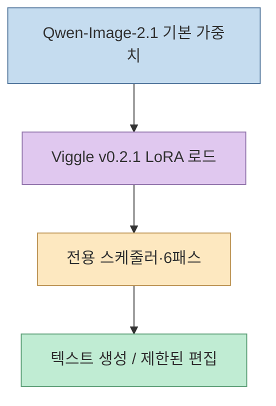
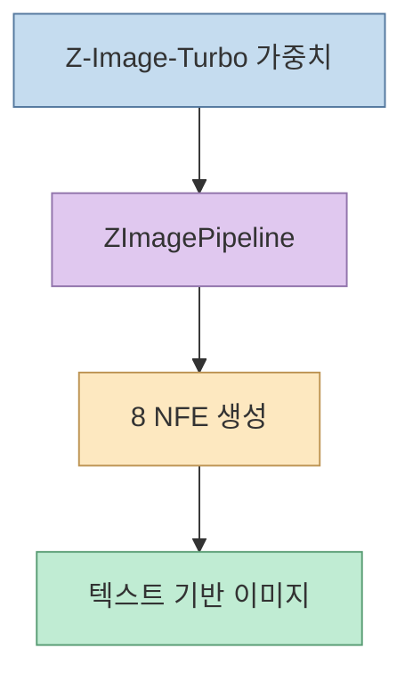
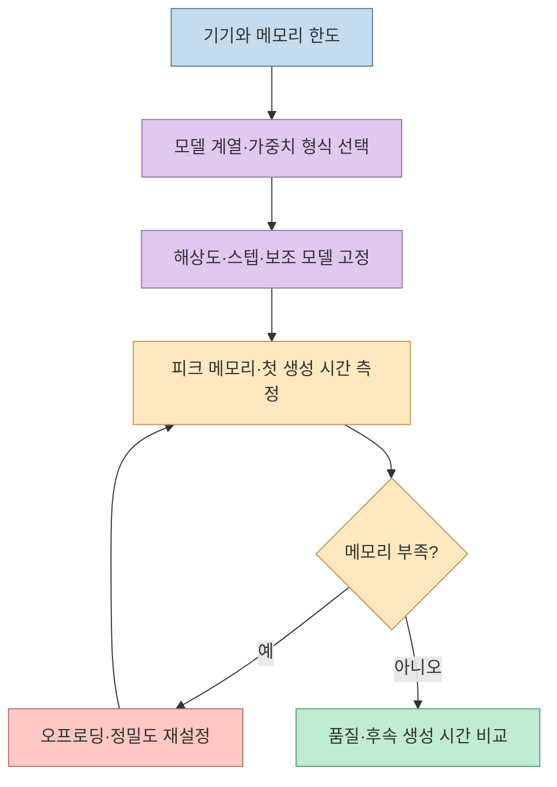

[X 게시글](https://x.com/Lonely__MH/status/2104253476704592315)은 로컬 이미지 생성의 장점으로 인터넷 없이 사용하기, 검토 절차가 없는 생성, 낮은 VRAM 또는 통합 메모리에서의 실행을 들고, **Qwen-Image-2.1 Viggle Turbo**와 **Z-Image-Turbo**를 추천한다. 하지만 두 링크는 같은 모델의 가속판 두 개가 아니다. 하나는 **Qwen-Image-2.1 위에 적용하는 LoRA 어댑터**, 다른 하나는 **독립적인 Z-Image 모델 계열**이다. 공개 모델 카드에 적힌 단계 수와 측정 조건, 기능 제한, 라이선스를 먼저 분리해야 현실적인 선택이 가능하다.

<!--more-->

## Sources

- [원문 X 게시글](https://x.com/Lonely__MH/status/2104253476704592315) · [인용된 로컬 배포 안내 게시글](https://x.com/FiniYang/status/2103847036147916947) — X 직접 페이지가 차단돼 공개 게시글 데이터를 X 신디케이션 경로와 공개 미러로 교차 확인했다. 인용 게시글의 장문 안내 전문이나 배포 코드를 검증한 것은 아니다.
- [Viggle의 Qwen-Image-2.1-viggle-turbo 모델 카드](https://huggingface.co/Viggle/Qwen-Image-2.1-viggle-turbo) · [Qwen-Image-2.1 공식 저장소](https://github.com/QwenLM/Qwen-Image-2.1) · [Qwen Research License](https://github.com/QwenLM/Qwen-Image-2.1/blob/main/LICENSE)
- [Tongyi-MAI의 Z-Image-Turbo 모델 카드](https://huggingface.co/Tongyi-MAI/Z-Image-Turbo) — 모델 계열, 단계 수, 메모리 안내, 라이선스

**자료 범위:** 이 글은 두 모델을 직접 설치·실행한 벤치마크가 아니다. X 게시글의 ‘기본적으로 NSFW 지원’, ‘낮은 메모리에서 원활함’ 같은 표현은 **작성자의 주장**이며 보편적 동작이나 사용 허가로 간주하지 않는다. Viggle의 속도와 품질 수치 역시 **모델 제작자가 공개한 자체 평가**로 표시한다.

## 1. 두 ‘Turbo’는 무엇을 가속하는가

Qwen-Image-2.1의 공식 예시는 이미지 생성과 편집을 **40스텝**으로 수행한다. [Viggle Turbo v0.2.1](https://huggingface.co/Viggle/Qwen-Image-2.1-viggle-turbo)은 이를 대상으로 만든 **few-step 증류 LoRA**다. 모델 카드 기준으로 기본 Qwen 가중치를 먼저 불러온 뒤 LoRA와 제공된 스케줄러를 적용해 **6번의 transformer pass**로 생성한다. 카드에 표시된 LoRA 파일은 약 0.7~1.3GB지만, 그것만 내려받아 독립적으로 실행하는 모델이 아니다. **기본 모델의 가중치와 텍스트 인코더·VAE도 필요하다.** [Viggle 모델 카드](https://huggingface.co/Viggle/Qwen-Image-2.1-viggle-turbo)

반면 [Z-Image-Turbo](https://huggingface.co/Tongyi-MAI/Z-Image-Turbo)는 Tongyi-MAI의 **6B Z-Image 계열**에 속하는 별도 모델이다. 모델 카드는 **8 NFE(Number of Function Evaluations)** 로 생성한다고 설명한다. 예시 코드의 `num_inference_steps=9`가 실제로는 **8번의 DiT 전방 계산**을 만든다고 명시돼 있어, 숫자 9와 홍보 문구의 8이 충돌하는 것은 아니다. 이 모델을 Viggle LoRA처럼 Qwen-Image-2.1에 올리는 방식으로 이해하면 안 된다. [Z-Image-Turbo 모델 카드](https://huggingface.co/Tongyi-MAI/Z-Image-Turbo)

Z-Image-Turbo는 독립적인 흐름이다. 두 모델이 모두 적은 단계 수를 지향하더라도, **가중치·파이프라인·지원 작업·사용 조건**이 다르다.

## 2. ‘약 5배 빠름’과 ‘8스텝’의 정확한 범위

Viggle 제작자는 v0.2.1이 **40스텝 Qwen 기본 모델보다 엔드투엔드로 약 5배 빠르다**고 보고한다. 40을 6으로 나눈 값보다 작은 까닭은 전체 생성 시간에 모델 로딩과 인코딩·디코딩 등 스텝 수 이외의 작업도 있기 때문이다. 다만 이 비율은 **제작자의 측정 결과**다. 카드 자체도 작은 글씨가 빽빽한 이미지와 복잡한 편집에서는 기본 모델이 앞선다고 적고, **2K 출력의 품질 비교는 육안 평가이며 관련 정량 수치는 2K에서 측정하지 않았다**고 밝힌다. 카드의 96개 요청 자체 평가를 독립적인 표준 벤치마크로 확대 해석해서는 안 된다. [Viggle 모델 카드](https://huggingface.co/Viggle/Qwen-Image-2.1-viggle-turbo)

또한 Viggle LoRA는 단순히 `40 → 6`으로 스텝 숫자만 줄여 쓰는 것이 아니다. 제작자가 지정한 **6스텝 sigma 배열과 별도 스케줄러 설정**을 함께 쓰도록 안내한다. 기본 스케줄을 임의로 바꾸거나 여러 LoRA를 겹치면 모델 카드의 결과를 재현할 수 없다. ComfyUI용 커스텀 노드도 제공하지만 제작자는 포트의 덜 흔한 환경은 충분히 시험하지 못했다고 명시한다. [Viggle 사용 규칙·한계](https://huggingface.co/Viggle/Qwen-Image-2.1-viggle-turbo)

Z-Image-Turbo의 **8 NFE**도 ‘모든 기기에서 수 초’라는 뜻은 아니다. 카드가 언급한 초저지연 수치는 **기업용 H800 GPU 조건**이며, 소비자 기기에서는 **16GB VRAM에 맞는다**는 별도의 설명을 한다. 장치·해상도·정밀도·오프로딩 여부에 따라 속도와 피크 메모리는 달라진다. 공식 예시는 메모리 제약을 위해 CPU 오프로딩을 선택할 수도 있다고 안내하지만, 이를 켜면 속도와 메모리 사이에 교환관계가 생긴다. [Z-Image-Turbo 모델 카드](https://huggingface.co/Tongyi-MAI/Z-Image-Turbo)

## 3. ‘저메모리·통합 메모리에서 원활’은 아직 조건문이다

Viggle 카드의 ComfyUI 예시는 **int8 기본 변환 모델, int8 텍스트 인코더, LoRA, 프롬프트 보강기를 모두 유지한 상태에서 1248×832 이미지의 피크 VRAM이 26GB**였다고 적는다. 이는 한 구성의 실제 보고값이지 모든 설정의 최소 요구량은 아니지만, **“LoRA가 작으니 적은 메모리만 있으면 된다”는 추론은 틀리다.** 원문이 말하는 Mac 통합 메모리나 저사양 환경에 같은 처리량이 나온다는 근거도 이 카드에는 없다. [Viggle ComfyUI 문서](https://huggingface.co/Viggle/Qwen-Image-2.1-viggle-turbo)

Qwen 기본 모델 카드는 메모리 최적화 수단으로 **CPU 오프로딩**을 보여준다. 메모리가 부족할 때 실행 가능성을 높이는 방법이지만, CPU↔GPU 이동 때문에 생성 시간은 달라질 수 있다. 따라서 Mac과 NVIDIA GPU를 하나의 성능 문장으로 묶지 말고 **모델 변형·정밀도·해상도·실제 피크 메모리·첫 생성 시간**을 각각 측정해야 한다. [Qwen 공식 모델 카드](https://huggingface.co/Qwen/Qwen-Image-2.1)

## 4. 오프라인·콘텐츠 정책·라이선스는 속도와 별개다

**로컬 추론은 오프라인 운용을 가능하게 할 수 있지만, 처음부터 인터넷이 불필요하다는 뜻은 아니다.** 가중치·코드·의존성을 먼저 받아야 하고, 선택한 런타임이나 프롬프트 보강기가 외부 서비스를 쓰는지도 확인해야 한다. “네트워크를 끈 상태에서 입력부터 저장까지 완료된다”는 것은 설치 후 **직접 테스트할 운영 조건**이지 모델 이름으로 보증되는 기능이 아니다.

원문의 ‘무검열·기본 NSFW 지원’ 역시 **검증된 공식 기능이나 무제한 사용 허가로 읽어서는 안 된다.** 로컬 실행과 호스팅 서비스의 요청 검토 경로는 다르지만, 모델의 동작·출력 품질·배포 환경의 정책은 별개다. 특히 Qwen-Image-2.1과 Viggle 파생 모델에는 **Qwen Research License**가 적용된다. 공식 라이선스는 연구·평가 목적의 **비상업적 사용만** 허용하고, 상업적 이용에는 별도 라이선스를 요구한다. 반면 Z-Image-Turbo 모델 카드의 라이선스 표기는 **Apache-2.0**이다. 제작·배포 목적이라면 속도만큼 이 차이도 먼저 검토해야 한다. [Qwen 라이선스](https://github.com/QwenLM/Qwen-Image-2.1/blob/main/LICENSE), [Viggle 라이선스 설명](https://huggingface.co/Viggle/Qwen-Image-2.1-viggle-turbo), [Z-Image-Turbo 카드](https://huggingface.co/Tongyi-MAI/Z-Image-Turbo)

## 실전 적용 포인트

1. **작업을 먼저 정한다.** Qwen 기반 편집·투명 이미지·다중 참조가 필요하면 기본 모델과 Viggle의 지원 범위를 확인한다. 텍스트 기반의 빠른 이미지 생성이 우선이면 Z-Image-Turbo를 별도로 시험한다.
2. **버전과 실행 구성을 고정한다.** Viggle은 v0.2.1 LoRA뿐 아니라 권장 스케줄러·sigma 설정까지 기록한다. 6패스 수치만 떼어 비교하지 않는다.
3. **같은 조건으로 잰다.** 프롬프트·시드·해상도·출력 장수·메모리 최적화·첫 요청과 후속 요청을 고정해 시간, 피크 메모리, 글씨·인물·복잡한 편집 품질을 본다.
4. **오프라인 여부를 실제로 시험한다.** 설치 후 네트워크를 끊고 프롬프트 보강·저장·후처리까지 동작하는지 확인한다.
5. **라이선스와 운영 책임을 별도로 확인한다.** Qwen/Viggle과 Z-Image-Turbo의 이용 조건을 구분하고, 로컬이라는 이유로 모든 콘텐츠와 사용 방식이 자동 허용된다고 판단하지 않는다.

## 핵심 요약

- **Viggle Turbo**는 Qwen-Image-2.1의 **LoRA 증류 어댑터**다. 제작자 설명은 40스텝 기본 모델 대비 **약 5배 엔드투엔드 속도**, 권장 **6패스**다.
- **Z-Image-Turbo**는 별도 6B 모델로 **8 NFE**를 사용한다. 예제의 `num_inference_steps=9`는 실제 DiT 계산 8회에 해당한다.
- Viggle의 작은 LoRA 파일 크기는 전체 모델 메모리 요구량이 아니다. 2K 화질, Mac 통합 메모리, 저사양 속도는 **각 환경에서 별도 검증**해야 한다.
- Qwen/Viggle의 **비상업적 연구 라이선스**와 Z-Image-Turbo의 **Apache-2.0**은 중요한 선택 기준이다.

## 결론

원문이 소개한 두 경량 생성 경로는 모두 흥미롭지만, **가속 방식부터 다른 모델**이다. Viggle의 장점은 기존 Qwen 파이프라인을 더 적은 패스로 쓰는 데 있고, Z-Image-Turbo는 독립적인 8 NFE 생성 모델이다. 마케팅 숫자보다 실제 작업의 **품질·피크 메모리·엔드투엔드 시간·라이선스**를 함께 비교해야 로컬 이미지 생성이 진짜로 편해진다.
