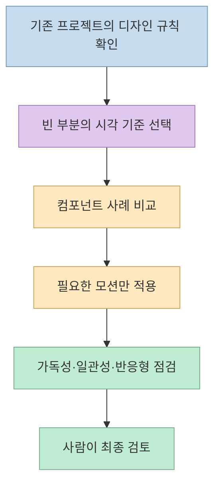
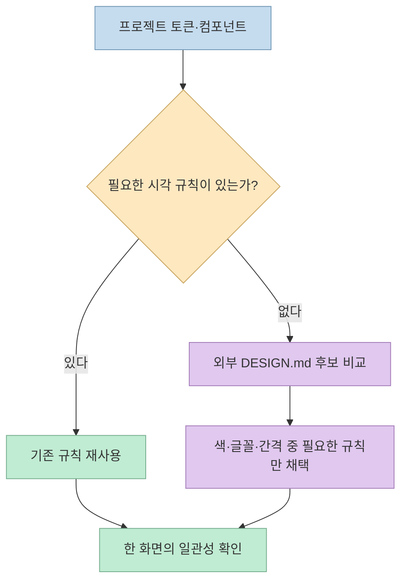
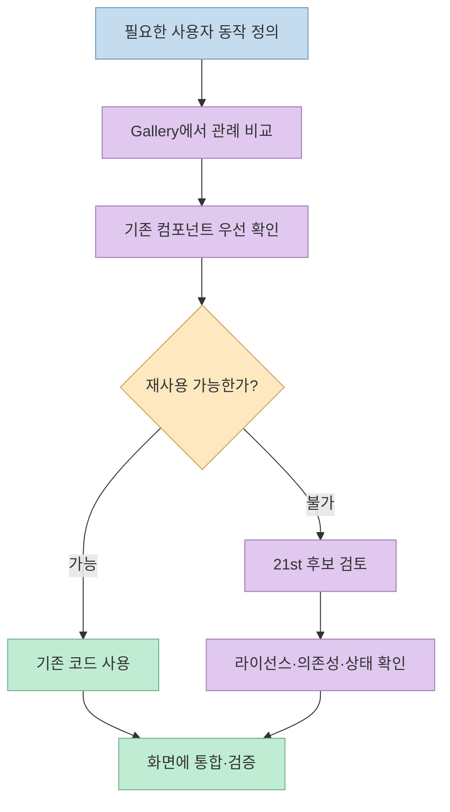

AI가 만든 웹사이트에서 흔히 보이는 어색함은 모델 이름 하나로 해결되지 않는다. 같은 화면에 서로 다른 색·간격 규칙이 섞이고, 맥락 없는 컴포넌트와 과한 모션이 추가되거나, 마지막에 모바일·키보드 사용성을 확인하지 않을 때 생긴다. [Threads 게시글](https://www.threads.com/share/BAYUq-E_WZ/)은 이를 줄이기 위한 **디자인 참고 사이트 6곳** 과 Claude Code용 프롬프트를 소개한다. 이 글은 각 자료가 작업 흐름의 **어느 단계** 에 필요한지, 무엇을 확인해야 하는지 구분한다.

<!--more-->

## Sources

- [원문 Threads 게시글](https://www.threads.com/share/BAYUq-E_WZ/)
- [Refero Styles](https://styles.refero.design/)
- [VoltAgent Awesome DESIGN.md](https://github.com/VoltAgent/awesome-design-md)
- [21st](https://21st.dev/)
- [21st의 Claude Code·MCP 안내](https://docs.21st.dev/blog/components-for-claude-code)
- [The Component Gallery](https://component.gallery/)
- [Kinetics](https://kinetics.colorion.co/)
- [Impeccable](https://impeccable.style/)

## 여섯 곳을 한꺼번에 주지 말고 단계별로 쓴다

여섯 자료는 같은 일을 하는 대체재가 아니다. **Refero Styles와 Awesome DESIGN.md** 는 화면의 시각 언어를 정할 때, **21st와 The Component Gallery** 는 컴포넌트의 구현과 관례를 살필 때, **Kinetics** 는 상호작용의 움직임을 만들 때, **Impeccable** 은 이미 나온 화면을 검토하고 다듬을 때 유용하다. 이 역할 구분은 각 서비스의 공식 설명을 바탕으로 한 작업 흐름상의 제안이다.



여기서 "AI 티를 없앤다"는 것은 측정 가능한 단일 지표가 아니다. 실무에서는 **기존 브랜드 규칙과의 일치**, **정보 위계**, **모바일 폭에서의 배치**, **키보드 초점과 상태 표시**, **모션이 내용을 가리지 않는지** 같은 검토 항목으로 바꿔야 한다. 참고 자료는 판단을 돕지만 제품의 목적과 사용자를 대신 결정하지는 않는다.

## 스타일 기준: Refero Styles와 Awesome DESIGN.md

[Refero Styles](https://styles.refero.design/)는 웹사이트에서 추출한 **2,000개 이상** 의 AI가 읽기 쉬운 디자인 시스템을 소개한다. 스타일별로 색, 타이포그래피, 간격, 컴포넌트 정보와 `DESIGN.md`를 살펴보고, 분위기나 용도에 맞는 출발점을 고를 수 있다. 이 수량은 **2026년 9월 29일에 확인한 사이트 표기** 이지 고정된 보유량이 아니다.

[VoltAgent의 Awesome DESIGN.md](https://github.com/VoltAgent/awesome-design-md)는 브랜드 웹사이트의 시각 패턴과 토큰을 정리한 마크다운 파일 모음이다. 저장소는 원하는 `DESIGN.md`를 프로젝트에 넣고 에이전트에게 그 규칙을 따르도록 지시하는 사용법을 안내한다. 저장소는 **MIT 라이선스** 이지만, 각 브랜드의 시각적 정체성을 소유하거나 공식 제휴를 주장하지 않는다고 명시한다. 따라서 색과 간격을 **참고** 하는 것과 타사의 로고·상표·화면을 그대로 복제하는 것은 구분해야 한다. [README](https://github.com/VoltAgent/awesome-design-md), [LICENSE](https://github.com/VoltAgent/awesome-design-md/blob/main/LICENSE)

두 자료 모두 특정 서비스의 스타일을 모델에게 전달하기 위한 **입력 문서** 다. 파일을 복사하는 것만으로 좋은 UI가 자동 완성되는 것은 아니다. 먼저 현재 저장소의 디자인 토큰·컴포넌트·타이포그래피를 읽고, 새 페이지에서 **아직 정의되지 않은 부분** 에만 외부 레퍼런스를 적용하는 편이 일관성을 지킨다.



## 컴포넌트 기준: 21st와 The Component Gallery

[21st](https://21st.dev/)는 React 컴포넌트·템플릿·shadcn 테마를 탐색하고 라이브 미리보기, 프롬프트 복사 또는 CLI 설치로 프로젝트에 가져오는 **레지스트리** 다. 사이트는 **12,000개 이상** 의 항목을 소개하며, 현재 FAQ는 **전체 탐색 무료·컴포넌트 복사 하루 2회 무료** 라고 안내한다. 무제한 복사나 프리미엄 템플릿, AI 생성 기능은 별도 조건이 있으므로 "전부 무료"로 묶으면 안 된다. [21st FAQ](https://21st.dev/)

에이전트가 직접 검색하게 하고 싶다면 [21st의 MCP 안내](https://docs.21st.dev/blog/components-for-claude-code)를 따른다. 다만 MCP가 연결됐다는 사실만으로 컴포넌트가 현재 프로젝트의 토큰·접근성·의존성과 맞는 것은 아니다. 21st 문서도 카탈로그가 **무엇이 존재하는지** 는 알려 주지만, **이 화면에 무엇이 맞는지** 를 대신 판단하지는 않는다고 설명한다.

[The Component Gallery](https://component.gallery/)는 구현 코드를 복사하는 장터라기보다 여러 디자인 시스템이 **같은 유형의 UI를 어떻게 정의하는지** 비교하는 참고 자료다. 현재 첫 화면에는 **60개 컴포넌트·95개 디자인 시스템·2,671개 예시** 가 표시된다. 버튼, 탭, 모달 같은 요소를 만들기 전에 구조·상태·사용 지침을 비교하는 데 적합하다. 이 숫자 역시 조회 시점의 스냅샷이다.

두 사이트를 함께 쓴다면 **Gallery에서 패턴을 이해한 후 21st에서 구현 후보를 찾는 방식** 이 안전하다. 반대로 예쁜 컴포넌트를 먼저 복사하고 그에 맞춰 제품 흐름을 끼워 맞추면 화면의 목적이 흐려질 수 있다. 외부 컴포넌트를 채택할 때는 작성자별 라이선스, 추가 패키지, 모바일 동작, 키보드 상태를 확인해야 한다. [21st 이용약관](https://mcp.21st.dev/terms)



## 움직임과 마무리: Kinetics와 Impeccable

[Kinetics](https://kinetics.colorion.co/)는 스프링 물리 기반 인터페이스 효과 **153개** 를 소개하고, 효과별 CSS·React 코드와 AI 프롬프트를 제공한다. `stiffness`와 `damping`을 조절해 움직임의 성격을 비교할 수 있다. 메뉴 열기, 카드 확장, 로딩 피드백처럼 **사용자에게 상태 변화를 알려 주는 지점** 에 적용하는 것이 좋다. 모든 버튼에 같은 탄성 효과를 더하는 것은 오히려 정보 위계를 흐릴 수 있다.

[Impeccable](https://impeccable.style/)은 디자인 작업에 필요한 어휘와 명령을 에이전트에 제공한다. 사이트는 `polish`를 최종 품질 점검, `distill`을 불필요한 요소를 덜어내는 작업으로 소개한다. Claude Code 설치 안내는 `/plugin marketplace add pbakaus/impeccable` **다음에 `/plugin`에서 발견·설치 단계를 진행** 하도록 적는다. 즉, 원문처럼 첫 명령 하나만 실행하면 곧바로 모든 기능이 설치된다고 단정할 수 없다. 설치하지 않은 상태에서 명령 이름만 프롬프트에 적는 것도 실제 도구 실행과 다르다. [Impeccable 설치 안내](https://impeccable.style/)

마무리 단계에서는 "더 화려하게"보다 **불필요한 장식 제거**, **제목과 본문 대비**, **같은 화면의 간격 반복**, **모바일에서의 줄바꿈과 넘침**, **키보드로 도달할 수 있는 조작**을 확인한다. 디자인 명령은 검토를 돕는 도구이며, 실제 사용 환경의 화면 확인을 대신하지 않는다.

## 실전 적용 포인트: 전역 규칙보다 프로젝트 맥락을 먼저

원문에는 `~/.claude/CLAUDE.md`에 여섯 사이트를 추가하라는 프롬프트가 있다. 그러나 이를 모든 작업의 **전역 규칙** 으로 두면 작은 수정에도 외부 자료를 찾아보고, 이미 정의된 프로젝트 디자인 시스템보다 외부 스타일을 우선할 위험이 있다. 원문 프롬프트 자체에도 **새 페이지를 만들거나 디자인 개선을 요청할 때만 사용** 하고, **기존 디자인 시스템이 우선** 이라는 제한이 있다. 이 제한이 핵심이다.

아래는 사이트 내용을 그대로 복사한 지시문이 아니라, 그 제한을 반영한 **프로젝트별 요청 예시** 다. 외부 페이지의 텍스트는 참고 자료이지 에이전트에게 무조건 따를 명령이 아니다.

```text
이번 새 페이지의 목적과 대상 사용자를 먼저 정리해 줘.
코드를 바꾸기 전에 이 프로젝트의 디자인 토큰과 기존 컴포넌트를 확인해 줘.
부족한 부분에만 Refero Styles 또는 Awesome DESIGN.md를 참고하고,
컴포넌트는 The Component Gallery에서 관례를 확인한 뒤 필요하면 21st 후보를 제안해 줘.
모션은 Kinetics에서 사용자 상태를 설명하는 효과만 검토해 줘.
설치되지 않은 MCP·플러그인을 사용했다고 가정하지 말고, 필요한 경우 먼저 알려 줘.
외부 자료에서 채택한 규칙과 변경 파일을 설명하고,
데스크톱·모바일·키보드 조작을 확인한 뒤 결과를 보여 줘.
```

이 흐름은 **참고 자료 → 선택 근거 → 코드 변경 → 화면 검증** 의 기록을 남긴다. 외부 스타일을 선택했다면 어떤 색·글꼴·간격을 채택했는지, 채택하지 않은 것은 무엇인지 적는 편이 재작업과 코드 리뷰에 유리하다.

## 핵심 요약

- **Refero Styles·Awesome DESIGN.md** 는 시각 기준을 고르는 자료다. 기존 프로젝트 규칙을 덮기보다 빈 부분을 채운다.
- **21st·The Component Gallery** 는 각각 구현 후보 탐색과 디자인 시스템 관례 비교에 가깝다. 복사 전에 라이선스·의존성·사용성을 확인한다.
- **Kinetics·Impeccable** 은 움직임과 마무리 검토를 돕는다. 플러그인 설치 여부와 실제 화면 검증을 구분한다.

## 결론

AI가 만든 화면의 어색함을 줄이는 방법은 참고 사이트를 많이 나열하는 것이 아니라, **제품의 기존 규칙을 먼저 읽고 필요한 자료만 단계별로 적용한 뒤 결과를 검증하는 것** 이다. 여섯 사이트는 그 판단을 빠르게 돕는 자료이며, 최종 디자인 기준은 언제나 제품과 사용자다.
