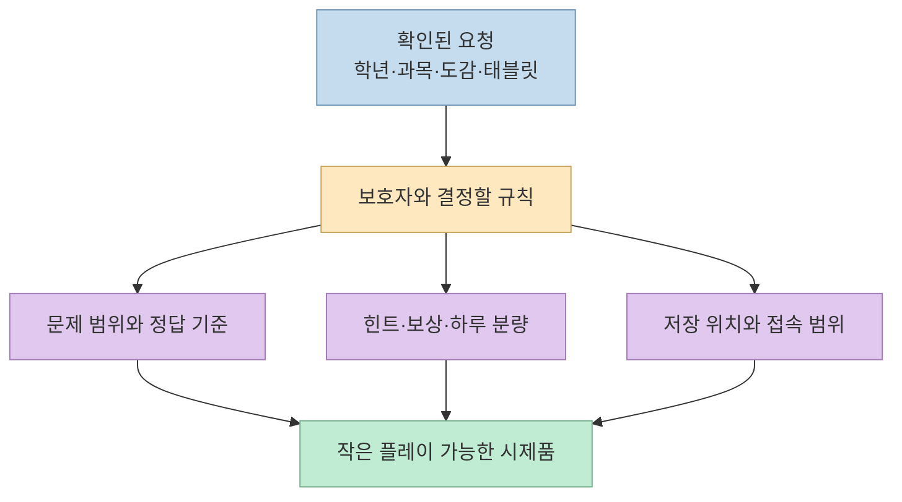
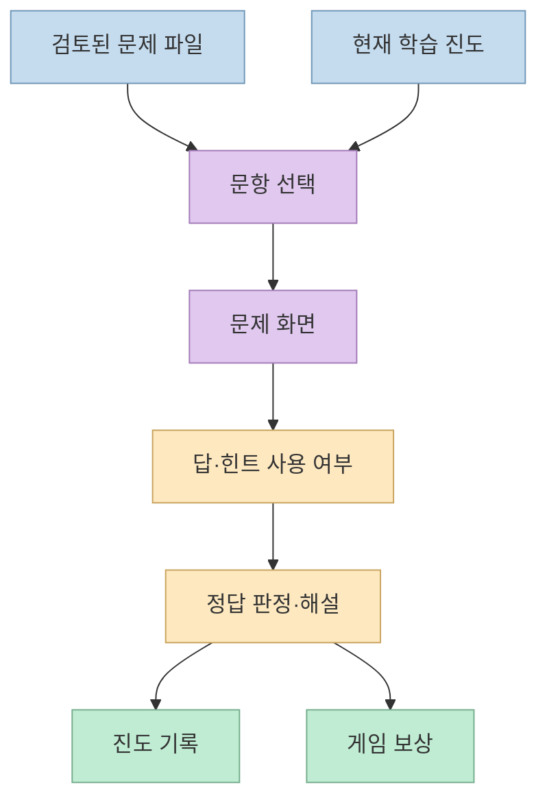
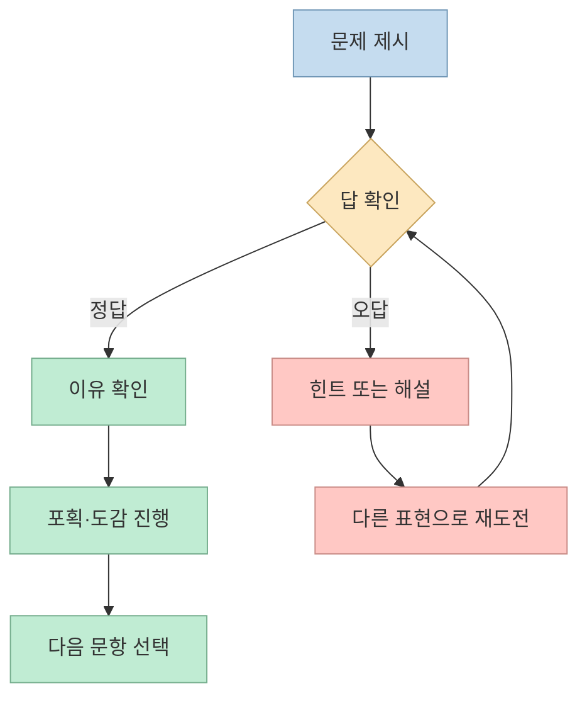
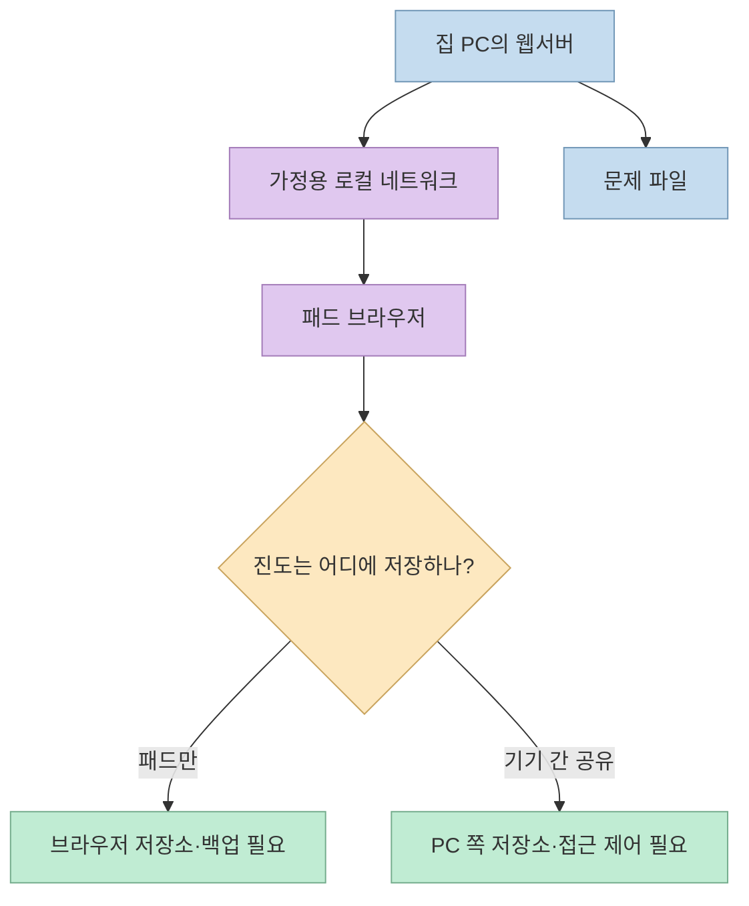

아이의 "나도 만들어 줘"라는 말에서 시작한 작은 학습 게임은 AI 코딩 도구의 흥미로운 활용 사례다. [Threads 작성자](https://www.threads.com/share/BAfIdEWDlC/)는 Opus 5.5로 만든 포켓몬 테마 게임의 플레이 영상과 요청 문장을 공개했다. 아이가 **문제를 풀고 캐릭터를 모아 도감을 완성하는 흐름** 이 핵심이다. 다만 영상과 프롬프트만으로는 실제 코드 구조, 문제의 교육적 적합성, 데이터 보존 방식까지 확인할 수 없다. 이 글은 **원문에서 확인되는 요구사항** 과 **직접 만들 때 권장하는 설계** 를 분리해 정리한다.

<!--more-->

## Sources

- [원문 Threads 게시글](https://www.threads.com/share/BAfIdEWDlC/)
- [작성자의 프롬프트 댓글](https://www.threads.com/@rolandlitna/post/Dd1XSHzk0uN)
- [PokéAPI 공식 문서](https://pokeapi.co/docs/v2)
- [PokéAPI 이미지 저장소의 권리 고지](https://github.com/PokeAPI/sprites/blob/master/LICENCE.txt)
- [Pokémon 공식 이미지 사용 안내](https://support.pokemon.com/hc/en-us/articles/360000634094-Can-I-use-Pok%C3%A9mon-images-or-materials)
- [MDN의 로컬·루프백 네트워크 설명](https://developer.mozilla.org/en-US/docs/Web/Security/Defenses/Local_network_access)

## 원문 프롬프트가 이미 결정한 것과 아직 결정하지 않은 것

작성자가 공개한 프롬프트는 **대한민국 초등학교 3학년 2학기**, **수학·영어**, **문제를 풀어 캐릭터를 잡고 도감을 완성하는 게임**, **파트너와 플레이어의 이름·외형 설정**, **매일 진도에 맞춘 난이도 상승**을 요구한다. 문제는 별도 데이터로 관리하되 DB는 필수가 아닐 수 있다고 했고, 집 PC에서 웹서버를 실행해 패드 브라우저로 접속하겠다고 적었다. 작성자는 AI가 포켓몬의 세대 범위 등을 되물었다고도 설명한다. [프롬프트 댓글](https://www.threads.com/@rolandlitna/post/Dd1XSHzk0uN)

이는 완성된 사양서가 아니라 **좋은 출발 질문** 이다. 수학·영어에서 어떤 단원을 다룰지, 정답을 몇 번 맞혀야 포획되는지, 틀렸을 때 힌트를 줄지, 하루 학습량을 누가 바꿀지, 진도를 어느 기기에 저장할지는 원문에 명시되지 않았다. 이 빈칸을 AI가 임의로 채우면 게임은 작동해도 **아이에게 맞는 학습 활동** 이 아닐 수 있다. 아래의 구조와 예시는 원문 앱을 분석한 결과가 아니라, 이 요구사항을 구현할 때의 **제안** 이다.



## 문제 은행을 게임 코드와 분리한다

원문의 "문제를 별도 data로 관리"한다는 요구는 중요하다. 문제를 버튼 이벤트와 화면 코드에 직접 넣으면 단원·정답·해설을 바꿀 때마다 게임 로직까지 수정해야 한다. 작은 가정용 시제품에서는 **문제 파일(JSON 등)** 과 **게임 상태**를 분리하는 편이 관리하기 쉽다. DB가 필수는 아니지만, 문제 파일이 정답인지 검증하는 과정은 필요하다.

다음은 **이 글에서 제안하는 예시 형식** 이며, 원문 앱의 실제 데이터가 아니다. `unit`은 보호자가 선택한 교재의 단원에 맞춰 확인하고, AI가 만든 문제의 정답·표현·해설은 공개 전에 사람이 검토한다.

```json
{
  "id": "math-example-001",
  "subject": "math",
  "unit": "보호자가 확인한 단원",
  "prompt": "12 + 8은 얼마인가요?",
  "choices": ["18", "20", "22"],
  "answer": "20",
  "explanation": "12에 8을 더하면 20입니다.",
  "difficulty": "starter"
}
```

게임 화면은 문제를 보여 주고 답을 받는 역할을 맡고, 문제 은행은 문항·정답·해설을 제공한다. 진도 기록은 **문제를 보았는지**, **어떤 선택지를 골랐는지**, **힌트를 본 뒤 맞혔는지**를 구분하면 보호자가 어려운 부분을 발견하기 쉽다. 이 기록은 아이의 평가표가 아니라 다음 문제를 고르는 피드백으로만 쓰는 편이 적절하다.



## 포획·배틀은 학습을 가리는 장치가 아니라 피드백이어야 한다

원문 프롬프트는 문제를 풀어 캐릭터를 잡고 도감을 채우는 흐름을 요구한다. 원문에 인용된 다른 사용자의 영상에는 **문제를 풀어야 공격하는 배틀** 사례도 소개된다. 이것만으로 작성자의 게임에도 같은 배틀 시스템이 구현됐다고 볼 수는 없다. [원문 Threads](https://www.threads.com/share/BAfIdEWDlC/)

게임 규칙을 설계할 때는 **정답 → 작은 게임상 행동 → 이유 설명 → 다음 문제** 순서를 분명히 하는 편이 좋다. 틀렸을 때 무조건 보상을 막거나 같은 문제만 되풀이시키면 아이가 정답을 이해하기보다 시행착오로 버튼을 누를 수 있다. 오답에는 짧은 힌트나 다른 표현의 유사 문항을 주고, 해설을 읽을 수 있게 한다. 이것은 학습 효과가 입증된 특정 게임 규칙이라는 주장이 아니라, **정답만 외우는 플레이를 피하기 위한 설계 제안**이다.



"매일 난이도를 높인다"는 요구도 날짜가 바뀌었다는 이유만으로 어려운 문제를 자동 개방한다는 뜻으로 구현할 필요는 없다. **단원별 이해 여부와 보호자가 조정한 진도** 를 기준으로 다음 문제를 선택하는 방식을 먼저 검토해야 한다. 같은 날에도 어려운 문제를 풀었다면 더 쉬운 예제로 돌아갈 수 있어야 한다. 실제 교재와 아이의 학습 수준은 보호자가 확인해야 하며, 모델이 자동 생성한 문항을 교과 과정에 맞는다고 가정해서는 안 된다.

## PC에서 실행하고 패드에서 접속할 때의 데이터 경계

집 PC의 웹서버에 패드 브라우저로 접속한다는 요청은 **같은 컴퓨터에서만 접속하는 `localhost` 화면** 과 다르다. [MDN](https://developer.mozilla.org/en-US/docs/Web/Security/Defenses/Local_network_access)은 `127.0.0.1` 같은 루프백 주소를 **해당 기기에서만 접근 가능한 주소** 로, 가정용 사설 IP를 **로컬 네트워크 주소** 로 구분한다. 따라서 패드가 PC의 서버에 접속하려면 PC의 로컬 네트워크 주소, 서버가 듣는 인터페이스, 방화벽을 확인해야 한다. "외부 공개하지 않는다"는 의도만 적어 두는 것으로 접속 범위가 자동 제한되지는 않는다.



문제 파일은 PC에서 내려주더라도, **진도를 패드의 브라우저 저장소에만 기록하면 그 진도는 PC나 다른 패드로 자동 동기화되지 않는다**. 한 기기만 쓸 시제품이라면 단순하지만 브라우저 데이터 삭제에 대비해 내보내기·백업이 필요하다. 여러 기기에서 계속 플레이하려면 PC 쪽에 진도를 저장하는 작은 API와 접근 제어가 필요해진다. 이름·외형·성적처럼 아이와 연결되는 정보는 **필요한 만큼만 저장**하고, 외부 분석 서비스나 모델 API에 보내는지 별도로 점검한다.

## 캐릭터 데이터와 이미지는 권리가 다르다

원문은 포켓몬 위키 이미지를 가져오고, 추가 이미지는 생성 도구로 만들자고 요청한다. 하지만 **비공개·가정용** 이라는 전제가 모든 이미지의 사용 권한을 자동으로 보장하지는 않는다. [PokéAPI](https://pokeapi.co/docs/v2)는 포켓몬 정보에 접근할 수 있는 공개 API이며, 요청한 리소스를 **로컬에 캐시** 해 달라고 안내한다. 이는 데이터 접근 방식에 관한 설명이지 캐릭터 그림의 별도 사용 허락이 아니다.

[PokéAPI의 sprite 저장소](https://github.com/PokeAPI/sprites/blob/master/LICENCE.txt)는 이미지 내용의 저작권이 **The Pokémon Company** 에 있다고 명시한다. [Pokémon 공식 안내](https://support.pokemon.com/hc/en-us/articles/360000634094-Can-I-use-Pok%C3%A9mon-images-or-materials)도 캐릭터·이름·디자인 등의 지식재산 사용 요청을 일반적으로 검토해 줄 수 없다고 적는다. 따라서 위키나 API에서 이미지 URL을 얻을 수 있다는 사실을 **앱 배포·재사용 허가** 로 해석하지 말아야 한다. 외부 공유를 고려한다면 사용 권리가 분명한 자체 캐릭터와 자체 그림으로 바꾸는 편이 안전하다. 생성형 도구를 쓰더라도 기존 캐릭터를 그대로 재현하도록 요구하지 않는 것이 좋다.

## 실전 적용 포인트: 한 번에 완성시키지 말고 세 번 나눈다

첫 번째 요청에서는 **아이의 학년·과목·사용 기기·게임 목표** 를 말하고, AI에게 빠진 결정을 질문하게 한다. 두 번째 요청에서는 **문제 은행 형식과 정답 검증** 을 만든다. 세 번째 요청에서는 **게임 화면과 진도 저장** 을 연결하고 PC·패드에서 실제 플레이를 확인한다. 이렇게 나누면 프롬프트 한 번으로 거대한 게임을 만들 때보다 무엇이 구현됐고 무엇이 미완성인지 확인하기 쉽다. 원문의 "궁금한 것은 질문해 달라"는 지시가 중요한 이유도 여기에 있다. [프롬프트 댓글](https://www.threads.com/@rolandlitna/post/Dd1XSHzk0uN)

시작 전에는 적어도 다음을 정한다.

1. 한 번에 플레이할 시간과 하루 문제량을 **보호자가 조정할 수 있는가**?
2. 문제·정답·해설을 **누가 검토하고 어떻게 수정하는가**?
3. 오답과 힌트 사용 후에 **보상과 진도가 어떻게 달라지는가**?
4. 패드의 진도를 **어디에 저장하고 어떻게 백업하는가**?
5. 캐릭터 데이터와 이미지를 **어디서 가져오며 공유할 권리가 있는가**?

## 핵심 요약

- 원문에서 확인되는 것은 **가정용 포켓몬 테마 학습 게임의 목표와 프롬프트** 다. 내부 구현·교육 효과는 확인되지 않았다.
- 문제 은행, 게임 규칙, 진도 기록, 네트워크 접속을 **서로 다른 설계 문제** 로 나누어야 한다.
- 비공개 사용과 공개 API 접근이 캐릭터 이미지의 권리를 자동으로 해결하지는 않는다.

## 결론

AI가 짧은 요청으로 플레이 가능한 시제품을 빠르게 만들 수 있어도, **좋은 학습 게임** 은 문제의 정확성, 아이의 반응, 진도 조절, 데이터 보관, 이미지 사용 범위를 사람이 확인할 때 완성된다. 처음에는 한 단원과 작은 도감으로 시작하고, 아이와 보호자가 실제로 플레이하며 고치는 편이 낫다.
