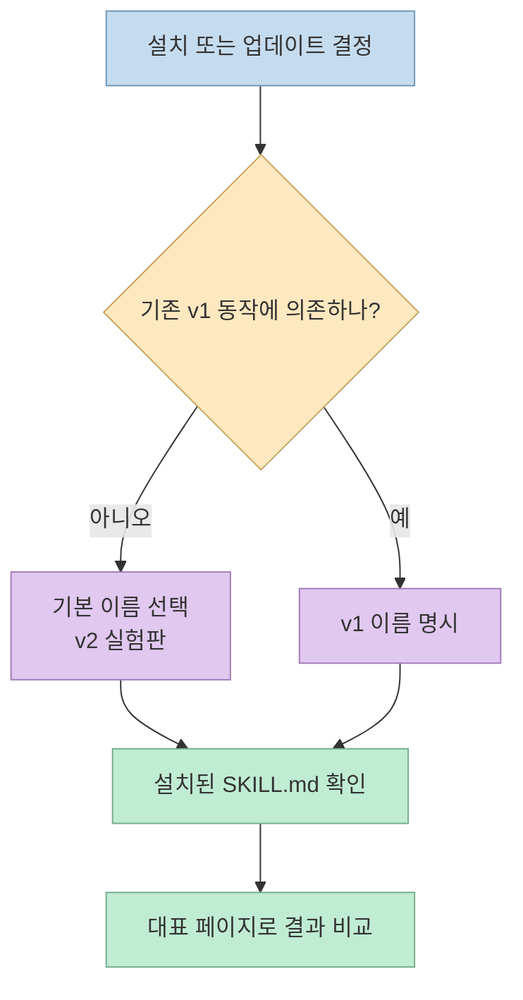
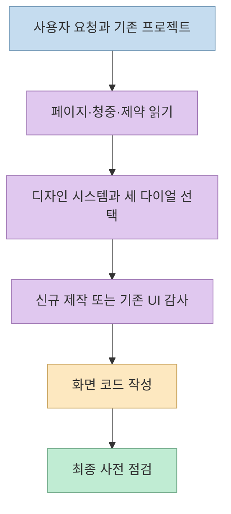
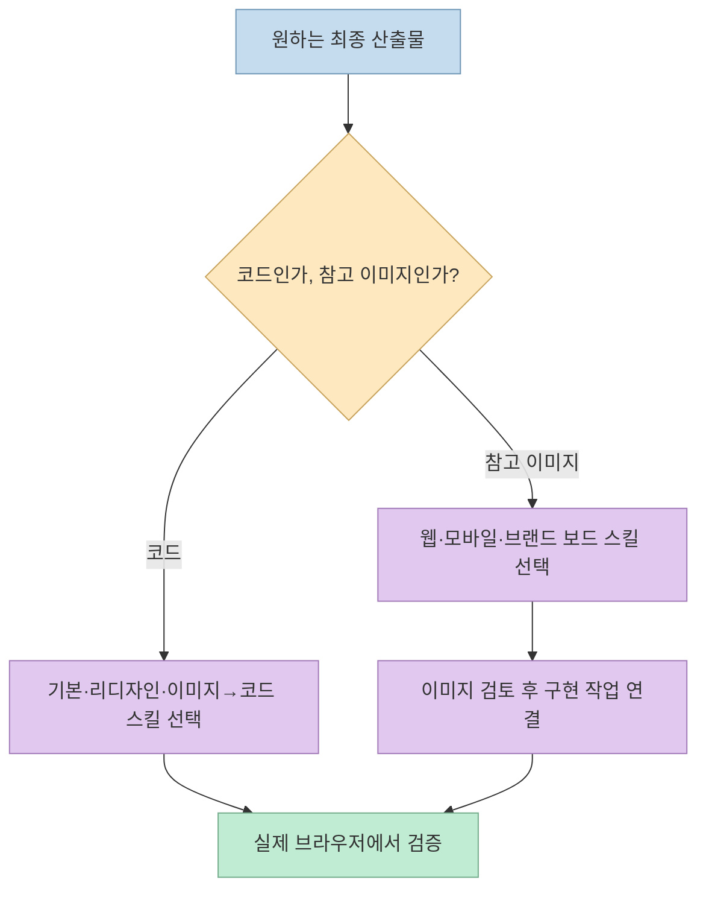

AI가 만든 웹사이트의 뻔한 구성을 줄이기 위한 [Taste Skill](https://github.com/Leonxlnx/taste-skill)은 이미 이 블로그에서 [기본 원리](/post/2026/07/2026-07-09-taste-skill-anti-slop-frontend/)와 [v2의 디자인 다이얼](/post/2026/09/2026-09-22-taste-skill-anti-slop-frontend-design-for-claude-code/)을 소개한 바 있다. 이번에는 **저장소를 지금 설치하면 무엇이 들어오고, 어떤 화면에는 쓰지 말아야 하는지** 에 집중한다. 2026년 9월 29일 기준 공식 README는 기본 설치 대상이 **v2 실험판** 이며, 기존 v1은 별도 설치 이름으로 보존된다고 명시한다. [README](https://github.com/Leonxlnx/taste-skill), [CHANGELOG](https://github.com/Leonxlnx/taste-skill/blob/main/CHANGELOG.md)

<!--more-->

## Sources

- [Taste Skill GitHub 저장소](https://github.com/leonxlnx/taste-skill)
- [설치 및 스킬 목록이 포함된 README](https://github.com/Leonxlnx/taste-skill/blob/main/README.md)
- [v2 변경 기록](https://github.com/Leonxlnx/taste-skill/blob/main/CHANGELOG.md)
- [기본 스킬 원문](https://github.com/Leonxlnx/taste-skill/blob/main/skills/taste-skill/SKILL.md)
- [MIT 라이선스](https://github.com/Leonxlnx/taste-skill/blob/main/LICENSE)

## 기본 설치 이름은 같지만 내용은 v2 실험판이다

저장소의 설치 예시는 `npx skills add`가 `skills/` 폴더를 읽는다고 설명한다. 전체 묶음을 설치할 수도 있고, `--skill`에 **폴더 이름이 아니라 스킬 프런트매터의 `name` 값** 을 넣어 하나만 고를 수도 있다. 현재 기본 프런트엔드 스킬의 설치 이름은 `design-taste-frontend`다. 이 이름으로 다시 설치하면 v1을 유지하는 것이 아니라 **v2 실험판으로 교체** 된다. v1의 정확한 동작이 필요한 프로젝트는 `design-taste-frontend-v1`을 따로 선택해야 한다. [README 설치 안내](https://github.com/Leonxlnx/taste-skill#installing)

```bash
# 현재 기본 스킬: v2 실험판
npx skills add https://github.com/Leonxlnx/taste-skill --skill "design-taste-frontend"

# 이전 동작이 필요한 프로젝트: v1을 명시적으로 선택
npx skills add https://github.com/Leonxlnx/taste-skill --skill "design-taste-frontend-v1"
```

위 명령은 공식 문서의 사용법을 옮긴 **예시** 이며, 이 글을 위해 실제 설치하거나 기존 프로젝트 설정을 바꾸지는 않았다. [변경 기록](https://github.com/Leonxlnx/taste-skill/blob/main/CHANGELOG.md)은 v2를 아직 안정 릴리스가 아닌 **변경 가능한 사전 공개판** 이라고 설명한다. 팀 프로젝트라면 설치 전후의 스킬 파일 차이를 검토하고, UI 산출물이 달라질 수 있음을 염두에 두는 편이 좋다.



## v2의 변화: 취향 수치만이 아니라 판단 순서를 규정한다

기존 글에서 다룬 `DESIGN_VARIANCE`, `MOTION_INTENSITY`, `VISUAL_DENSITY`는 여전히 존재한다. 하지만 [v2 변경 기록](https://github.com/Leonxlnx/taste-skill/blob/main/CHANGELOG.md)은 그보다 앞에 **Brief Inference** 를 둔다. 페이지 유형, 청중, 참고 자료와 제약을 먼저 읽고 디자인 방향을 한 줄로 정리하도록 한다. 그다음 적절한 디자인 시스템을 고르고, 새 화면인지 기존 화면을 보존할지 구분하며, 마지막에 사전 점검 목록을 실행하는 구조다.



원문 스킬에는 흔한 마케팅 페이지 장식에 대한 강한 금지 규칙도 있다. 예를 들어 **근거 없는 수치**, **실제 제품 화면처럼 보이게 만든 가짜 `<div>` 미리보기**, **장식용 상태 표시**를 피하라고 지시한다. 다만 이 규칙은 **그 스킬을 사용하는 화면 제작 작업의 지침**이지, 모든 웹사이트에서 같은 표현을 무조건 금지해야 한다는 일반 표준은 아니다. 특히 글쓰기·브랜드 보이스의 스타일은 프로젝트의 기존 규칙과 비교해 결정해야 한다. [기본 스킬 원문](https://github.com/Leonxlnx/taste-skill/blob/main/skills/taste-skill/SKILL.md)

## 코드 스킬과 이미지 스킬을 같은 결과물로 보지 않는다

[README의 스킬 목록](https://github.com/Leonxlnx/taste-skill#skills)은 **구현용 스킬** 과 **이미지 생성용 스킬** 을 분리한다. 기본 `design-taste-frontend`는 화면 코드를 만들 때 쓰고, `redesign-existing-projects`는 기존 화면을 먼저 감사한 뒤 수정하는 용도다. `gpt-taste`는 GPT/Codex 계열에 더 강한 레이아웃·모션 규칙을 적용하는 변형이다. `image-to-code`는 참고 이미지를 분석한 다음 코드 구현으로 이어지는 흐름을 목표로 한다.

반면 `imagegen-frontend-web`, `imagegen-frontend-mobile`, `brandkit`은 **참고 이미지나 브랜드 보드** 를 만드는 스킬이며, **코드를 출력하는 스킬이 아니라고 README가 명시** 한다. 이미지 보드만 설치하고 페이지 구현까지 자동으로 되리라 기대하면 단계가 빠진다. 또한 저장소의 이미지 예시나 홍보 화면은 독립적으로 측정한 UI 품질 지표가 아니다.



## 적용 제외 영역을 읽는 것이 설치만큼 중요하다

[기본 스킬의 Out of Scope](https://github.com/Leonxlnx/taste-skill/blob/main/skills/taste-skill/SKILL.md)는 **대시보드·고밀도 관리자 화면**, **데이터 표**, **여러 단계의 입력 폼**, **코드 편집기**, **네이티브 모바일**, **실시간 협업 UI**를 이 스킬의 주 대상으로 보지 않는다. 이런 작업에서는 해당 제품의 공식 디자인 시스템이나 전문 UI 컴포넌트를 사용하고, Taste Skill의 마케팅·소개·랜딩 페이지 관련 지침만 해당 화면에 선택적으로 적용하라고 안내한다.

이는 중요한 경계다. `VISUAL_DENSITY`라는 다이얼이 있다고 해서 복잡한 테이블과 권한 관리 화면까지 Taste Skill 하나로 설계할 수 있다는 뜻은 아니다. **도구의 강점** 과 **제품의 도메인 요구** 를 분리해야 한다. 기존 컴포넌트 규칙이 있는 저장소에서는 새 스킬의 미학이 버튼·간격·내비게이션을 무단으로 바꾸지 않도록 검토한다.

## 실전 적용 포인트: 결과를 비교하고, 통과 조건을 따로 둔다

도입할 때는 바로 전체 사이트를 리디자인하기보다 **대표 랜딩 페이지 한 곳** 을 선택한다. 기존 화면과 스킬 적용 화면을 같은 콘텐츠·뷰포트에서 비교하고, 레이아웃뿐 아니라 모바일 폭, 텍스트 대비, CTA 가독성, 폼 초점 상태, 이미지 출처를 확인한다. 스킬 원문의 최종 점검 목록도 이런 항목을 요구하지만, **체크리스트의 존재 자체가 실제 검증을 수행했다는 증거는 아니다**. [최종 점검 항목](https://github.com/Leonxlnx/taste-skill/blob/main/skills/taste-skill/SKILL.md)

1. 설치 전: 기존 디자인 토큰과 컴포넌트, 사용 중인 v1·v2 버전을 기록한다.
2. 적용 중: 페이지 유형과 대상 사용자를 밝히고, 스킬의 다이얼값을 그 이유와 함께 정한다.
3. 적용 후: 코드를 빌드하고 실제 브라우저에서 데스크톱·모바일 화면을 검토한다.
4. 유지 결정: 결과가 프로젝트의 정보 구조와 브랜드를 개선했는지 확인한 뒤 다른 화면으로 확장한다.

## 핵심 요약

- 현재 기본 설치 이름 `design-taste-frontend`는 **v2 실험판** 을 가리킨다. v1을 유지하려면 다른 이름을 명시해야 한다.
- 저장소에는 **코드 구현 스킬** 과 **참고 이미지 전용 스킬** 이 함께 있다. 원하는 산출물에 맞춰 선택한다.
- 기본 스킬의 강점은 랜딩·마케팅 화면의 시각적 판단이다. **대시보드와 복잡한 제품 UI는 적용 제외** 로 명시돼 있다.

## 결론

Taste Skill을 도입할 때 중요한 질문은 "AI 티를 얼마나 없애는가"보다 **어느 버전을, 어떤 화면에, 무엇을 검증하며 적용할 것인가** 다. 저장소의 스킬 파일과 적용 제외 목록을 읽고 작은 화면에서 비교한 뒤 확대하는 편이, 설치만으로 품질이 보장된다고 믿는 것보다 안전하다.
