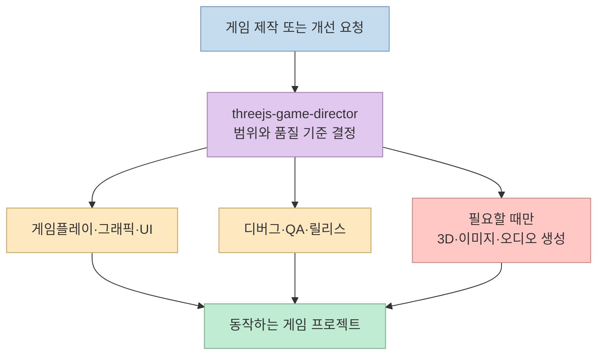
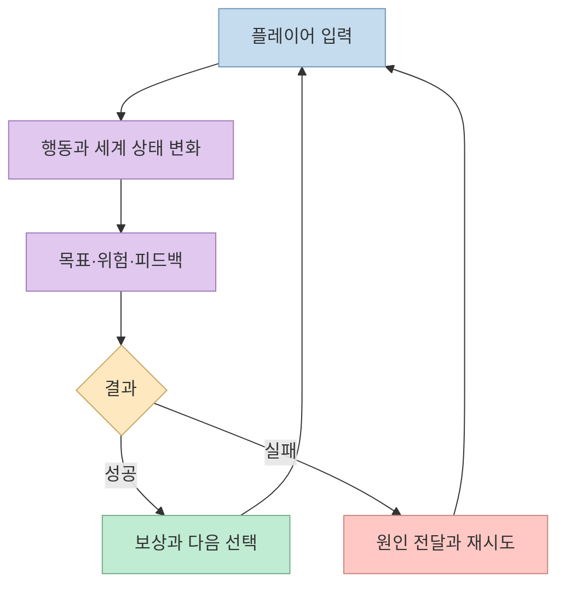
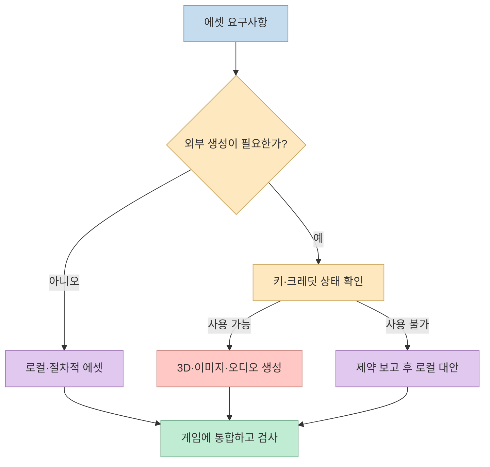
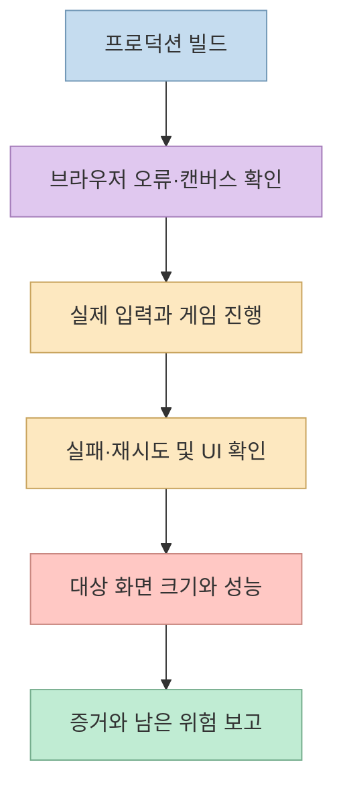

[Threads 게시물](https://www.threads.com/share/_6zfvpYIL/)은 플레이 가능한 Three.js 브라우저 게임을 만들기 위한 에이전트 스킬 묶음을 소개한다. 원문 설명은 게임플레이, 고품질 그래픽, UI, QA와 선택적 AI 에셋 생성을 한 문장에 담고 있다. 실제 [프로젝트 저장소](https://github.com/majidmanzarpour/threejs-game-skills)를 보면 핵심은 완성 게임이나 새로운 엔진이 아니라, **게임 제작 단계를 나누고 결과를 검증하도록 에이전트를 안내하는 9개 스킬** 이다. [저장소 README](https://github.com/majidmanzarpour/threejs-game-skills/blob/main/README.md)

<!--more-->

## Sources

- [원본 Threads 게시물](https://www.threads.com/share/_6zfvpYIL/)
- [Three.js Game Skills 저장소 및 README](https://github.com/majidmanzarpour/threejs-game-skills)
- [디렉터 스킬 원문](https://github.com/majidmanzarpour/threejs-game-skills/blob/main/skills/threejs-game-director/SKILL.md)
- [게임플레이 스킬 원문](https://github.com/majidmanzarpour/threejs-game-skills/blob/main/skills/threejs-gameplay-systems/SKILL.md)
- [QA·릴리스 스킬 원문](https://github.com/majidmanzarpour/threejs-game-skills/blob/main/skills/threejs-qa-release/SKILL.md)

원본 Threads는 일반 HTTP 추출에서 본문이 나오지 않아 동적 페이지 렌더링으로 확인했다(`scrapling-fetch`). 아래 세부 기능은 짧은 게시물만으로 추정하지 않고, 연결된 저장소의 README와 스킬 파일을 기준으로 설명한다. 저장소의 기능 설명은 **제작자가 의도한 작업 흐름** 이며, 이 글에서 게임을 새로 생성해 품질을 실측한 결과는 아니다.

## 디렉터 하나로 시작하되, 역할은 분리한다

저장소는 Codex와 Claude Code에서 공통으로 쓰는 9개 스킬을 제공한다. `threejs-game-director`가 전체 작업의 진입점이다. 나머지는 게임플레이 시스템, 그래픽, UI, 디버그·프로파일링, QA·릴리스, 3D·이미지·오디오 생성이라는 전문 역할을 맡는다. 디렉터는 요청 범위에 맞는 스킬을 고른다. 따라서 작은 HUD 수정에 전체 게임 출시 절차를 억지로 적용하지 않고, 완성 게임 요청에는 더 넓은 검증을 요구하도록 설계됐다. [README의 스킬 목록](https://github.com/majidmanzarpour/threejs-game-skills#skill-system), [디렉터 스킬](https://github.com/majidmanzarpour/threejs-game-skills/blob/main/skills/threejs-game-director/SKILL.md)



빈 프로젝트를 위한 Vite·TypeScript·Three.js 스캐폴드도 게임플레이 스킬 폴더에 포함된다. 코드 생성 후에는 시드 기반 난수와 테스트 훅, Playwright 테스트 템플릿을 활용할 수 있도록 구성돼 있다. 다만 스킬 설치 자체가 게임을 생성하거나 호스트의 모델·백그라운드 실행 기능을 바꾸지는 않는다. 에이전트에게 프로젝트에서 작업을 지시해야 한다. [README의 패키지 구성과 실행 환경 설명](https://github.com/majidmanzarpour/threejs-game-skills#packaged-resources)

## 첫 목표는 멋진 정지 화면이 아니라 플레이 루프다

[게임플레이 스킬](https://github.com/majidmanzarpour/threejs-game-skills/blob/main/skills/threejs-gameplay-systems/SKILL.md)은 넓은 범위의 제작 요청에서 먼저 디자인 브리프, 핵심 루프 계약, 레벨·조우 계획을 작성하도록 한다. 핵심 루프 계약에는 플레이어의 행동, 목표, 압박, 보상, 실패·재시도 조건이 들어간다. 이 요소가 설명문에만 있는지, 실제 입력과 상태 변화로 구현됐는지 확인하는 것이 중요하다. 예컨대 목표가 HUD에 보이지만 주 입력으로 달성할 수 없다면 플레이 가능한 루프라고 보기 어렵다.



디렉터는 이 루프가 돌아가는 **대표 장면** 을 먼저 만들고, 카메라 거리와 아트 방향, 주요 오브젝트의 가독성을 확인한 뒤 레벨이나 에셋 종류를 늘리라고 지시한다. 이는 정적 장면에 나중에 조작을 덧붙이거나, 실제 게임감이 검증되기 전에 콘텐츠를 대량 생산하는 실수를 줄이려는 순서다. [디렉터의 초기 품질 지침](https://github.com/majidmanzarpour/threejs-game-skills/blob/main/skills/threejs-game-director/SKILL.md), [게임플레이 스킬](https://github.com/majidmanzarpour/threejs-game-skills/blob/main/skills/threejs-gameplay-systems/SKILL.md)

## AI 생성 에셋은 선택 사항이다

기본 게임 제작 스킬은 유료 API 키 없이도 사용할 수 있다고 README는 설명한다. 외부 생성이 필요한 경우에만 Tripo의 3D 모델, Gemini의 이미지, ElevenLabs의 오디오를 각각 담당 스킬에 연결한다. 대응 환경 변수는 `TRIPO_API_KEY`, `GEMINI_API_KEY`, `ELEVENLABS_API_KEY`다. 키가 없거나 크레딧이 소진됐을 때는 로컬·절차적 에셋으로 가능한 작업을 이어가고 제한을 보고하도록 설계돼 있다. 생성 비용과 서비스 가용성은 별도로 확인해야 한다. [README의 선택형 API 키 안내](https://github.com/majidmanzarpour/threejs-game-skills#optional-api-keys)



API 키는 브라우저에서 실행되는 게임 코드나 저장소에 넣지 않아야 한다. README는 생성 API를 로컬 에이전트 도구에서 호출하고 결과 에셋만 프로젝트에 저장하도록 안내한다. 생성된 3D·이미지·오디오의 사용 조건과 프로젝트 성능 예산도 실제 배포 전 별도로 검토할 항목이다. [README의 키 보안 안내](https://github.com/majidmanzarpour/threejs-game-skills#optional-api-keys)

## QA는 빌드 성공보다 넓다

README와 [QA·릴리스 스킬](https://github.com/majidmanzarpour/threejs-game-skills/blob/main/skills/threejs-qa-release/SKILL.md)은 완성 게임에서 프로덕션 빌드뿐 아니라 브라우저 오류, 비어 있지 않은 캔버스, 실제 조작, 목표 진행, 실패와 재시도, 데스크톱·모바일 화면을 확인하도록 한다. UI를 바꿨다면 글자 잘림·겹침·터치 영역을, 그래픽을 바꿨다면 렌더링 예산과 성능을 추가로 살핀다. 스캐폴드에는 스크린샷 회귀 테스트 및 봇 플레이테스트용 템플릿이 포함돼 있다. 이는 **제공된 검증 수단** 이지, 설치만으로 모든 생성 게임이 QA를 통과한다는 뜻은 아니다. [README의 기대 증거](https://github.com/majidmanzarpour/threejs-game-skills#expected-evidence), [QA 스킬](https://github.com/majidmanzarpour/threejs-game-skills/blob/main/skills/threejs-qa-release/SKILL.md)



“AAA급”이나 “프리미엄”도 결과를 보장하는 인증이 아니다. 디렉터 스킬은 이런 요청을 높은 품질 기준으로 해석하고, 시각 점수표와 측정 증거를 요구한다. 반대로 정지 화면 한 장, 기본 도형만 놓인 장면, 확인되지 않은 스크린샷만으로는 그 수준을 주장하지 말라고 명시한다. 캔버스 픽셀 검사와 산출물 경로 검사는 일부 증거일 뿐, 미학적 품질이나 게임의 재미를 증명하지 못한다는 한계도 스킬 원문에 적혀 있다. [디렉터 스킬의 품질 기준](https://github.com/majidmanzarpour/threejs-game-skills/blob/main/skills/threejs-game-director/SKILL.md), [QA 스킬의 검사 한계](https://github.com/majidmanzarpour/threejs-game-skills/blob/main/skills/threejs-qa-release/SKILL.md)

## 실전 적용 포인트

README는 Codex 또는 Claude Code에 전체 스킬을 설치한 뒤, 빈 폴더나 기존 Three.js 게임 프로젝트에서 `threejs-game-director`를 지정해 원하는 결과를 요청하는 방식을 제시한다. 아래는 **README의 Codex 설치 예시** 다. 이 글을 작성하면서 명령을 실행하거나 사용자 환경에 스킬을 설치하지는 않았다. CLI 동작과 설치 경로는 사용 중인 버전에서 다시 확인해야 한다. [README 설치·사용 안내](https://github.com/majidmanzarpour/threejs-game-skills#install)

```bash
npx skills add majidmanzarpour/threejs-game-skills --skill '*' -a codex -g -y
```

처음에는 “우주 전투 게임을 만들어줘”보다 **조작, 목표, 실패 조건, 대상 기기, 아트 방향, 검증 범위** 를 짧게 명시하는 편이 좋다. 예를 들어 “데스크톱과 모바일에서 조작 가능한 소규모 우주 전투 게임을 만들고, 적 격추 → 점수 증가 → 피격·재시도 루프를 구현한 뒤 두 화면 크기에서 실제 입력과 빌드를 검사해줘”처럼 요청할 수 있다. 이는 README의 예시와 게임플레이·QA 스킬의 요구를 조합한 적용 예시이지, 저장소가 이 게임을 이미 제공한다는 뜻은 아니다. [README의 프롬프트 예시](https://github.com/majidmanzarpour/threejs-game-skills#what-good-usage-looks-like), [게임플레이 스킬](https://github.com/majidmanzarpour/threejs-game-skills/blob/main/skills/threejs-gameplay-systems/SKILL.md)

## 핵심 요약

- 이 저장소는 Three.js 게임을 자동 완성하는 엔진이 아니라, **디렉터 + 8개 전문 스킬** 로 제작·검증을 조직하는 지침 묶음이다. [README](https://github.com/majidmanzarpour/threejs-game-skills)
- 먼저 입력·목표·압박·보상·재시도가 실제로 이어지는 플레이 루프를 만들고, 대표 장면의 품질을 확인한 뒤 콘텐츠를 확장한다. [게임플레이 스킬](https://github.com/majidmanzarpour/threejs-game-skills/blob/main/skills/threejs-gameplay-systems/SKILL.md)
- 외부 3D·이미지·오디오 생성은 선택 사항이며, “고품질” 주장은 빌드와 스크린샷을 넘는 플레이·UI·성능 증거가 필요하다. [README](https://github.com/majidmanzarpour/threejs-game-skills#optional-api-keys), [QA 스킬](https://github.com/majidmanzarpour/threejs-game-skills/blob/main/skills/threejs-qa-release/SKILL.md)

## 결론

Three.js Game Skills의 실용적인 가치는 화려한 한 장의 장면보다 **플레이 가능한 결과와 그 결과를 확인하는 절차** 를 함께 요구한다는 데 있다. 다만 실제 게임 품질은 요청의 구체성, 구현, 에셋 선택, 브라우저 플레이테스트에 달려 있다. 스킬의 약속을 배포 품질로 착각하지 말고, 생성된 게임을 직접 조작하고 증거를 검토해야 한다.
