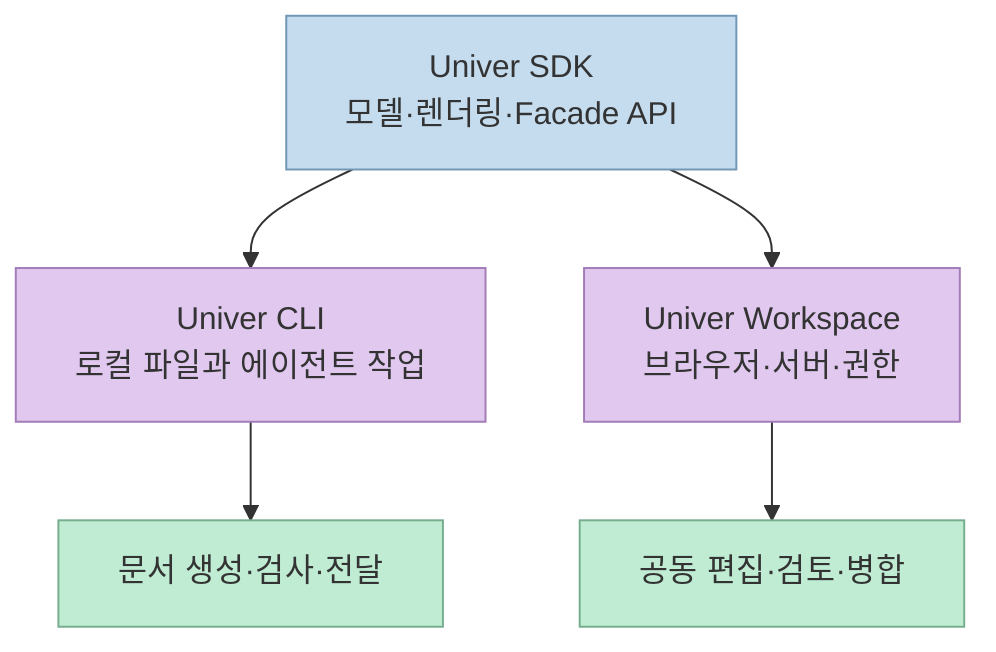
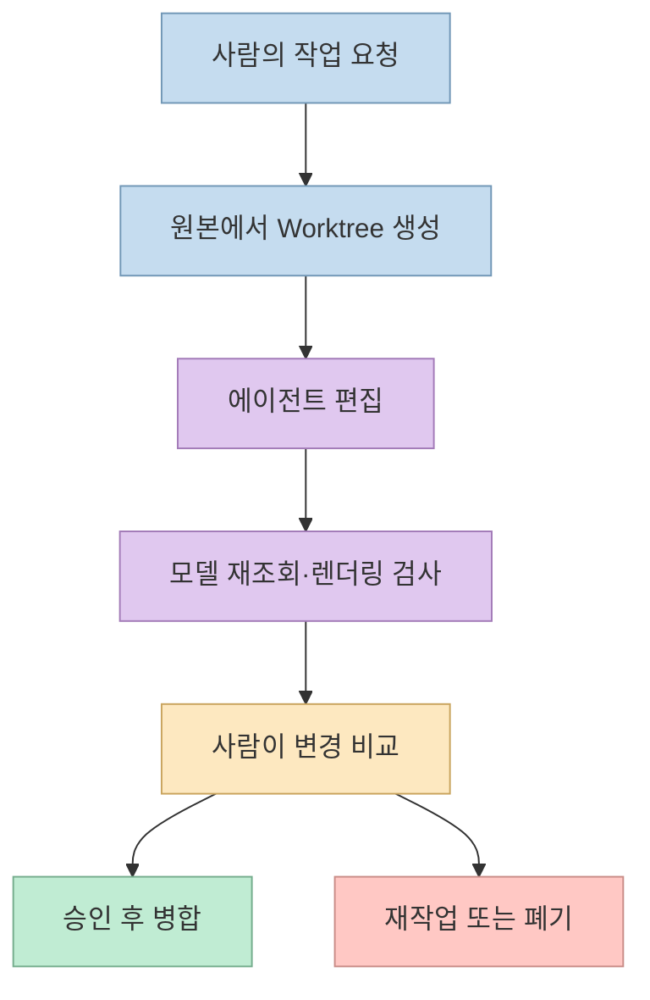
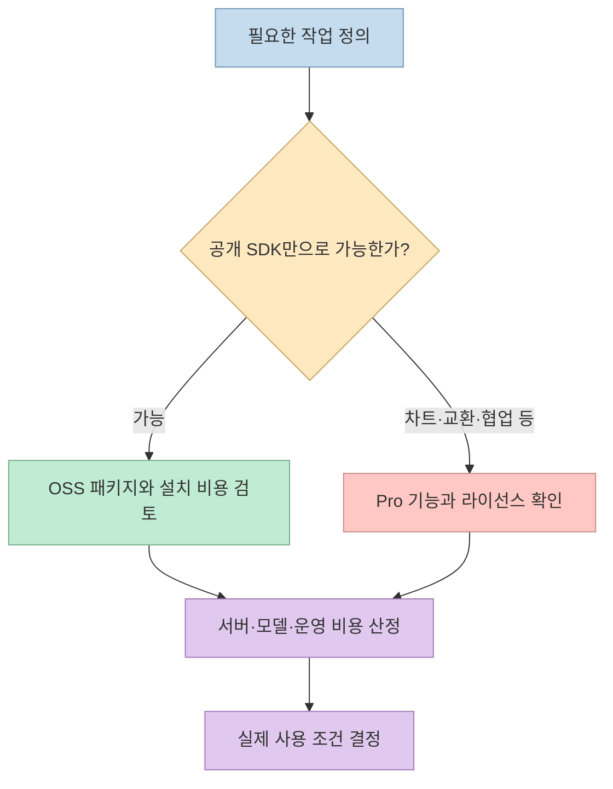

"매출 보고서를 만들어 줘"라는 요청을 받은 AI가 셀과 수식을 수정하고, 결과를 렌더링해 확인한 뒤, 사람이 검토할 문서를 건네는 방식은 단순한 텍스트 생성과 다르다. [Threads 소개 글](https://www.threads.com/share/_7HyB1B1b/)이 다룬 **Univer**는 이런 작업에 쓰이는 오피스 런타임·개발 도구·워크스페이스의 제품군이다. 다만 게시글의 기능과 성능을 **하나의 무료 오픈소스 패키지가 모두 제공한다**고 읽으면 범위를 잘못 이해하기 쉽다.

<!--more-->

## Sources

- [원문 Threads 게시글](https://www.threads.com/share/_7HyB1B1b/)
- [Univer SDK 저장소](https://github.com/dream-num/univer)
- [Univer CLI 저장소](https://github.com/dream-num/univer-cli)
- [Univer Workspace 저장소](https://github.com/dream-num/univer-workspace)
- [Univer 공식 사이트](https://univer.ai/)
- [SpreadsheetBench 공식 사이트](https://spreadsheetbench.github.io/)
- [Microsoft의 Excel Agent Mode 평가 설명](https://techcommunity.microsoft.com/blog/excelblog/building-agent-mode-in-excel/4457320)

## SDK, CLI, Workspace는 같은 제품이 아니다

[Univer SDK](https://github.com/dream-num/univer)는 애플리케이션에 스프레드시트·문서·프레젠테이션 편집 기능을 넣기 위한 **구성 가능한 개발 기반**이다. 브라우저와 Node.js에서 사용할 수 있는 런타임, 플러그인, 수식 엔진, 렌더링 엔진, Facade API가 핵심이다. 저장소는 이를 완성된 호스팅 오피스 서비스가 아니라 **자체 생산성 화면을 만들기 위한 프레임워크**라고 설명한다.

[Univer CLI](https://github.com/dream-num/univer-cli)는 에이전트가 로컬 `.univer` 파일을 가져오거나 만들고, Sheet·Doc·Slide·Base·Board를 검사·편집·검증하도록 조립한 별도 애플리케이션이다. [Univer Workspace](https://github.com/dream-num/univer-workspace)는 브라우저 편집기, 서버, 에이전트, CLI를 묶어 사람이 공동 편집하고 에이전트의 변경을 검토할 수 있는 셀프호스트형 작업 공간이다. 따라서 "Univer가 문서를 만들고 차트를 그린다"는 말은 **어느 구성요소와 어떤 플러그인을 설치했는지**까지 적어야 정확하다.

공식 사이트는 스프레드시트·문서·슬라이드뿐 아니라 캔버스, 관계형 테이블, PDF도 제품군의 범위로 소개한다. 그러나 [SDK README](https://github.com/dream-num/univer)는 PDF를 *coming soon*으로 표시하고, 슬라이드 역시 개발 중인 공개 기능과 별도의 Pro 기능을 구분한다. 제품군 소개에 등장하는 여섯 표면을 **공개 SDK에서 동일한 완성도로 즉시 사용할 수 있는 여섯 도구**로 해석해서는 안 된다.

## Worktree가 바꾸는 것은 편집 권한이 아니라 검토 흐름

[CLI 설명](https://github.com/dream-num/univer-cli)에 따르면 에이전트는 파일을 가져오거나 생성한 다음 **격리된 초안 Worktree**에서 편집한다. 작업 후 저장된 모델을 다시 읽고, 화면 검사가 필요하면 스크린샷이나 레이아웃 검사를 수행한다. 준비된 결과는 로컬 Viewer에서 사람이 비교하고 **병합·재작업·폐기**할 수 있다. [Workspace](https://github.com/dream-num/univer-workspace)에서는 서버가 문서 저장과 권한을 소유하며, 에이전트의 중간 변경은 사람이 승인하기 전까지 공유 본문과 분리된다.

이 구조의 장점은 **동시에 작업하는 에이전트가 원본을 직접 덮어쓰지 않는 것**이다. Threads의 "여러 에이전트가 같은 파일을 작업해도 충돌이 안 남"은 여기까지만 받아들여야 한다. 격리된 초안 둘이 **같은 셀이나 문단을 다르게 수정했다면 병합 단계에서 선택 또는 충돌 처리가 여전히 필요**하다. 이는 Worktree가 중간 변경을 분리한다는 공식 설명에서 따라오는 운영상 추론이지, 모든 병합이 무충돌이라는 성능 보증이 아니다.

## Apache-2.0과 ‘비용 0원’은 다른 이야기

[SDK 저장소](https://github.com/dream-num/univer)의 공개 코드는 Apache-2.0 라이선스다. 하지만 같은 README는 **차트, 고급 가져오기·내보내기, 실시간 협업, 일부 슬라이드·Base 기능** 등을 별도 **Univer Pro** 영역으로 명시한다. [CLI 저장소](https://github.com/dream-num/univer-cli)는 자체 코드를 Apache-2.0으로 공개하면서도, 함께 쓰는 Pro SDK 패키지와 런타임 자격 증명에는 **각각의 약관**이 적용된다고 적는다. 특히 CLI에 포함된 로컬 개발용 런타임 자격 증명은 저장소의 오픈소스 라이선스와 같지 않다고 구분한다.

그러므로 "무료·설치비 0원·상업적으로 모든 기능 사용 가능"이라는 묶음 표현은 검증되지 않는다. 오픈소스 코드의 이용 허용 범위와 제품 기능별 라이선스, 서버 운영비, 외부 AI 모델 사용료는 별개다. 셀프호스트도 **문서 서버를 직접 운영할 수 있다는 의미**이지, 연결한 모델이나 외부 연동까지 포함해 데이터가 절대로 밖으로 나가지 않는다는 보장은 아니다. 배포 전에는 네트워크 경로와 모델 제공자를 직접 확인해야 한다.

## 성능 수치는 날짜와 평가 범위를 붙여 읽자

[Univer 공식 사이트](https://univer.ai/)는 2025년 12월의 **SpreadsheetBench 68.86% pass@1** 결과를 제시한다. [Microsoft의 공개 설명](https://techcommunity.microsoft.com/blog/excelblog/building-agent-mode-in-excel/4457320)은 Excel Agent Mode의 **57.2%**를 제시하므로, 두 공개 수치의 차이는 **11.66%포인트**다. 다만 두 회사가 각자 발표한 결과를 하나의 동일한 독립 재현 실험으로 취급해서는 안 된다. 특히 [SpreadsheetBench 공식 사이트](https://spreadsheetbench.github.io/)는 현재 V1과 V2를 구분하고, V1 전체의 상위 점수를 **70.48%**로 표시한다. 과거 발표의 "1위"를 시점 표시 없이 **현재 1위**로 옮겨 적으면 부정확하다.

공식 사이트는 Rust 기반 수식 런타임의 **수식 100만 개를 수 초 안에 계산**, 웹에서 **셀 1,000만 개 렌더링**도 소개한다. 이는 **공급업체의 성능 주장**이며, 이 글에서 하드웨어·문서 크기·수식 종류·측정 방법을 재현한 수치는 아니다. 실제 도입에는 자신의 데이터로 초기 로딩, 수정 후 재계산, 브라우저 메모리, 내보내기 결과를 각각 측정해야 한다. [Univer 공식 사이트](https://univer.ai/)

## 실전 적용 포인트

1. **목적부터 나눈다.** 자체 서비스에 편집기를 넣는다면 SDK, 로컬 에이전트가 파일을 만들고 검토받게 한다면 CLI, 여러 사용자가 서버에서 협업한다면 Workspace의 문서를 먼저 읽는다. [SDK](https://github.com/dream-num/univer), [CLI](https://github.com/dream-num/univer-cli), [Workspace](https://github.com/dream-num/univer-workspace)
2. **필수 기능을 실제 라이선스에 매핑한다.** 특히 XLSX·DOCX·PPTX 교환, 차트, 실시간 협업, 슬라이드 편집은 "Univer 지원"이라는 소개 문구가 아니라 사용하려는 패키지와 배포 환경을 기준으로 확인한다. [SDK 기능 경계](https://github.com/dream-num/univer)
3. **사람의 승인 단계를 남긴다.** 에이전트가 수식 결과와 시각적 배치를 다시 검사하더라도, 보고서의 수치 의미와 외부 공유 적합성은 사람이 확인한 뒤 병합한다. [CLI의 검토 흐름](https://github.com/dream-num/univer-cli)

## 핵심 요약

- Univer는 하나의 "무료 AI 엑셀"이 아니라 **SDK·CLI·Workspace 및 Pro 확장**으로 이루어진 제품군이다.
- Worktree는 에이전트의 중간 편집을 원본에서 분리하지만, **병합 충돌과 내용 검토를 없애지는 않는다**.
- 68.86%와 57.2%는 공개된 **과거 SpreadsheetBench V1 결과**다. 기능·비용·성능은 자신의 구성과 현재 조건에서 별도로 검증해야 한다.

## 결론

Univer의 핵심 가치는 AI가 오피스 파일을 **편집하고, 검증하고, 사람이 승인할 수 있는 작업 흐름**을 제공한다는 점이다. 도입 판단은 화려한 기능 목록보다 **어떤 저장소와 라이선스의 기능을 쓸지**, **원본 반영을 누가 승인할지**, **내 데이터에서 무엇을 측정할지**를 먼저 정하는 데서 시작한다.
