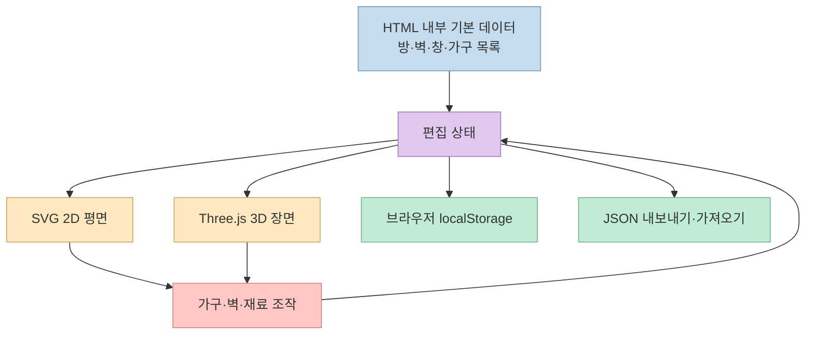
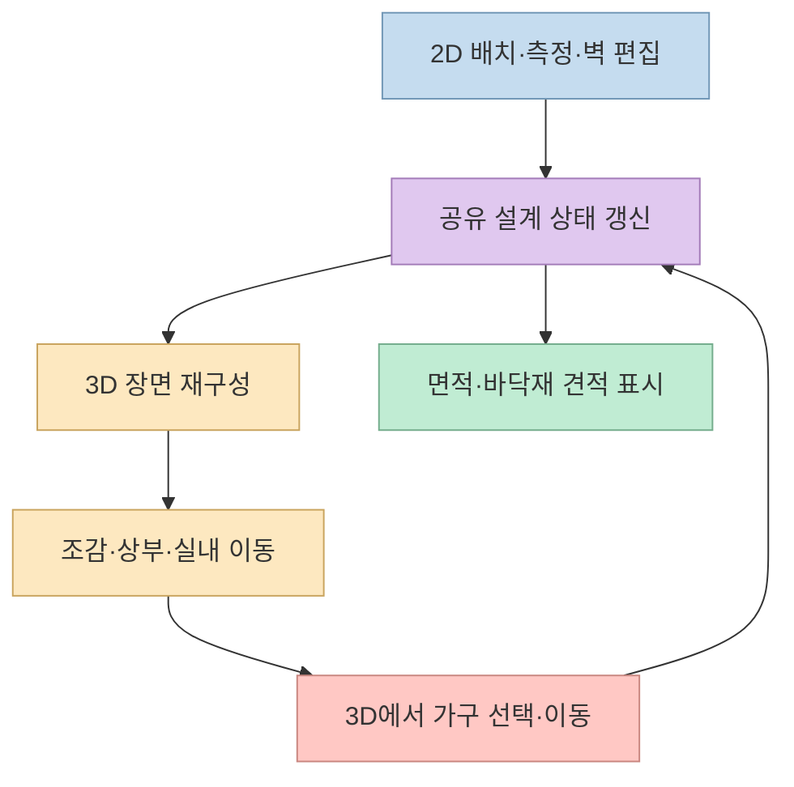
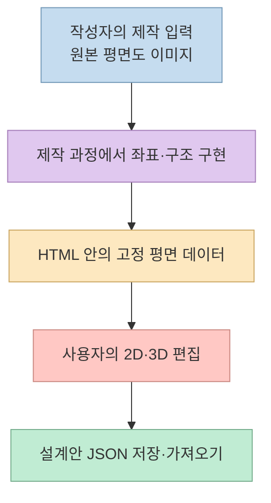

[작성자의 X 게시물](https://x.com/akokoi1/status/2104771886236553568)은 주택 평면도를 편집하고 3D로 둘러보는 도구 [Floorplan 3D](https://github.com/wy51ai/floorplan-3d)를 공개했다. 작성자는 파일 하나로 이뤄진 프로젝트를 아이가 인테리어 시뮬레이션 게임처럼 사용해 iPad 조작을 보완했다고 설명한다. 저장소를 확인하면 핵심은 **SVG 평면 편집과 Three.js 장면을 하나의 브라우저 앱으로 묶은 것** 이다. 다만 “평면도 이미지 한 장으로 만들었다”는 제작 경험과, 앱 사용자가 임의의 이미지를 업로드해 자동 변환할 수 있다는 기능은 구별해야 한다. [원본 게시물](https://x.com/akokoi1/status/2104771886236553568), [이전 시연 게시물](https://x.com/akokoi1/status/2104520072014508316), [저장소 README](https://github.com/wy51ai/floorplan-3d)

<!--more-->

## Sources

- [원본 X 게시물](https://x.com/akokoi1/status/2104771886236553568)
- [앞서 올린 제작·시연 게시물](https://x.com/akokoi1/status/2104520072014508316)
- [Floorplan 3D 저장소와 README](https://github.com/wy51ai/floorplan-3d)
- [단일 HTML 소스](https://github.com/wy51ai/floorplan-3d/blob/master/index.html)
- [온라인 데모](https://wy51ai.github.io/floorplan-3d/)
- [라이선스가 없는 공개 저장소에 관한 GitHub 문서](https://docs.github.com/en/repositories/managing-your-repositorys-settings-and-features/customizing-your-repository/licensing-a-repository)

원본 X 본문은 X의 공개 트윗 JSON 엔드포인트로 읽었다(`x-syndication`, HTTP 추출). 연결된 저장소의 README와 `index.html`을 별도로 확인했고, 온라인 데모는 데스크톱 브라우저에서 **2D 화면을 열고 3D 장면으로 전환하는 범위** 까지 직접 확인했다. iPad 실기기 조작이나 면적·견적 정확도를 검증한 것은 아니다.

## 한 파일이지만 2D와 3D는 같은 설계 데이터를 읽는다

저장소에는 중심 앱 파일인 `index.html`과 README가 있다. 별도 빌드 단계 없이 HTML을 열 수 있지만, 3D에 필요한 Three.js 모듈은 jsDelivr CDN의 `three@0.160.0`을 가져오므로 처음 3D 장면을 열 때 네트워크가 필요하다. 2D는 SVG, 3D는 Three.js를 쓰고, 가구·방·철거 벽·측정값 등을 담은 상태를 `localStorage`에 저장한다. 이는 **서버 없이 실행되는 앱** 이지, 모든 자산이 HTML 내부에 포함된 완전 오프라인 파일이라는 뜻은 아니다. [README의 기술 스택과 실행 안내](https://github.com/wy51ai/floorplan-3d#快速开始), [HTML 소스](https://github.com/wy51ai/floorplan-3d/blob/master/index.html)

코드에서 `ROOMS`는 방의 다각형과 재료, `WALLS`와 `WINS`는 벽·창, `MATS`는 바닥 재료와 가격, `LIB`는 가구 카탈로그를 정의한다. 이 데이터를 바꾸면 다른 평면도에 맞게 조정할 수 있다. 3D 가구는 `buildFurniture()`가 Three.js 도형과 재질을 조합해 만든다. 즉, 앱이 실행 중 매번 AI로 가구 모델을 생성하는 방식은 아니다. [README의 사용자 정의 항목](https://github.com/wy51ai/floorplan-3d#自定义户型), [HTML 소스](https://github.com/wy51ai/floorplan-3d/blob/master/index.html)

## 편집 기능은 배치·측정·재료·시점까지 이어진다

README에 따르면 2D에서는 60종이 넘는 가구·가전을 배치하고 이동·회전·크기 조정할 수 있다. 벽 가까이 자동 흡착하는 배치, 벽에 흡착하는 측정, 비내력벽 철거, 치수·방 이름·격자 등의 표시 전환도 제공한다. 3D에서는 조감·사선·상부 시점과 1인칭 이동을 고르고, 문을 열거나 가구를 선택·이동할 수 있다. 3D 조작은 2D 설계 상태와 동기화하도록 설명돼 있다. 실제 데모에서도 **2D/3D 전환과 3D 시점·벽 표시·일조 조절 컨트롤** 이 나타나는 것을 확인했다. [README 기능 목록](https://github.com/wy51ai/floorplan-3d#功能), [온라인 데모](https://wy51ai.github.io/floorplan-3d/)

방 면적과 재료별 바닥 면적을 계산하고, 바닥재 가격에는 코드상 **5% 손실분을 더한 추정식** 을 적용한다. PNG 이미지와 설계안 JSON을 내보낼 수 있고, 설계안은 브라우저에도 자동 저장된다. 비용 표시는 입력된 재료 단가에 따른 예시 견적으로 이해해야 한다. 실제 시공비나 법적·구조적 적합성을 검증하는 시스템이라고 볼 근거는 없다. [README의 통계·저장 기능](https://github.com/wy51ai/floorplan-3d#功能), [HTML 소스](https://github.com/wy51ai/floorplan-3d/blob/master/index.html)

## iPad 적응의 의미와 이미지 자동 변환의 경계

작성자는 아이가 마우스로 조작하기 어렵다는 점을 발견해 iPad 화면을 보완했다고 말한다. 실제 소스에는 좁은 화면에서 사이드 패널을 바꾸는 CSS 분기, 포인터 이벤트, 3D 이동용 가상 조이스틱 코드가 있다. README도 터치 기기에서 가상 조이스틱을 사용한다고 설명한다. 다만 이는 **터치 대응 코드가 존재한다** 는 확인이다. 기기별 성능, Apple Pencil 동작, 모든 iPad 화면 방향에서의 편집 편의성까지 보장하는 검증 결과는 아니다. [원본 게시물](https://x.com/akokoi1/status/2104771886236553568), [README의 3D 설명](https://github.com/wy51ai/floorplan-3d#功能), [HTML 소스](https://github.com/wy51ai/floorplan-3d/blob/master/index.html)

앞선 게시물에서 작성자는 평면도 이미지 한 장을 제공하고 모델의 도움으로 프로젝트를 만들었다고 설명한다. 그러나 현재 HTML의 파일 입력은 `.json` 설계안만 받으며, 기본 방·벽 좌표는 코드에 직접 정의돼 있다. 따라서 **AI를 이용해 앱을 제작한 과정** 과 **앱 자체에 내장된 이미지 인식 기능** 을 혼동하면 안 된다. 사용자가 다른 평면도를 적용하려면 현재 안내대로 `ROOMS`·`WALLS` 등 데이터를 수정하거나 별도 변환 기능을 개발해야 한다. [앞선 게시물](https://x.com/akokoi1/status/2104520072014508316), [README의 사용자 정의 방법](https://github.com/wy51ai/floorplan-3d#自定义户型), [HTML 소스](https://github.com/wy51ai/floorplan-3d/blob/master/index.html)

## 실전 적용 포인트

가볍게 살펴보려면 [온라인 데모](https://wy51ai.github.io/floorplan-3d/)에서 2D 가구 배치, 3D 전환, 조감·실내 시점, JSON 내보내기를 순서대로 시험하면 된다. 자신의 평면도로 바꿀 계획이라면 먼저 실제 치수와 방 다각형·벽 위치를 준비하고, `index.html`의 기본 데이터 구조를 이해해야 한다. 코드를 한 파일로 유지하는 선택은 배포가 단순한 대신, 좌표 데이터·UI·렌더링 로직이 함께 커져 수정과 테스트가 어려워질 수 있다. 마지막 문장은 현재 구조에서의 유지보수상 **추론** 이다. [README의 실행·사용자 정의 안내](https://github.com/wy51ai/floorplan-3d), [HTML 소스](https://github.com/wy51ai/floorplan-3d/blob/master/index.html)

재사용 전에는 라이선스도 확인해야 한다. 2026년 9월 30일 확인한 저장소에는 별도 `LICENSE` 파일이 보이지 않고 GitHub API에도 감지된 라이선스가 없다. 작성자가 X에서 “공개했다”고 한 사실만으로 자유로운 수정·재배포 허가가 명시된 것은 아니다. GitHub 문서는 공개 저장소라도 라이선스가 없으면 기본 저작권 규칙이 적용된다고 안내한다. 코드 일부를 제품에 가져가려면 권리 조건을 먼저 확인하는 편이 안전하다. [저장소 파일 목록](https://github.com/wy51ai/floorplan-3d), [GitHub 라이선스 문서](https://docs.github.com/en/repositories/managing-your-repositorys-settings-and-features/customizing-your-repository/licensing-a-repository)

## 핵심 요약

- Floorplan 3D는 SVG 2D 편집과 Three.js 3D 시각화를 단일 HTML 앱에 담았다. 3D 모듈은 CDN에서 불러온다. [README](https://github.com/wy51ai/floorplan-3d)
- 가구 배치·측정·벽 편집·바닥재 견적·브라우저 저장·JSON 교환을 제공한다. 데모에서는 2D에서 3D로의 화면 전환을 확인했다. [README](https://github.com/wy51ai/floorplan-3d), [온라인 데모](https://wy51ai.github.io/floorplan-3d/)
- 작성자의 “이미지 한 장으로 제작” 경험을 앱의 이미지 자동 변환 기능으로 읽으면 안 된다. 현재 파일 입력은 설계안 JSON용이며, 기본 평면 좌표는 코드에 있다. [이전 게시물](https://x.com/akokoi1/status/2104520072014508316), [HTML 소스](https://github.com/wy51ai/floorplan-3d/blob/master/index.html)
- 터치 대응은 구현돼 있지만 iPad 실기기 품질은 별도 확인이 필요하며, 코드 재사용 전 라이선스 조건을 확인해야 한다. [원본 게시물](https://x.com/akokoi1/status/2104771886236553568), [저장소](https://github.com/wy51ai/floorplan-3d)

## 결론

이 프로젝트는 한 장의 HTML로도 **편집 상태를 중심에 둔 2D·3D 인테리어 시제품** 을 만들 수 있음을 보여준다. 좋은 출발점은 데모를 직접 조작해 보고, 내 평면도의 좌표·치수와 사용 권한을 확인한 뒤 필요한 기능만 참고하는 것이다. 시각화와 비용 추정은 설계 탐색에 유용할 수 있지만, 실제 시공 도면이나 견적의 검증을 대신하지는 않는다.
