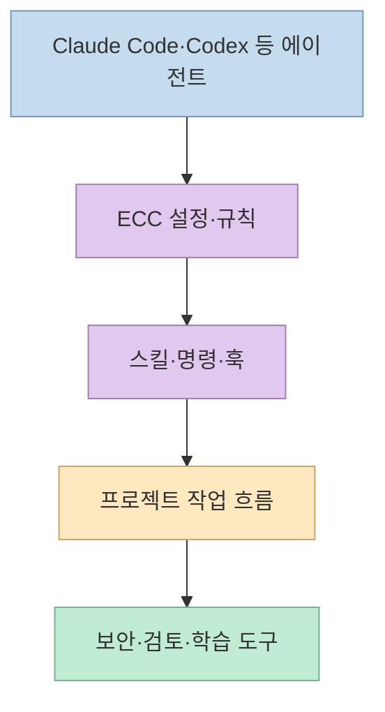
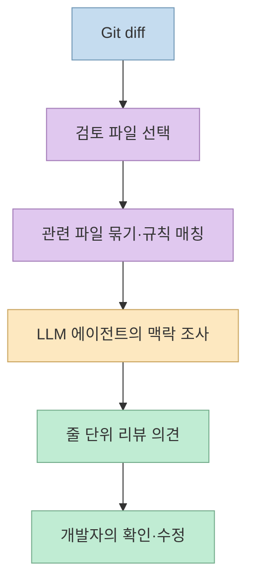
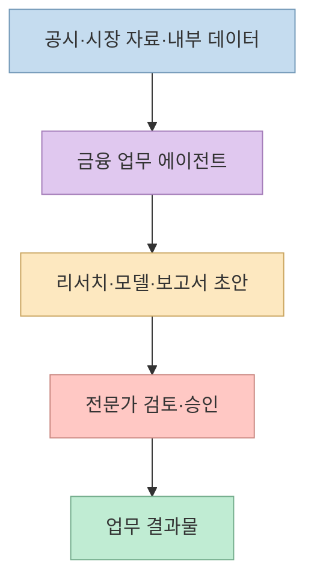
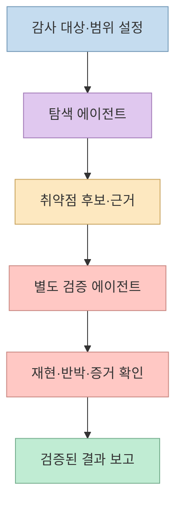
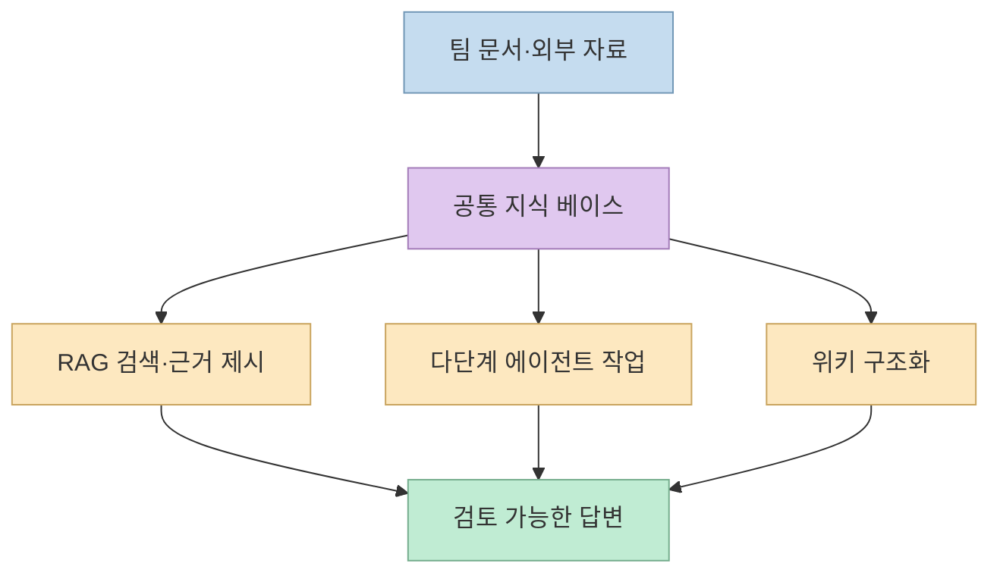

[문외인 Layperson의 쇼츠](https://youtube.com/shorts/-6xW6lJJ1_Q?si=obI0OZiQW_qmnH4A)는 9월 4주차 GitHub 트렌딩이라는 이름으로 **코딩 에이전트 설정 묶음, 코드 리뷰 도구, 터미널 에이전트, 금융 업무 에이전트, 보안 감사 스킬** 을 5위부터 1위까지 소개하고, 지식 플랫폼 하나를 보너스로 덧붙인다. 서로 경쟁하는 동종 제품의 성능 순위로 읽기보다는, **개발·검토·도메인 업무·보안·지식 관리** 라는 서로 다른 작업에 어떤 도구가 쓰이는지 살펴보는 목록으로 읽는 편이 유용하다. [영상 도입 0:00](https://youtu.be/-6xW6lJJ1_Q?t=0), [보너스 소개 2:20](https://youtu.be/-6xW6lJJ1_Q?t=140)

<!--more-->

## Sources

- [원본 영상: 9월 4주차의 오픈소스 정보를 정리해주는 깃허브 트렌딩 TOP5](https://youtube.com/shorts/-6xW6lJJ1_Q?si=obI0OZiQW_qmnH4A)
- [ECC 공식 저장소](https://github.com/affaan-m/ECC)
- [Open Code Review 공식 저장소](https://github.com/alibaba/open-code-review)
- [Claude Code 공식 저장소](https://github.com/anthropics/claude-code)
- [Claude for Financial Services 공식 저장소](https://github.com/anthropics/financial-services)
- [Cloudflare security-audit-skill 공식 저장소](https://github.com/cloudflare/security-audit-skill)
- [WeKnora 공식 저장소](https://github.com/Tencent/WeKnora)

영상의 한국어 **자동 생성 자막** 과 YouTube 메타데이터를 확인하고, 프로젝트 이름·기능·적용 범위는 각 공식 저장소 README와 대조했다. 자동 자막에는 이름과 별 개수의 오인식이 있고 GitHub 별 개수는 수시로 바뀌므로, 아래에서는 영상의 수치를 현재의 확정 통계처럼 반복하지 않는다. 또한 영상이 말하는 “트렌딩 순위”의 집계 기준과 시점을 독립적으로 재현하지 못했다. 따라서 **5위~1위는 영상의 소개 순서** 를 뜻한다. [영상의 순위 소개 0:12](https://youtu.be/-6xW6lJJ1_Q?t=12), [영상의 별 개수 언급 0:32](https://youtu.be/-6xW6lJJ1_Q?t=32)

## 5위 ECC: 에이전트 작업 환경의 설정 묶음

영상의 “이씨씨”는 [Everything Claude Code, ECC](https://github.com/affaan-m/ECC)다. 영상은 에이전트·스킬·규칙을 함께 설치하는 묶음이며 Claude Code와 Codex를 지원한다고 소개한다. 공식 저장소도 스킬, 에이전트, 훅, 규칙, 메모리·보안 도구 등을 묶은 **에이전트 하네스 구성 체계** 로 설명한다. 핵심은 특정 모델을 새로 만드는 것이 아니라, 이미 사용하는 코딩 에이전트가 어떤 절차와 도구를 사용할지 설정하는 것이다. [영상 0:16](https://youtu.be/-6xW6lJJ1_Q?t=16), [ECC README](https://github.com/affaan-m/ECC)

이런 묶음은 초기 설정을 빠르게 시작하게 해 주지만, **구성 요소가 많다는 것 자체가 생산성이나 안전성을 증명하지는 않는다.** 설치 전에는 실제로 필요한 스킬·훅만 고르고, 기존 프로젝트 규칙과 중복되는 지침이 없는지 확인해야 한다. 공식 README도 검증된 공식 배포 경로 사용을 강조한다. [ECC README의 설치·공식 배포 안내](https://github.com/affaan-m/ECC)

## 4위 Open Code Review: 결정적 파이프라인과 AI 판단의 결합

[Alibaba Open Code Review](https://github.com/alibaba/open-code-review)는 변경된 코드를 읽고 줄 단위 리뷰 의견을 만드는 도구로 소개된다. 공식 README에 따르면 Git diff에서 검토할 파일을 선별하고 관련 파일을 묶는 단계는 **규칙 기반의 결정적 로직** 으로 처리하며, 맥락 조사와 결함 판단에는 도구를 사용하는 LLM 에이전트를 쓴다. 즉 “AI가 전체 diff를 한 번 읽고 자유롭게 평가한다”는 구조가 아니라, 파일 선택·규칙 매칭·리뷰 위치 같은 기계적으로 고정할 수 있는 부분과 해석이 필요한 부분을 나눈다. [영상 0:42](https://youtu.be/-6xW6lJJ1_Q?t=42), [공식 README의 아키텍처 설명](https://github.com/alibaba/open-code-review)

영상은 알리바바 내부에서 사용하던 시스템을 공개했다고 설명하고, 저장소 README도 내부 코드 리뷰 도구에서 출발했다고 적는다. 다만 이 이력이 **내 저장소에서 버그를 모두 찾아낸다** 는 보장은 아니다. 실제 도입 시에는 기존 정적 분석·테스트와 역할을 나누고, 오탐률·누락률·외부 모델로 전송되는 코드 범위를 별도로 검토해야 한다. [영상 0:46](https://youtu.be/-6xW6lJJ1_Q?t=46), [Open Code Review README](https://github.com/alibaba/open-code-review)

## 3위 Claude Code: 범용 터미널 작업자

[Claude Code](https://github.com/anthropics/claude-code)는 터미널에서 코드베이스를 파악하고, 자연어 요청에 따라 일상적인 개발 작업·코드 설명·Git 워크플로를 돕는 범용 코딩 에이전트다. 영상에서도 반복 작업, 복잡한 코드 설명, Git 커밋 등을 예로 든다. 위의 Open Code Review가 **코드 리뷰라는 좁은 목적** 에 초점을 맞춘다면, Claude Code는 여러 개발 작업을 수행하는 일반 작업 환경에 가깝다. [영상 1:06](https://youtu.be/-6xW6lJJ1_Q?t=66), [Claude Code 공식 README](https://github.com/anthropics/claude-code)

Claude Code의 공식 저장소에는 설치 안내와 플러그인 정보가 있다. 영상에서 말하는 “명령 하나로 설치”를 특정 설치 명령으로 고정해 외우기보다는, 실제 설치 시점의 [공식 설정 문서](https://code.claude.com/docs/en/setup)를 확인하는 편이 정확하다. 공식 README는 과거의 npm 전역 설치 방식을 더는 권장하지 않는다고 표시한다. [영상 1:17](https://youtu.be/-6xW6lJJ1_Q?t=77), [공식 설치 안내](https://github.com/anthropics/claude-code)

## 2위 Claude for Financial Services: 금융 실무용 출발점

영상의 “파이낸셜 서비스”는 [Anthropic의 Claude for Financial Services 저장소](https://github.com/anthropics/financial-services)다. 투자은행, 주식 리서치, 사모펀드, 자산관리 등 금융 업무를 위한 **참조 에이전트·스킬·데이터 커넥터** 를 제공한다. 공식 README에는 피치 자료, 시장 조사, 실적 검토, 재무 모델, 가치 평가, 총계정원장 조정, KYC 등의 워크플로가 명시돼 있다. 영상이 예로 든 공시 읽기·모델 수정·보고서 초안도 이 범주에 속한다. [영상 1:32](https://youtu.be/-6xW6lJJ1_Q?t=92), [금융 서비스 README](https://github.com/anthropics/financial-services)

중요한 경계는 **자동 작성과 전문적 판단의 분리** 다. 저장소는 결과물을 자격 있는 전문가가 검토해야 할 초안으로 규정하며 투자·법률·세무·회계 조언이 아니라고 명시한다. 연결 데이터의 권한, 수치의 기준일, 계산식, 승인 절차를 빼고 “금융 에이전트가 보고서를 완성한다”고 이해하면 과장이다. [금융 서비스 README의 면책·구성 설명](https://github.com/anthropics/financial-services)

## 1위 Cloudflare security-audit-skill: 발견과 반박을 분리한 감사

영상의 “시큐리티 오딧 스킬”은 [Cloudflare의 security-audit-skill](https://github.com/cloudflare/security-audit-skill)로 확인된다. 단순히 “취약점을 찾아 줘”라고 묻는 프롬프트보다 범위가 넓다. 공식 README는 **사전 조사 → 범위별 탐색 → 후보 검증 → 구조화된 기록 → 독립적 기록 검증 → 보고** 의 단계를 설명한다. 특히 어떤 에이전트가 찾아낸 취약점 후보는 **같은 에이전트가 최종 검증하지 않도록** 설계했다. 영상의 “다른 새 에이전트가 반박을 시도한다”는 설명과 연결되는 부분이다. [영상 1:57](https://youtu.be/-6xW6lJJ1_Q?t=117), [Cloudflare 보안 감사 스킬 README](https://github.com/cloudflare/security-audit-skill)

이 분리는 보안 보고서에서 중요한 **“발견자의 주장”과 “독립적으로 확인된 사실”** 을 구분하려는 장치다. 다만 스킬 설치만으로 침투 테스트나 정식 보안 감사를 대체한다는 뜻은 아니다. 검토 대상의 실행 권한, 민감 데이터, 외부 전송 정책을 먼저 확인하고, 결과의 증거와 재현 절차를 사람이 검토해야 한다. 공식 README도 도구 사용과 병렬 하위 에이전트를 지원하는 코딩 에이전트가 필요하다고 명시한다. [Cloudflare 보안 감사 스킬 README](https://github.com/cloudflare/security-audit-skill)

## 보너스 WeKnora: 문서 검색에서 에이전트·위키까지

마지막 보너스는 Tencent의 [WeKnora](https://github.com/Tencent/WeKnora)다. 영상은 문서 기반 검색, 다단계 에이전트, 위키 정리 기능을 함께 언급한다. 공식 저장소 역시 **같은 지식 베이스 위에서 RAG 검색, 여러 단계의 에이전트 작업, 유지되는 위키** 를 제공하는 지식 플랫폼으로 설명한다. 문서 하나를 요약하는 도구라기보다 팀 자료를 수집·검색·작업·정리하는 환경에 가깝다. [영상 2:20](https://youtu.be/-6xW6lJJ1_Q?t=140), [WeKnora README](https://github.com/Tencent/WeKnora)

## 실전 적용 포인트

이 여섯 프로젝트는 목적이 다르다. **에이전트 환경을 구성** 하려면 ECC, **변경 코드의 리뷰를 강화** 하려면 Open Code Review, **일반 개발 작업을 위임** 하려면 Claude Code, **금융 업무 초안을 설계** 하려면 Claude for Financial Services, **근거 중심의 보안 감사 절차** 가 필요하면 Cloudflare 스킬, **조직 문서 활용** 이 목적이면 WeKnora를 검토하는 식이다. 이는 영상의 소개 순서와 각 공식 README의 제품 범위를 종합한 선택 가이드다. [영상 전체](https://youtu.be/-6xW6lJJ1_Q?t=0), [ECC](https://github.com/affaan-m/ECC), [Open Code Review](https://github.com/alibaba/open-code-review), [Claude Code](https://github.com/anthropics/claude-code), [금융 에이전트](https://github.com/anthropics/financial-services), [보안 감사 스킬](https://github.com/cloudflare/security-audit-skill), [WeKnora](https://github.com/Tencent/WeKnora)

새 도구를 도입할 때는 별 개수보다 **실행 권한, 외부 서비스·모델 의존성, 코드나 문서의 전송 범위, 결과를 누가 최종 검토하는지** 를 먼저 살펴봐야 한다. 특히 코드 리뷰·보안·금융 업무에서는 “에이전트가 초안을 만들었다”와 “검증을 마쳤다”를 같은 단계로 취급하지 않는 것이 핵심이다. [Open Code Review README](https://github.com/alibaba/open-code-review), [금융 서비스 README](https://github.com/anthropics/financial-services), [Cloudflare 보안 감사 스킬 README](https://github.com/cloudflare/security-audit-skill)

## 핵심 요약

- 영상은 **ECC → Open Code Review → Claude Code → Claude for Financial Services → Cloudflare security-audit-skill** 순서로 다섯 프로젝트를 소개하고, **WeKnora** 를 보너스로 덧붙인다. [영상 0:16](https://youtu.be/-6xW6lJJ1_Q?t=16), [영상 2:20](https://youtu.be/-6xW6lJJ1_Q?t=140)
- ECC는 **작업 환경**, Open Code Review는 **코드 검토**, Claude Code는 **범용 개발 작업**, 금융 에이전트는 **도메인별 초안**, Cloudflare 스킬은 **독립 검증을 포함한 보안 감사**, WeKnora는 **지식 베이스 활용** 에 초점이 있다.
- 영상의 별 개수와 순위를 현재의 공식 GitHub 통계로 받아들이지 말고, 각 프로젝트의 README와 실제 필요 조건을 확인해야 한다.

## 결론

이 영상은 최신 도구를 빠르게 발견하는 출발점으로 유용하다. 다만 **여섯 프로젝트가 해결하는 문제가 서로 다르다** 는 점이 더 중요하다. 먼저 자신의 병목이 설정, 개발, 리뷰, 금융 문서, 보안 검증, 지식 관리 중 어디에 있는지 정하고, 그 목적에 맞는 저장소를 직접 검토하는 것이 트렌딩 숫자를 따라가는 것보다 실용적이다.
