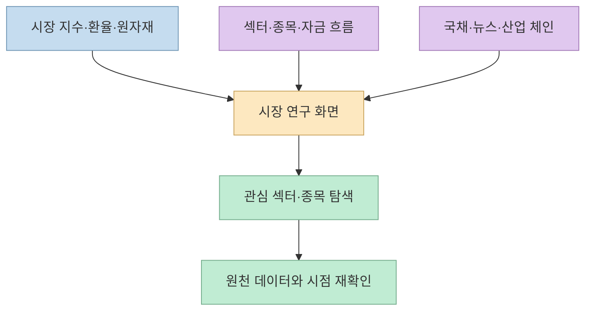
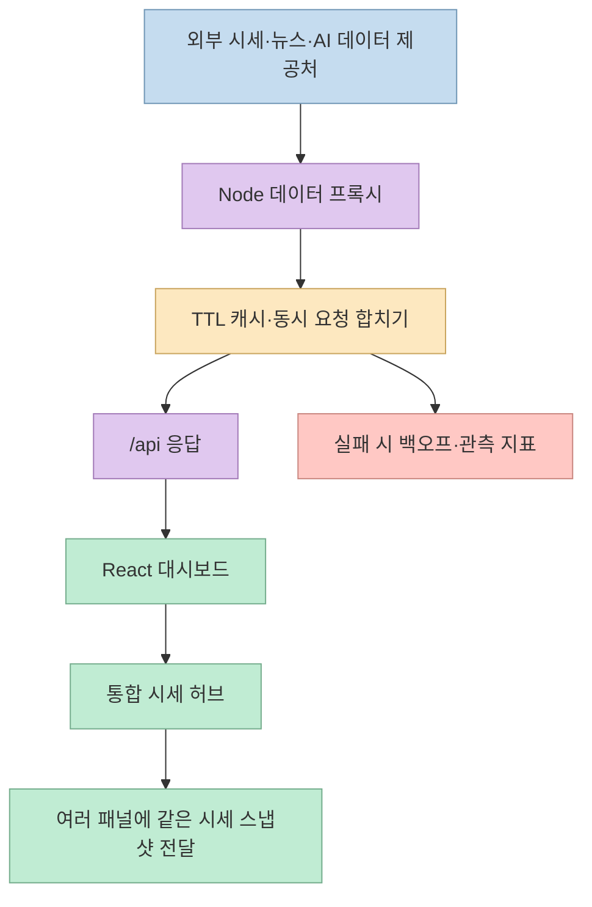
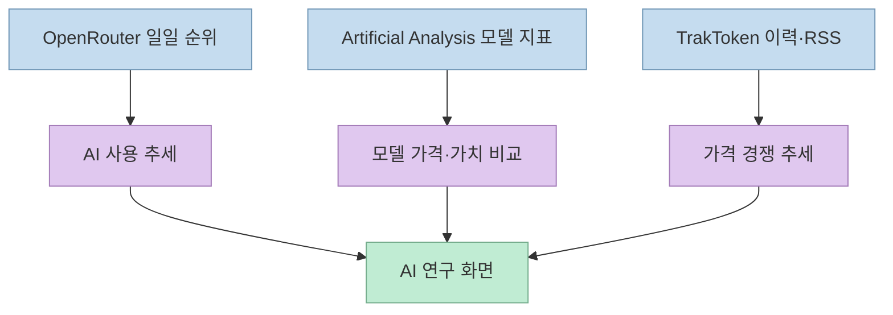
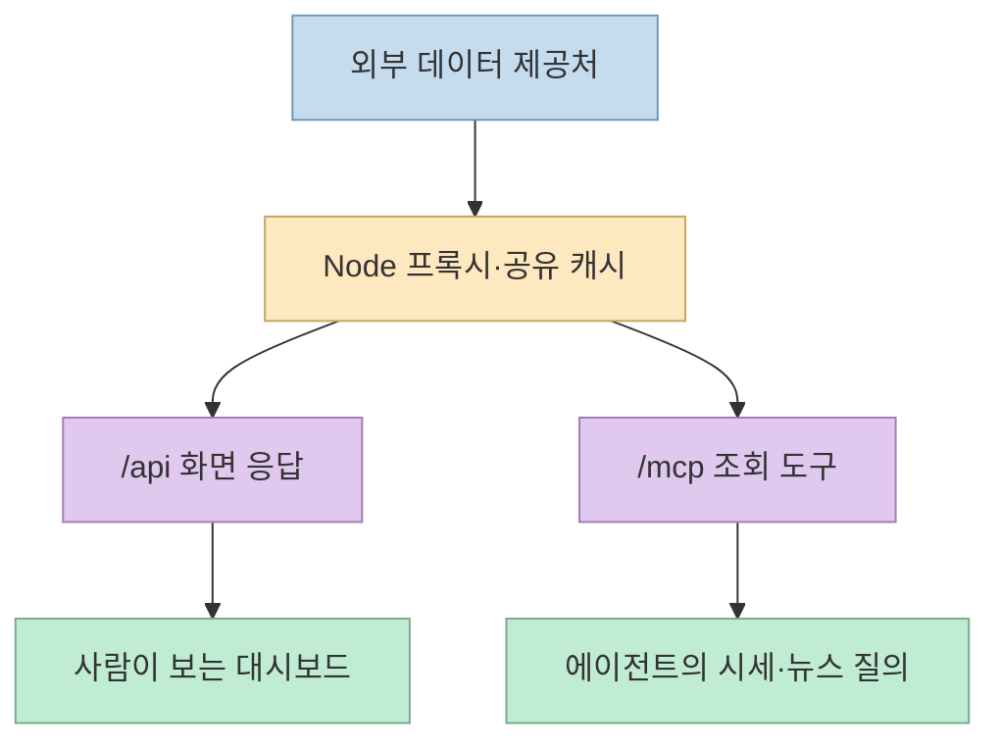

[theBigGavin/marketingdashboard](https://github.com/theBigGavin/marketingdashboard)는 이름과 달리 광고 성과를 집계하는 마케팅 분석기가 아니다. README의 제품명은 **Market Research Cockpit(mrd)** 으로, 중국·홍콩·미국 시장 지수와 원자재, 미국 국채 수익률, 섹터 흐름, 뉴스, 산업 밸류체인, AI 모델 사용·가격 지표를 한 화면 계열에 묶은 금융·산업 연구용 대시보드다. 이 글은 기능 목록을 나열하는 데 그치지 않고, **외부 데이터 → Node 프록시·캐시 → React 화면·MCP** 흐름과 운용상 주의점을 살펴본다. [공식 README](https://github.com/theBigGavin/marketingdashboard)

<!--more-->

## Sources

- [원본 GitHub 저장소: theBigGavin/marketingdashboard](https://github.com/theBigGavin/marketingdashboard)
- [영문 README](https://github.com/theBigGavin/marketingdashboard/blob/main/README.md)
- [통합 시세 허브 코드](https://github.com/theBigGavin/marketingdashboard/blob/main/src/lib/market.ts)
- [Node 서버 코드](https://github.com/theBigGavin/marketingdashboard/blob/main/server/index.cjs)
- [MCP 서버 코드](https://github.com/theBigGavin/marketingdashboard/blob/main/server/mcp-server.cjs)
- [공개 데모](https://mrd.hermes.cc.cd/)

2026년 9월 30일 기준 README를 HTTP로 확인하고(`scrapling-get`), 주요 구조는 공개 소스 파일과 대조했다. 이 글을 위해 서비스를 직접 배포하거나 각 시세의 정확도·지연을 측정하지는 않았다. README가 말하는 “실시간”은 **시장 원천 데이터의 정확성 보증** 이 아니라 대시보드의 반복 갱신과 데이터 집계 방식을 설명하는 표현으로 읽어야 한다. [README의 면책 조항](https://github.com/theBigGavin/marketingdashboard#%EF%B8%8F-disclaimer)

## 한 화면의 목적: 시세, 맥락, 산업 연결을 같이 보기

기본 화면은 상하이·선전, 항셍, 다우·나스닥·S&P 500 등 지수와 환율·변동성 지표를 나란히 놓고, 금·은·구리·원유·비트코인, 미국 2년·10년물 국채 수익률과 장단기 스프레드까지 확인하도록 구성됐다. 섹터 순위에서 구성 종목과 자금 흐름으로 들어가거나, 반도체·AI 컴퓨팅·전기차·로봇 등 산업 체인에 연결된 종목을 살펴보는 흐름도 README가 제시한다. 이 기능들은 **투자 결정을 자동으로 내리는 엔진** 이 아니라 여러 공개 자료를 조사 화면에 모으는 기능이다. [README 기능 목록](https://github.com/theBigGavin/marketingdashboard#-features)



기본 시황 외에 `/fin`은 실적 발표 일정·예고·기업별 추세, `/goods`는 상품 선물·현물·베이시스, `/ai`는 AI 사업자 사용량과 모델 가격을 별도 화면으로 보여 준다. 따라서 “한 화면”은 모든 정보를 한 장에 무한히 밀어 넣는다는 뜻보다는, **각 연구 과제에 필요한 패널을 동일 제품 안에서 빠르게 전환** 하는 설계에 가깝다. 이 해석은 README의 화면 구성에서 도출한 것이다. [README의 기능과 프로젝트 구조](https://github.com/theBigGavin/marketingdashboard#-project-structure)

## 데이터 파이프라인: 빠른 화면 뒤에 프록시와 여러 캐시가 있다

프런트엔드는 React 19·Vite 7·TypeScript로 만들고, 백엔드는 프레임워크 없는 Node.js `http` 서버를 사용한다. 서버가 Tencent·Sina·Eastmoney 등 외부 시세·뉴스 제공처와 AI 지표 제공처를 집계하고 `/api/*`로 프런트엔드에 전달한다. 서버는 엔드포인트별 TTL 메모리 캐시와 동시 요청 합치기, 실패 시 백오프를 적용한다. README는 시세에 짧은 캐시를, 일부 목록성 데이터에는 더 긴 캐시를 둔다고 설명한다. **브라우저 화면의 갱신 간격과 실제 거래소 데이터의 생성 시점은 같은 개념이 아니다.** [README 아키텍처](https://github.com/theBigGavin/marketingdashboard#%EF%B8%8F-architecture), [서버 코드](https://github.com/theBigGavin/marketingdashboard/blob/main/server/index.cjs)



특히 `src/lib/market.ts`의 통합 시세 허브는 여러 패널이 같은 종목을 각각 요청하는 대신, 묶어 가져온 스냅샷을 배포한다. 일반 화면은 5초, TV 모드는 10초 폴링 간격으로 정의돼 있다. 서버 쪽도 종목별 캐시와 진행 중 요청 공유로 상위 제공처 호출을 줄인다. 이는 **화면마다 서로 다른 시점의 같은 종목 가격이 보이는 문제를 줄이려는 구조** 다. 서버는 별도 DB 없이 메모리 캐시를 사용하지만, 일부 현물·AI 관련 이력은 로컬 파일에 누적하므로 “모든 데이터가 휘발된다”는 뜻은 아니다. [README의 시세 허브·캐시 설명](https://github.com/theBigGavin/marketingdashboard#%EF%B8%8F-architecture), [시세 허브 코드](https://github.com/theBigGavin/marketingdashboard/blob/main/src/lib/market.ts)

## AI 화면은 개인 사용량 계기판이 아니라 시장 지표다

AI 관련 패널은 OpenRouter의 **사업자별 일일 순위 데이터** 로 토큰 사용 추세를 비교하고, Artificial Analysis의 모델 가격·지능 지표와 TrakToken TTSI의 가격 경쟁 관련 데이터를 표시한다. 즉 내 OpenRouter 계정의 청구서나 개인 토큰 소비를 추적하는 화면이라고 설명하면 부정확하다. README 기준 일부 장기 이력은 로컬 `ttsi.csv` 파일을 추가해야 넓게 볼 수 있고, 파일이 없으면 RSS의 제한된 최근 구간으로 폴백한다. 선택적 API 키가 필요한 패널도 있으므로, 데모에서 보이는 모든 AI 데이터가 키 없는 셀프호스팅 환경에서도 동일하게 나온다고 가정해서는 안 된다. [README의 AI 기능과 프로덕션 설정](https://github.com/theBigGavin/marketingdashboard#-features), [README의 실행 안내](https://github.com/theBigGavin/marketingdashboard#-quick-start)



## MCP는 데이터를 읽는 별도 입구다

같은 Node 프로세스에는 `/mcp` 엔드포인트도 들어 있다. README와 `server/mcp-server.cjs`에서 확인되는 공개 도구는 `get_quotes`, `get_boards`, `get_futures`, `get_money_flow`, `get_news` 다섯 가지다. 각각 시세, 섹터, 선물·상품, 자금 흐름, 뉴스를 조회한다. 이 도구 목록에는 주문 실행이나 포트폴리오 매매 기능이 없다. AI 에이전트가 화면을 스크래핑하지 않고 같은 서버의 캐시된 시장 데이터를 질의할 수 있다는 점이 구조적 특징이다. 다만 에이전트가 받은 시세도 데이터 원천의 지연·오류 가능성을 그대로 가진다. [README의 MCP 설명](https://github.com/theBigGavin/marketingdashboard#-mcp-server-phase-15), [MCP 서버 코드](https://github.com/theBigGavin/marketingdashboard/blob/main/server/mcp-server.cjs)



## 실전 적용 포인트

개발 환경은 Node.js 18 이상과 일부 프록시 경로에 필요한 `curl`을 전제로 한다. README의 기본 절차는 `npm install` 뒤 `npm run dev`, 프로덕션은 `npm run build` 뒤 `npm start`다. 프로덕션에서는 한 Node 프로세스가 API와 빌드된 프런트엔드를 함께 제공하며 Docker 실행 예시도 있다. 공개 데모는 별도 로그인과 키 없이 열 수 있다고 README는 설명하지만, 관리형 호스팅 상품은 아직 준비 중이며 가격·출시일이 없다. 셀프호스팅 코드는 MIT 라이선스다. 아래 명령은 문서의 사용법을 요약한 **미실행 예시** 다. [README의 실행·호스팅 안내](https://github.com/theBigGavin/marketingdashboard#-quick-start), [MIT 라이선스](https://github.com/theBigGavin/marketingdashboard/blob/main/LICENSE)

```bash
npm install
npm run dev

# 프로덕션 빌드·실행
npm run build
npm start
```

PWA 설치 외에 macOS WKWebView 셸, Android TV WebView 앱, iOS Scripting 스크립트도 제공한다. 이들은 별도의 시장 데이터 엔진이라기보다 같은 웹 화면을 기기별 조작 방식에 맞게 감싼 배포 형태다. 예를 들어 TV 모드는 리모컨 방향키 이동과 패널 확대, 느린 GPU를 고려한 렌더링·폴링 조정을 설명한다. 화면이 여러 기기에서 열린다고 해서 원천 데이터의 실시간성이나 시세 사용 권한 문제가 사라지지는 않는다. [README의 기기별 실행 안내](https://github.com/theBigGavin/marketingdashboard#-android-tv-app)

실무에서 참고한다면 먼저 **데이터 제공처의 지연·안정성, 키가 필요한 AI 패널, 캐시 갱신 기준, 장애 시 오래된 값 표시** 를 구분해 점검하는 편이 좋다. 투자 판단에 쓰는 경우에는 거래소·공식 공시 등 원천 자료로 시간을 다시 확인해야 한다. 저장소도 공개 웹 데이터는 지연되거나 부정확할 수 있으며 투자 조언이 아니라고 명시한다. 이 글 역시 도구의 구조를 소개하는 글이지 종목·거래 추천이 아니다. [README 아키텍처·면책 조항](https://github.com/theBigGavin/marketingdashboard)

## 핵심 요약

- `marketingdashboard`의 실제 제품은 광고 분석기가 아니라 시장·산업 연구용 **Market Research Cockpit** 이다. [README](https://github.com/theBigGavin/marketingdashboard)
- Node 프록시가 외부 자료를 집계·캐시하고 React 화면과 다섯 개의 공개 MCP 조회 도구에 제공한다. [README](https://github.com/theBigGavin/marketingdashboard#%EF%B8%8F-architecture), [MCP 코드](https://github.com/theBigGavin/marketingdashboard/blob/main/server/mcp-server.cjs)
- AI 화면은 사업자별 토큰 사용 추세·모델 가격 경쟁 지표이며, 개인 계정의 사용량 내역과는 다르다. 일부 데이터에는 키나 별도 이력 파일이 필요하다. [README](https://github.com/theBigGavin/marketingdashboard#-features)
- 화면이 자주 갱신돼도 외부 공개 데이터의 지연·오류 가능성은 남는다. 연구 보조 도구로 사용하고 중요한 숫자는 원천 자료로 교차 확인해야 한다. [README 면책 조항](https://github.com/theBigGavin/marketingdashboard#%EF%B8%8F-disclaimer)

## 결론

이 프로젝트의 흥미로운 점은 많은 패널을 그렸다는 사실보다, **시장 데이터의 수집·캐시를 한곳에 모아 사람의 화면과 에이전트의 MCP 질의에 재사용** 한다는 구조다. 반면 외부 공개 엔드포인트에 기대는 제품인 만큼 “5초마다 바뀌는 화면”을 “검증된 초실시간 시세”로 받아들이면 안 된다. 기능을 평가할 때는 보기 좋은 한 화면뿐 아니라 데이터 출처와 갱신·장애 동작을 함께 확인해야 한다.
