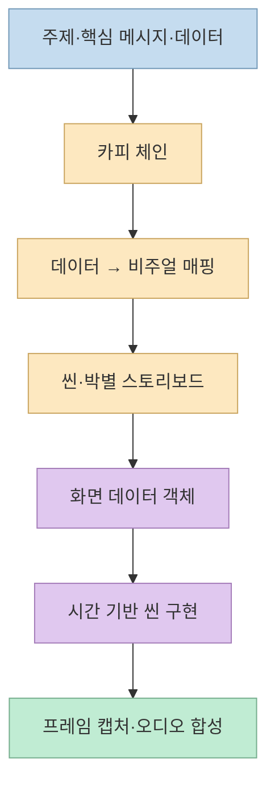
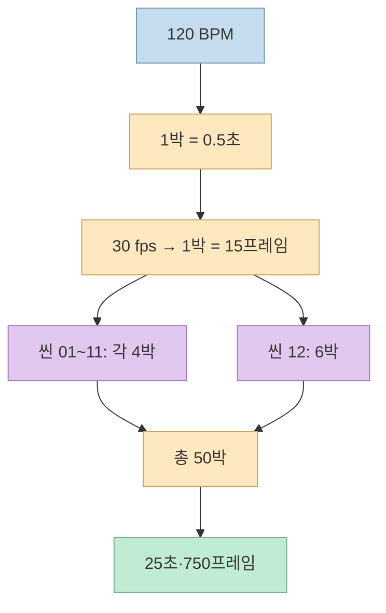
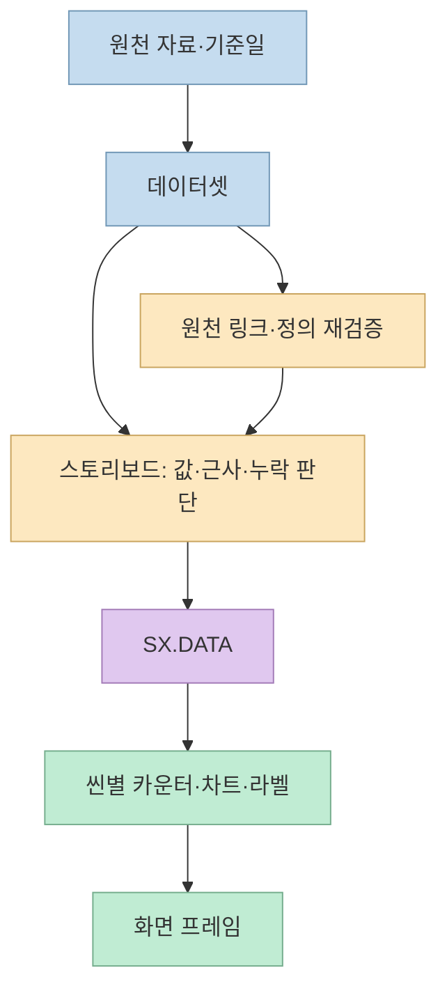
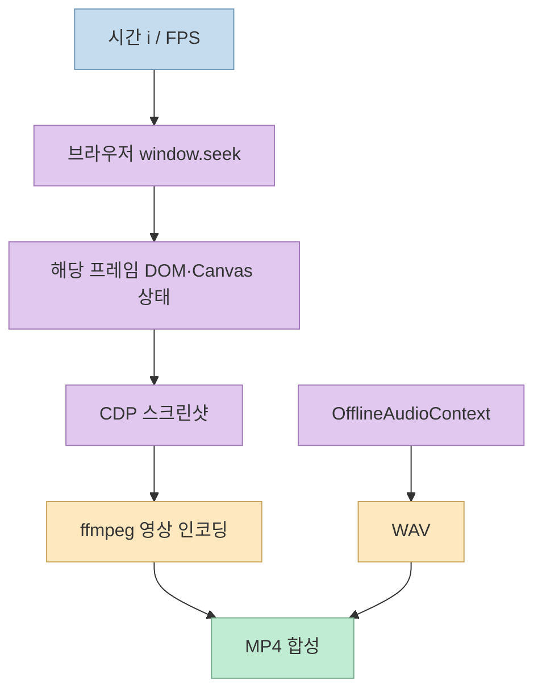

[JTech-CO/Motiongraphic](https://github.com/JTech-CO/Motiongraphic)은 HTML로 만든 데이터 모션그래픽과 제작 자료를 함께 공개한 저장소다. 2026년 9월 30일 확인한 공개 목록에는 **SpaceX 2002—2026** 작품 한 편이 있으며, 완성 MP4뿐 아니라 템플릿 프롬프트, 채워 넣은 프롬프트, 스토리보드, 데이터셋, 브라우저 소스와 렌더 스크립트가 연결돼 있다. 따라서 이 저장소의 가치는 “프롬프트 한 줄로 영상을 자동 생성한다”는 주장보다 **데이터를 검토 가능한 기획 문서와 시간 기반 코드로 옮기는 제작 과정** 에 있다. [저장소 README](https://github.com/JTech-CO/Motiongraphic/blob/main/README.md)

<!--more-->

## Sources

- [원본 저장소: JTech-CO/Motiongraphic](https://github.com/JTech-CO/Motiongraphic)
- [작품 목록과 영상 링크](https://github.com/JTech-CO/Motiongraphic/blob/main/README.md)
- [재사용용 템플릿 프롬프트](https://github.com/JTech-CO/Motiongraphic/blob/main/Motion%20Graphic%20Template%20Prompt.txt)
- [SpaceX 작품 안내·실행 조건](https://github.com/JTech-CO/Motiongraphic/blob/main/1.%20SpaceX%20Motion/README.md)
- [스토리보드와 기획 변경 기록](https://github.com/JTech-CO/Motiongraphic/blob/main/1.%20SpaceX%20Motion/prompt/STORYBOARD.md)
- [데이터셋](https://github.com/JTech-CO/Motiongraphic/blob/main/1.%20SpaceX%20Motion/dataset/SpaceX_Dataset_2002-2026.md), [화면 데이터 객체](https://github.com/JTech-CO/Motiongraphic/blob/main/1.%20SpaceX%20Motion/js/data.js)
- [타임라인 코드](https://github.com/JTech-CO/Motiongraphic/blob/main/1.%20SpaceX%20Motion/js/core/timeline.js), [렌더 엔진](https://github.com/JTech-CO/Motiongraphic/blob/main/1.%20SpaceX%20Motion/js/engine.js), [MP4 렌더 스크립트](https://github.com/JTech-CO/Motiongraphic/blob/main/1.%20SpaceX%20Motion/tools/render.mjs)

원본 저장소는 HTTP 추출(`scrapling-get`)로 확인하고, 중요한 구조와 수치는 위의 공개 파일 원문과 대조했다. 이 글을 위해 제공된 MP4를 다시 렌더하거나 SpaceX 데이터셋의 모든 수치를 독립 검증하지는 않았다. 아래 설명은 **공개된 제작 구현에 대한 분석** 이지 영상 속 개별 수치의 정확성 보증이 아니다.

## 프롬프트보다 먼저 봐야 할 것: 기획 산출물의 순서

템플릿은 주제·목적·대상·핵심 메시지·데이터 JSON·CTA·브랜드·언어와 해상도·프레임률·길이·BPM을 입력으로 받는다. 그런데 곧바로 코드를 만들도록 하지 않는다. 먼저 **카피 체인 → 데이터와 시각 표현의 매핑 → 박별 이벤트가 있는 씬 표** 를 출력하고, 확인을 받은 뒤 구현하도록 설계했다. 숫자를 화면에 흩뿌리는 대신 한 문장의 이야기를 씬마다 나눠 보여 주려는 제약이다. 템플릿은 목록·비율·시계열·규모·절차 등에 각각 어울리는 시각 표현을 제안하고, 동일한 핵심 데이터를 다른 형식으로 다시 등장시키도록 요구한다. [템플릿의 입력·1단계·매핑 사전](https://github.com/JTech-CO/Motiongraphic/blob/main/Motion%20Graphic%20Template%20Prompt.txt)

실제 [SpaceX 스토리보드](https://github.com/JTech-CO/Motiongraphic/blob/main/1.%20SpaceX%20Motion/prompt/STORYBOARD.md)는 이 단계가 단순한 장식 문서가 아님을 보여 준다. 씬별 카피와 배경·시그니처 모션·박별 사건·전환을 적고, 화면 표기값이 데이터셋의 어느 절에서 왔는지도 기록한다. 예를 들어 범위값에 `~`를 붙이는 방식, 자료에 없는 2011년 발사량을 빈 값으로 남기는 방식, 마지막 씬을 6박으로 늘리는 이유가 별도로 설명돼 있다. 특히 2020년 구독자 값처럼 부등식으로 주어진 수치를 연속 카운터의 확정 목표값으로 쓰지 않은 결정은 **모션 연출이 데이터의 의미를 왜곡하지 않게 하는 편집 판단** 이다. [스토리보드 데이터 사용표와 변경 기록](https://github.com/JTech-CO/Motiongraphic/blob/main/1.%20SpaceX%20Motion/prompt/STORYBOARD.md)

## 25초를 750프레임으로 나누는 타임라인

예제 사양은 1920×1080, 30fps, 120BPM, 25초다. 120BPM이면 한 박은 `60/120 = 0.5초`, 30fps에서는 `0.5×30 = 15프레임`이다. 첫 11개 씬은 각 4박·2초, 마지막 씬은 6박·3초이므로 총 `11×4 + 6 = 50박`, `50×15 = 750프레임`이 된다. 코드의 `SCENE_BEATS`는 이 구성을 그대로 표현한다. 씬 시각을 이전 씬의 부동소수점 결과에 계속 더하는 대신 **절대 박 번호에서 초와 프레임을 직접 계산** 한다. [타임라인 코드](https://github.com/JTech-CO/Motiongraphic/blob/main/1.%20SpaceX%20Motion/js/core/timeline.js), [스토리보드 사양](https://github.com/JTech-CO/Motiongraphic/blob/main/1.%20SpaceX%20Motion/prompt/STORYBOARD.md)

이 정수 박 기준 설계의 실용적 이점은 컷이 음악 경계에서 조금씩 밀리지 않는다는 것이다. 타임라인은 `beatFrame(b) = b × 60 × FPS / BPM`을 제공하고, 전환을 박보다 4프레임 먼저 시작하도록 `LEAD = 4 / FPS`로 둔다. 다만 “항상 모든 BPM과 FPS 조합에서 정수 프레임이 된다”는 일반 법칙은 아니다. **이 작품의 120BPM·30fps 조합에서 한 박이 정확히 15프레임** 이기 때문에 특히 간결하게 맞아떨어진다. 다른 템포로 재사용할 때는 박 경계의 프레임 반올림 정책을 따로 정해야 한다. [타임라인 상수](https://github.com/JTech-CO/Motiongraphic/blob/main/1.%20SpaceX%20Motion/js/core/timeline.js)

## 화면 숫자의 출처와 재현 가능한 프레임

작품의 `js/data.js`는 화면에 나타나는 사실값을 `SX.DATA` 한 객체에 모아 둔다. 씬은 이 객체를 참조하며, 근삿값 여부는 `approx: true`, 자료에 없는 연도는 `v: null`처럼 데이터의 상태로 표현한다. 이는 단순한 코드 정리 이상이다. 장면마다 숫자를 하드코딩하면 나중에 값이 바뀌었을 때 자막·차트·카운터가 서로 달라질 수 있는데, 단일 객체는 그 위험을 줄인다. 그러나 이 객체가 **원천 출처 검증까지 자동으로 해결해 주지는 않는다.** 데이터셋·스토리보드·코드 사이에 값이 일치하는지와, 원천 자료가 실제로 그 값을 뒷받침하는지는 별개의 검증이다. [화면 데이터 객체](https://github.com/JTech-CO/Motiongraphic/blob/main/1.%20SpaceX%20Motion/js/data.js), [데이터셋](https://github.com/JTech-CO/Motiongraphic/blob/main/1.%20SpaceX%20Motion/dataset/SpaceX_Dataset_2002-2026.md)

브라우저 쪽에서는 각 씬이 `build()`로 요소를 만들고 `update(lt)`로 **해당 씬의 지역 시각** 에 따른 상태를 그린다. `engine.render(t)`는 전역 시각에서 활성 씬, 전환 창, HUD와 텍스처를 갱신한다. `main.js`의 `window.seek(t)`는 임의 시각으로 이동하고 같은 렌더 경로를 호출한다. 프로젝트는 고정 시드 난수를 사용하고 매 프레임의 상태를 시간 `t`로부터 계산하므로, 실시간 재생을 처음부터 기다리지 않고도 특정 프레임을 다시 요청할 수 있도록 설계했다. 여기서 README의 “순수 함수”는 **시간에 따른 화면 상태가 재현 가능하다는 설계 표현** 으로 이해해야 한다. 실제 `render(t)` 구현은 DOM 스타일을 변경하므로 부작용이 전혀 없는 수학적 순수 함수라는 뜻은 아니다. [씬 엔진](https://github.com/JTech-CO/Motiongraphic/blob/main/1.%20SpaceX%20Motion/js/engine.js), [플레이어와 공개 API](https://github.com/JTech-CO/Motiongraphic/blob/main/1.%20SpaceX%20Motion/js/main.js), [작품 README](https://github.com/JTech-CO/Motiongraphic/blob/main/1.%20SpaceX%20Motion/README.md)

## 브라우저 재생과 MP4 출력은 다른 경로다

작품은 `index.html`을 브라우저에서 직접 열어 재생할 수 있고, `?t=12.5`로 시작 시각을 지정하거나 `?grid`로 박 그리드를 표시할 수 있다. `?capture`는 캡처용 1:1 무대와 컨트롤 숨김을 적용한다. 재생 화면에는 정지·재생, 한 프레임 또는 한 박 이동, 씬 점프, 음소거 등의 조작이 있다. 브라우저 정책상 오디오는 첫 클릭 뒤에 시작된다. 이는 **검토용 플레이어** 의 경로다. [작품 실행·컨트롤 안내](https://github.com/JTech-CO/Motiongraphic/blob/main/1.%20SpaceX%20Motion/README.md)

MP4 출력은 별도 `node tools/render.mjs` 경로를 사용한다. 이 스크립트는 로컬 HTTP 서버를 띄우고, 설치된 Chrome 또는 Edge를 헤드리스로 실행한 뒤, Node 내장 `WebSocket`으로 Chrome DevTools Protocol에 연결한다. 페이지에서 FPS·길이·무대 크기를 읽고 각 `i/FPS` 시각으로 `seek`한 다음 스크린샷을 캡처해 ffmpeg에 전달한다. 오디오는 페이지 내부 `OfflineAudioContext`로 WAV를 만든 후 영상과 합친다. 따라서 npm 패키지가 필요 없다는 설명은 **실행 도구까지 모두 내장됐다는 뜻이 아니다.** 렌더링에는 Node 22 이상, Chrome/Edge, PATH의 ffmpeg가 필요하다. `--from`·`--to`로 일부 구간만, `--stills`로 확인용 이미지들만, `--wav`로 오디오만 뽑는 옵션도 있다. [렌더 스크립트](https://github.com/JTech-CO/Motiongraphic/blob/main/1.%20SpaceX%20Motion/tools/render.mjs), [실행 조건](https://github.com/JTech-CO/Motiongraphic/blob/main/1.%20SpaceX%20Motion/README.md)

흥미로운 점은 **템플릿이 최종 구현과 같지 않다** 는 것이다. 템플릿의 기술 요구에는 단일 HTML과 Puppeteer 캡처가 적혀 있지만, 실제 예제는 `index.html`·`css/`·`js/`로 분리했고 Puppeteer 패키지 대신 CDP를 직접 호출한다. 스토리보드는 두 변경을 명시적으로 기록한다. 따라서 이 저장소를 모방할 때 템플릿의 문구를 완성물의 사양으로 오독해서는 안 된다. 템플릿은 제작 방향을 제시하고, 예제는 검토·유지보수·의존성 조건에 맞춰 그 방향을 구현한 한 사례다. [템플릿 기술 요구](https://github.com/JTech-CO/Motiongraphic/blob/main/Motion%20Graphic%20Template%20Prompt.txt), [스토리보드의 변경 사유](https://github.com/JTech-CO/Motiongraphic/blob/main/1.%20SpaceX%20Motion/prompt/STORYBOARD.md)

## 실전 적용 포인트

이 방식을 다른 주제에 적용한다면 먼저 **메시지 한 문장과 데이터 정의** 를 고정하는 편이 좋다. 같은 “사용자 수”라도 누적 가입자, 월간 활성 사용자, 유료 구독자는 서로 다른 값이다. 그다음 화면마다 필요한 숫자·단위·기준일·근사 여부·출처 URL을 정리하고, 스토리보드에서 어느 박에 어떤 값이 등장하는지 추적한다. 현재 예제의 데이터셋은 참고자료 이름과 우선순위를 제시하지만, 모든 개별 주장에 대한 직접 링크가 붙어 있지는 않으므로 **영상의 공개·재사용 전에 주장별 원천 링크를 다시 붙여 검증** 하는 것이 안전하다. 이 권고는 공개 데이터셋과 스토리보드의 구조를 보고 도출한 실무적 판단이다. [데이터셋](https://github.com/JTech-CO/Motiongraphic/blob/main/1.%20SpaceX%20Motion/dataset/SpaceX_Dataset_2002-2026.md), [스토리보드 데이터 사용표](https://github.com/JTech-CO/Motiongraphic/blob/main/1.%20SpaceX%20Motion/prompt/STORYBOARD.md)

구현 단계에서는 `SX.DATA`처럼 화면 값을 한곳으로 모으고, 박·초·프레임 환산을 타임라인 모듈 한곳에 두며, **임의 시각을 다시 그릴 수 있는 `seek(t)` 경로** 를 유지해야 한다. 그런 다음 전체 750프레임을 바로 렌더하기보다 몇 개의 주요 시각을 스틸로 뽑아 잘림·폰트 폴백·숫자 표기·전환 연결을 확인하는 순서가 효율적이다. 예제는 외부 웹폰트 CDN을 사용하지 않고 로컬 폰트와 시스템 폴백을 정의하지만, 서로 다른 머신에서 완전히 동일한 글꼴 형태가 나온다고 보장하지는 않는다. 완전한 픽셀 단위 재현성이 필요하면 렌더 환경과 사용 폰트도 고정해야 한다. [작품 README의 폰트·렌더 안내](https://github.com/JTech-CO/Motiongraphic/blob/main/1.%20SpaceX%20Motion/README.md)

마지막으로 공개 저장소에서 코드를 읽을 수 있다는 사실과 재배포·수정 권한은 별개다. 2026년 9월 30일 확인한 저장소 루트와 GitHub 저장소 메타데이터에서는 별도 라이선스가 확인되지 않았다. 따라서 예제를 복사해 상업용 템플릿으로 재배포하기 전에는 권리자에게 이용 조건을 확인하는 편이 좋다. 이는 이 프로젝트의 이용 허용 범위를 법적으로 단정하는 말이 아니라, **라이선스 표기가 보이지 않는 공개 코드에 대한 주의** 다. [저장소 루트](https://github.com/JTech-CO/Motiongraphic), [GitHub 라이선스 메타데이터](https://api.github.com/repos/JTech-CO/Motiongraphic), [GitHub의 라이선스 안내](https://docs.github.com/en/repositories/managing-your-repositorys-settings-and-features/customizing-your-repository/licensing-a-repository)

## 핵심 요약

- Motiongraphic은 현재 공개 목록상 **완성 영상 한 편과 그 제작 근거를 함께 볼 수 있는 예제 저장소** 다.
- 핵심 파이프라인은 **입력 데이터 → 카피·매핑·스토리보드 → 단일 화면 데이터 객체 → 시간 기반 씬 → CDP 캡처·ffmpeg 합성** 이다.
- 예제의 120BPM·30fps에서는 1박이 15프레임이므로 50박·25초가 정확히 750프레임으로 떨어진다.
- 템플릿의 단일 HTML·Puppeteer 요구와 실제 분할 파일·직접 CDP 구현을 구분해야 한다.
- 재사용 전에는 개별 수치의 원천과 라이선스, 렌더 환경·폰트까지 확인해야 한다.

## 결론

이 저장소가 보여 주는 재사용 가능한 아이디어는 특정 SpaceX 장면 효과가 아니라, **데이터·기획·타이밍·렌더링을 서로 확인할 수 있는 산출물로 분리한 방식** 이다. 영상을 브라우저에서 만들더라도 이야기와 수치의 검증을 앞단에 두고, 뒤에서는 `seek(t)`로 원하는 프레임을 다시 만들 수 있어야 결과물을 안정적으로 다듬을 수 있다.
