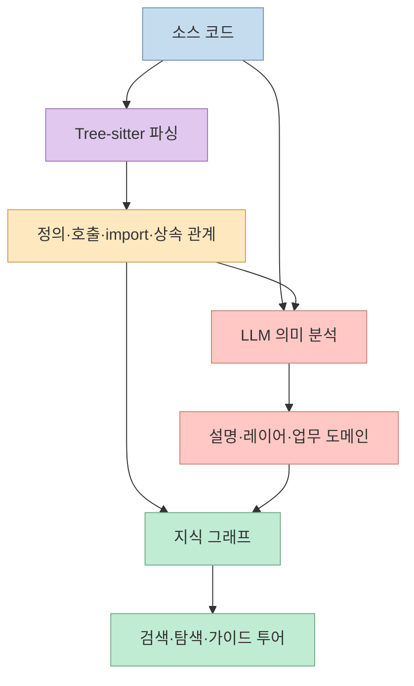
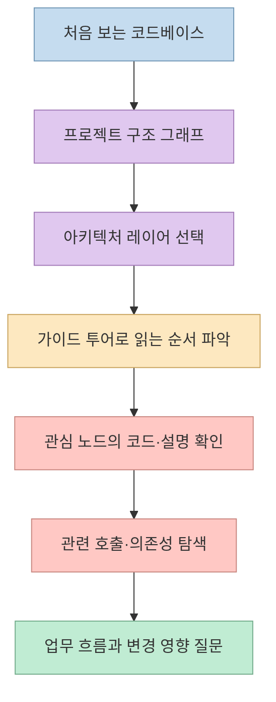
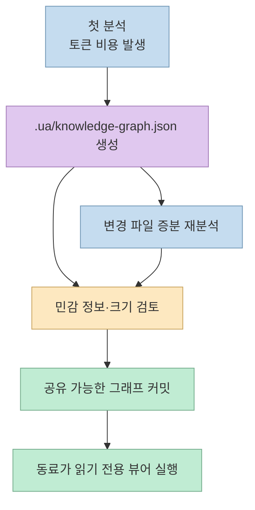

[Understand Anything](https://understand-anything.com/)의 문구는 “Graphs that teach the codebase”다. 그래프의 노드와 연결 수를 보여 주는 데서 끝나지 않고, 코드가 어떤 **업무 흐름** 을 구성하고 무엇부터 읽어야 하는지 알려 주겠다는 뜻이다. 이 블로그는 앞서 [프로젝트의 기본 개념](/post/2026/05/2026-05-24-understand-anything-interactive-code-knowledge-graph/)과 [Graphify 비교](/post/2026/05/2026-05-28-understand-anything-vs-graphify-code-graph-comparison/)를 다뤘다. 이번에는 현재 공식 사이트와 README에서 확인되는 **분석 파이프라인, 로컬 데이터 공유, 언어 설정** 에 초점을 맞춘다. [공식 사이트](https://understand-anything.com/), [공식 저장소](https://github.com/Egonex-AI/Understand-Anything)

<!--more-->

## Sources

- [Understand Anything 공식 사이트](https://understand-anything.com/)
- [Egonex-AI/Understand-Anything 공식 저장소 및 README](https://github.com/Egonex-AI/Understand-Anything)
- [공식 라이브 데모](https://understand-anything.com/)

공식 사이트의 텍스트와 현재 저장소 README를 읽어 기능·설치 조건을 대조했다(`web-http`). 실제 사용자 코드베이스에 플러그인을 설치하거나 분석 비용·정확도를 실측한 글은 아니다. 옛 저장소 주소인 `Lum1104/Understand-Anything`은 현재 `Egonex-AI/Understand-Anything`으로 리디렉션된다. [현재 저장소](https://github.com/Egonex-AI/Understand-Anything)

## 구조를 추출하는 일과 의미를 설명하는 일을 분리한다

현재 README는 **Tree-sitter + LLM** 조합을 명시한다. Tree-sitter 쪽은 import·export, 함수·클래스 정의, 호출 지점, 상속 등 코드의 구조적 사실을 파싱한다. 이 정보로 관계를 만들고 변경된 파일을 감지한다. LLM 쪽은 파싱 결과와 소스 코드를 함께 보고 평이한 설명, 아키텍처 계층, 비즈니스 도메인 연결, 학습용 투어를 생성한다. 따라서 “AI가 코드를 전부 읽고 자유롭게 그래프를 상상한다”보다, **재현 가능한 구조 추출 위에 의미 설명을 얹는 설계** 로 이해하는 편이 정확하다. [README의 분석 구조](https://github.com/Egonex-AI/Understand-Anything#tree-sitter--llm-hybrid)



공식 홈페이지는 구조 그래프와 별도로 **업무 지식 보기** 를 강조한다. 사용자가 파일·함수 연결을 확인하거나, 인증·결제·사용자 생애주기처럼 코드가 구성하는 도메인과 흐름을 볼 수 있다는 설명이다. 다만 이런 업무 의미는 구조적 관계와 달리 LLM의 해석이 들어가는 결과다. 중요한 설계 판단이나 변경 영향은 그래프의 설명만 믿지 말고 해당 코드와 테스트를 다시 확인해야 한다. 마지막 문장은 분석 방식에서 도출한 **실무상 추론** 이다. [공식 사이트의 업무 흐름 설명](https://understand-anything.com/), [README의 구조·의미 분담](https://github.com/Egonex-AI/Understand-Anything#tree-sitter--llm-hybrid)

## “가르치는 그래프”는 학습 순서를 제공한다

공식 사이트는 계층적 탐색, 퍼지 검색, 유형별 필터, 도메인 매핑, 업무 흐름, AI가 만든 투어를 핵심 요소로 소개한다. README의 Guided Tours는 아키텍처를 **의존성 순서** 로 설명하는 워크스루다. 그래프를 처음 보는 사람이 수백 개의 노드 앞에서 헤매지 않도록, 무엇을 먼저 보고 다음에 어떤 관계를 따라갈지 안내하는 기능이 제목의 “teach”에 해당한다. [공식 사이트의 기능 설명](https://understand-anything.com/), [README의 Guided Tours](https://github.com/Egonex-AI/Understand-Anything#-guided-tours)



`/understand`는 프로젝트 스캔, 파일 분석, 아키텍처 판단, 투어 생성, 그래프 검토 역할을 오케스트레이션한다. 추가로 `/understand-domain`은 도메인 분석, `/understand-knowledge`는 위키 문서 분석 역할을 사용한다. 파일 분석은 병렬로 수행되고, 재실행 때는 변경된 파일만 다시 분석하는 증분 흐름을 지원한다. 다만 README는 첫 전체 분석이 큰 코드베이스에서 **상당한 토큰을 소비할 수 있다** 고 명시하므로, 학습 효과와 초기 비용을 함께 고려해야 한다. [README의 파이프라인과 증분 분석](https://github.com/Egonex-AI/Understand-Anything#multi-agent-pipeline), [README의 토큰 사용 안내](https://github.com/Egonex-AI/Understand-Anything#-quick-start)

## `.ua/` 그래프는 팀의 공유 자산이 될 수 있다

현재 README는 생성 그래프의 기본 저장 경로를 `.ua/knowledge-graph.json`으로 안내한다. 이전 방식의 `.understand-anything/` 디렉터리가 이미 있는 프로젝트에서는 그 경로를 계속 쓴다. 이는 예전 소개 글의 경로를 무조건 현재 기본값으로 사용하면 안 된다는 뜻이다. 팀은 그래프 JSON을 버전 관리에 넣어 동료에게 공유할 수 있지만, `.ua/intermediate/`와 `.ua/diff-overlay.json`은 로컬 임시 산출물로 제외하라고 안내한다. [README의 데이터 경로와 공유 지침](https://github.com/Egonex-AI/Understand-Anything#-share-the-graph-with-your-team)



이미 그래프가 있는 프로젝트라면 동료는 별도 LLM 분석 없이 **읽기 전용 뷰어** 를 열 수 있다. README의 조건은 Node.js 18 이상이며, 뷰어는 로컬 디스크의 그래프를 제공하고 LLM 호출을 하지 않는다고 설명한다. 즉 “그래프 생성에는 AI 비용이 들 수 있지만 이미 생성된 결과를 탐색하는 데는 AI가 필수는 아니다”라는 사용 경로가 분명해졌다. 그래프가 코드와 설명을 담는 만큼, 외부에 공개되는 저장소에 커밋하기 전 민감 정보가 포함됐는지 살피는 것은 실무상 필요한 **추론적 주의사항** 이다. [README의 읽기 전용 뷰어](https://github.com/Egonex-AI/Understand-Anything#view-the-dashboard-without-claude-code), [README의 공유 지침](https://github.com/Egonex-AI/Understand-Anything#-share-the-graph-with-your-team)

## 한국어 출력과 설치 경로를 현재 문서대로 확인한다

README는 `/understand --language ko`로 **노드 설명, 대시보드 UI, 가이드 투어** 를 한국어로 생성할 수 있다고 안내한다. 첫 실행에서 언어 인자를 생략하면 대화 언어를 감지하고, 영어가 아닌 경우 확인을 거쳐 선택을 프로젝트 설정에 저장한다. 자동 감지보다 결과 언어를 명시하고 싶다면 `--language ko`가 분명한 선택이다. [README의 언어 설정](https://github.com/Egonex-AI/Understand-Anything#-quick-start)

공식 사이트의 시작 명령은 Claude Code용 마켓플레이스 설치 후 `/understand` 실행이다. Codex 등 다른 도구도 지원하지만 명령 접두사와 설치 방식이 다르다. README는 Codex에서 `/understand` 대신 `$understand`를 사용한다고 적는다. 따라서 다른 에이전트의 설치 예시를 그대로 복사하기보다 **자신의 호스트에 맞는 공식 설치 절차** 를 확인해야 한다. 아래는 실행하지 않은 문서상의 예시다. [공식 사이트의 시작 안내](https://understand-anything.com/), [README의 멀티 플랫폼 설치 안내](https://github.com/Egonex-AI/Understand-Anything#-multi-platform-installation)

```text
Claude Code: /understand
Codex:       $understand
한국어 출력: --language ko
```

## 실전 적용 포인트

먼저 [공식 라이브 데모](https://understand-anything.com/)에서 그래프의 계층 이동, 검색, 노드 설명과 투어가 자신이 원하는 코드 이해 방식인지 살펴볼 수 있다. 실제 프로젝트에 적용한다면 작은 저장소에서 시작해 그래프의 구조적 연결과 설명 품질을 코드와 대조하는 편이 좋다. 이후 큰 저장소로 넓히되 초기 토큰 예산을 잡고, 공유 전에는 그래프 JSON의 민감 정보와 크기를 검토한다. 이 순서는 공식 기능·비용·공유 지침을 조합한 **권장 절차** 이지, 설치만으로 정확한 그래프가 보장된다는 의미는 아니다. [라이브 데모](https://understand-anything.com/), [README](https://github.com/Egonex-AI/Understand-Anything)

## 핵심 요약

- 현재 프로젝트는 Tree-sitter의 구조 추출과 LLM의 의미 설명을 분리해 **관계의 재현성** 과 **학습용 설명** 을 함께 추구한다. [README](https://github.com/Egonex-AI/Understand-Anything#tree-sitter--llm-hybrid)
- 기본 그래프 경로는 `.ua/knowledge-graph.json`이며, 기존 `.understand-anything/` 프로젝트는 이전 경로를 유지한다. [README](https://github.com/Egonex-AI/Understand-Anything#-quick-start)
- 생성된 그래프는 팀에 공유하고 Node.js 기반 읽기 전용 뷰어로 LLM 호출 없이 탐색할 수 있다. [README](https://github.com/Egonex-AI/Understand-Anything#view-the-dashboard-without-claude-code)
- 한국어 출력은 `--language ko`로 지정할 수 있지만, 초기 전체 분석의 토큰 비용과 LLM 설명의 정확성 검토는 별개다. [README](https://github.com/Egonex-AI/Understand-Anything#-quick-start)

## 결론

Understand Anything의 현재 모습은 그래프를 만드는 도구보다 **코드베이스를 가르치는 데이터·인터페이스·운영 흐름** 에 가깝다. 그래프를 팀에 재사용할 수 있는 점은 매력적이지만, 그것이 코드를 직접 읽고 테스트하는 일을 대체하지는 않는다. 가장 유용한 사용법은 그래프에서 출발점을 찾고, 중요한 판단은 원본 코드로 확인하는 것이다.
