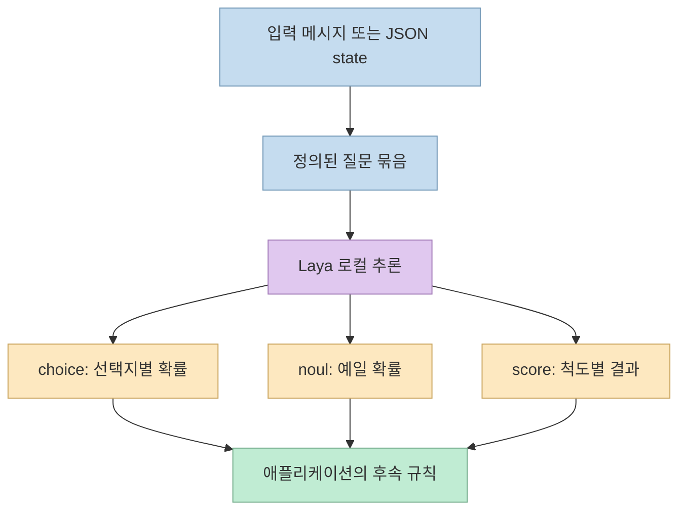
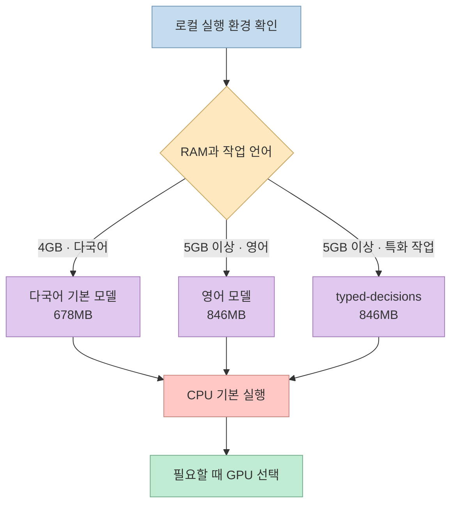
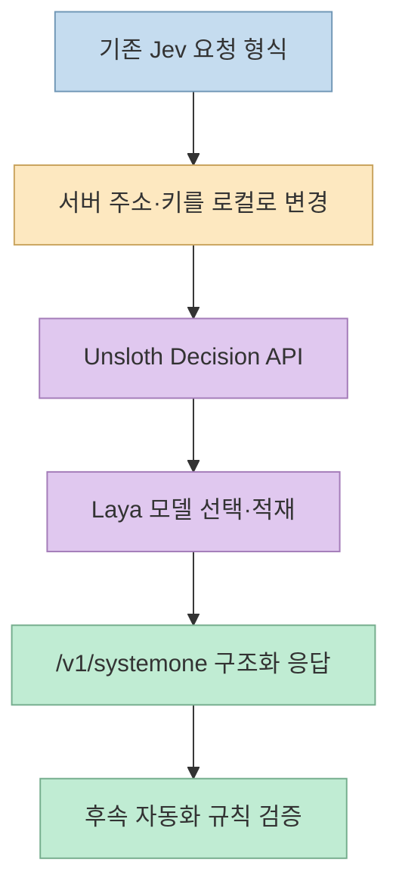
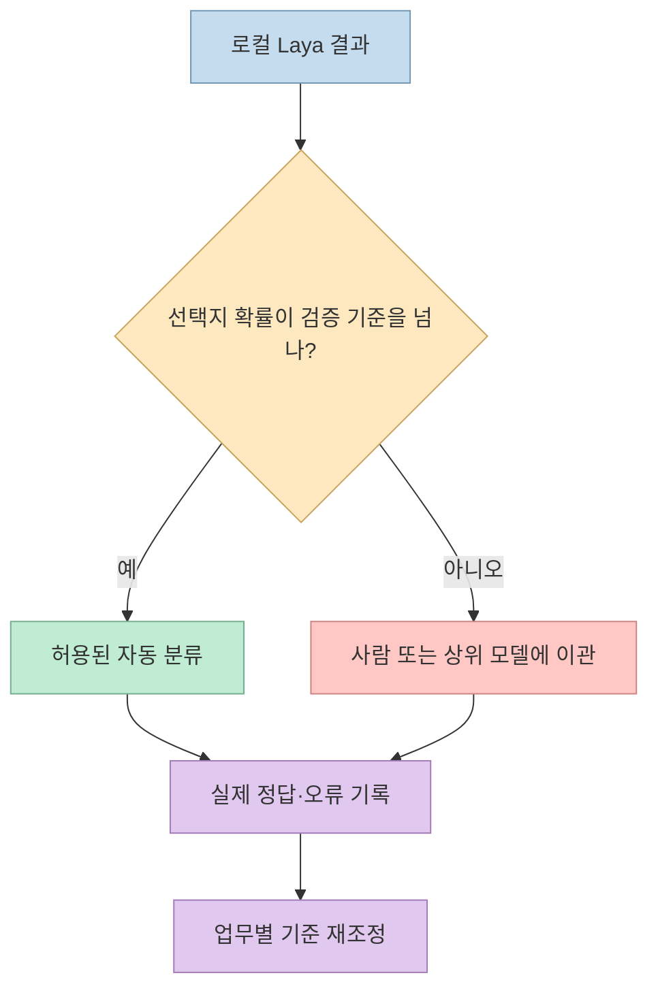

[Threads 게시물](https://www.threads.com/share/_zcskj56w/)은 Unsloth가 **Laya 결정 모델을 4GB RAM PC에서도 로컬 실행** 할 수 있게 지원한다고 소개한다. Mac·Windows·Linux의 CPU나 GPU 환경에서 쓰고, Unsloth Desktop으로 Jev 호환 API도 제공할 수 있다는 내용이다. 공식 가이드를 대조하면 요지는 맞지만, **4GB는 모든 Laya 모델에 공통인 요구사항이 아니다.** 기본 다국어 모델의 최소 RAM이며, 영어 모델과 typed-decisions 모델은 각각 5GB가 안내돼 있다. [Threads 원문](https://www.threads.com/share/_zcskj56w/), [Unsloth의 Laya 실행 가이드](https://unsloth.ai/docs/models/decision-laya)

<!--more-->

## Sources

- [원본 Threads 게시물](https://www.threads.com/share/_zcskj56w/)
- [Unsloth 공식 가이드: Laya와 Jev 호환 API](https://unsloth.ai/docs/models/decision-laya)
- [Unsloth 공식 GitHub 저장소](https://github.com/unslothai/unsloth)
- [Laya 원본 프로젝트](https://github.com/NandhaKishorM/laya)
- [기존 글: Ollaya의 로컬 결정 모델과 검증 포인트](/post/2026/09/2026-09-28-ollaya-local-decision-model-agent-routing/)

원본 Threads는 일반 HTTP 추출로 본문을 확인했다(`scrapling-get`). Unsloth 가이드의 본문도 HTTP로 읽어 모델별 용량·API 형식·제한을 교차 확인했다. 이 글에서 모델을 직접 내려받거나 4GB 기기에서 추론 시간을 측정하지는 않았다. 아래의 메모리와 성능 표현은 **공식 문서가 제시한 실행 조건과 설명** 이지 독립 벤치마크가 아니다.

## “결정 모델”은 문장을 생성하기보다 구조화된 답을 고른다

Laya는 처리할 텍스트 또는 JSON `state`와 질문들을 입력받아, 정해진 형태의 답을 한 번의 추론으로 반환한다. 질문은 `choice`(선택지), `noul`(예/아니오), `score`(척도)의 세 종류다. 고객 문의를 어느 부서에 보낼지, 환불 요청이 있는지, 긴급도가 어느 정도인지처럼 **반복되는 좁은 판단** 에 맞는다. 자유로운 설명문 작성, 복잡한 계획 수립, 코드 생성까지 이 모델 하나로 대체한다는 뜻은 아니다. [Unsloth의 질문 유형 설명](https://unsloth.ai/docs/models/decision-laya), [Laya 원본 저장소](https://github.com/NandhaKishorM/laya)



이 주제는 앞서 소개한 [Ollaya](/post/2026/09/2026-09-28-ollaya-local-decision-model-agent-routing/)와 작업 종류가 겹친다. 차이는 이번 소식의 대상이 **Unsloth Desktop의 Laya 실행·서빙 절차** 라는 점이다. 같은 계열의 판단 문제라도 런타임, 모델 선택, API 설정, 메모리 조건은 각각 확인해야 한다. [Unsloth 가이드](https://unsloth.ai/docs/models/decision-laya), [Ollaya 기존 글](/post/2026/09/2026-09-28-ollaya-local-decision-model-agent-routing/)

## 4GB의 정확한 범위: 기본 다국어 모델 하나

Unsloth 가이드의 권장 설정에서 기본값인 `laya-multilingual`은 모델 크기 **678MB**, 최소 **4GB RAM**, 기본 컨텍스트 **1,024토큰**으로 안내된다. `laya-english`와 `laya-typed-decisions`는 각각 **846MB**, 최소 **5GB RAM**이다. CPU가 기본 실행 대상이고 GPU를 선택하면 빠른 응답을 기대할 수 있다고 설명한다. GPU 메모리가 부족할 때 CPU로 되돌아가는 동작도 문서화돼 있다. 따라서 “4GB에서 Laya 실행 가능”은 **선택한 모델·설정에 한정된 최소 조건** 이며, 동시에 다른 무거운 앱을 실행하는 PC의 여유 메모리나 처리량까지 보장하는 수치는 아니다. 마지막 문장은 최소 사양에서 도출한 **운영상 추론** 이다. [Unsloth 모델별 권장 설정](https://unsloth.ai/docs/models/decision-laya)



첫 요청에는 모델 적재가 필요해 공식 가이드는 **10~20초**를 안내하고, 이후에는 대부분 CPU에서 1초보다 짧게 응답한다고 설명한다. 이는 설치·다운로드 시간이나 사용자의 실제 업무 정확도까지 포함한 값이 아니다. 사용하려는 기기에서 첫 요청 지연, 반복 요청 지연, 메모리 사용량을 따로 재는 것이 좋다. [Unsloth 빠른 시작](https://unsloth.ai/docs/models/decision-laya)

## Unsloth Desktop은 Jev 호환 `/v1/systemone`을 연다

공식 절차는 Unsloth Desktop을 설치한 뒤 **Settings → API → Decision API** 에서 `Serve requests`를 켜는 것이다. 선택한 Laya 모델은 확인 후 내려받는다. API 키는 같은 화면의 Access tokens에서 확인하고, 로컬호스트에서만 사용할 때는 `Keyless API access` 설정도 가능하다고 가이드가 설명한다. 기본 예시 주소는 `http://localhost:8888/v1/systemone`이다. 기존 Jev 통합은 서버 주소와 키를 로컬 Unsloth 쪽으로 바꾸어 같은 요청 형식을 보낼 수 있다. [Unsloth 설정·마이그레이션 가이드](https://unsloth.ai/docs/models/decision-laya)



요청에는 `state`와 `questions`가 들어간다. 아래는 공식 가이드의 형태를 축약한 **미실행 예시** 다. 부서 선택과 환불 여부를 동시에 묻지만, 반환된 판단을 실제 환불 처리와 연결할지는 호출 애플리케이션이 결정해야 한다. 키 없는 접근을 켜지 않았다면 자신이 발급받은 API 토큰을 넣어야 한다. [Unsloth의 요청 예시](https://unsloth.ai/docs/models/decision-laya)

```bash
curl http://localhost:8888/v1/systemone \
  -H 'Authorization: Bearer <LOCAL_UNSLOTH_TOKEN>' \
  -H 'Content-Type: application/json' \
  -d '{
    "model": "laya",
    "state": "이번 달 요금이 두 번 청구됐습니다. 환불해주세요.",
    "questions": {
      "team": {
        "type": "choice",
        "instructions": "어느 팀이 처리해야 하는가?",
        "criteria": {"billing": "요금·환불", "technical": "기술 오류"}
      },
      "refund": {"type": "noul", "instructions": "환불을 요청했는가?"}
    }
  }'
```

## 호환 형식과 같은 판단 품질은 다르다

Jev와 Laya가 같은 HTTP 요청·응답 형태를 쓸 수 있어도, 결과의 `confidence`를 계산하는 공식은 다르다. Unsloth 가이드는 Jev에서 사용하던 `confidence` 임계값을 그대로 옮기지 말고, `choice`의 개별 `probabilities` 값을 보라고 경고한다. 예컨대 `billing` 확률이 일정 기준 이상일 때만 자동 분류하고 나머지는 검토하도록 할 수 있다. 다만 그 기준도 **자신의 라벨 데이터에서 오류율을 확인해 정해야** 한다. “모델이 자신 있어 보인다”와 “실제로 정답이다”는 동일하지 않다. [Unsloth의 Jev 차이 설명](https://unsloth.ai/docs/models/decision-laya)

가이드는 한 요청에 질문을 최대 64개, `choice` 하나에 선택지를 최대 255개까지 받는다고 안내한다. 그러나 선택지 설명들이 **고정된 토큰 예산을 공유** 하므로, 설명이 붙은 선택지가 약 20개를 넘으면 라벨 내용이 잘릴 수 있다고 별도로 경고한다. 이는 “API가 요청을 받는다”와 “그 많은 후보를 정확히 구별한다”의 차이다. 선택지가 많다면 먼저 후보군을 좁히거나 실제 데이터로 정확도를 검증해야 한다. [Unsloth의 질문 수·선택지 제한과 마이그레이션 안내](https://unsloth.ai/docs/models/decision-laya)



## 실전 적용 포인트

시작할 때는 **다국어 기본 모델, 짧은 질문, 소수의 명확한 선택지** 로 작은 검증 세트를 만드는 편이 좋다. 예를 들어 실제 고객 문의 100건을 `billing`·`technical`·`other`로 사람이 먼저 분류해 두고, 로컬 모델의 부서 선택·환불 판단·지연을 함께 기록한다. 이 숫자는 실험 설계의 예시이지 공식 권장 표본 수가 아니다. 중요한 조치에는 자동 실행 대신 보류·검토 경로를 둔다. Unsloth 가이드의 최소 RAM과 하위 1초 응답 설명만으로 특정 업무 정확도나 비용 절감률을 예측할 수는 없다. [Unsloth 가이드](https://unsloth.ai/docs/models/decision-laya)

민감한 텍스트를 로컬에서 처리하는 선택지는 유용하지만, API를 네트워크에 공개하면 “로컬 모델”이라는 이유만으로 안전해지지는 않는다. 특히 키 없는 접근 설정은 로컬호스트 사용 범위와 함께 검토해야 한다. Unsloth 저장소는 원격 접근 시 비밀번호와 서버 측 도구 노출에 주의하라고 안내한다. 서비스로 운영하려면 인증·바인딩 주소·접근 가능 네트워크를 확인해야 한다. [Unsloth Desktop 설정 가이드](https://unsloth.ai/docs/models/decision-laya), [Unsloth 저장소의 원격 접근 안내](https://github.com/unslothai/unsloth)

## 핵심 요약

- Threads의 **4GB RAM** 주장은 Unsloth가 권장하는 **기본 다국어 Laya 모델** 의 최소 조건이다. 다른 두 모델은 5GB가 안내돼 있다. [Unsloth 가이드](https://unsloth.ai/docs/models/decision-laya)
- Laya는 자유로운 답변 생성보다 `choice`·`noul`·`score` 형태의 빠른 구조화 판단을 담당한다. [Unsloth 가이드](https://unsloth.ai/docs/models/decision-laya), [Laya 저장소](https://github.com/NandhaKishorM/laya)
- Unsloth Desktop은 Jev 호환 `/v1/systemone`을 제공하지만 `confidence` 계산과 많은 선택지의 처리 방식은 같지 않다. [Unsloth 가이드](https://unsloth.ai/docs/models/decision-laya)
- 로컬 실행 가능성과 업무 정확도·자동화 안전성은 별개다. 각 팀의 데이터로 임계값과 실패 경로를 검증해야 한다.

## 결론

Unsloth의 Laya 지원은 **작은 판단을 개인 PC에서 실행하고 기존 Jev 형식으로 연결하는 실용적인 경로** 다. 그러나 4GB라는 숫자는 선택한 체크포인트의 최소 사양일 뿐이다. 진짜 도입 기준은 자신의 업무 입력에서 얼마나 정확히 판단하고, 불확실할 때 안전하게 멈출 수 있는지다.
