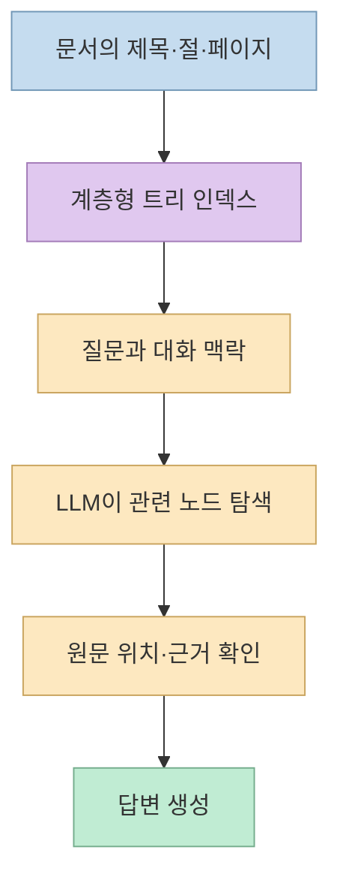
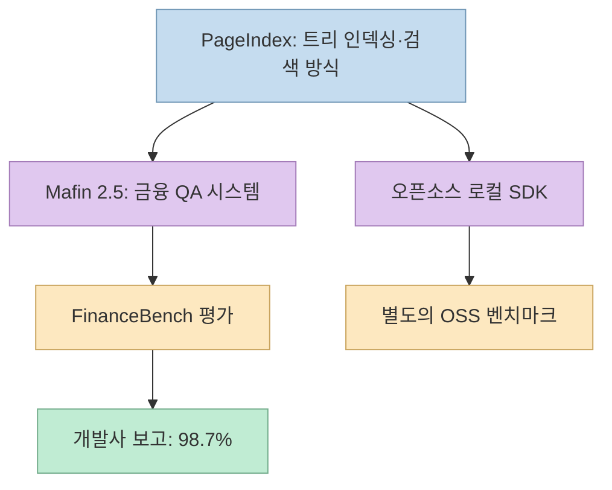
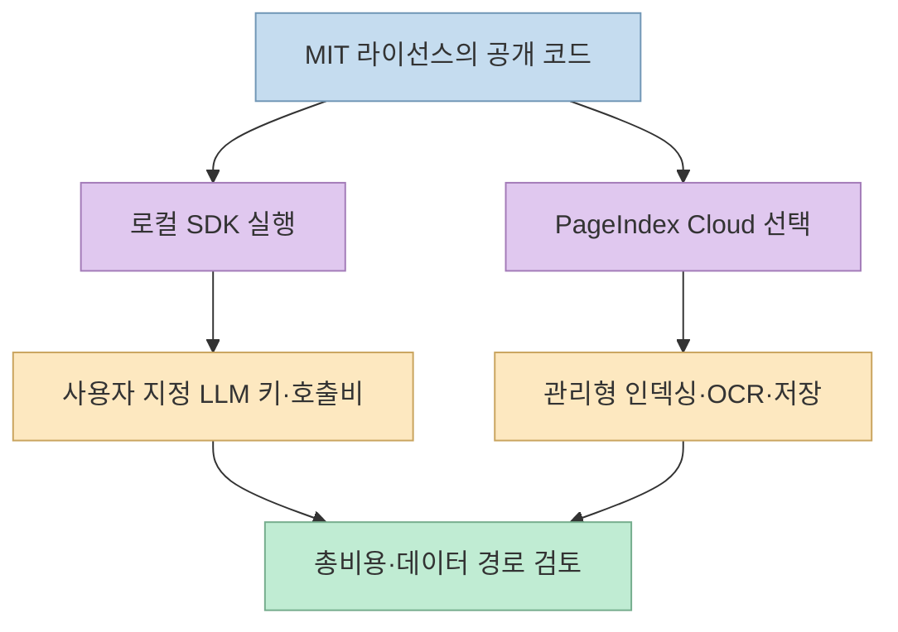

[Threads 게시물](https://www.threads.com/share/BBsCrR-aQo/)은 PageIndex를 두고 “벡터 DB 없음, 임베딩 없음, 청킹 없음, 유사도 검색 없음”, “FinanceBench 98.7%”, “100% 무료 오픈소스”라고 요약한다. 첫째는 **검색 구조**, 둘째는 **별도로 구성한 금융 질의응답 시스템의 평가**, 셋째는 **코드 라이선스와 서비스 비용** 에 관한 말이다. 세 문장을 한 제품의 동일한 조건에서 나온 성능·가격 보증처럼 연결하면 중요한 차이를 놓친다. [원본 Threads 게시물](https://www.threads.com/@qjc.ai/post/Dd84vY5E6y9), [PageIndex README](https://github.com/VectifyAI/PageIndex)

<!--more-->

## Sources

- [원본 Threads 공유 링크](https://www.threads.com/share/BBsCrR-aQo/)
- [원본 게시물 고유 주소](https://www.threads.com/@qjc.ai/post/Dd84vY5E6y9)
- [VectifyAI/PageIndex 공식 저장소](https://github.com/VectifyAI/PageIndex)
- [개발사 설명: Mafin 2.5와 FinanceBench 98.7%](https://pageindex.ai/blog/Mafin2.5)
- [Mafin 2.5 평가 결과·코드 저장소](https://github.com/VectifyAI/Mafin2.5-FinanceBench)
- [PageIndex OSS 로컬 실행 벤치마크](https://github.com/VectifyAI/PageIndex-OSS-Benchmark)
- [FinanceBench 원본 논문](https://arxiv.org/abs/2311.11944)

2026년 10월 1일 공개 Threads 페이지를 HTTP 추출(`scrapling-get`)로 확인했다. 공유 링크는 `@qjc.ai`의 개별 게시물로 이동했으며, 이 글은 **접근 가능한 해당 게시물 본문** 의 세 가지 주장만 다룬다. 이어서 PageIndex 저장소·개발사 벤치마크 문서·FinanceBench 원논문을 대조했다. PageIndex를 설치해 직접 벤치마크를 재실행하지는 않았으므로, 성능 수치는 **개발사가 공개한 평가 결과** 로 표기한다.

## 주장 1: “벡터 DB·임베딩·청킹이 없다”는 무슨 뜻인가

일반적인 벡터 검색 기반 RAG는 문서를 일정 단위로 나누고, 각 부분의 임베딩을 저장한 뒤 질문과 의미상 가까운 조각을 찾는다. PageIndex는 문서의 제목·절·페이지 범위를 반영한 **계층형 트리 인덱스** 를 만들고, 질문을 받은 LLM이 트리를 따라 관련 위치를 찾아 들어간다. 공식 README가 “No Vector DB, No Chunking”이라고 쓰는 것은 **이 검색 경로에 벡터 인덱스와 고정 길이 청크를 필수 요소로 두지 않는다** 는 의미다. 문서를 분할해 접근하지 않는다는 뜻이나, 인덱스 없이 전체 PDF를 매번 읽는다는 뜻이 아니다. [원본 게시물](https://www.threads.com/@qjc.ai/post/Dd84vY5E6y9), [PageIndex README의 Index·Retrieve 설명](https://github.com/VectifyAI/PageIndex#what-is-pageindex)

이 접근은 목차와 계층이 뚜렷한 긴 보고서에서 유용할 수 있다. 다만 “벡터가 없다”는 말은 **모든 문서 유형과 모든 질문에서 벡터 검색보다 낫다** 는 말이 아니다. 트리 탐색도 문서 파싱 품질과 모델의 판단에 의존하며, 질문이 여러 문서의 정보를 가로지르거나 구조가 불분명한 자료에서는 별도 평가가 필요하다. 공식 README도 오픈소스 로컬 경로와 OCR·이미지 처리를 제공하는 Cloud 경로의 문서 범위를 구분한다. [PageIndex README의 사용 대상·Local/Cloud 구분](https://github.com/VectifyAI/PageIndex)

## 주장 2: “98.7%”는 어떤 시스템의 어떤 평가인가

핵심 구분은 **PageIndex 프레임워크와 Mafin 2.5 응용 시스템이 동일하지 않다** 는 점이다. 개발사의 [공식 설명](https://pageindex.ai/blog/Mafin2.5)은 PageIndex를 기반으로 만든 금융 문서 질의응답 모델 **Mafin 2.5** 가 FinanceBench에서 98.7% 정확도를 기록했다고 말한다. [평가 저장소](https://github.com/VectifyAI/Mafin2.5-FinanceBench)에는 결과 파일과 평가 코드, 사람의 판정 자료가 공개돼 있다. 따라서 이 수치를 “공개 PageIndex 패키지를 설치하면 자동으로 98.7%가 나온다”거나 “모든 벡터 RAG를 동일 조건에서 이겼다”로 바꿔 말해서는 안 된다. [Threads의 원문 표현](https://www.threads.com/@qjc.ai/post/Dd84vY5E6y9), [Mafin 2.5 발표](https://pageindex.ai/blog/Mafin2.5), [평가 저장소](https://github.com/VectifyAI/Mafin2.5-FinanceBench)

비교에도 주의가 필요하다. 개발사 평가 저장소는 일부 외부 제품의 보고치가 **전체 공개 질문 집합이 아닌 일부 범위** 를 사용했다고 적고, 자체 평가 역시 정답의 모호성·오류와 **다중 문서 추론 부족** 을 한계로 명시한다. 원래 FinanceBench는 금융 공시에서 근거를 찾는 질의응답 벤치마크다. 이 테스트의 점수를 곧바로 금융 분석 전반이나 실제 업무 의사결정 정확도로 확장할 수는 없다. 또한 평가 파일이 공개돼 있다는 사실과 **독립 제3자가 같은 설정으로 결과를 재현했다** 는 사실은 다르다. [Mafin 평가의 비교·한계](https://github.com/VectifyAI/Mafin2.5-FinanceBench), [FinanceBench 원논문](https://arxiv.org/abs/2311.11944)

더 중요한 혼동은 **서로 다른 벤치마크를 한 숫자로 묶는 것** 이다. PageIndex의 별도 [OSS 로컬 벤치마크](https://github.com/VectifyAI/PageIndex-OSS-Benchmark)는 공개 패키지의 로컬 실행 경로를 34개 PDF·62개 문서 내 사실 찾기 질문으로 테스트한다. 이 평가는 FinanceBench의 Mafin 2.5 결과와 **데이터·시스템·질문 범위가 다르다.** 벤치마크 저장소도 표·그림·계산 문제와 로컬 인덱서가 받아들이지 못하는 문서는 범위에서 제외했다고 명시한다. 그러므로 98.7%를 OSS 로컬 패키지의 일반 정확도처럼 제시할 근거는 없다. [PageIndex OSS 벤치마크의 범위](https://github.com/VectifyAI/PageIndex-OSS-Benchmark), [Mafin 2.5 평가 저장소](https://github.com/VectifyAI/Mafin2.5-FinanceBench)

## 주장 3: “무료 오픈소스”와 “운영비 0원”은 다르다

PageIndex 공개 저장소에는 MIT 라이선스가 있고, 현재 SDK는 **로컬에서 인덱싱·검색·대화** 를 실행하는 경로를 안내한다. 따라서 오픈소스라는 부분에는 근거가 있다. 그러나 공식 퀵스타트는 `OPENAI_API_KEY`를 설정하고 인덱싱·검색에 사용할 모델을 지정한다. 로컬 코드의 라이선스 비용이 없더라도 모델 API 호출과 실행 자원에는 비용이 들 수 있다. 공식 README는 로컬 인덱싱 비용과 질의 비용을 별도 항목으로 다룬다. [원본 게시물](https://www.threads.com/@qjc.ai/post/Dd84vY5E6y9), [PageIndex 라이선스·퀵스타트·비용 설명](https://github.com/VectifyAI/PageIndex)

또한 **로컬 OSS와 Cloud의 기능 범위가 다르다.** README는 로컬 경로를 텍스트 중심 PDF에, Cloud를 스캔·이미지 중심 문서의 OCR·이미지 이해·관리형 저장까지 필요한 경우에 배치한다. Cloud 사용 예제에는 별도의 `PAGEINDEX_API_KEY`가 등장한다. 민감한 금융 자료를 다룬다면 “벡터 DB를 쓰지 않는다”는 구조적 특성만큼, 문서가 로컬과 외부 서비스 중 어디에서 처리되는지 확인해야 한다. [PageIndex README의 Local/Cloud 비교](https://github.com/VectifyAI/PageIndex#pageindex-cloud)

## 실전 적용 포인트: 같은 질문으로 비교해야 한다

도입 검토는 마케팅 문구보다 **자기 문서와 자기 질문** 으로 시작해야 한다. 원문 구조가 유지된 PDF를 준비하고, 단일 절의 사실 확인, 여러 절을 오가는 질문, 표·그림에 있는 값, 여러 문서를 결합해야 하는 질문을 따로 묶는다. 동일한 자료·질문·정답 기준으로 PageIndex 로컬 경로와 현재 사용하는 벡터 RAG를 비교하고, 정답률뿐 아니라 **근거 페이지, 누락, 지연, 인덱싱·질의 비용** 을 기록한다. 이는 PageIndex 공식 문서가 로컬 범위를 한정하고, OSS 벤치마크가 표·그림·계산을 제외한다는 사실에서 도출한 평가 제안이다. [PageIndex README](https://github.com/VectifyAI/PageIndex), [OSS 벤치마크 범위](https://github.com/VectifyAI/PageIndex-OSS-Benchmark)

이전에 쓴 [PageIndex 기반 RAG 앱 제작 글](/post/2026/04/2026-04-10-pageindex-vectorless-rag-codex/)은 Codex로 데모를 조립하고 디버깅하는 과정에 초점을 맞췄다. 이번 Threads 게시물은 그 구현법보다 **성능 수치가 가리키는 시스템과 오픈소스·비용의 경계** 를 확인하는 계기로 읽는 편이 좋다.

## 핵심 요약

- **벡터리스** 는 임베딩·벡터 DB 대신 문서 트리와 LLM 기반 탐색을 쓰는 검색 설계다. 문서 인덱싱이 사라지는 것은 아니다. [PageIndex README](https://github.com/VectifyAI/PageIndex)
- **FinanceBench 98.7%** 는 개발사가 보고한 **Mafin 2.5** 의 금융 QA 평가 결과다. 공개 PageIndex SDK의 보편 성능 수치로 볼 수 없다. [Mafin 2.5 발표](https://pageindex.ai/blog/Mafin2.5)
- **무료 오픈소스** 는 공개 코드의 MIT 라이선스와 연결되지만, 모델 호출비·실행 자원·선택적 Cloud 서비스까지 모두 무료라는 뜻은 아니다. [PageIndex README](https://github.com/VectifyAI/PageIndex)
- 실제 도입 여부는 자기 문서·질문에서의 근거 품질, 실패 유형, 지연, 총비용을 비교해 판단해야 한다.

## 결론

PageIndex는 긴 문서의 구조를 검색의 중심에 둔 흥미로운 대안이다. 다만 Threads의 세 문장을 하나로 묶어 “무료 설치만으로 모든 벡터 RAG보다 정확하다”고 읽으면 과장된다. **검색 방식은 PageIndex, 98.7% 평가는 Mafin 2.5, 무료 범위는 공개 코드의 라이선스** 로 나눠 이해하는 것이 정확한 출발점이다.
