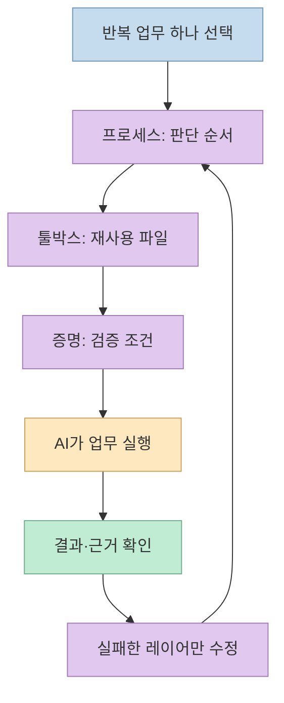
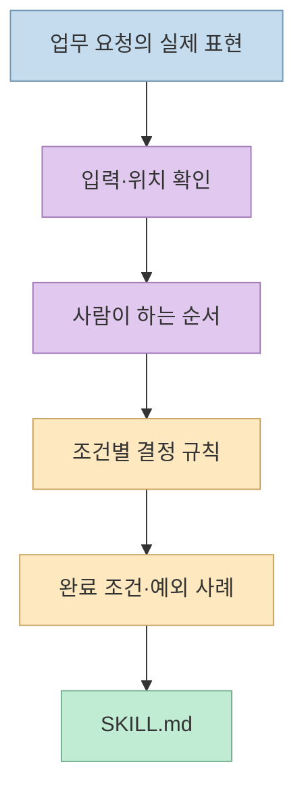
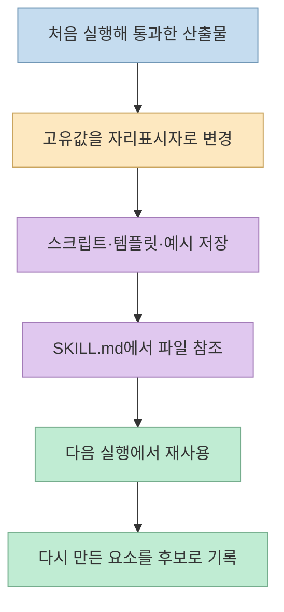
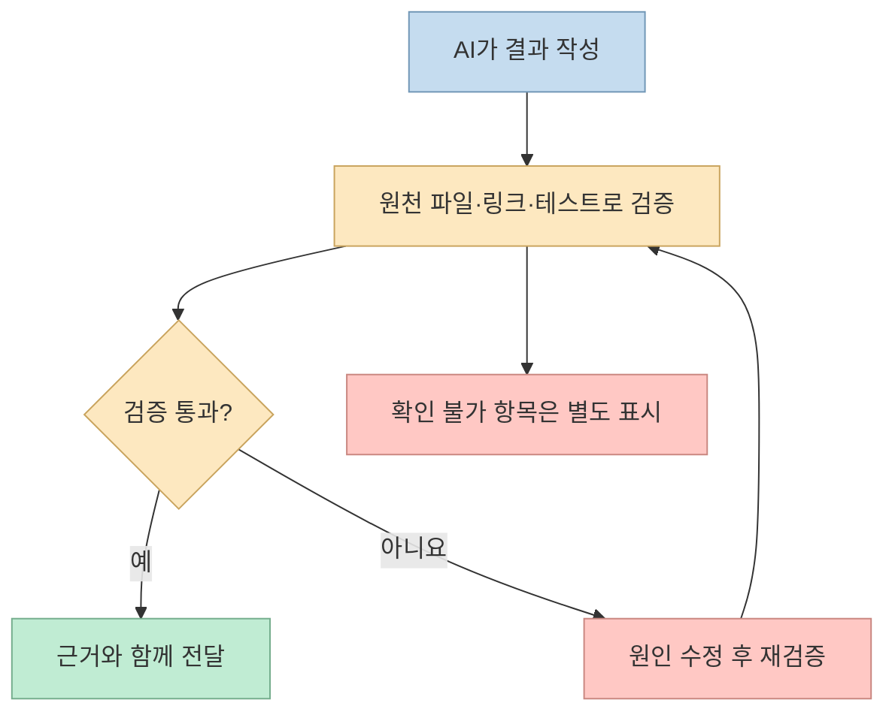
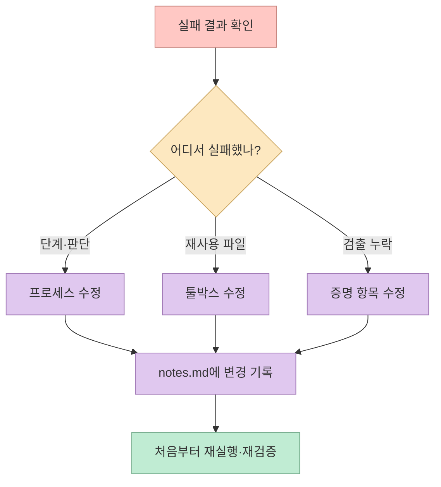

[「AI 위임 루프: 에이전트 대신 매뉴얼으로 일 넘기기」](https://sdk-kim-builds.com/guides/ai-delegation-loop-playbook/)의 제안은 업무마다 새 에이전트와 연결을 만드는 대신 **업무 하나당 매뉴얼 폴더 하나** 를 유지하자는 것이다. 매뉴얼에는 사람이 판단하던 순서, 반복 사용될 스크립트·템플릿, 실제로 실패할 수 있는 검증 조건이 들어간다. 실행 결과가 틀리면 대화창에서만 정정하지 않고 해당 파일을 고쳐 다음 실행에 반영한다. 핵심은 “AI에게 일을 넘기는 것”보다 **판단과 검증을 재사용 가능한 자산으로 남기는 것** 이다. [원문 가이드의 도입·세 레이어 설명](https://sdk-kim-builds.com/guides/ai-delegation-loop-playbook/)

<!--more-->

## Sources

- [원본 가이드: AI 위임 루프](https://sdk-kim-builds.com/guides/ai-delegation-loop-playbook/)
- [Vercel: 내부 데이터 에이전트의 도구를 줄인 실험](https://vercel.com/blog/we-removed-80-percent-of-our-agents-tools)
- [Vercel: 파일시스템과 Bash를 사용하는 에이전트 설계](https://vercel.com/blog/how-to-build-agents-with-filesystems-and-bash)
- [Anthropic: Agent Skills의 파일·폴더 구조](https://www.anthropic.com/engineering/equipping-agents-for-the-real-world-with-agent-skills)
- [Claude 프로젝트 파일 관리 안내](https://support.claude.com/en/articles/9519177-how-can-i-create-and-manage-projects)

원문은 HTTP 추출(`scrapling-get`)로 전체 본문을 확인했다. 원문이 소개하는 Vercel·Anthropic 사례는 각 회사의 공개 자료와 대조했다. 아래의 주간 고객 업데이트는 **원문이 제시한 설명용 사례** 이며, 이 글에서 실제 고객 데이터를 실행·검증한 결과가 아니다.

## 왜 ‘업무별 에이전트’보다 ‘업무별 매뉴얼’인가

업무마다 전용 에이전트를 만들면 각 에이전트의 지시·도구 연결·기억을 따로 관리해야 한다. 업무 규칙이 바뀔 때마다 여러 곳을 손봐야 한다면 자동화가 오히려 유지보수 업무를 만든다. 원문은 범용 AI에 **그 일을 처리하는 절차와 자료** 를 파일로 제공하면, 모델의 능력을 재사용하면서 업무 지식만 지속적으로 고칠 수 있다고 주장한다. 이는 모든 전문 에이전트가 불필요하다는 증명이 아니라, 반복적인 개인·팀 업무의 **첫 설계 단위를 에이전트 수가 아닌 작업 지식** 으로 잡자는 제안이다. [원문의 「왜 에이전트는 계속 죽는가」](https://sdk-kim-builds.com/guides/ai-delegation-loop-playbook/), [Anthropic의 Skills 설명](https://www.anthropic.com/engineering/equipping-agents-for-the-real-world-with-agent-skills)

원문은 Vercel의 내부 데이터 에이전트를 단순화한 사례도 근거로 든다. [Vercel 원문](https://vercel.com/blog/we-removed-80-percent-of-our-agents-tools)에 따르면 특화 도구를 줄이고 파일 접근을 중심으로 바꾼 뒤, 대표 질의 5개 평가에서 성공이 **4/5에서 5/5** 로 바뀌고 평균 실행 시간과 토큰 사용량도 줄었다. 이를 “품질이 대략 두 배”라고 일반화하는 것은 공개 수치와 맞지 않는다. 더구나 5개 질의의 내부 실험이므로 다른 업무에도 같은 개선 폭이 나온다는 보장은 없다. Vercel 자신도 잘 정리된 데이터 정의 파일이 있었기 때문에 이 방식이 통했다고 강조한다. **도구를 줄인 것만으로 좋아진 게 아니라, 읽을 만한 업무 지식이 이미 있었다** 는 조건을 놓치면 안 된다. [Vercel 실험·한계](https://vercel.com/blog/we-removed-80-percent-of-our-agents-tools)

## 시작 전: 파일을 누가 읽고, 누가 저장하는가

원문이 먼저 구분하는 것은 **파일시스템에 직접 접근하는 AI** 와 **대화·프로젝트에 올린 파일을 참조하는 AI** 다. Claude Code처럼 허용된 폴더의 파일을 읽고 쓸 수 있는 환경에서는 `SKILL.md`, 템플릿, 스크립트를 실제 폴더에 유지하며 작업 후 바로 갱신할 수 있다. 반대로 업로드한 프로젝트 지식 파일을 참고하는 채팅 흐름에서는 AI가 수정안을 대화로 출력했다고 해서 업로드된 사본까지 자동으로 바뀌었다고 가정하면 안 된다. 원문은 **원본 한 벌을 정하고, 수정 후 낡은 업로드본을 교체** 하라고 권한다. [원문의 「시작 전에」](https://sdk-kim-builds.com/guides/ai-delegation-loop-playbook/), [Claude 프로젝트 지식 관리 안내](https://support.claude.com/en/articles/9519177-how-can-i-create-and-manage-projects)

다만 이 구분은 **모든 AI 제품·연결 방식에 대한 영구적인 규칙** 은 아니다. 연결된 저장소의 실시간 편집, 동기화, 권한 제어가 가능한 환경도 있고 제품 기능은 바뀐다. 실제 사용 환경에서는 “이 대화가 보는 것은 원본인가, 업로드 시점의 사본인가?”, “AI에 쓰기 권한이 있는가?”, “수정된 파일이 다음 대화에도 반영되는가?”를 각각 확인해야 한다. 같은 이름의 오래된 파일을 여러 벌 남겨 두지 말라는 원문의 원칙은 어느 방식에서나 유효하다. [원문의 단일 마스터 원칙](https://sdk-kim-builds.com/guides/ai-delegation-loop-playbook/), [Anthropic의 파일·폴더 기반 Skills 설명](https://www.anthropic.com/engineering/equipping-agents-for-the-real-world-with-agent-skills)

## 레이어 1 — 프로세스: ‘어떻게’보다 ‘언제, 왜’를 기록한다

첫 매뉴얼은 SOP를 혼자 쓰는 것이 아니라 AI에게 **인터뷰를 받으며** 만든다. 원문의 첫 번째 프롬프트는 업무의 시작 계기와 빈도, 입력의 정확한 위치, 실제 순서, 결정마다 사용하는 규칙, 완료 판정, 과거의 예외 사례, 만족스러운 톤과 나쁜 결과의 모습까지 묻게 한다. 그 답을 `SKILL.md`의 목적·사용 시점·입력·순서·결정 규칙·완료 정의·예외 사례로 정리한다. 중요한 것은 “보고서를 잘 작성한다” 같은 추상 명령이 아니라 **“계획 대비 수치가 빠졌으면 무엇을 다시 확인할지”** 처럼 실행 가능한 분기다. [원문의 「레이어 1: 프로세스」와 첫 프롬프트](https://sdk-kim-builds.com/guides/ai-delegation-loop-playbook/)

원문은 첫 업무로 **주 1회 이상 반복하고, 나쁜 결과를 바로 알아볼 수 있으며, 새 직원에게 20분 안에 설명할 수 있는 일** 을 권한다. 이 기준은 효과가 입증된 정량 법칙이라기보다, 너무 크고 모호한 작업으로 시작하지 않도록 범위를 제한하는 휴리스틱이다. `SKILL.md`의 “언제 쓰는지”에도 실제 사용자가 요청할 법한 말을 적어야 필요할 때 불러오기 쉽다. [원문의 업무 선택 기준·폴더 구성](https://sdk-kim-builds.com/guides/ai-delegation-loop-playbook/)

## 레이어 2 — 툴박스: 통과한 결과를 재사용 파일로 만든다

두 번째 레이어는 AI가 매번 같은 것을 다시 만들지 않도록 **스크립트, 자리표시자 템플릿, 참조 데이터, 좋은 완료 예시, 표기·톤 규칙** 을 저장하는 것이다. 원문은 한 번 실제 업무를 돌려 만족스러운 결과가 나왔을 때 그 결과에서 업무 고유값을 `[고객명]` 같은 자리표시자로 바꾸고, 채운 예시를 함께 보존하도록 한다. `SKILL.md`의 해당 단계에서 파일 이름을 직접 가리키고, `files/INDEX.md`에는 파일의 용도와 등록일을 남긴다. 두 번째 실행에서는 AI가 여전히 백지에서 다시 만드는 것이 무엇인지 찾아 다음 툴박스 후보로 삼는다. [원문의 「레이어 2: 툴박스」와 두 번째 프롬프트](https://sdk-kim-builds.com/guides/ai-delegation-loop-playbook/)

무엇을 **넣지 않을지** 도 중요하다. 원문은 일회성 결과물, API 키·비밀번호, 승인되지 않은 초안, 기능이 겹치는 중복 파일을 제외하라고 한다. 고객 정보·계정 ID 같은 참조 데이터가 필요한 경우에도 비밀값과 혼동해 같은 파일에 넣지 말고 접근 권한을 별도로 관리해야 한다. 월 1회 정도 사용되지 않는 파일을 정리한다는 제안 역시 툴박스가 커질수록 잘못된 버전을 고를 위험을 낮추려는 것이다. [원문의 툴박스 제외 항목·유지보수](https://sdk-kim-builds.com/guides/ai-delegation-loop-playbook/)

## 레이어 3 — 증명: 실패할 수 있는 완료 조건을 둔다

원문이 가장 강조하는 세 번째 레이어는 **AI 자신의 “괜찮아 보인다”는 평가 밖에서 확인할 수 있는 증거** 다. 수치가 원본 데이터에 존재하는지, 링크가 열리는지, 이름 표기가 참조 파일과 일치하는지, 테스트가 실제로 통과하는지처럼 통과·실패가 갈리는 항목을 정한다. 원문의 세 번째 프롬프트는 업무별 검증 5~10개를 만들고, 결과를 보여주기 전에 실행·수정·재실행한 뒤 각 항목의 근거와 함께 통과/실패를 보고하도록 한다. 확인할 수 없는 항목은 통과로 간주하지 않는다. [원문의 「레이어 3: 증명」과 세 번째 프롬프트](https://sdk-kim-builds.com/guides/ai-delegation-loop-playbook/)

예를 들어 **주간 고객 업데이트** 라면 모든 숫자를 추출 파일로 추적하고, 고객명은 표기 기준과 일치시키며, 지난주 약속한 조치가 빠지지 않았는지 확인할 수 있다. “전문적인 문장인가?”만으로는 실패 여부가 모호하지만 “200단어 이하인가?”나 “결제 링크가 실제 열리는가?”는 검증할 수 있다. 다만 기계적인 항목이 통과했다고 해서 비즈니스 판단까지 자동 승인되는 것은 아니다. 민감한 발송·채용·재무 판단은 사람의 최종 승인 단계를 별도로 둘 필요가 있다. [원문의 직무별 검증 예시](https://sdk-kim-builds.com/guides/ai-delegation-loop-playbook/)

## 루프 — 채팅에서 끝내지 말고 실패한 레이어를 고친다

네 번째 프롬프트는 잘못된 결과를 보고 “다음에는 조심해”라고만 말하는 대신 **어느 레이어가 실패했는지 분류** 하게 한다. 단계·순서·결정 규칙이 빠졌다면 프로세스, 파일을 다시 만들거나 오래된 템플릿을 썼다면 툴박스, 발견됐어야 할 오류가 통과했다면 증명 레이어의 문제다. 해당 레이어를 최소한으로 수정하고 `notes.md`에 오류와 수정 내용을 남긴 뒤 같은 작업을 처음부터 다시 실행한다. 같은 실수가 반복되면 막연한 주의문이 아니라 명시적 규칙을 추가한다. [원문의 「루프」와 네 번째 프롬프트](https://sdk-kim-builds.com/guides/ai-delegation-loop-playbook/)

가이드의 폴더 예시는 `SKILL.md` 아래에 `files/INDEX.md`, 숫자 추출 스크립트, 업데이트 템플릿, 톤 규칙, 만족했던 완료 예시, `notes.md`를 둔다. **업무 하나당 폴더 하나** 이므로 콘텐츠 재활용과 고객 업데이트를 한 거대한 스킬에 섞지 않는다. `SKILL.md`에는 모두를 복사해 넣기보다 필요할 때 어떤 파일을 사용할지 명시한다. 이 구조는 Anthropic이 Agent Skills를 지침·스크립트·리소스가 함께 있는 폴더로 설명하는 방향과도 맞는다. [원문의 폴더 구조](https://sdk-kim-builds.com/guides/ai-delegation-loop-playbook/), [Anthropic의 Skills 구조](https://www.anthropic.com/engineering/equipping-agents-for-the-real-world-with-agent-skills)

## 실전 적용 포인트: 주간 고객 업데이트로 작게 시작하기

원문의 예시를 실행 가능한 순서로 바꾸면 다음과 같다. **①** 지난주 수치와 계획을 어디서 가져오는지 인터뷰로 확인한다. **②** 고객이 좋아했던 업데이트 형식과 정확한 고객명 표기를 템플릿·참조 파일로 남긴다. **③** “모든 수치가 원본에 존재”, “지난주 약속 조치 언급” 같은 검증을 붙인다. **④** 한 번 실행해 틀린 숫자나 누락을 찾는다. **⑤** 그때만 채팅에서 바로 문장을 고치는 대신, 오류를 낳은 매뉴얼 단계 또는 검증 항목을 수정해 다시 돌린다. [원문의 「전체 실전 예제: 주간 고객 업데이트」](https://sdk-kim-builds.com/guides/ai-delegation-loop-playbook/)

원문은 첫 매뉴얼을 만드는 데 약 30분을 제안하지만, 이는 저자가 권하는 시작 시간이지 누구에게나 보장되는 구축 시간은 아니다. **첫 실행과 두 번째 실행의 차이** 를 보는 것이 더 의미 있다. 두 번째에도 매번 같은 설명을 다시 입력한다면 프로세스·툴박스가 아직 약하고, 틀린 결과가 계속 전달된다면 증명 레이어를 손봐야 한다. [원문의 「첫 30분」과 두 번째 실행 권고](https://sdk-kim-builds.com/guides/ai-delegation-loop-playbook/)

## 핵심 요약

- **프로세스** 는 사람의 실제 순서와 결정 규칙, 예외 사례를 `SKILL.md`에 남긴다.
- **툴박스** 는 통과한 스크립트·템플릿·좋은 예시를 재사용 파일로 바꾼다.
- **증명** 은 숫자·링크·테스트처럼 실패 가능한 외부 근거로 완료를 판정한다.
- 오류가 나면 대화에서만 고치지 말고 **실패한 레이어의 파일을 수정하고 재실행** 한다.
- Vercel 사례는 도구 단순화의 가능성을 보여 주지만, 소수 내부 질의의 결과를 모든 업무에 적용할 수는 없다. [Vercel의 실험](https://vercel.com/blog/we-removed-80-percent-of-our-agents-tools)

## 결론

AI 위임은 “이번 한 번 답을 잘 받는 것”에서 끝나면 다음 주에 다시 설명해야 한다. 이 가이드의 실용적 핵심은 **업무 지식·재사용 도구·검증 기준을 파일에 남기고, 실패가 생길 때마다 그 파일을 조금씩 고치는 것** 이다. 처음에는 가장 반복되고 검증하기 쉬운 업무 하나로 시작하는 편이 좋다.
