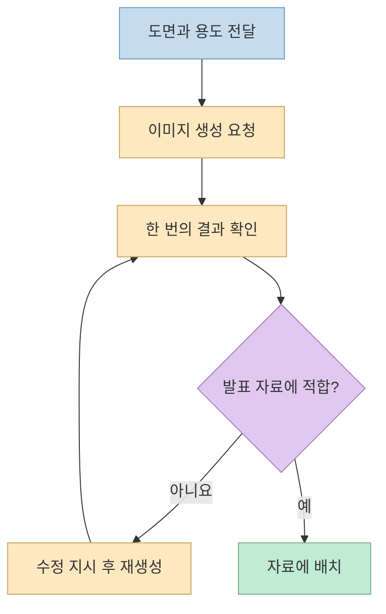
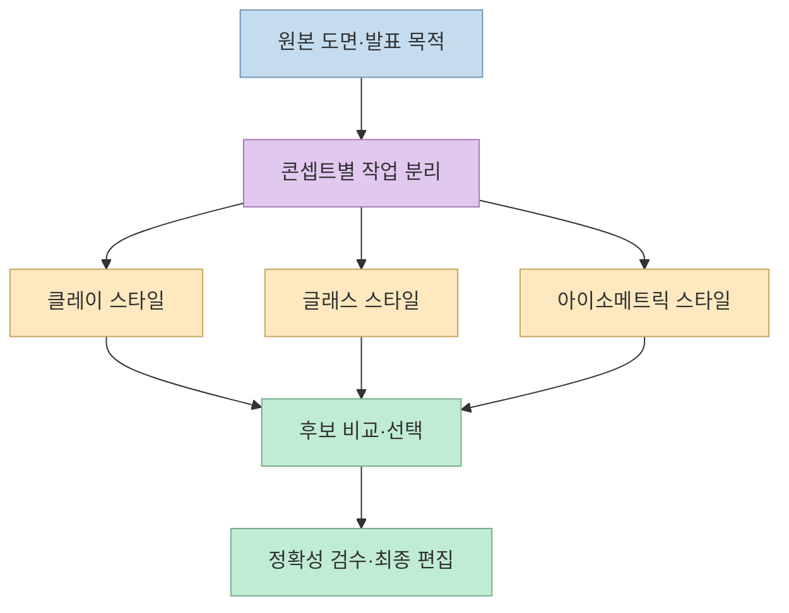
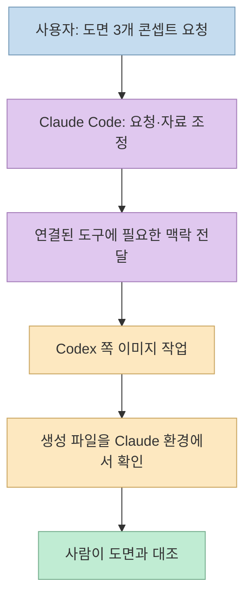

[레인 | AI 바이브코딩의 영상](https://youtu.be/MDO68K7ygUg?si=_u-UVh9YvvqNeMgH)은 발표·회의 자료에 쓸 이미지를 만드는 방법을 보여 준다. 흑백 특허 도면을 입체적인 인포그래픽으로 바꾸는 예시에서 출발해, ChatGPT 화면에서 한 장씩 수정하는 흐름과 터미널에서 여러 후보를 생성하는 흐름을 비교한다. 마지막에는 평소 쓰던 Claude Code 환경에서 Codex CLI를 연결해 이미지를 요청하는 개인 작업 사례를 시연한다. 핵심은 모델 이름보다 **자료 수집→시각화 지시→후보 생성→검수·선택** 의 제작 과정이다. [영상 00:00](https://youtu.be/MDO68K7ygUg?t=0), [03:52](https://youtu.be/MDO68K7ygUg?t=232)

<!--more-->

## Sources

- [원본 YouTube 영상](https://youtu.be/MDO68K7ygUg?si=_u-UVh9YvvqNeMgH)
- [영상 설명란의 Claude Code 설치 문서](https://code.claude.com/docs/en/quickstart)
- [Claude Code의 MCP 연결 공식 문서](https://code.claude.com/docs/en/mcp)
- [OpenAI 공식 이미지 생성 API 문서](https://developers.openai.com/api/docs/guides/image-generation)
- [OpenAI의 과거 Codex MCP 예제와 현재 지원 상태 안내](https://developers.openai.com/cookbook/examples/codex/codex_mcp_agents_sdk/building_consistent_workflows_codex_cli_agents_sdk)

영상의 한국어 자막 399개 구간과 YouTube 제목·설명란을 확인했다. 아래 시각적 결과에 대한 평가는 **발표자의 시연과 설명** 에 근거하며, 원본 특허의 도면과 생성 이미지가 기술적으로 일치하는지 별도 검증한 결과가 아니다. 영상 속 모델·연결 방식·요금은 촬영 시점과 개인 계정 설정의 사례이므로 현재 모든 계정에서 동일하게 동작한다고 가정하지 않는다.

## 1. 한 장씩 생성하는 데스크톱 흐름의 병목

발표자는 흑백의 평면적인 특허 도면을 발표용 이미지로 바꾸고 싶어 ChatGPT 데스크톱 환경에서 "이 페이지의 도면을 이미지 세 장으로 뽑아 달라"고 요청했다. 영상에서는 이 작업에 약 8분 45초가 걸렸다고 말한다. 결과가 마음에 들지 않아 색상이나 상단 요소를 다시 지시하면 추가 대기 시간이 든다는 점을 문제로 꼽는다. **8분 45초는 이 시연의 관찰값** 이지 이미지 생성의 일반적인 소요 시간은 아니다. [영상 02:09](https://youtu.be/MDO68K7ygUg?t=129), [02:31](https://youtu.be/MDO68K7ygUg?t=151), [02:49](https://youtu.be/MDO68K7ygUg?t=169)

영상은 여러 이미지 생성 제품을 언급하지만, 발표자가 GPT를 선택한 직접적인 이유는 자신이 원하는 도면 시각화 결과와 이미 사용 중인 구독 환경이다. 특정 모델이 모든 종류의 이미지에서 객관적으로 1위라는 근거를 영상 자체가 제시한 것은 아니다. 또한 "Claude에서는 이런 화려한 이미지를 만들 수 없다"는 표현은 발표자의 사용 환경에 관한 비교로 읽어야 한다. 연결된 도구나 계정 기능에 따라 실제 가능한 작업은 달라진다. [영상 00:40](https://youtu.be/MDO68K7ygUg?t=40), [01:09](https://youtu.be/MDO68K7ygUg?t=69), [01:38](https://youtu.be/MDO68K7ygUg?t=98)

## 2. 터미널과 병렬 실행: 기다리는 시간 대신 후보를 늘리다

발표자의 두 번째 접근은 터미널의 Claude Code 환경에서 같은 작업을 여러 요청으로 나누어 실행하는 것이다. 하나의 결과를 보고 마음에 들지 않으면 다시 요청하는 대신, 처음부터 **여러 시각적 콘셉트의 후보를 생성하고 사람이 고른다** 는 발상이다. 영상에서는 필요하면 여러 에이전트·작업을 동시에 띄워 수십 개 이상의 이미지를 만든다고 설명하고, 썸네일 자산도 여러 후보를 만든 뒤 조합해 쓴다고 말한다. 이는 작업 관리 방식의 변화이지, 이미지 한 장의 생성 비용이 저절로 줄어든다는 뜻은 아니다. [영상 03:52](https://youtu.be/MDO68K7ygUg?t=232), [04:09](https://youtu.be/MDO68K7ygUg?t=249), [12:50](https://youtu.be/MDO68K7ygUg?t=770)

병렬 요청은 각 요청이 독립적으로 실행되고 서비스의 동시 실행 한도에 여유가 있을 때 **전체 대기 시간** 을 줄일 수 있다. 반면 요청 수가 늘면 총 사용량도 늘 수 있고, 제한에 걸리면 속도 이득이 줄어든다. 영상의 "네 대를 동시에 돌린다"는 설명은 개인 작업 예시다. OpenAI의 이미지 생성 API는 여러 결과를 요청하는 `n` 매개변수를 제공하지만, 이것과 Claude Code에서 여러 에이전트를 실행하는 것은 **서로 다른 병렬화 계층** 이다. 전자는 이미지 API 요청의 결과 개수이고, 후자는 여러 작업을 조정하는 워크플로다. [영상 04:20](https://youtu.be/MDO68K7ygUg?t=260), [04:31](https://youtu.be/MDO68K7ygUg?t=271), [OpenAI 이미지 생성 문서](https://developers.openai.com/api/docs/guides/image-generation)

## 3. Claude Code를 조정자로, Codex를 이미지 작업 도구로

영상에서 발표자는 익숙한 Claude Code 환경의 맥락을 유지하면서 이미지를 만드는 역할을 Codex CLI에 맡기고 싶었다고 설명한다. 화면에서는 Claude Code에 Codex CLI 연결을 요청하고, MCP 서버 연결과 인증을 확인한 뒤 특허 페이지의 도면을 서로 다른 콘셉트로 만들어 달라고 지시한다. 이 사례의 구성은 **Claude Code가 요청을 조정하고, 연결된 Codex 쪽 작업이 이미지를 생성하는 형태** 로 이해하는 것이 안전하다. 단순히 두 제품을 설치하는 것만으로 두 모델의 대화 기록과 장기 기억이 자동으로 합쳐지는 것은 아니다. 실제로 도구에 전달되는 파일·대화 정보·권한은 연결 설정과 호출 방식에 달려 있다. [영상 04:38](https://youtu.be/MDO68K7ygUg?t=278), [05:10](https://youtu.be/MDO68K7ygUg?t=310), [07:19](https://youtu.be/MDO68K7ygUg?t=439), [Claude Code MCP 문서](https://code.claude.com/docs/en/mcp)

영상은 Claude Code 설치와 Windows에서 Git Bash 사용을 안내한다. 현재 [Claude Code 공식 빠른 시작 문서](https://code.claude.com/docs/en/quickstart)는 운영체제별 설치 방법과 인증을 설명하며, Windows의 Git for Windows는 Bash 도구 사용에 **권장** 되지만 설치하지 않으면 PowerShell을 사용할 수 있다고 적는다. 따라서 "Windows에서는 Git Bash가 무조건 필수"라는 일반화는 피해야 한다. 연결 전에는 Claude Code와 Codex의 인증, MCP 서버의 실행 가능 여부, 파일 접근 권한을 각각 확인해야 한다. [영상 06:03](https://youtu.be/MDO68K7ygUg?t=363), [06:49](https://youtu.be/MDO68K7ygUg?t=409), [Claude Code 빠른 시작](https://code.claude.com/docs/en/quickstart)

또한 예전 OpenAI 예제에 등장하는 `codex mcp-server` 방식은 공식 페이지에서 **보관된 예제·지원 종료된 서버 인터페이스** 로 표시한다. 새 자동화를 그대로 복사해 구축하기보다 현재의 Codex SDK나 앱 서버 안내를 확인해야 한다. 반면 Claude Code의 MCP 연결 자체는 별도의 공식 문서가 있다. 영상의 시연이 가능하다는 사실과 그 연결 명령이 장기적으로 권장된다는 주장은 구분할 필요가 있다. [OpenAI의 보관된 Codex MCP 예제](https://developers.openai.com/cookbook/examples/codex/codex_mcp_agents_sdk/building_consistent_workflows_codex_cli_agents_sdk), [Claude Code MCP 문서](https://code.claude.com/docs/en/mcp)

## 4. 특허 도면 실습과 비용을 읽는 방법

실습에서 발표자는 Google Patents 페이지의 도면 링크를 전달하고 세 가지 다른 콘셉트로 시각화해 달라고 요청한다. 결과 예시로 레이어에 색을 입힌 공정도, 분리된 구조, 입체 조립 느낌의 이미지 등을 보여 준다. 이후 이미지에 쓰인 스타일을 역으로 설명해 달라고 묻고, 받은 긴 프롬프트를 다시 사용해 보는 과정도 소개한다. **스타일 추출은 재현을 돕는 방법** 이지만 같은 프롬프트가 같은 그림을 보장하지는 않는다. [영상 07:57](https://youtu.be/MDO68K7ygUg?t=477), [08:22](https://youtu.be/MDO68K7ygUg?t=502), [10:42](https://youtu.be/MDO68K7ygUg?t=642), [11:55](https://youtu.be/MDO68K7ygUg?t=715)

특허·기술 도면에서는 보기 좋은 재구성보다 **번호, 층 순서, 재료명, 두께 단위와 원본의 대응** 이 중요하다. 발표자는 결과 이미지가 번호와 옹스트롬 단위의 두께까지 표현했다고 말하지만, 영상만으로 각 숫자가 원본과 일치하는지는 확인할 수 없다. 발표나 보고서에 쓰기 전에는 원본 문서의 도면 번호와 설명을 기준으로 사람이 검수해야 한다. 이것은 영상의 결과를 부정하는 것이 아니라, 시각화의 성공과 기술적 정확성을 다른 기준으로 평가하자는 뜻이다. [영상 09:07](https://youtu.be/MDO68K7ygUg?t=547), [09:17](https://youtu.be/MDO68K7ygUg?t=557)

발표자는 자신의 작업 화면에서 약 33만 토큰 사용량과 API 비용으로 환산한 약 8달러를 언급하며, 당시에는 구독 환경에서 추가 청구가 없었다고 말한다. 이는 **개인 세션의 추정·청구 경험** 이다. 다른 사용자의 요금이나 무제한 사용을 보장하지 않는다. 직접 OpenAI 이미지 API를 호출한다면 이미지 입력·출력 토큰, 선택한 모델·품질·크기, 추가 모델 사용량에 따라 별도로 비용을 계산해야 한다. 현재 공식 문서는 API 이미지 생성에 별도 사용량과 가격 구조가 있음을 설명한다. [영상 10:13](https://youtu.be/MDO68K7ygUg?t=613), [OpenAI 이미지 생성 비용 설명](https://developers.openai.com/api/docs/guides/image-generation)

## 실전 적용 포인트

1. **원본과 목적을 함께 준다.** "예쁜 3D"만 요청하지 말고 어떤 도면을 누구에게 설명할지, 보존해야 할 번호·라벨·층 순서를 명시한다. 영상은 특허 도면을 발표용으로 바꾸는 사례를 보여 준다. [영상 02:14](https://youtu.be/MDO68K7ygUg?t=134), [07:57](https://youtu.be/MDO68K7ygUg?t=477)
2. **처음부터 소수의 다른 방향을 비교한다.** 색만 바꾼 중복 이미지보다 구도와 표현 방식을 나눈 후보를 요청하고, 선택 후에 세부 수정을 한다. 발표자도 세 콘셉트와 썸네일 후보를 만든 뒤 고르는 방식을 사용한다. [영상 11:42](https://youtu.be/MDO68K7ygUg?t=702), [12:50](https://youtu.be/MDO68K7ygUg?t=770)
3. **도구 연결은 현재 문서로 검증한다.** Claude Code 설치·MCP 연결·Codex 인증·이미지 생성 경로를 각각 확인한다. 특히 영상 속 연결을 누구나 그대로 재현할 수 있는 공식 단일 명령으로 간주하지 않는다. [Claude Code 설치](https://code.claude.com/docs/en/quickstart), [Claude Code MCP](https://code.claude.com/docs/en/mcp), [OpenAI 이미지 생성](https://developers.openai.com/api/docs/guides/image-generation)
4. **비용과 정확성을 마지막에 확인한다.** 병렬 생성 수와 품질 설정을 제한하고, 선택한 이미지는 원본 수치·문구와 대조한다. 영상의 개인 비용 예시를 자신의 청구액으로 일반화하지 않는다. [영상 10:13](https://youtu.be/MDO68K7ygUg?t=613), [OpenAI 이미지 생성 문서](https://developers.openai.com/api/docs/guides/image-generation)

## 핵심 요약

- 영상은 **데스크톱에서 한 장씩 생성·수정하는 방식** 에서 **터미널에서 여러 후보를 만들고 선택하는 방식** 으로 넘어가는 개인 워크플로를 보여 준다. [영상 02:09](https://youtu.be/MDO68K7ygUg?t=129), [03:52](https://youtu.be/MDO68K7ygUg?t=232)
- Claude Code–Codex 연결은 도구 호출과 맥락 전달을 구성한 사례이지, 두 서비스의 모든 기억이 자동 공유된다는 뜻은 아니다. [영상 04:38](https://youtu.be/MDO68K7ygUg?t=278), [Claude Code MCP 문서](https://code.claude.com/docs/en/mcp)
- 이미지가 기술 도면처럼 보이더라도 번호·층 순서·단위는 원본과 대조해야 한다. 비용도 영상의 개인 사례와 현재 API 청구 구조를 구별해야 한다. [영상 09:07](https://youtu.be/MDO68K7ygUg?t=547), [10:13](https://youtu.be/MDO68K7ygUg?t=613)

## 결론

이 영상의 재현 가능한 아이디어는 특정 모델이 "알아서 완벽한 3D 그림을 만든다"는 약속이 아니다. **기존 작업 맥락에서 자료를 모으고, 표현이 다른 후보를 병렬로 만들고, 최종 결과를 사람이 검수하는 제작 시스템** 을 세우는 것이다. 도구 연결과 요금은 최신 공식 문서로 확인하고, 특히 기술 자료의 정확성은 원본을 기준으로 판단해야 한다.
