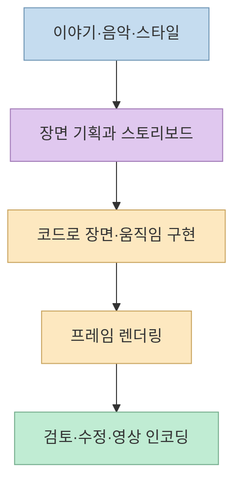
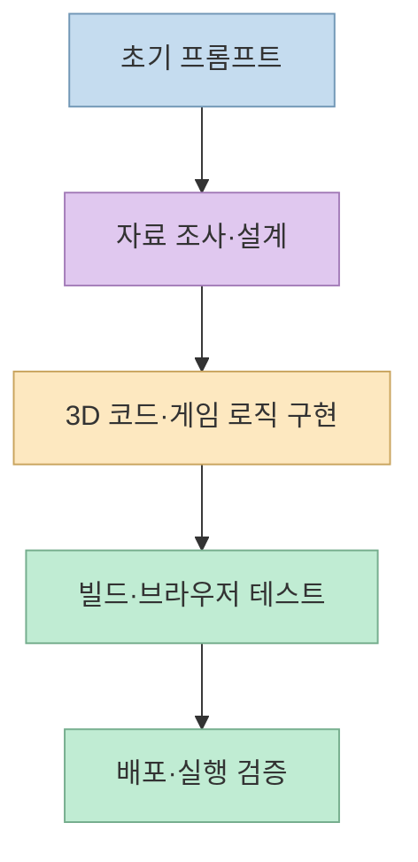
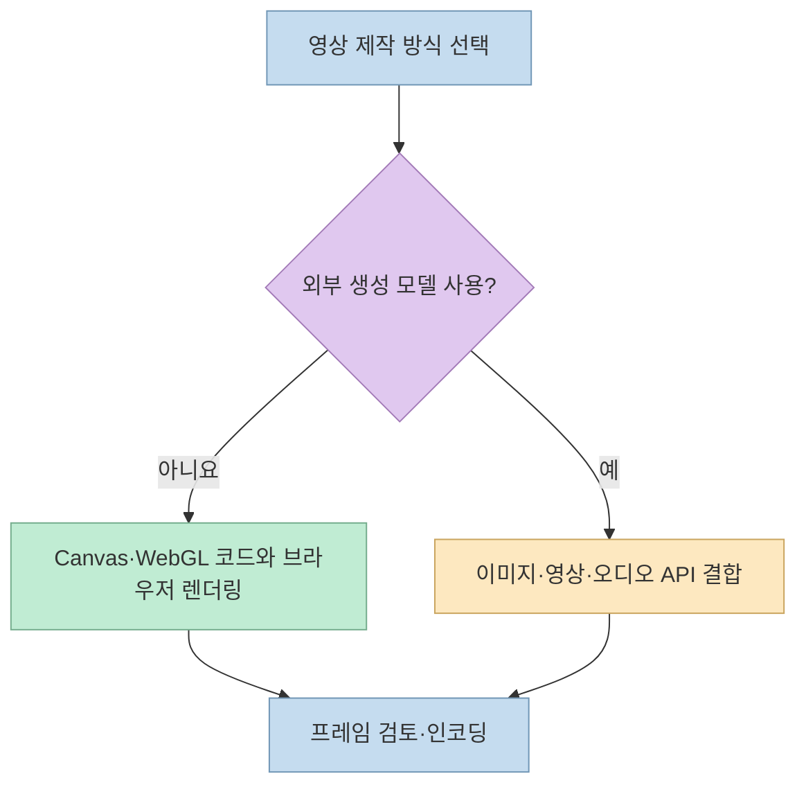

[X 게시물](https://x.com/NFTCPS/status/2105493719931826452)은 Claude Opus 5.5 공개 직후 주목받은 GitHub 저장소 10개를 소개한다. 뮤직비디오, 43가지 스타일의 단편, WebGPU 게임, 한 문장 프롬프트로 만든 3D 게임, 제작 스킬과 사례 모음이 한 목록에 섞여 있다. 이들을 모두 "AI가 영상 하나를 만든다"로 묶기보다 **완성 작품·재사용 도구·참고 자료** 로 나누고, 실제 제작 방식을 구분하는 편이 유용하다.

<!--more-->

## Sources

- [원본 X 게시물](https://x.com/NFTCPS/status/2105493719931826452)
- [Anthropic: Claude Opus 5.5 발표](https://www.anthropic.com/claude-opus-5-5)
- [PDoomVideo](https://github.com/JohnHeibel/PDoomVideo), [lemo-opuscar](https://github.com/lemomo-ai/lemo-opuscar)
- [tidewater](https://github.com/dgreenheck/tidewater), [claude-opus-5-5-demo](https://github.com/riba2534/claude-opus-5-5-demo)
- [shipvideo](https://github.com/diggerhq/shipvideo), [motion-graphics-music-video-skill](https://github.com/makevoid/motion-graphics-music-video-skill)
- [opus-video-skills](https://github.com/tuzhechen2005/opus-video-skills), [ClaudeAnimationBase](https://github.com/JohnHeibel/ClaudeAnimationBase)
- [awesome-opus5-5-videos](https://github.com/yihui-dev/awesome-opus5-5-videos), [awesome-opus-5-5-videos](https://github.com/athemeroy/awesome-opus-5-5-videos)

원본 X 게시물은 X 페이지 추출이 제한되어 공개 트윗 미러 API(`api.fxtwitter.com`)의 본문·링크를 HTTP로 확인했고, 첨부 이미지는 별도로 확인했다. 10개 저장소의 README와 메타데이터는 GitHub 원본 및 GitHub API로 대조했다. 아래의 제작 과정 설명은 **프로젝트 작성자의 공개 설명** 을 기반으로 하며, 각 프로젝트를 직접 실행하거나 산출물의 제작 이력을 독립적으로 감사한 것은 아니다. 원본 게시물의 별점과 "10개 중 8개" 같은 집계는 시점·분류 기준에 따라 달라질 수 있어 재현 가능한 고정 통계로 취급하지 않는다.

## 1. 완성 작품: 코드를 영상 제작 도구로 쓰다

[PDoomVideo](https://github.com/JohnHeibel/PDoomVideo)는 *I'm Upping My P(doom)* 뮤직비디오의 소스다. README에 따르면 Claude Code에서 Opus 5.5로 장면 구성, 가사와 음악의 정렬, 렌더러와 장면 코드를 만들었다. 첫 제작분은 `legacy/`에 남아 있고, 이후 버전의 제작 지침과 스토리보드도 공개돼 있다. 따라서 단순히 "프롬프트를 입력하니 MP4가 나왔다"는 사례가 아니라, **스토리보드→장면 코드→프레임 렌더링** 으로 이어지는 개발형 제작이다. 사람의 방향 제시와 모델의 구현을 구별해서 읽어야 한다. [PDoomVideo README](https://github.com/JohnHeibel/PDoomVideo)

[lemo-opuscar](https://github.com/lemomo-ai/lemo-opuscar)는 43가지 영상 스타일 각각에 재사용 가능한 스타일 프롬프트와 코드로 만든 단편 예시를 제공한다. 갤러리에서 스타일을 고른 뒤 자신의 이야기에 적용하는 구성이다. 저장소는 개발자가 직접 각 작품을 만들었으며 다른 모델에서 같은 결과를 보장하지 않는다고 명시한다. X 게시물의 첨부 이미지도 이 프로젝트의 갤러리와 *OPUSCAR 98* 작품 소개를 보여준다. [lemo-opuscar README](https://github.com/lemomo-ai/lemo-opuscar), [원본 X 게시물](https://x.com/NFTCPS/status/2105493719931826452)

## 2. 게임: 영상과 달리 입력·상태·성능까지 구현한다

[tidewater](https://github.com/dgreenheck/tidewater)는 브라우저에서 실행하는 섬 낚시 게임이다. 낚시와 물고기 판매·장비 구매뿐 아니라 바다와 섬의 실시간 표현을 포함하며, 프로젝트 설명에 따르면 프레임워크 없이 WebGPU·WGSL 기반 자체 렌더링 엔진을 사용한다. WebGPU를 지원하는 브라우저와 적절한 GPU가 필요하고 첫 실행 때 셰이더 컴파일에 시간이 걸릴 수 있다. 이는 "AI 영상"보다는 **인터랙티브 3D 애플리케이션** 사례다. [tidewater README](https://github.com/dgreenheck/tidewater)

[claude-opus-5-5-demo](https://github.com/riba2534/claude-opus-5-5-demo)는 펠리컨 자전거, 슈팅 게임 맵, 레이싱 게임의 세 웹 프로젝트를 묶었다. 작성자는 각 프로젝트를 한 문장 프롬프트에서 단일 세션으로 생성하고 코드를 사람이 수정하지 않았다고 설명한다. 그러나 "한 문장"은 전체 작업량이 한 단계였다는 뜻이 아니다. README에는 모델이 자료 조사, 프로젝트 구성, 빌드, 브라우저 테스트와 배포까지 진행했다고 적혀 있다. 결과를 평가할 때는 **초기 입력의 길이** 와 **에이전트가 수행한 후속 작업** 을 분리해야 한다. [claude-opus-5-5-demo README](https://github.com/riba2534/claude-opus-5-5-demo)

## 3. 재사용 도구: 같은 "영상 스킬"이어도 파이프라인은 다르다

[shipvideo](https://github.com/diggerhq/shipvideo)는 URL 또는 설명을 넣어 제품 출시 영상을 만드는 웹 앱이다. README의 흐름은 페이지 정보를 읽고, Opus 5.5가 단일 HTML 영상 장면을 작성한 뒤, 서버리스 에이전트가 헤드리스 Chromium으로 프레임을 렌더링하고 `ffmpeg`로 MP4를 인코딩하는 방식이다. 생성 비디오 모델이 클립 자체를 그리는 방식과 다르며, 영상은 작성한 웹 코드의 실행 결과다. 운영 시에는 OpenComputer 환경과 렌더링·다운로드 경로가 필요하다. [shipvideo README](https://github.com/diggerhq/shipvideo)

[opus-video-skills](https://github.com/tuzhechen2005/opus-video-skills)는 회화풍 애니메이션과 키네틱 타이포그래피 등 **스타일별 Claude Code 스킬** 을 제공한다. README는 이미지와 음악을 코드로 절차적으로 만들고 헤드리스 Chrome에서 프레임을 렌더링한 다음 `ffmpeg`로 인코딩한다고 설명한다. 반면 [motion-graphics-music-video-skill](https://github.com/makevoid/motion-graphics-music-video-skill)은 음악·프롬프트를 받아 제작하지만, README상 외부 이미지·영상·오디오 생성 도구와 FAL.ai API, p5.js, Python, Swift 도구를 함께 사용한다. 후자를 "모든 프레임을 Opus가 순수 코드만으로 생성"한 사례로 소개하면 부정확하다. 비용·API 키·외부 모델 의존성도 따로 확인해야 한다. [opus-video-skills README](https://github.com/tuzhechen2005/opus-video-skills), [motion-graphics-music-video-skill README](https://github.com/makevoid/motion-graphics-music-video-skill)

[ClaudeAnimationBase](https://github.com/JohnHeibel/ClaudeAnimationBase)는 PDoomVideo 작성자가 만든 출발점이다. p5.js·p5.brush 기반 캐릭터 애니메이션 코드, 감정 표현과 제작 지침을 제공한다. README의 예시는 에이전트가 지침을 읽고 스토리보드를 만든 뒤 쇼트별로 구현·검토해 `out/video.mp4`를 작성하는 흐름이다. 완성된 MV를 그대로 복제하기보다 **제작 지침과 기본 자산을 자기 장면에 맞게 바꾸는 도구** 로 보는 것이 맞다. [ClaudeAnimationBase README](https://github.com/JohnHeibel/ClaudeAnimationBase)

## 4. 사례 모음: 비슷한 이름, 다른 목적

[awesome-opus5-5-videos](https://github.com/yihui-dev/awesome-opus5-5-videos)는 원본 게시물과 공개 프롬프트 또는 원본 링크를 연결해 영상 사례를 찾아보기 쉽게 만든 목록이다. README에는 475개 항목과 재현 갤러리가 설명돼 있다. 숫자는 저장소가 기록한 시점의 스냅샷이며, 사례가 모두 같은 도구·동일 조건으로 재현된다는 뜻은 아니다. [awesome-opus5-5-videos README](https://github.com/yihui-dev/awesome-opus5-5-videos)

이름에 하이픈 하나가 더 있는 [awesome-opus-5-5-videos](https://github.com/athemeroy/awesome-opus-5-5-videos)는 1,000개 이상 영상의 출처를 추적하며, 모델이 렌더링 코드를 작성한 경우와 외부 모델을 지휘하거나 기존 영상을 편집한 경우 등을 구분하려고 한다. README는 검색 시점, 검토된 사례와 관찰의 한계를 명시한다. 프롬프트를 찾고 싶으면 첫 번째, **영상이 실제로 어떤 제작 경로를 거쳤는지** 비교하려면 두 번째가 더 직접적이다. [awesome-opus-5-5-videos README](https://github.com/athemeroy/awesome-opus-5-5-videos)

## 실전 적용 포인트

1. **목적부터 고른다.** 손그림 캐릭터 애니메이션이면 ClaudeAnimationBase, 스타일 탐색이면 lemo-opuscar, 제품 출시 영상이면 shipvideo, 3D 웹 상호작용을 만들고 싶다면 tidewater나 3D 게임 데모의 구조를 살펴본다. 목록 저장소 두 개는 제작 도구가 아니라 사례 조사 자료다. [각 프로젝트 README](https://github.com/JohnHeibel/ClaudeAnimationBase), [shipvideo README](https://github.com/diggerhq/shipvideo)
2. **제작 방식과 비용을 확인한다.** 코드 렌더링 중심인지 외부 생성 모델을 섞는지에 따라 설치·API·비용·재현성이 달라진다. 특히 음악비디오 스킬은 외부 모델과 서비스 의존성을 README에서 먼저 확인해야 한다. [motion-graphics-music-video-skill README](https://github.com/makevoid/motion-graphics-music-video-skill)
3. **품질 검증을 별도 단계로 둔다.** 프레임을 생성할 수 있다는 것과 이야기의 일관성, 움직임, 음악 싱크, 라이선스, 성능까지 만족한다는 것은 다르다. 공개 저장소의 프롬프트와 결과물은 출발점으로 삼되, 자신의 환경에서 빌드·재생·권리 관계를 확인한다. [PDoomVideo README](https://github.com/JohnHeibel/PDoomVideo), [claude-opus-5-5-demo README](https://github.com/riba2534/claude-opus-5-5-demo)

## 핵심 요약

- 원본 게시물의 10개 링크는 **완성 작품 4개, 제작 도구 4개, 사례 모음 2개** 로 읽으면 목적이 선명해진다. 여기서 작품 4개는 PDoomVideo·lemo-opuscar·tidewater·3D 게임 데모를 뜻하며, 이 중 게임 2개는 영상이 아니다. [원본 X 게시물](https://x.com/NFTCPS/status/2105493719931826452)
- "Opus 5.5 영상"은 단일 제작 기술을 뜻하지 않는다. 일부는 코드로 그려 브라우저에서 렌더링하고, 일부는 외부 생성 모델을 결합한다. [opus-video-skills README](https://github.com/tuzhechen2005/opus-video-skills), [motion-graphics-music-video-skill README](https://github.com/makevoid/motion-graphics-music-video-skill)
- "한 문장 프롬프트"는 에이전트의 조사·구현·테스트·배포 단계가 생략됐다는 뜻이 아니다. [claude-opus-5-5-demo README](https://github.com/riba2534/claude-opus-5-5-demo)

## 결론

이 목록이 보여 주는 변화는 영상 편집 소프트웨어가 무의미해졌다는 결론이 아니라, **코드를 작성하는 에이전트가 영상·애니메이션·게임 제작 파이프라인에 들어올 수 있다는 점** 이다. 무엇을 만들고 어떤 도구에 의존하는지부터 구분하면, 화제의 데모를 재현 가능한 자신의 워크플로로 바꾸기 쉽다.
