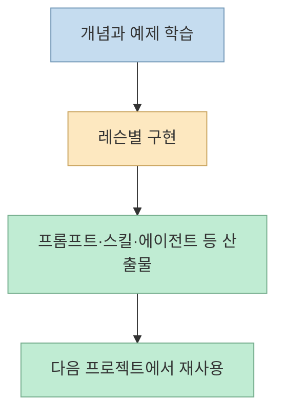
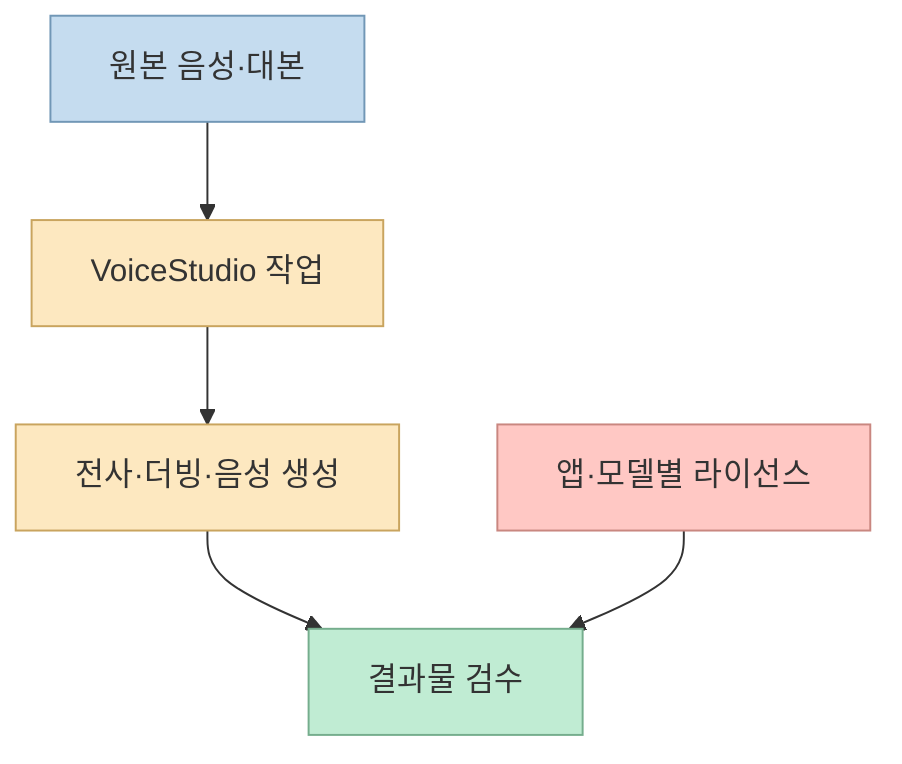
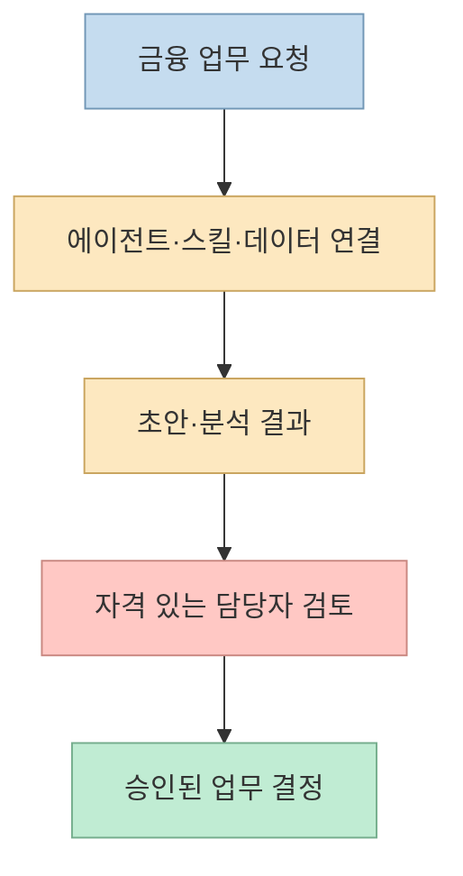
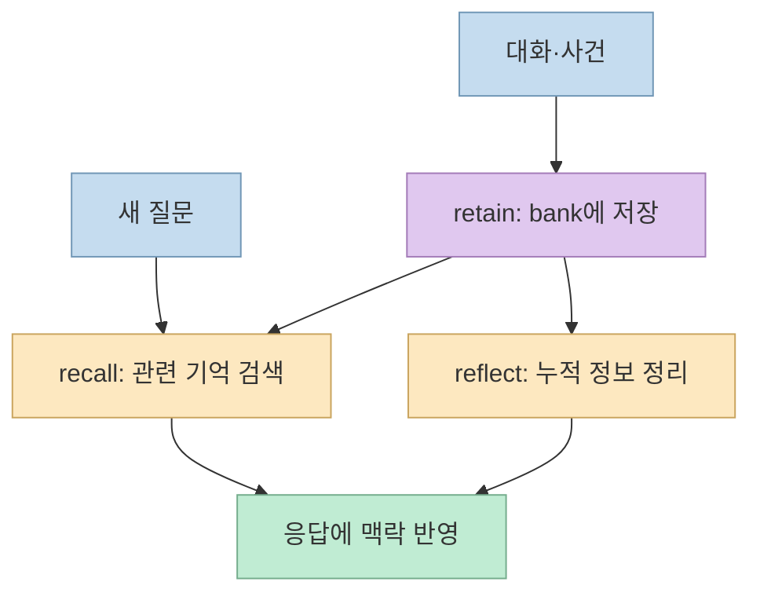
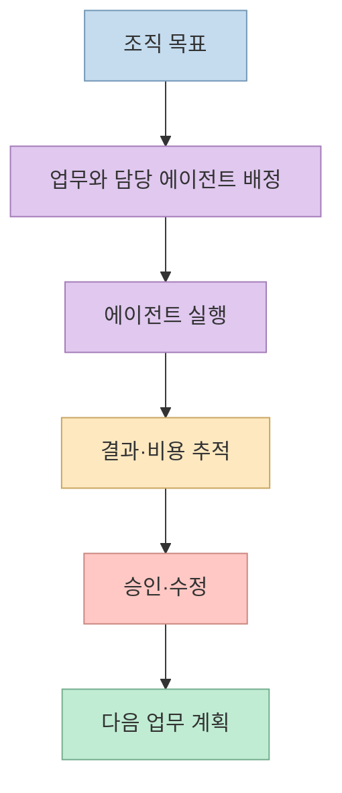
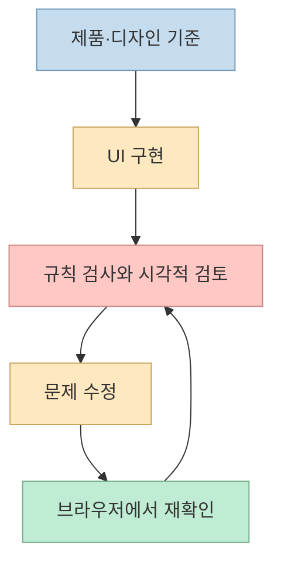

[문외인 Layperson의 쇼츠](https://youtube.com/shorts/Pp9ytaH4vuI?si=Zjmx4fioDzD4Ugjn)는 10월 첫 주에 눈여겨볼 오픈소스 다섯 개와 보너스 도구 하나를 소개한다. 학습 자료부터 음성 제작, 금융 업무용 에이전트, 장기 기억, 다중 에이전트 운영까지 범위가 넓다. 이 글은 영상의 **5위→1위 소개 순서** 를 따르되, 각 프로젝트의 공식 저장소를 기준으로 실제 역할과 도입 시 주의점을 구분한다. [영상 0:00](https://youtu.be/Pp9ytaH4vuI?t=0)

<!--more-->

## Sources

- [원본 YouTube Shorts: 10월 1주차의 오픈소스 정보를 정리해주는 깃허브 트렌딩 TOP5](https://youtube.com/shorts/Pp9ytaH4vuI?si=Zjmx4fioDzD4Ugjn)
- [AI Engineering from Scratch](https://github.com/rohitg00/ai-engineering-from-scratch)
- [VoiceStudio](https://github.com/debpalash/VoiceStudio)
- [Claude for Financial Services](https://github.com/anthropics/financial-services)
- [Hindsight](https://github.com/vectorize-io/hindsight)
- [Paperclip](https://github.com/paperclipai/paperclip)
- [Impeccable](https://github.com/pbakaus/impeccable)

아래 순위는 **영상의 발표 순서** 다. 특정 시점의 GitHub Trending 집계 기준과 순위 변동은 독립적으로 재현하지 못했다. 영상 속 스타 수와 전주 대비 상승 폭도 시점에 따라 달라지므로 현재 수치처럼 옮기지 않는다. 한국어 자동 자막에서 프로젝트 이름이 흔들리는 부분은 공식 저장소 표기로 바로잡았다.

## 5위: AI Engineering from Scratch — 학습 결과를 재사용 가능한 도구로

영상은 [AI Engineering from Scratch](https://github.com/rohitg00/ai-engineering-from-scratch)를 AI 엔지니어링을 처음부터 배우는 커리큘럼으로 소개한다. 저장소 README에 따르면 **20개 단계, 523개 레슨, 약 342시간** 분량이다. Python·TypeScript·Rust·Julia를 다루며, 레슨마다 프롬프트·스킬·에이전트·MCP 서버처럼 다시 쓸 수 있는 결과물을 만드는 구성이 특징이다. 숫자는 커리큘럼 자체의 규모이지 수강 완료나 실무 역량을 보증하는 지표는 아니다. [영상 0:15](https://youtu.be/Pp9ytaH4vuI?t=15), [공식 README](https://github.com/rohitg00/ai-engineering-from-scratch)

따라서 이 저장소는 당장 설치해 쓰는 앱보다 **학습 경로와 실습 재료** 로 보는 편이 정확하다. 처음부터 523개 레슨을 모두 따라가기보다, 현재 필요한 단계 하나를 골라 작은 결과물을 완성하고 다음 단계로 넘어가는 방식이 현실적이다. 이는 저장소의 레슨별 산출물 구조를 바탕으로 한 활용 제안이다. [공식 README](https://github.com/rohitg00/ai-engineering-from-scratch)

## 4위: VoiceStudio — 로컬 음성 제작, 라이선스는 별도 확인

[VoiceStudio](https://github.com/debpalash/VoiceStudio)는 음성 복제, 더빙, 받아쓰기, 전사, 오디오북 제작 등을 한 환경에서 다루는 **로컬 우선** 음성 작업 도구다. 영상도 클라우드 서비스가 아닌 로컬 작업 가능성을 강조한다. 다만 로컬 실행이 곧 모든 데이터 처리·모델 다운로드가 오프라인이라는 뜻은 아니므로, 실제 배포 구성과 사용하는 모델을 확인해야 한다. [영상 0:41](https://youtu.be/Pp9ytaH4vuI?t=41), [공식 README](https://github.com/debpalash/VoiceStudio)

특히 영상이 언급한 **상업적 사용 주의** 는 중요하다. 앱 소스는 AGPL-3.0이지만, 함께 쓰는 모델 가중치에는 별도 라이선스가 적용될 수 있다. 저장소의 [라이선스 안내](https://github.com/debpalash/VoiceStudio/blob/main/LICENSE-NOTICE.md)는 기본 OmniVoice 가중치를 비상업적 조건인 CC-BY-NC로 구분한다. 앱 라이선스만 보고 생성 결과물의 모든 상업 이용이 허용된다고 단정하지 말고, **선택한 모델과 데이터의 사용 조건** 을 각각 확인해야 한다. [영상 1:03](https://youtu.be/Pp9ytaH4vuI?t=63), [라이선스 안내](https://github.com/debpalash/VoiceStudio/blob/main/LICENSE-NOTICE.md)

## 3위: Claude for Financial Services — 금융 업무용 에이전트 설계 예시

[Anthropic의 financial-services 저장소](https://github.com/anthropics/financial-services)는 금융 업무에 맞춘 에이전트, 스킬, 데이터 연결 구성을 제공한다. 영상은 **10개 에이전트** 를 소개하고 Claude Cowork 또는 API에서 활용할 수 있다고 설명한다. 공식 README도 동일한 에이전트 정의를 **Claude Cowork 플러그인** 과 **Claude Managed Agents API** 경로로 제공한다고 명시한다. 즉, 단일 금융 분석 앱이라기보다 업무별 에이전트 구성을 재사용하는 출발점이다. [영상 1:05](https://youtu.be/Pp9ytaH4vuI?t=65), [영상 1:15](https://youtu.be/Pp9ytaH4vuI?t=75), [공식 README](https://github.com/anthropics/financial-services)

금융 분야라는 이름 때문에 **투자 판단을 자동 위임하는 도구** 로 오해해서는 안 된다. 공식 README는 생성물이 투자·법률·세무·회계 자문이 아니며, 적격 전문가의 검토가 필요한 초안이라고 밝힌다. 거래 실행, 위험 승인, 장부 기록, 고객 온보딩 같은 결정도 자동으로 맡기지 않도록 경고한다. 실제 업무에 도입한다면 데이터 접근권, 근거 출처, 담당자 검토·승인 단계를 먼저 정해야 한다. [공식 README](https://github.com/anthropics/financial-services)

## 2위: Hindsight — 기억 저장과 검색, 성찰을 분리

[Hindsight](https://github.com/vectorize-io/hindsight)는 에이전트의 장기 기억을 위한 프로젝트다. 영상은 사용자의 선호를 기억해 다음 대화에 활용하는 예시를 들고, 공식 README는 동작을 **`retain`(저장), `recall`(조회), `reflect`(축적된 내용의 정리·추론)** 로 나눈다. 저장 공간은 **bank** 단위로 분리할 수 있으며, 조회에는 의미·키워드·그래프·시간 기반 신호와 재순위화가 사용된다. [영상 1:29](https://youtu.be/Pp9ytaH4vuI?t=89), [영상 1:37](https://youtu.be/Pp9ytaH4vuI?t=97), [공식 README](https://github.com/vectorize-io/hindsight)

핵심은 더 긴 프롬프트를 매번 보내는 대신, **필요한 기억을 선별해 다시 불러오는 것** 이다. 다만 검색된 기억이 언제나 사실이거나 최신이라고 보장되지는 않는다. 실제 도입에서는 어떤 정보를 저장할지, bank별 접근권을 어떻게 분리할지, 오래된 기억을 언제 수정·폐기할지를 함께 설계해야 한다. 마지막 문장은 기억 시스템의 특성에서 도출한 운영상 권고다. [공식 README](https://github.com/vectorize-io/hindsight)

## 1위: Paperclip — 여러 에이전트의 업무를 조직처럼 운영

[Paperclip](https://github.com/paperclipai/paperclip)은 여러 AI 에이전트를 **목표, 업무, 팀, 비용** 단위로 관리하는 오픈소스 운영 계층이다. 영상은 회사를 운영하듯 에이전트를 배치하고 예산을 제어하는 도구로 소개한다. 공식 README는 조직도, 업무 할당, 예산, 승인 절차와 대시보드를 제시한다. 따라서 Paperclip 자체가 모든 일을 처리하는 범용 모델이라기보다, 이미 존재하는 에이전트들의 작업을 조정하는 서버와 UI에 가깝다. [영상 1:55](https://youtu.be/Pp9ytaH4vuI?t=115), [영상 2:03](https://youtu.be/Pp9ytaH4vuI?t=123), [공식 README](https://github.com/paperclipai/paperclip)

운영 화면에 예산과 승인 기능이 있다고 해서 **무감독 자율 운영의 안전성이 자동 보장되는 것은 아니다**. 실제 연결할 에이전트의 권한과 도구, 승인 대상 작업, 비용 한도를 먼저 정해야 한다. Paperclip이 해결하는 문제는 개별 에이전트의 지능보다 **여러 작업자의 책임과 진행 상태를 보이게 만드는 것** 이다. [공식 README](https://github.com/paperclipai/paperclip)

## 보너스: Impeccable — UI 품질 개선을 반복 가능한 명령으로

영상 말미의 [Impeccable](https://github.com/pbakaus/impeccable)은 에이전트가 웹 UI를 평가하고 개선하도록 돕는 디자인 스킬이다. 공식 README는 **1개 스킬, 24개 명령, 61개 결정적 검사 규칙** 을 설명한다. `PRODUCT.md`에 제품의 기준을 적고, 브라우저에서 실제 화면을 확인하며 개선을 반복하는 방식이 핵심이다. 검사 규칙으로 찾을 수 있는 문제와 LLM의 주관적 비평을 구분한다는 점도 유용하다. [영상 2:20](https://youtu.be/Pp9ytaH4vuI?t=140), [공식 README](https://github.com/pbakaus/impeccable)

## 실전 적용 포인트

이 여섯 저장소는 같은 종류의 도구가 아니다. **AI Engineering from Scratch는 배우는 데**, **VoiceStudio는 음성 결과물을 만드는 데**, **financial-services는 금융 업무용 에이전트 구성을 시작하는 데**, **Hindsight는 맥락을 기억하는 데**, **Paperclip은 여러 에이전트의 업무를 운영하는 데**, **Impeccable은 UI 품질을 검토하는 데** 쓴다. 한꺼번에 설치할 목록이 아니라 현재 병목에 맞춰 고를 선택지다. 이는 영상의 여섯 소개 항목과 공식 README의 용도를 비교한 분류다. [영상 0:15](https://youtu.be/Pp9ytaH4vuI?t=15), [영상 2:20](https://youtu.be/Pp9ytaH4vuI?t=140)

처음 적용한다면 **한 가지 문제와 검증 기준** 을 먼저 정하자. 대화마다 맥락을 잃는다면 Hindsight의 기억 품질을, 여러 에이전트가 충돌한다면 Paperclip의 업무·비용 가시성을, UI가 반복해서 거칠게 나온다면 Impeccable의 검사 루프를 시험한다. 금융·음성처럼 권리와 책임이 큰 영역은 각각 **사람의 승인** 과 **모델 라이선스 확인** 을 도입 조건으로 둔다. [Hindsight](https://github.com/vectorize-io/hindsight), [Paperclip](https://github.com/paperclipai/paperclip), [Impeccable](https://github.com/pbakaus/impeccable), [금융 저장소 안내](https://github.com/anthropics/financial-services), [VoiceStudio 라이선스](https://github.com/debpalash/VoiceStudio/blob/main/LICENSE-NOTICE.md)

## 핵심 요약

- 영상의 5위부터 1위는 **학습 → 로컬 음성 제작 → 금융 업무용 에이전트 → 장기 기억 → 다중 에이전트 운영** 순서다. [영상 0:15](https://youtu.be/Pp9ytaH4vuI?t=15), [영상 1:55](https://youtu.be/Pp9ytaH4vuI?t=115)
- 보너스 **Impeccable**은 결과 화면의 품질을 반복적으로 검사·개선하는 쪽에 가깝다. [영상 2:20](https://youtu.be/Pp9ytaH4vuI?t=140), [공식 README](https://github.com/pbakaus/impeccable)
- 순위 상승·스타 수보다 **현재 프로젝트의 병목, 라이선스, 승인 체계** 를 기준으로 선택해야 한다.

## 결론

이 쇼츠를 하나의 기술 스택 추천으로 받아들이기보다, **AI 작업의 서로 다른 여섯 계층을 살펴보는 목록** 으로 활용하는 편이 낫다. 필요한 계층 하나를 고르고 공식 README의 실행 조건과 제약을 확인한 뒤, 작은 실험으로 효과를 검증하자.
