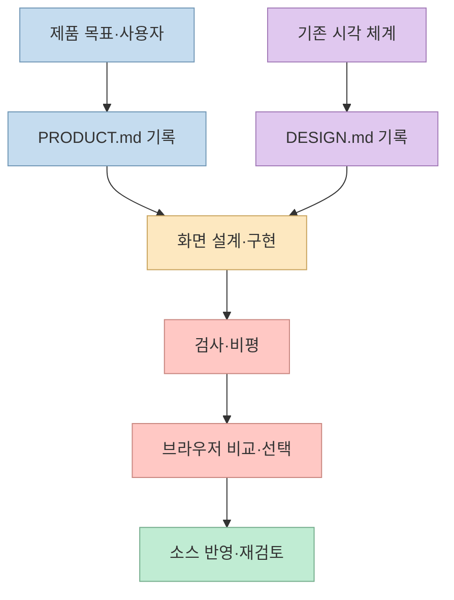
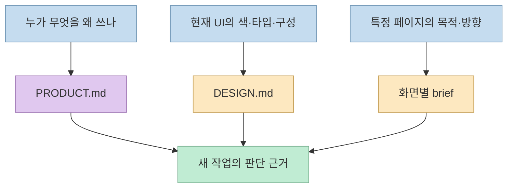
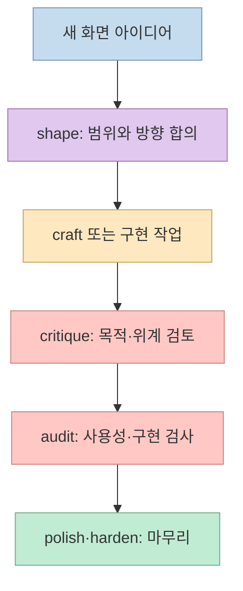
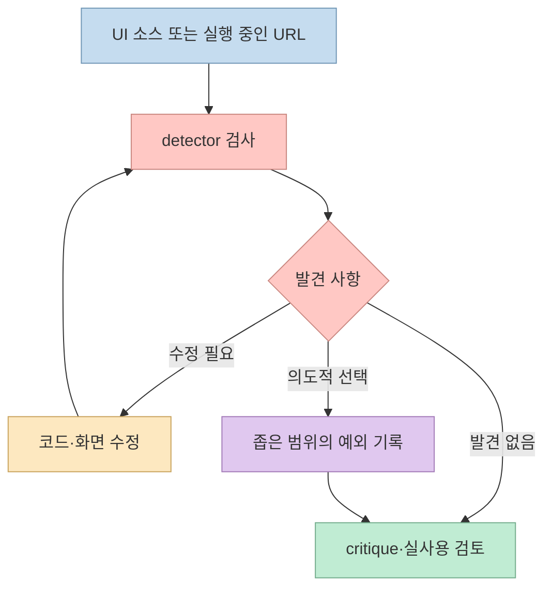
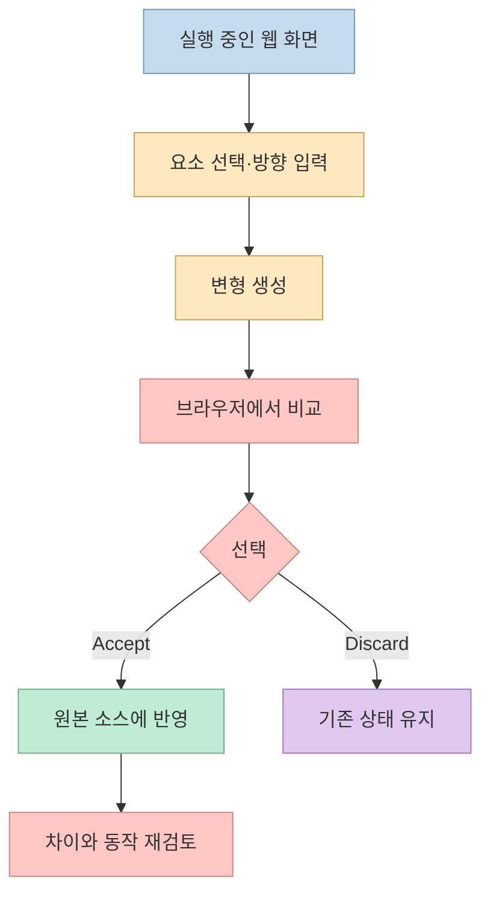

[Impeccable](https://github.com/pbakaus/impeccable)은 AI 코딩 에이전트가 화면을 만들고 개선할 때 쓰는 디자인 스킬이다. 현재 공식 README는 **1개 스킬, 24개 명령, 61개 결정적 검사 규칙, 브라우저에서의 시각적 반복 작업** 을 제시한다. 그러나 핵심은 명령 개수가 아니다. **제품의 사실을 기록하고 → 화면을 설계·구현하고 → 기계적 오류와 디자인 문제를 구분해 검토하고 → 실제 브라우저에서 결과를 선택하는 흐름** 이다. [공식 저장소](https://github.com/pbakaus/impeccable)

<!--more-->

## Sources

- [입력 URL: Impeccable 공식 GitHub 저장소](https://github.com/pbakaus/impeccable)
- [공식 문서: Context files](https://impeccable.style/docs/context/)
- [공식 문서: shape](https://impeccable.style/docs/shape/)
- [공식 문서: audit](https://impeccable.style/docs/audit/)
- [공식 문서: critique](https://impeccable.style/docs/critique/)
- [공식 문서: Detector](https://impeccable.style/docs/detector/)
- [공식 문서: Automatic design checks](https://impeccable.style/docs/hooks/)
- [공식 문서: Live Mode](https://impeccable.style/docs/live/)

이 블로그는 [3월의 디자인 언어 글](/post/2026/03/2026-03-23-impeccable-design-language-ai-harnesses/)과 [8월의 팩트체크 글](/post/2026/08/2026-08-05-impeccable-design-guardrail-v4-fact-check/)에서 Impeccable을 다뤘다. 당시 명령·검사 규칙 개수는 현재와 다르다. 아래 설명과 수치는 **2026년 10월 3일에 확인한 공식 README·문서의 스냅샷** 이며, 설치 시점에는 다시 확인해야 한다. [공식 README](https://github.com/pbakaus/impeccable)

## 1. Impeccable이 해결하려는 문제: 지시 한 줄로는 제품을 이해할 수 없다

공식 README는 AI가 흔히 만드는 획일적 화면의 예로 과도한 카드 중첩, 습관적인 그라데이션, 읽기 어려운 색상 조합 등을 든다. Impeccable은 이런 패턴을 피하라는 말만 더하는 대신, **프로젝트에 남는 맥락**, 디자인 작업용 명령, 코드·화면 검사, 브라우저 검토를 연결한다. “프롬프트를 넣으면 디자이너 수준 결과를 자동 보장한다”는 설명보다 **에이전트가 판단할 근거와 피드백 루프를 추가한다** 는 설명이 정확하다. [공식 README](https://github.com/pbakaus/impeccable)

이 구조에서 스킬은 **디자인 작업을 지휘하는 언어**, detector는 **알려진 패턴을 재현 가능하게 찾아내는 검사기**, Live Mode는 **사람이 결과를 비교하는 작업 공간** 이다. 세 부분은 서로 대체재가 아니다. 기계적 검사가 깨끗해도 화면의 목적과 위계가 어색할 수 있고, 보기 좋은 화면이라도 접근성·반응형 문제가 남을 수 있다. [공식 README](https://github.com/pbakaus/impeccable), [Detector 문서](https://impeccable.style/docs/detector/), [audit 문서](https://impeccable.style/docs/audit/)

## 2. `PRODUCT.md`와 `DESIGN.md`를 구분해야 하는 이유

`/impeccable init`은 저장소를 살펴보고 부족한 **제품의 지속적 사실** 을 질문한 뒤 `PRODUCT.md`에 기록한다. 여기에 들어갈 것은 사용자, 해야 할 일, 플랫폼, 제약, 용어 등이다. 반면 `/impeccable document`는 이미 존재하는 화면의 색상·타이포그래피·레이아웃·컴포넌트를 읽어 `DESIGN.md`에 **공유 시각 체계** 를 기록한다. 공식 문서는 `init`이 `DESIGN.md`까지 자동 생성하는 것은 아니라고 구분한다. [공식 README](https://github.com/pbakaus/impeccable), [Context 문서](https://impeccable.style/docs/context/)

구분이 중요한 이유는 **제품의 목적과 시각적 취향을 같은 규칙으로 굳히지 않기 위해서** 다. 예컨대 사용자가 이동 중 장애 상황을 확인해야 한다는 사실은 `PRODUCT.md`에 남길 수 있다. 현재 쓰는 버튼 색상과 간격은 `DESIGN.md`에 기록한다. 가격 페이지와 설정 화면의 목적은 다시 다르므로, 공식 문서는 페이지별 방향을 `.impeccable/surfaces/*.md`로 다룬다. 생성된 `.impeccable/design.json`은 도구가 쓰는 메타데이터이므로 손으로 수정하지 말라고 안내한다. [Context 문서](https://impeccable.style/docs/context/)

## 3. 명령을 단계별로 고르면 ‘그냥 예쁘게’보다 구체적이다

현재 README는 모든 기능을 `/impeccable <command> <target>` 아래의 **24개 명령** 으로 소개한다. `shape`는 구현 전에 사용자 과업·상태·제약·방향을 정리하고 **brief에서 멈추는** 명령이다. `craft`는 구상부터 구현과 시각적 반복까지 이어지는 흐름이다. 이미 있는 화면에는 `critique`로 정보 위계와 명확성을 검토하고, `audit`로 접근성·성능·반응형·테마·구현 일관성을 살펴보는 편이 목적에 맞다. `polish`는 최종 정리, `harden`은 오류·국제화·긴 텍스트·경계 상황을 다룬다. [공식 README](https://github.com/pbakaus/impeccable), [shape 문서](https://impeccable.style/docs/shape/), [critique 문서](https://impeccable.style/docs/critique/), [audit 문서](https://impeccable.style/docs/audit/)

여기서 `critique`와 `audit`의 차이를 특히 주의해야 한다. **`critique`는 디자인이 왜 어색하거나 혼란스러운지 판단하는 비평** 이고, **`audit`는 실제 사용과 구현 품질에서 문제가 있는지 살피는 검토** 다. 공식 `audit` 문서는 결과를 심각도순으로 제시하며 코드는 바꾸지 않는다고 설명한다. 어느 명령도 검토 결과를 무조건 수용하라는 뜻은 아니다. [critique 문서](https://impeccable.style/docs/critique/), [audit 문서](https://impeccable.style/docs/audit/)

## 4. 61개 규칙은 결정적 검사이지 디자인 심사위원이 아니다

공식 README의 **61개 규칙** 은 detector의 결정적 검사 규칙이다. CLI와 브라우저 확장은 이 규칙을 **LLM이나 API 키 없이** 실행하며, LLM 기반 비평 항목은 별도로 존재한다. 검사 대상에는 낮은 대비, 텍스트 넘침, 흔한 AI 디자인 패턴, 기록된 디자인 시스템과의 불일치가 포함된다. 따라서 “61개 규칙을 통과했다”는 말은 **알려진 규칙의 지적이 없었다** 는 뜻이지, 화면의 목적·브랜드 적합성·실제 사용자 경험까지 검증됐다는 뜻은 아니다. [공식 README](https://github.com/pbakaus/impeccable), [Detector 문서](https://impeccable.style/docs/detector/)

독립적인 수동 검사는 `npx impeccable detect src/`처럼 폴더를, 또는 `npx impeccable detect http://localhost:3000`처럼 실행 중인 페이지를 대상으로 할 수 있다. 소스 검사는 코드·스타일을 보고, URL 검사는 브라우저에 렌더링된 배치를 확인한다. 자동화용 `--json` 출력에서는 종료 코드 **0은 주요 발견 사항 없음, 2는 주요 발견 사항 있음, 1은 대상 스캔 실패** 를 뜻한다. 코드 1을 단순한 디자인 실패로 처리하면 실제 검사 오류를 놓친다. [Detector 문서](https://impeccable.style/docs/detector/)

훅을 설치·허용하면 에이전트가 UI 파일을 편집하는 동안 detector 피드백을 받을 수 있다. 다만 **설치만으로 모든 환경에서 훅이 자동 활성화되는 것은 아니다**. 공식 문서는 코딩 도구의 훅 신뢰·승인 상태를 확인하고 `/impeccable doctor`로 구성 오류를 점검하라고 안내한다. Codex에서는 훅 정의를 별도로 신뢰해야 하며, 정의가 바뀌면 다시 검토가 필요할 수 있다. [Automatic design checks 문서](https://impeccable.style/docs/hooks/)

## 5. Live Mode는 변형을 고른 뒤 실제 소스를 검토하는 단계

`/impeccable live`는 실행 중인 웹 페이지에서 요소를 선택하고 수정 방향을 말한 뒤, 변형을 화면에서 비교하는 **베타 기능** 이다. `generate`는 에이전트 대화에서 지정한 요소의 변형 비교를 시작할 수 있다. Live Mode는 기본적으로 선택한 요소에 세 가지 대안을 만들며, 마음에 드는 안을 **Accept** 하면 소스에 반영한다. 전체 페이지 방향은 요소를 고르지 않고 **Steer** 로 전달할 수도 있다. [공식 README](https://github.com/pbakaus/impeccable), [Live Mode 문서](https://impeccable.style/docs/live/)

중요한 경계는 **미리보기에서 보기 좋은 것과 소스·동작이 올바른 것은 별개** 라는 점이다. 공식 문서도 수락 후 소스 차이와 행동을 검토하라고 권한다. Live Mode는 개발 서버나 로컬 정적 HTML의 웹 화면을 대상으로 하며, 네이티브 iOS·Android 화면에는 붙지 않는다. 프로젝트 설정에 따라 처음 연결할 때 추가 구성이 필요할 수 있다. [Live Mode 문서](https://impeccable.style/docs/live/)

## 실전 적용 포인트

처음 써 본다면 **기존 화면 한 페이지** 로 범위를 좁히는 편이 좋다. `npx impeccable install`로 설치한 다음, 도구를 다시 열고 제품 맥락을 `init`으로 기록한다. 기존 디자인을 지켜야 한다면 `document`로 현재 시각 체계를 명시한다. 그 뒤 `critique`로 목적과 위계를 보고, `audit`나 detector로 구현 문제를 확인하고, 필요할 때 Live Mode에서 변형을 비교한다. CLI 설치기는 환경에 따라 설치 범위와 제공자를 묻기 때문에, 자동화할 때는 공식 README의 `--providers`·`--scope` 옵션을 확인해야 한다. [공식 README](https://github.com/pbakaus/impeccable), [Context 문서](https://impeccable.style/docs/context/)

**Codex에서의 호출법은 다른 에이전트와 다를 수 있다.** 공식 README는 Claude Code 등의 `/impeccable` 표기와 달리 Codex에서 스킬을 열거나 `$impeccable`을 입력하도록 안내한다. 훅도 설치 파일의 존재와 실행 허용을 구분해야 한다. 이 글은 사용 흐름을 설명할 뿐, 이 블로그 저장소에 Impeccable을 설치하거나 훅을 켜지는 않았다. [공식 README](https://github.com/pbakaus/impeccable), [훅 문서](https://impeccable.style/docs/hooks/)

## 핵심 요약

- Impeccable의 현재 구성은 **1개 스킬·24개 명령·61개 결정적 검사 규칙** 이며, 숫자는 업데이트될 수 있다. [공식 README](https://github.com/pbakaus/impeccable)
- `PRODUCT.md`는 **제품의 사실**, `DESIGN.md`는 **공유 시각 체계**, 화면별 brief는 **그 화면의 목적과 방향** 을 맡는다. [Context 문서](https://impeccable.style/docs/context/)
- `critique`는 디자인 판단, `audit`와 detector는 사용·구현 문제 점검, Live Mode는 시각적 대안 비교에 각각 쓰인다. [critique 문서](https://impeccable.style/docs/critique/), [audit 문서](https://impeccable.style/docs/audit/), [Live Mode 문서](https://impeccable.style/docs/live/)
- 검사 결과와 미리보기는 **사람의 최종 검토를 대체하지 않는다**. [Detector 문서](https://impeccable.style/docs/detector/), [Live Mode 문서](https://impeccable.style/docs/live/)

## 결론

Impeccable을 가장 잘 이해하는 방법은 “AI가 예쁜 UI를 만드는 프롬프트”가 아니라 **제품 맥락, 시각 체계, 설계 명령, 결정적 검사, 브라우저 피드백을 연결하는 작업 방식** 으로 보는 것이다. 명령을 많이 실행하는 것보다 먼저 **어떤 화면에서 누가 무엇을 해야 하는지** 를 기록하고, 검사와 사람의 선택을 끝까지 남기는 편이 중요하다.
