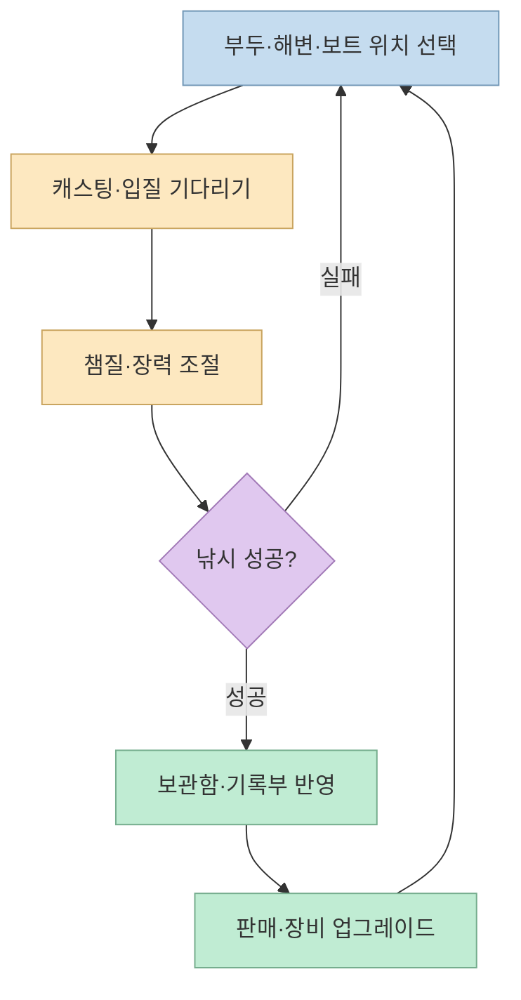
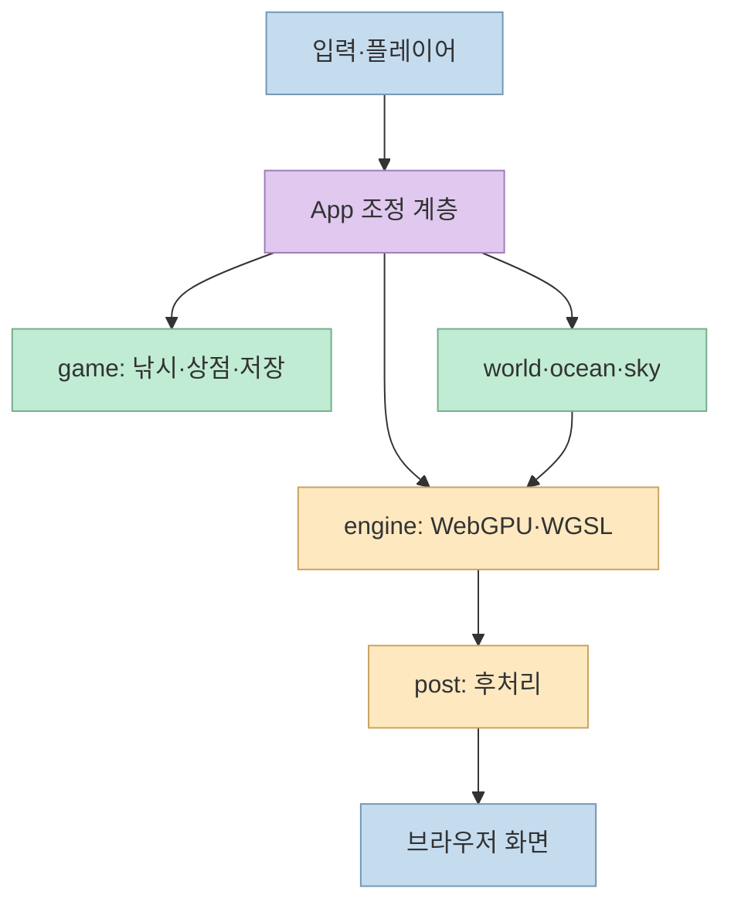
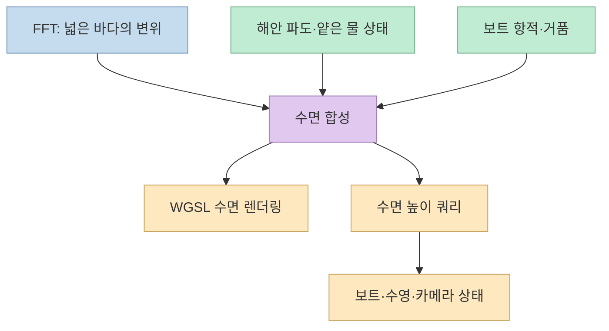
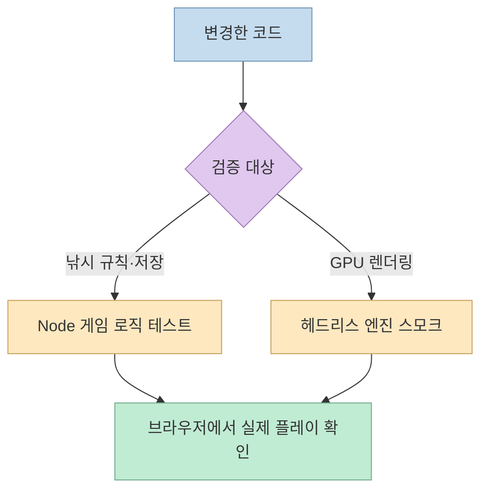

[Tidewater](https://github.com/dgreenheck/tidewater)는 브라우저에서 즐기는 섬 낚시 게임이다. 부두·해변·보트에서 낚시하고, 잡은 물고기를 팔아 장비를 업그레이드한다. 그러나 이 프로젝트가 기술적으로 흥미로운 이유는 낚시 규칙 자체보다 그 아래에 **자체 WebGPU·WGSL 렌더 엔진, 여러 규모의 파도와 해안 시뮬레이션, 별도 게임 상태 관리** 를 함께 구현했다는 점이다. 저장소 설명에는 Claude Opus 5.5로 만들었다고 적혀 있지만, 이 글은 제작 과정의 성과를 추정하기보다 **공개된 코드가 실제로 어떻게 나뉘어 있는지** 에 집중한다. [README](https://github.com/dgreenheck/tidewater#tidewater), [프로젝트 구조](https://github.com/dgreenheck/tidewater#project-layout)

<!--more-->

## Sources

- [dgreenheck/tidewater 원본 저장소](https://github.com/dgreenheck/tidewater)
- [플레이 가능한 공개 페이지](https://dgreenheck.github.io/tidewater/)
- [README: 요구 사항·기능·실행법](https://github.com/dgreenheck/tidewater/blob/main/README.md)
- [애플리케이션 연결부 `src/App.js`](https://github.com/dgreenheck/tidewater/blob/main/src/App.js), [렌더 엔진 `src/engine/Engine.js`](https://github.com/dgreenheck/tidewater/blob/main/src/engine/Engine.js)
- [해양 FFT `src/ocean/OceanFFT.js`](https://github.com/dgreenheck/tidewater/blob/main/src/ocean/OceanFFT.js), [해안 시뮬레이션 `src/ocean/ShoreSim.js`](https://github.com/dgreenheck/tidewater/blob/main/src/ocean/ShoreSim.js), [수면 쿼리 `src/ocean/WaterQuery.js`](https://github.com/dgreenheck/tidewater/blob/main/src/ocean/WaterQuery.js)
- [낚시 확률 `src/game/Bites.js`](https://github.com/dgreenheck/tidewater/blob/main/src/game/Bites.js), [줄 장력 미니게임 `src/game/CatchMinigame.js`](https://github.com/dgreenheck/tidewater/blob/main/src/game/CatchMinigame.js), [저장 상태 `src/game/GameState.js`](https://github.com/dgreenheck/tidewater/blob/main/src/game/GameState.js)
- [실행 스크립트 `package.json`](https://github.com/dgreenheck/tidewater/blob/main/package.json), [게임 로직 테스트](https://github.com/dgreenheck/tidewater/blob/main/test/game-logic.mjs), [엔진 스모크 테스트](https://github.com/dgreenheck/tidewater/blob/main/test/engine-smoke.mjs), [에셋 출처](https://github.com/dgreenheck/tidewater/blob/main/CREDITS.md)

2026년 10월 3일 공개 저장소 페이지를 Scrapling의 HTTP fetch(`scrapling-get`)로 읽고, GitHub의 원본 README·소스 파일·메타데이터를 HTTP로 대조했다. 공개 플레이 페이지가 HTTP 200으로 응답하는 것은 확인했지만, GPU가 있는 브라우저에서 직접 플레이하거나 FPS를 측정하지는 않았다. 아래 성능 수치와 시각 품질은 **저장소 작성자의 설명** 이며 독립 벤치마크가 아니다.

## 1. 게임의 중심은 ‘던지기→버티기→판매→업그레이드’ 루프

README의 게임 흐름은 단순한 바다 구경이 아니다. 플레이어는 위치를 고르고 낚싯대를 던진 뒤, 입질이 오면 챔질하고, 줄의 장력을 관리하면서 물고기를 끌어올린다. 잡은 물고기는 보관함과 기록부에 반영되고 판매 수익으로 줄·릴·낚싯대·연료통·어군 탐지기 등을 업그레이드한다. 보트로 먼바다에 가는 선택은 연료 소모와 연결된다. 즉 환경 탐험과 경제·장비 루프가 서로를 움직인다. [README의 Fishing 기능](https://github.com/dgreenheck/tidewater#features), [낚시 플레이 설명](https://github.com/dgreenheck/tidewater#fishing)

입질은 무작위 한 번으로 끝나지 않는다. [`Bites.js`](https://github.com/dgreenheck/tidewater/blob/main/src/game/Bites.js)는 물 깊이와 산호초·부두까지의 거리로 얕은 바다, 산호초, 부두, 만, 깊은 바다의 **겹칠 수 있는 서식지 가중치** 를 만든다. 이어 어종별 서식지 선호, 희귀도, 시간대 활동성을 곱해 선택 가중치를 계산한다. 따라서 "어느 지점·어느 시간에 낚시하느냐"가 잡히는 어종에 반영된다. 건조한 모래 위에서는 입질 후보가 없도록 처리한다. [`Bites.js`의 habitatAt·activity·pickSpecies](https://github.com/dgreenheck/tidewater/blob/main/src/game/Bites.js), [README의 어종 설명](https://github.com/dgreenheck/tidewater#features)

줄을 감는 동안에는 [`CatchMinigame.js`](https://github.com/dgreenheck/tidewater/blob/main/src/game/CatchMinigame.js)가 거리, 장력, 물고기의 체력과 돌진 상태를 갱신한다. 줄을 계속 감으면 거리는 줄지만 장력이 올라가고, 풀어 주면 장력은 낮아지지만 물고기가 도망갈 수 있다. 적정 장력 구간에서는 물고기가 더 빨리 지치며, 과한 장력이 지속되면 줄이 끊어지고, 장시간 너무 느슨하면 바늘이 빠진다. README의 "초록색 장력 구간 유지"가 게임 규칙으로 구현되는 위치다. [`CatchMinigame.js` 생성자·update](https://github.com/dgreenheck/tidewater/blob/main/src/game/CatchMinigame.js), [README](https://github.com/dgreenheck/tidewater#features)

## 2. ‘엔진 없음’이 아니라 ‘외부 3D 프레임워크 대신 자체 엔진’

README는 WebGPU와 WGSL 위에서 "프레임워크 없이" 실행한다고 설명한다. 이는 렌더링 계층에 범용 3D 엔진을 두지 않았다는 뜻으로 읽는 것이 정확하다. 실제 [`src/engine/`](https://github.com/dgreenheck/tidewater/tree/main/src/engine)에는 GPU 리소스, 지오메트리, 장면, 카메라, 재질, 그림자, WGSL 셰이더 구성 코드가 있으며, [`Engine.js`](https://github.com/dgreenheck/tidewater/blob/main/src/engine/Engine.js)는 캔버스를 만들고 GPU를 초기화해 렌더러·장면·카메라와 크기 변경을 관리한다. 개발·빌드에는 Vite를 사용하므로 "외부 패키지가 전혀 없다"는 뜻은 아니다. [README의 기술 설명](https://github.com/dgreenheck/tidewater#tidewater), [`package.json`](https://github.com/dgreenheck/tidewater/blob/main/package.json)

애플리케이션 상위의 [`src/App.js`](https://github.com/dgreenheck/tidewater/blob/main/src/App.js)는 엔진에 바다, 대기, 지형, 야생동물, 플레이어, 낚시 게임, 오디오, 후처리 모듈을 연결한다. 이 분리가 중요하다. GPU 자원과 셰이더 파이프라인을 다루는 코드를 낚시 경제 규칙과 분리해 두면, 물 표현을 바꾸거나 입질 확률을 조정할 때 영향을 받는 범위를 찾기 쉬워진다. 다음 다이어그램은 파일 간 의존 관계를 **설명용으로 단순화한 것** 이지 런타임의 모든 호출 순서는 아니다. [`src/App.js`의 import 구성](https://github.com/dgreenheck/tidewater/blob/main/src/App.js), [README의 프로젝트 구조](https://github.com/dgreenheck/tidewater#project-layout)

## 3. 바다 표현: 넓은 해면, 얕은 해안, 게임의 수면 높이를 연결한다

README는 네 단계의 FFT 해양, 부서지는 파도, 젖은 모래로 밀려왔다 빠지는 얕은 물, 보트 항적, 수면 아래의 빛무늬와 굴절을 나열한다. 소스에서 [`OceanFFT.js`](https://github.com/dgreenheck/tidewater/blob/main/src/ocean/OceanFFT.js)는 크기가 다른 네 캐스케이드와 256 크기의 역 FFT를 사용해 넓은 해면의 변위를 계산한다. 파일 주석에는 한 프레임의 캐스케이드 계산을 행·열 두 GPU compute dispatch로 처리하고, 변위·도함수 텍스처를 기록한다고 설명돼 있다. 여러 파장 규모를 조합하는 이유는 가까운 잔물결과 멀리 이어지는 큰 물결을 한 해면에서 표현하기 위해서다. [README의 Ocean 항목](https://github.com/dgreenheck/tidewater#features), [`OceanFFT.js` 구현 설명](https://github.com/dgreenheck/tidewater/blob/main/src/ocean/OceanFFT.js)

해안에서는 넓은 바다와 다른 현상이 필요하다. [`ShoreSim.js`](https://github.com/dgreenheck/tidewater/blob/main/src/ocean/ShoreSim.js)는 해변 영역의 거품, 모래 젖음, 물이 빠진 뒤 남은 거품, 물 흐름 속도를 상태로 저장해 매 프레임 GPU에서 갱신한다. 따라서 "파도가 보인다"와 "파도가 지나간 자리의 모래가 젖는다"를 별도 문제로 다룬다. [`WaterQuery.js`](https://github.com/dgreenheck/tidewater/blob/main/src/ocean/WaterQuery.js)는 카메라와 보트·수영자 등 게임 대상의 수면 높이를 조회한다. GPU 결과를 CPU 물리에 읽어 오는 데 파일 주석상 1~3프레임의 지연이 있어, 그림의 물과 게임 물리 사이에는 동기화 설계가 필요하다. [`ShoreSim.js` 상태 설명](https://github.com/dgreenheck/tidewater/blob/main/src/ocean/ShoreSim.js), [`WaterQuery.js` 쿼리·지연 설명](https://github.com/dgreenheck/tidewater/blob/main/src/ocean/WaterQuery.js)

이 위에는 대기·구름, 계단식 그림자, 앰비언트 오클루전, 시간적 업스케일링, 블룸·자동 노출·모션 블러 같은 후처리가 더해진다. 하지만 "구현돼 있다"와 "모든 장치에서 안정적으로 60fps가 나온다"는 다른 주장이다. README의 2560×1267 해상도에서 60fps 목표는 **Apple M5 Pro를 기준으로 한 작성자의 목표** 이며, 느린 장치에서는 동적 렌더 해상도를 낮춘다고 설명한다. 첫 방문 시 여러 셰이더의 컴파일로 1분 이상 걸릴 수도 있다. [README의 Sky·Lighting 항목](https://github.com/dgreenheck/tidewater#features), [README의 Requirements](https://github.com/dgreenheck/tidewater#requirements)

## 4. 상태 저장과 테스트는 그래픽과 독립된 품질 축이다

[`GameState.js`](https://github.com/dgreenheck/tidewater/blob/main/src/game/GameState.js)는 돈, 잡은 물고기 목록, 어종별 기록, 장비 업그레이드, 연료를 한곳에 둔다. 변경 시 브라우저 `localStorage`에 저장하며, 저장소 접근이 실패하는 환경에서는 예외를 방어해 게임 자체는 계속 동작하도록 설계했다. 이는 서버 계정으로 동기화한다는 뜻이 아니고 **현재 브라우저의 로컬 진행 상태** 다. 다른 기기나 브라우저의 기록과 자동으로 합쳐지지 않는다. [`GameState.js`의 저장 키·상태 구조](https://github.com/dgreenheck/tidewater/blob/main/src/game/GameState.js), [README의 진행 저장 설명](https://github.com/dgreenheck/tidewater#features)

테스트도 둘로 나뉜다. [`package.json`](https://github.com/dgreenheck/tidewater/blob/main/package.json)의 `npm test`는 GPU 없이 입질·장력·인벤토리·저장을 확인하는 [`test/game-logic.mjs`](https://github.com/dgreenheck/tidewater/blob/main/test/game-logic.mjs)와 헤드리스 WebGPU로 장면을 그려 보는 [`test/engine-smoke.mjs`](https://github.com/dgreenheck/tidewater/blob/main/test/engine-smoke.mjs)를 실행한다. 저장소에는 그 밖의 해양·후처리 관련 시험 파일도 있지만, **`npm test` 기본 명령에 모두 포함되지는 않는다.** 테스트 파일의 존재만으로 전체 게임을 모든 브라우저에서 검증했다고 볼 수는 없다. [`package.json` scripts](https://github.com/dgreenheck/tidewater/blob/main/package.json), [README의 test 디렉터리 설명](https://github.com/dgreenheck/tidewater#project-layout)

## 실전 적용 포인트

1. **먼저 공개 데모에서 환경을 확인한다.** [플레이 페이지](https://dgreenheck.github.io/tidewater/)와 README에 적힌 WebGPU 지원 브라우저·GPU 조건을 확인한다. 초기 셰이더 컴파일이 길 수 있으므로 첫 로딩만 보고 실패로 단정하지 않는다. [README의 Requirements](https://github.com/dgreenheck/tidewater#requirements)
2. **로컬에서는 저장소의 명령을 그대로 따른다.** `npm install` 후 `npm run dev`를 실행하면 README 기준 `http://127.0.0.1:5189`에서 개발 서버가 뜬다. `npm run build`는 정적 결과물을 `dist/`에 만들고, `npm test`는 위에서 설명한 기본 두 테스트를 실행한다. 여기서는 직접 설치·실행하지 않았으므로 로컬 성능은 확인하지 않았다. [README의 Running locally](https://github.com/dgreenheck/tidewater#running-locally), [`package.json`](https://github.com/dgreenheck/tidewater/blob/main/package.json)
3. **재사용할 때는 코드와 에셋의 권리를 분리한다.** 코드는 MIT이지만 효과음, 스캔 모델, 캐릭터, 폰트는 각각 다른 출처·라이선스를 가진다. 단순히 저장소 상단의 MIT 배지만 보고 포함된 모든 리소스를 동일 조건으로 재배포해서는 안 된다. [CREDITS.md](https://github.com/dgreenheck/tidewater/blob/main/CREDITS.md), [LICENSE](https://github.com/dgreenheck/tidewater/blob/main/LICENSE)

## 핵심 요약

- Tidewater는 낚시·판매·업그레이드가 반복되는 게임이며, 장소·시간에 따른 입질 가중치와 장력 관리가 코드의 핵심 규칙이다. [`Bites.js`](https://github.com/dgreenheck/tidewater/blob/main/src/game/Bites.js), [`CatchMinigame.js`](https://github.com/dgreenheck/tidewater/blob/main/src/game/CatchMinigame.js)
- 렌더링은 자체 WebGPU·WGSL 엔진을 사용하고, 바다는 FFT 해면·해안 상태·수면 높이 쿼리를 나누어 처리한다. [`Engine.js`](https://github.com/dgreenheck/tidewater/blob/main/src/engine/Engine.js), [`OceanFFT.js`](https://github.com/dgreenheck/tidewater/blob/main/src/ocean/OceanFFT.js), [`WaterQuery.js`](https://github.com/dgreenheck/tidewater/blob/main/src/ocean/WaterQuery.js)
- 성능 목표, 전체 브라우저 호환성, AI 제작 과정은 README 설명과 직접 검증 결과를 구분해야 한다. 코드는 MIT이지만 서드파티 에셋의 라이선스는 별도다. [README](https://github.com/dgreenheck/tidewater), [CREDITS.md](https://github.com/dgreenheck/tidewater/blob/main/CREDITS.md)

## 결론

Tidewater를 배우는 가장 좋은 방법은 "AI가 만든 화려한 게임"이라는 표면보다 **게임 규칙, 자체 렌더 엔진, 여러 물 시뮬레이션, 상태·테스트가 어디서 이어지는지** 를 보는 것이다. 공개 코드는 그 연결을 추적할 수 있게 해 주지만, 실제 성능과 사용 경험은 자신의 브라우저·GPU에서 따로 검증해야 한다.
