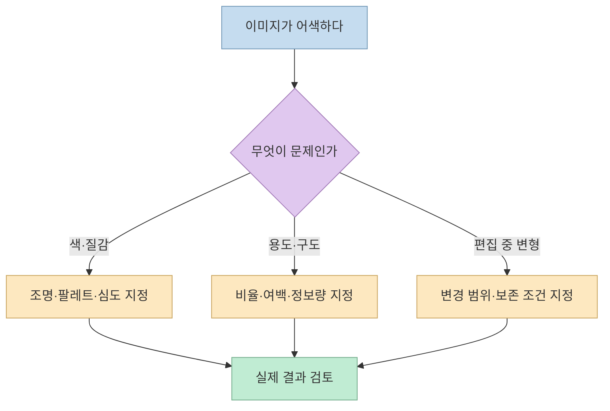
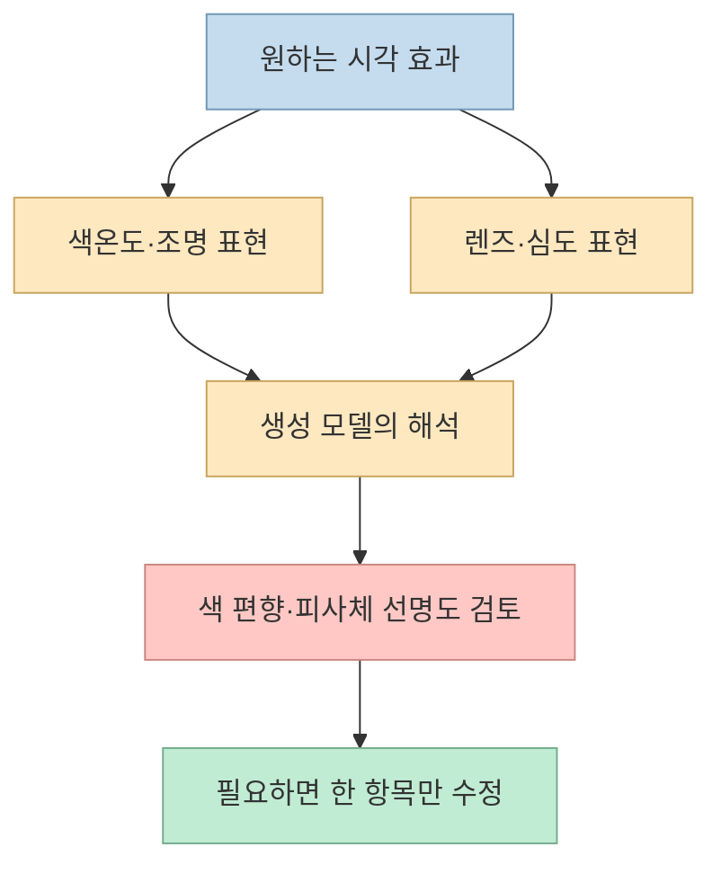
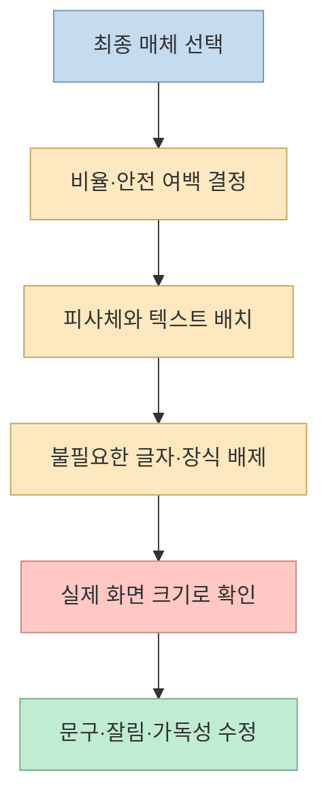
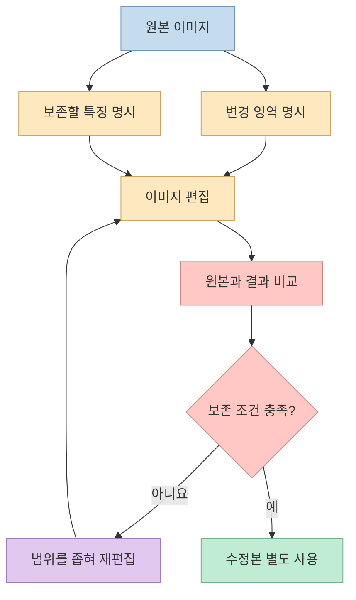

[おさぼりさん의 X 스레드](https://x.com/osabori_code/status/2106313054380290548)는 ChatGPT로 만든 이미지가 획일적으로 보일 때 덧붙일 수 있는 **아홉 가지 지시** 를 제안한다. 주제는 색 보정부터 SNS 썸네일, 슬라이드 삽화, 제품 사진 편집, 마지막 마무리까지 다양하다. 하지만 “한 문장만 추가하면 AI 느낌이 사라진다”는 말은 검증된 보편 법칙이 아니다. 이 글은 원문의 항목을 **무엇을 바꾸려는 지시인지** 로 나누고, 결과를 어떻게 확인해야 하는지 정리한다. [원문](https://x.com/osabori_code/status/2106313054380290548)

<!--more-->

## Sources

- [입력 URL: おさぼりさん의 X 스레드](https://x.com/osabori_code/status/2106313054380290548)
- [스레드 펼쳐 보기: 12개 게시물](https://threadreaderapp.com/thread/2106313054380290548.html)
- [OpenAI: Image prompting](https://developers.openai.com/api/docs/guides/image-prompting)
- [OpenAI: Images in ChatGPT](https://help.openai.com/en/articles/11084440-images-in-chatgpt)
- [OpenAI: Image generation](https://developers.openai.com/api/docs/guides/image-generation)

X 원문의 첫 게시물만 보면 아홉 항목이 보이지 않는다. 이어진 답글은 공개 스레드 펼치기 페이지에서 확인했고, 첫 게시물은 X의 공개 임베드 데이터와 대조했다. 아래 설명에서 **원문 작성자의 제안** 과 **공식 문서에서 확인되는 기능** 을 구분한다. 이 글은 아홉 지시를 직접 이미지 생성 실험으로 비교한 결과가 아니다. [원문](https://x.com/osabori_code/status/2106313054380290548), [스레드 펼쳐 보기](https://threadreaderapp.com/thread/2106313054380290548.html)

## 먼저 구분할 것: ‘AI 느낌’은 단일 오류가 아니다

원문은 “AI 느낌”이라는 말 아래 **노란 색감, 지나치게 평평한 배경, 문자 공간 부족, 불필요한 장식, 제품·인물의 변형** 을 함께 묶는다. 그런데 이 문제들은 한 번에 같은 방식으로 고칠 수 없다. 색감 문제에는 색·조명 지시가, 썸네일 문제에는 여백·배치 지시가, 제품 사진 편집에는 **바꿀 부분과 보존할 부분의 분리** 가 더 직접적이다. OpenAI의 이미지 프롬프트 가이드 역시 피사체·구도·스타일·제약을 구체적으로 적고, 편집할 때는 변경 사항과 유지할 사항을 따로 명시하라고 권한다. [원문 ①~⑨](https://threadreaderapp.com/thread/2106313054380290548.html), [OpenAI 프롬프트 가이드](https://developers.openai.com/api/docs/guides/image-prompting)

## ①·② 색과 깊이: 숫자는 미학적 힌트이지 물리적 보증이 아니다

**① 색감** 항목은 자연광과 약 `5500K`의 화이트밸런스, 노란색·불필요한 색 번짐 억제를 요청한다. 원문이 겨냥한 것은 “자연스럽다”는 추상어보다 **원치 않는 색 편향** 을 지정하는 일이다. 다만 `5500K`라는 숫자 하나가 모든 피부색·실내 조명·브랜드 팔레트에 맞는 색을 보장하지는 않는다. 실사용 프롬프트에서는 “흰 종이가 중립적인 흰색으로 보이도록”, “제품 고유 색상은 유지”처럼 **기준물과 보존 조건** 을 함께 적는 편이 검토하기 쉽다. 뒤의 제안은 공식 가이드의 색·제약 구분을 적용한 것이다. [원문 ①](https://x.com/osabori_code/status/2106313054543872038), [OpenAI 프롬프트 가이드](https://developers.openai.com/api/docs/guides/image-prompting)

**② 깊이** 항목은 사진풍·일러스트풍 중 원하는 표현을 고르고, `50mm` 렌즈와 `F1.8`, 약한 배경 흐림을 요청한다. 이 표현은 생성 모델에 **사진 같은 원근과 얕은 피사계 심도를 암시하는 스타일 단서** 로 볼 수 있다. 모델이 실제 50mm 렌즈로 촬영하거나 광학 법칙을 정확히 시뮬레이션했다는 뜻은 아니다. 또 “고해상도”라고 쓰는 것과 파일의 실제 픽셀 크기는 별개다. 구체적인 출력 크기가 필요하다면 결과 파일의 규격을 직접 확인해야 한다. [원문 ②](https://x.com/osabori_code/status/2106313054745169962), [OpenAI 이미지 생성 가이드](https://developers.openai.com/api/docs/guides/image-generation)

## ③~⑥ 매체에 맞는 구성: 썸네일·슬라이드·도해·포스터

**③ SNS 아이캐치** 는 제목을 올릴 공간을 위나 아래에 남기고, 주인공을 중앙에서 조금 옮기라고 한다. 핵심은 그림을 만든 뒤 우연히 문구를 끼워 넣는 대신 **최종 사용 위치를 구도에 먼저 반영** 하는 것이다. 실제 게시 플랫폼에서는 썸네일이 작게 표시되거나 잘릴 수 있으므로, 완성본을 해당 비율로 미리 보고 글자와 피사체가 살아 있는지 확인해야 한다. [원문 ③](https://x.com/osabori_code/status/2106313054963347578), [OpenAI 프롬프트 가이드](https://developers.openai.com/api/docs/guides/image-prompting)

**④ 슬라이드 삽화** 는 단색 또는 단순한 그라데이션 배경을 요청하고, 불필요한 소품·글자를 제외한다. 슬라이드의 기존 정보 위계와 충돌하지 않게 하려는 지시다. “모든 슬라이드에서 일관된 결과”는 자동으로 보장되지 않으므로, 여러 장을 만들 때는 같은 팔레트·선 굵기·배경 규칙을 반복하고 나란히 비교해야 한다. [원문 ④](https://x.com/osabori_code/status/2106313055185637416), [OpenAI 프롬프트 가이드](https://developers.openai.com/api/docs/guides/image-prompting)

**⑤ 자료용 도해** 는 `16:9` 비율에 “문제 → 해결책 → 효과”라는 세 상자를 왼쪽부터 연결하고, 지정 문구 외의 텍스트를 넣지 말라고 한다. **⑥ 행사 포스터** 는 세로형으로 제목과 날짜를 정확히 넣고 다른 문구를 배제한다. 둘 다 “예쁘게”보다 **비율, 정보 구조, 필요한 문자열** 을 먼저 고정한 예다. ChatGPT Images는 원하는 가로세로 비율을 지정하고 이미지 속 글자를 요청할 수 있지만, 공식 문서는 글자 위치·가독성·철자를 최종 출력에서 다시 확인하라고 안내한다. 날짜와 숫자는 특히 사람이 원문과 대조해야 한다. [원문 ⑤](https://x.com/osabori_code/status/2106313055391174826), [원문 ⑥](https://x.com/osabori_code/status/2106313055596675403), [ChatGPT Images 도움말](https://help.openai.com/en/articles/11084440-images-in-chatgpt), [OpenAI 프롬프트 가이드](https://developers.openai.com/api/docs/guides/image-prompting)

## ⑦·⑧ 편집: ‘바꿀 것’만큼 ‘그대로 둘 것’이 중요하다

**⑦ 제품 이미지** 는 기존 사진을 흰 배경의 스튜디오 사진처럼 바꾸되 **제품 모양·색·로고는 유지** 하고, 그림자는 약하게 두라고 한다. **⑧ 인물 사진** 은 사람을 보존하고 배경만 밝은 사무실로 바꾸라고 한다. 두 항목은 새 이미지를 처음부터 생성하는 요청이 아니라 **참조 이미지 편집 요청** 이다. 공식 이미지 가이드도 편집 시 “무엇을 바꿀지”와 “무엇을 그대로 둘지”를 분리하라고 권한다. [원문 ⑦](https://x.com/osabori_code/status/2106313055810539728), [원문 ⑧](https://x.com/osabori_code/status/2106313056032821507), [OpenAI 프롬프트 가이드](https://developers.openai.com/api/docs/guides/image-prompting)

그러나 “원본 그대로”라고 썼다는 사실만으로 **로고, 패키지 글자, 얼굴 특징, 자세가 실제로 보존됐다고 판단할 수 없다**. OpenAI 도움말은 선택 영역 밖에도 편집이 번질 수 있다고 설명한다. 제품 판매 자료라면 로고·라벨·색을 원본과 대조하고, 인물 사진이라면 얼굴·의상·손·그림자·배경 경계를 확인해야 한다. 원본을 덮어쓰지 않고 수정본을 별도로 저장하는 것도 안전한 작업 방식이다. [ChatGPT Images 도움말](https://help.openai.com/en/articles/11084440-images-in-chatgpt), [OpenAI 프롬프트 가이드](https://developers.openai.com/api/docs/guides/image-prompting)

## ⑨ 마지막 한 줄: 범용 주문이 아니라 취향의 제약

원문이 특히 강조한 **⑨** 는 “불필요한 요소를 없애고, 그림자를 자연스럽고 부드럽게 하며, 색은 과하게 선명하지 않은 차분한 톤으로” 정리하라는 지시다. 이는 모델에 **복잡도·그림자·채도** 에 관한 선호를 전달한다. 많은 썸네일과 자료 삽화에는 도움이 될 수 있지만, 강한 색상이나 뚜렷한 그림자가 브랜드의 핵심인 작업에 무조건 붙이면 오히려 목표를 해칠 수 있다. “모든 이미지에서 AI 느낌이 사라진다”는 원문의 효과 주장은 실험으로 확인되지 않았다. [원문 ⑨](https://x.com/osabori_code/status/2106313056217428346), [OpenAI 프롬프트 가이드](https://developers.openai.com/api/docs/guides/image-prompting)

더 실용적인 방식은 마무리 지시를 **완성 이미지의 문제에 맞춰 한 항목씩** 적용하는 것이다. 소품이 많다면 소품만 줄이고, 채도가 과하다면 채도만 낮춘다. 한 번에 색·구도·그림자·문자를 모두 바꾸면 어떤 지시가 품질에 영향을 줬는지 판단하기 어렵다. OpenAI 공식 가이드 역시 기존 결과를 바탕으로 한 번에 한 가지씩 개선하고, 매번 실제 출력을 검사하라고 권한다. [OpenAI 프롬프트 가이드](https://developers.openai.com/api/docs/guides/image-prompting)

## 실전 적용 포인트

원문의 아홉 문장을 모두 붙이는 것보다, **목적 → 피사체 → 구도·비율 → 스타일 → 반드시 유지할 요소 → 제외할 요소 → 검수 기준** 순서로 한 장의 요구사항을 만드는 편이 낫다. 예를 들어 슬라이드에 넣을 제품 이미지는 “16:9, 왼쪽에 제품, 오른쪽에 제목을 넣을 여백, 브랜드 색상·라벨은 원본 유지, 배경 장식과 임의의 글자는 제외”처럼 쓸 수 있다. 이는 원문의 ③~⑦을 상황에 맞게 재조합한 **예시 프롬프트** 이지, 원문에 실린 문장을 그대로 옮긴 것이 아니다. [원문 ③~⑦](https://threadreaderapp.com/thread/2106313054380290548.html), [OpenAI 프롬프트 가이드](https://developers.openai.com/api/docs/guides/image-prompting)

결과를 받을 때는 **① 비율과 잘림, ② 실제 텍스트와 철자, ③ 로고·제품·인물의 보존, ④ 색과 그림자, ⑤ 작은 화면에서의 가독성** 을 확인한다. 이미지 편집에서는 변경하지 말아야 할 부분이 바뀌지 않았는지도 살펴야 한다. 특히 도해의 글자나 연결 관계가 중요하다면 생성 이미지를 최종 자료로 바로 넣지 말고, 확인 후 필요하면 별도 편집 도구에서 교정한다. [OpenAI 프롬프트 가이드](https://developers.openai.com/api/docs/guides/image-prompting), [ChatGPT Images 도움말](https://help.openai.com/en/articles/11084440-images-in-chatgpt)

## 핵심 요약

- 원문의 아홉 항목은 **①~② 색·깊이, ③~⑥ 매체별 구성, ⑦~⑧ 참조 이미지 편집, ⑨ 마무리 취향** 으로 나눌 수 있다. [X 스레드](https://threadreaderapp.com/thread/2106313054380290548.html)
- `5500K`, `50mm`, `F1.8` 같은 값은 원하는 **시각 효과의 단서** 로 다루고, 실제 촬영 조건이나 출력 품질의 보증으로 읽지 않는다. [원문 ①](https://x.com/osabori_code/status/2106313054543872038), [원문 ②](https://x.com/osabori_code/status/2106313054745169962)
- 글자·로고·얼굴·제품 형태는 프롬프트에 보존을 요청해도 **출력에서 다시 확인** 해야 한다. [OpenAI 프롬프트 가이드](https://developers.openai.com/api/docs/guides/image-prompting)
- “AI 느낌 제거”의 출발점은 비밀 문장 하나보다 **이미지의 용도와 실패 기준을 명확히 하는 것** 이다.

## 결론

이 스레드의 좋은 점은 막연히 “더 자연스럽게”라고 하지 않고, **색·심도·여백·문자·보존할 특징** 을 구체적으로 지시한다는 데 있다. 다만 프롬프트는 결과를 유도할 뿐 품질을 보장하지 않는다. 필요한 항목만 선택하고, 최종 사용 환경에서 이미지와 원본을 대조하는 검수까지 해야 실무에서 쓸 수 있다.
