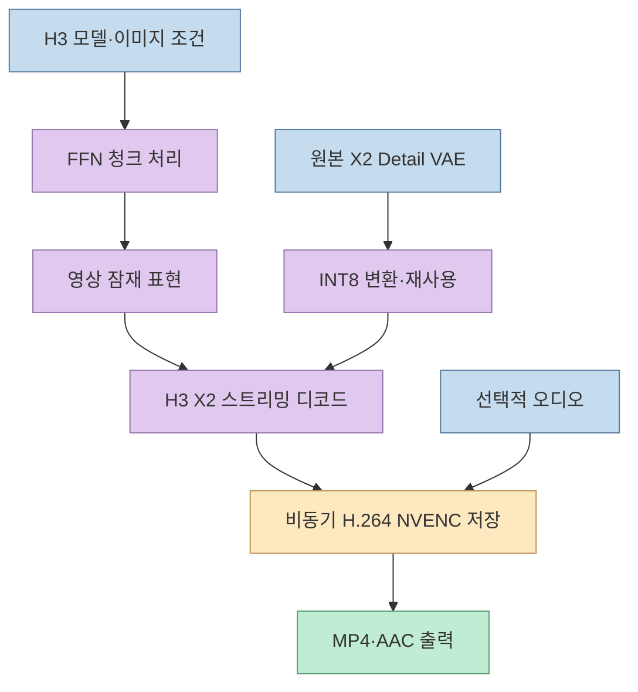
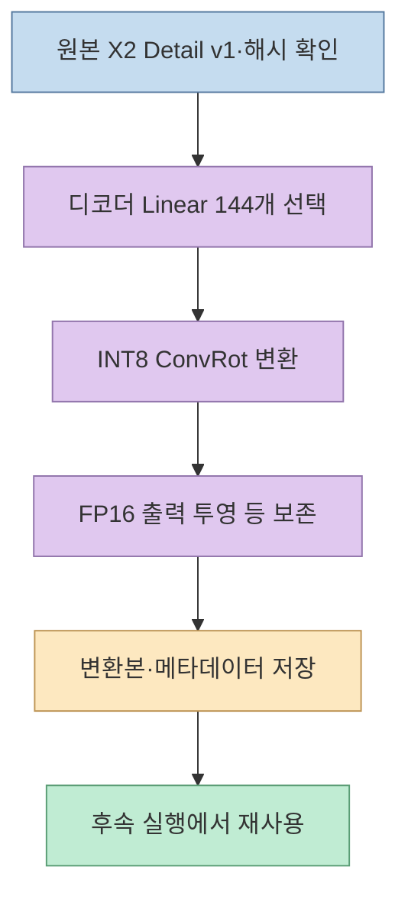
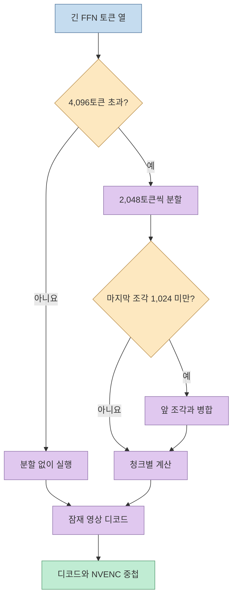
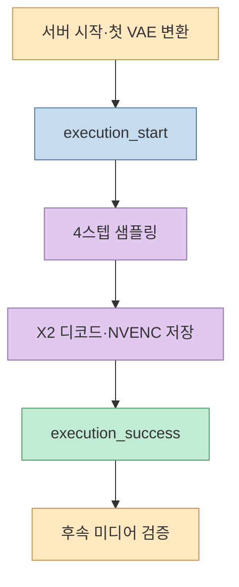
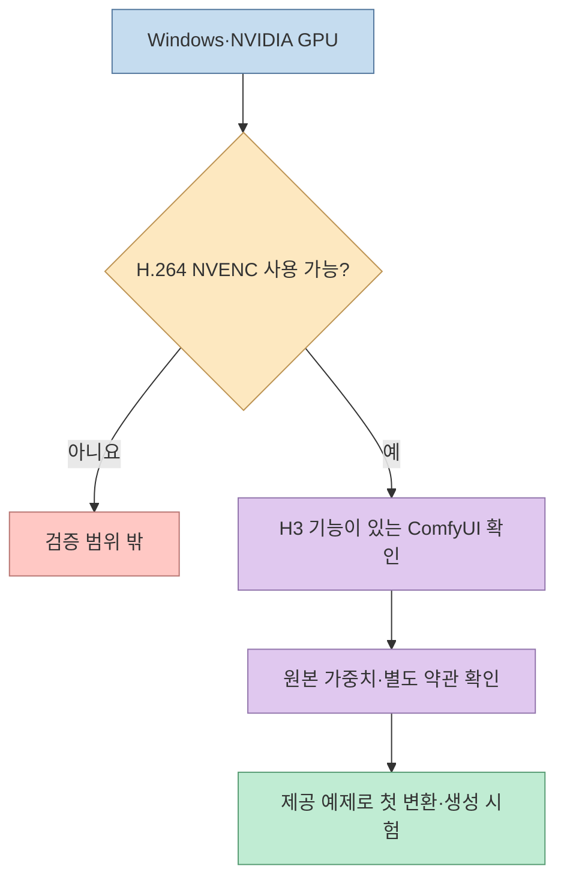

[ComfyUI-H3-X2-Stream](https://github.com/sepiablue-ai/ComfyUI-H3-X2-Stream)은 MiniMax H3 영상 워크플로에서 **X2 Detail VAE 준비, 영상 디코드·저장, FFN 메모리 처리**를 맡는 커스텀 노드 묶음이다. 개발자는 RTX 4070 12GB에서 1088×1920 출력, 124프레임, 24fps, 오디오 포함 영상을 약 60초에 완료한 구성을 공개했다. 이는 **특정 모델·하드웨어·워크플로의 측정**이며, H3 모델 전체가 1분 안에 모든 영상을 만든다는 약속은 아니다. [저장소 README](https://github.com/sepiablue-ai/ComfyUI-H3-X2-Stream)

<!--more-->

## Sources

- [ComfyUI-H3-X2-Stream 저장소](https://github.com/sepiablue-ai/ComfyUI-H3-X2-Stream) — 기능, 설치, 모델 구성, 실행 조건과 성능 측정
- [노드 정의](https://github.com/sepiablue-ai/ComfyUI-H3-X2-Stream/blob/main/nodes.py) · [INT8 변환 코드](https://github.com/sepiablue-ai/ComfyUI-H3-X2-Stream/blob/main/quantization.py) · [스트리밍 저장 코드](https://github.com/sepiablue-ai/ComfyUI-H3-X2-Stream/blob/main/streaming.py) — README의 주요 동작을 코드로 교차 확인
- [검증 기록](https://github.com/sepiablue-ai/ComfyUI-H3-X2-Stream/blob/main/docs/validation.md) · [벤치마크 데이터](https://github.com/sepiablue-ai/ComfyUI-H3-X2-Stream/blob/main/docs/benchmark.json) — 패키징 검증과 측정 조건

**자료 범위:** 원문 저장소와 그 안의 코드·기록을 확인했다. 성능 수치는 개발자가 공개한 실험 결과이며, 이 글에서 GPU로 독립 재현한 값은 아니다. 저장소의 영어 README를 HTTP로 읽고 노드·변환·검증 파일을 대조했다.

## 1. 세 노드는 H3 파이프라인의 서로 다른 병목을 다룬다

첫째, **H3 X2 Prepare INT8 VAE**는 원본 X2 Detail v1 체크포인트를 한 번 변환해 로컬에 저장하고, 다음 실행부터 변환 결과를 재사용한다. 둘째, **H3 X2 Decode + Stream Save**는 H3의 공간·시간 블렌딩을 유지하며 X2 RGB를 디코드하고, 다음 청크의 디코드와 현재 청크의 H.264 NVENC 인코딩을 겹친다. 선택한 오디오는 AAC로 저장한다. 셋째, **H3 Chunk FeedForward (X2 Stream)**는 긴 토큰 열의 FFN 계산을 청크로 나눠 처리한다. 모두 같은 성격의 "속도 노드"가 아니라 **가중치 크기·출력 메모리·토큰 처리량**이라는 다른 지점을 겨냥한다. [README](https://github.com/sepiablue-ai/ComfyUI-H3-X2-Stream), [노드 정의](https://github.com/sepiablue-ai/ComfyUI-H3-X2-Stream/blob/main/nodes.py)

**두 VAE의 역할을 혼동하면 안 된다.** 예제 워크플로에서 일반 H3 비디오 VAE는 `MiniMaxH3ImageToVideo`의 이미지 조건 입력에 남고, 변환된 X2 VAE는 최종 영상 디코드 분기에만 연결된다. 이 노드가 H3 전체 모델을 INT8로 바꾸는 것은 아니다. [README의 모델 배치 안내](https://github.com/sepiablue-ai/ComfyUI-H3-X2-Stream#models)

## 2. INT8 변환은 무엇을 줄이고 무엇을 남기는가

변환 대상은 X2 Detail v1 VAE의 **디코더 블록 Linear 가중치 144개**다. 저장소는 그룹 크기 256의 per-channel INT8 ConvRot로 이를 양자화하고, **인코더·정규화층·바이어스·최종 FP16 출력 투영**은 유지한다고 설명한다. 따라서 "VAE 전체가 INT8"이라는 표현보다 **디코더 일부 가중치의 선택적 INT8 변환**이 정확하다. 코드도 입력 체크포인트의 구조와 SHA-256을 검사한 뒤, 변환 결과에 레시피와 원본 해시 메타데이터를 기록하고 다른 파일로 저장한다. 원본은 덮어쓰지 않는다. [README의 변환 범위](https://github.com/sepiablue-ai/ComfyUI-H3-X2-Stream#rtx-4070-measurements), [변환 코드](https://github.com/sepiablue-ai/ComfyUI-H3-X2-Stream/blob/main/quantization.py)

README가 밝힌 원본 X2 VAE는 약 **5.25GB**, 변환본은 약 **2.83GB**다. 둘을 저장하면 디스크에는 두 파일이 모두 필요하며, 최초 변환 시 체크포인트를 CPU 메모리에 일시 적재한다. 테스트 PC의 RAM은 약 **48GiB**였고, 더 낮은 RAM 최소 사양은 확립되지 않았다. 디스크 용량 감소를 GPU VRAM 요구량이나 전체 모델 크기 감소와 동일시해서는 안 된다. [README 요구사항](https://github.com/sepiablue-ai/ComfyUI-H3-X2-Stream#requirements)

동일 잠재 프레임을 사용한 개발자 비교에서 FP16 기준 대비 평균 PSNR은 두 사례에서 **57.75dB·57.83dB**였다. 이는 제한된 테스트에서 수치상 차이가 작았다는 근거이지, 모든 프롬프트에 대한 지각 품질 동등성의 증명은 아니다. 최종 영상과 오디오는 눈과 귀로 확인해야 한다. [README의 화질 검증 설명](https://github.com/sepiablue-ai/ComfyUI-H3-X2-Stream#rtx-4070-measurements)

## 3. 스트리밍 저장과 FFN 청크의 실제 역할

스트리밍 저장 노드는 전체 디코드 프레임을 한 번에 `IMAGE` 출력으로 쌓지 않고, **청크 단위로 디코드하면서 NVENC 인코더에 넘긴다**. 그래서 출력 노드가 `IMAGE`를 반환하지 않으며, 뒤쪽에 프레임별 이미지 처리 노드를 연결해야 한다면 일반 디코더가 필요하다. 실패한 인코딩의 임시 영상을 완료된 MP4처럼 남기지 않는다고 README가 설명한다. 현재는 실행당 **영상 잠재 표현 1개**와 모노·스테레오 오디오 1개만 지원한다. [README의 출력 동작](https://github.com/sepiablue-ai/ComfyUI-H3-X2-Stream#generate-in-comfyui), [스트리밍 코드](https://github.com/sepiablue-ai/ComfyUI-H3-X2-Stream/blob/main/streaming.py)

FFN 노드의 `chunks=0`은 자동 모드다. 긴 입력은 기본 **2,048토큰 단위**로 나누고, 마지막 청크가 **1,024토큰 미만**이면 직전 청크에 합친다. `seq_threshold` 기본값 **4,096** 이하에서는 나누지 않는다. `chunks=1`은 이 패치를 끄며, 기존 저장 워크플로의 값을 자동으로 바꾸지 않으므로 새 모드를 쓰려면 0으로 설정해야 한다. [README의 FFN 설정](https://github.com/sepiablue-ai/ComfyUI-H3-X2-Stream#generate-in-comfyui)

## 4. "약 60초"는 어떤 조건에서 측정됐나

기준 실험은 **Windows·RTX 4070 12GB**, 4스텝 FL2VA, **544×960 샘플링 → 1088×1920 출력**, **124프레임·24fps**(약 5.17초 영상), 네이티브 오디오를 사용했다. 2026년 10월 2일의 초기 스트리밍 측정에서는 두 예제에서 각 3회 실행 중 **총 6회 중 5회가 60초 미만**이었다. 같은 README의 FP16 X2·FFN 4청크 기준선은 두 예제 각각 **86.725초·82.680초**였으나 **각 1회** 측정이다. 이 수치를 모든 영상의 평균 향상률로 일반화해서는 안 된다. [README 측정 조건](https://github.com/sepiablue-ai/ComfyUI-H3-X2-Stream#rtx-4070-measurements), [벤치마크 데이터](https://github.com/sepiablue-ai/ComfyUI-H3-X2-Stream/blob/main/docs/benchmark.json)

2026년 10월 3일의 같은 카드·같은 Case 01에서 **자동 2,048토큰 청크 중앙값 59.212초**, 종전 **8청크 중앙값 60.319초**가 각각 3회 측정됐다. 샘플러 중앙값도 38.700초에서 37.509초로 내려갔다. 개발자는 모델·프롬프트·시드·스텝·어텐션 설정을 이 비교 안에서 고정했다고 설명한다. 다른 해상도 세 쌍은 **각 모드 1회**라 개선 폭은 참고값에 머문다. [README의 10월 3일 업데이트](https://github.com/sepiablue-ai/ComfyUI-H3-X2-Stream#2048-token-ffn-update--2026-10-03)

측정 구간은 ComfyUI의 `execution_start`부터 `execution_success`까지로 **생성·디코드·저장을 포함**한다. 반면 서버 시작, 최초 INT8 변환, 실행 뒤 미디어 검증은 제외한다. 3스텝 실험은 더 빨랐지만 예제의 의상 색이 달라져 **기본 배포 워크플로는 4스텝**이다. 더 빠른 수치를 원할 때에도 프롬프트 충실도와 움직임·오디오를 별도 평가해야 한다. [README의 측정 경계](https://github.com/sepiablue-ai/ComfyUI-H3-X2-Stream#original-streaming-measurements--2026-10-02)

## 5. 설치 전 호환성과 사용 범위 확인

저장소의 재현 기준은 **ComfyUI 0.37.0의 특정 커밋**, NVIDIA CUDA GPU, 작동하는 **H.264 NVENC** 인코더다. 실제 검증은 **Windows·RTX 4070 12GB**에서 수행됐고, AMD·Apple·CPU 전용·Linux 환경은 검증되지 않았다. PyTorch 빌드에 `allow_fp16_accumulation`이 없다면 노드 옵션을 꺼야 한다. 모델 가중치는 저장소에 동봉되거나 자동 다운로드되지 않으며, `requirements.txt`도 사용 중인 ComfyUI의 Python 환경에 설치해야 한다. [README 요구사항·설치](https://github.com/sepiablue-ai/ComfyUI-H3-X2-Stream#requirements)

원본 X2 VAE는 `models/vae/`, 실험에 쓰인 확산 모델은 `models/diffusion_models/`, 텍스트 인코더는 `models/text_encoders/`에 배치한다. 첫 실행이 원본 X2 VAE의 SHA-256을 검사해 변환본을 만들고, 이후 결과를 재사용한다. ComfyUI-Manager의 Git URL 설치는 설명돼 있지만 **검증 실행은 수동 설치**였다. NVENC가 없을 때 소프트웨어 인코딩으로 조용히 대체하지도 않는다. [README 모델·실행 안내](https://github.com/sepiablue-ai/ComfyUI-H3-X2-Stream#models)

코드는 **GPL-3.0**이다. 다만 이것이 필요한 H3·X2 **모델 가중치의 사용 권한까지 허용한다는 뜻은 아니다**. 저장소 역시 원본 모델의 별도 약관을 확인하라고 명시한다. [README 저작권 안내](https://github.com/sepiablue-ai/ComfyUI-H3-X2-Stream#attribution), [NOTICE](https://github.com/sepiablue-ai/ComfyUI-H3-X2-Stream/blob/main/NOTICE.md)

## 실전 적용 포인트

1. **환경을 먼저 맞춘다.** Windows·NVIDIA·NVENC와 ComfyUI의 H3/X2 지원 버전을 확인한다. 테스트에 사용된 정확한 커밋은 재현 기준이지 모든 최신 버전 호환성 보증이 아니다.
2. **가중치를 분리해 배치한다.** 원본 X2 VAE, H3 비디오 VAE, 오디오 VAE, 확산 모델, 텍스트 인코더가 서로 다른 역할임을 확인한다. X2 변환본은 최종 디코드에만 연결한다.
3. **처음에는 제공 예제로 측정한다.** 변환 시간은 첫 실행에만 붙고, 정상 실행 시간은 따로 잰다. `chunks=0`과 8청크를 같은 시드·해상도·출력으로 비교한다.
4. **성공 기준을 시간 밖으로 넓힌다.** 출력 영상 전체 디코드, 프레임 수, 오디오, 화면의 디테일과 프롬프트 충실도를 확인한다. 스트림 노드 뒤에 이미지 프레임 처리 단계가 필요하면 별도 경로를 설계한다.

## 핵심 요약

- 이 저장소는 H3 자체가 아니라 **X2 VAE 준비·스트리밍 저장·FFN 청크 처리**를 제공한다.
- 선택적 INT8 변환은 **디코더 Linear 144개**에 적용된다. 원본 VAE와 변환본, 별도 H3 모델이 모두 필요하다.
- **약 60초**는 Windows RTX 4070 12GB의 특정 4스텝·124프레임·오디오 포함 FL2VA 결과다. 최초 변환과 서버 시작은 빠져 있다.
- NVIDIA NVENC와 해당 ComfyUI 기능이 필요하다. 다른 운영체제·GPU의 동작과 속도는 아직 이 자료로 확인되지 않는다.

## 결론

ComfyUI-H3-X2-Stream의 핵심은 모델을 새로 학습하는 것이 아니라 **기존 H3 워크플로에서 VAE 가중치·디코드 메모리·저장 단계의 병목을 분리해 다루는 것**이다. 공개된 벤치마크는 충분히 구체적이지만 검증된 하드웨어와 예제 범위가 좁다. 도입한다면 같은 워크플로에서 첫 변환, 정상 실행, 피크 메모리와 최종 영상 품질을 각각 기록하는 편이 정확하다.
