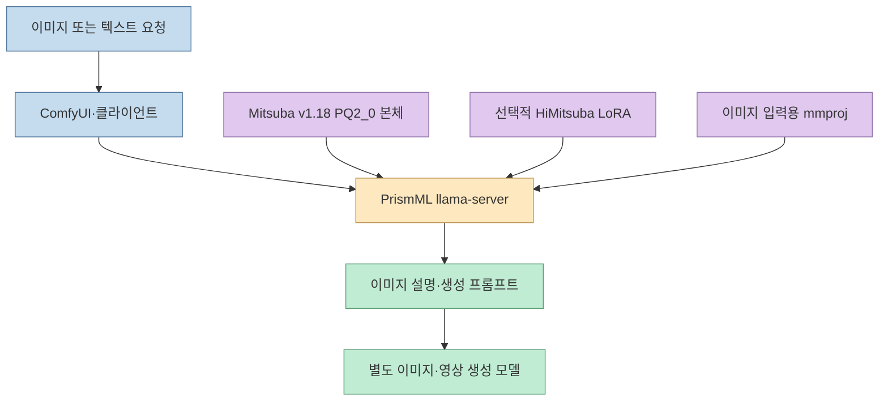
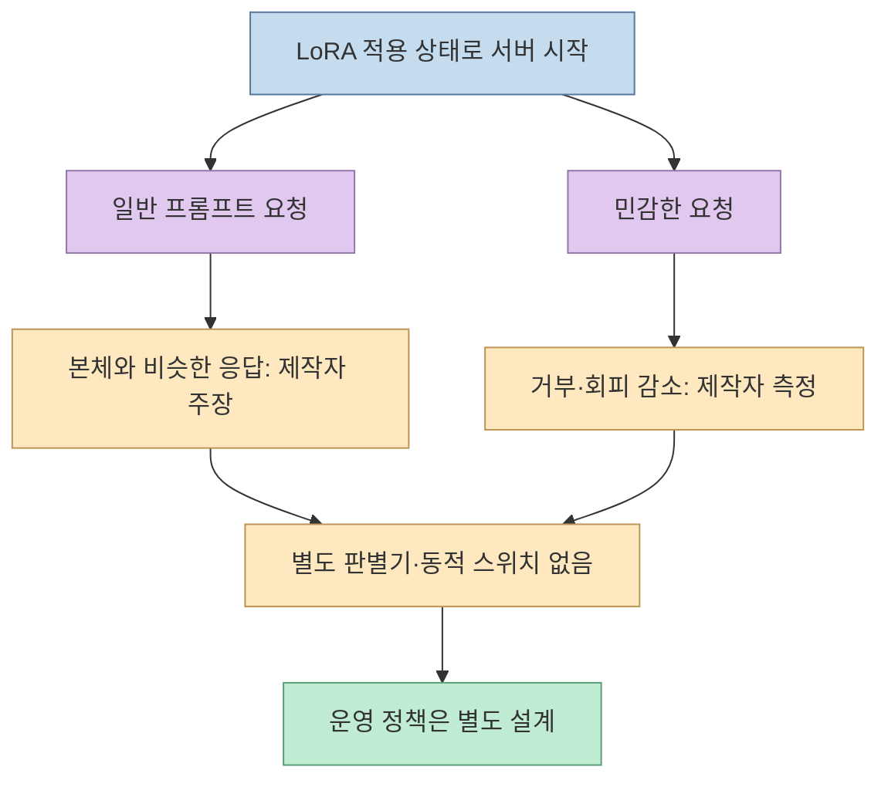
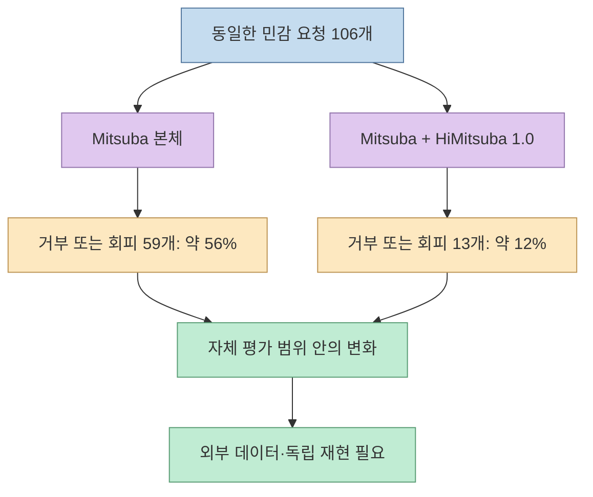
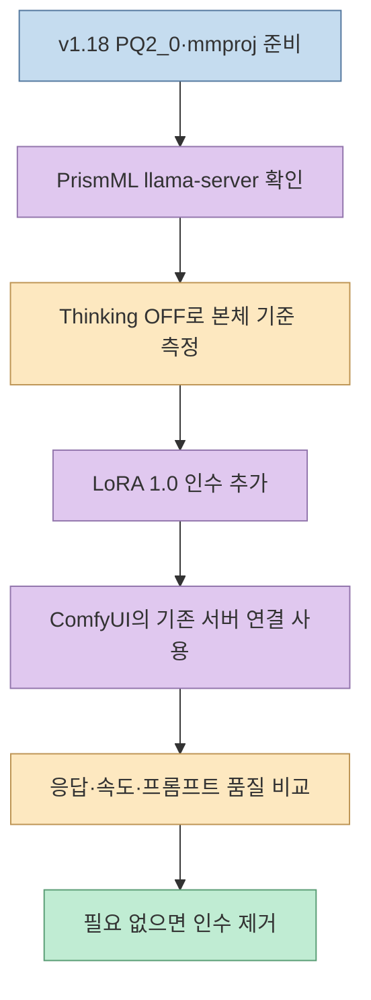

[X 게시글](https://x.com/Isichan_Hitori/status/2106726567200403506)은 ComfyUI 작업에 맞춘 비전·언어 모델 **Mitsuba-ComfyUI**에 70MB짜리 **HiMitsuba LoRA**를 추가했다고 소개한다. 발표자는 이를 "무검열" 변형이라 부르며, 민감한 요청에서 거부·회피가 **56%에서 12%로 줄었다**고 주장한다. 여기서 가장 먼저 구분할 것은 **이미지를 직접 생성하는 모델이 아니라, 이미지를 읽거나 이미지·영상 생성용 프롬프트를 작성하는 VLM**이라는 점이다. 수치도 공개된 모든 요청에 대한 보편적 성공률이 아니라 제작자의 제한된 평가 결과다.

<!--more-->

## Sources

- [원문 X 게시글](https://x.com/Isichan_Hitori/status/2106726567200403506) — HiMitsuba 발표와 사용법·평가 수치
- [Mitsuba & HiMitsuba 모델 카드](https://huggingface.co/isichan-ai/Mitsuba_and_HiMitsuba-27B-GGUF) — 파일 구성, 호환성, 사용법, 장단점
- [상세 평가 문서](https://huggingface.co/isichan-ai/Mitsuba_and_HiMitsuba-27B-GGUF/blob/main/EVALUATION.md) — 평가 축, 분모, 실행 조건과 한계
- [PrismML의 llama.cpp 포크](https://github.com/PrismML-Eng/llama.cpp) — 저비트 GGUF 형식용 런타임

**자료 범위:** X 원문은 웹 페이지에서 차단돼 트윗 JSON 대체 경로로 전문을 확인했고, Hugging Face의 모델 카드·평가 문서는 HTTP로 읽었다. 성능·행동 수치는 **모델 제작자가 공개한 자체 평가**이며 이 글에서 독립 재현하지 않았다. 평가 문서는 질문 전문을 공개하지 않는다.

## 1. 7.3GB 본체에 70MB를 더한다는 뜻

Mitsuba는 제작자가 **Qwen3.8-27B** 원본 가중치를 3값(ternary)으로 변환하고 ComfyUI용 작업에 맞게 조정했다고 설명하는 GGUF 모델이다. 권장 본체 파일 `Mitsuba-ComfyUI-27B-v1.18-PQ2_0.gguf`는 **7.32GB**, 선택적 LoRA `HiMitsuba-Uncensored-LoRA.gguf`는 **약 70MB**다. 이미지를 읽는 용도에는 별도의 비전 인코더 `mmproj-Q8_0.gguf` **약 0.63GB**도 필요하다. 이 숫자는 각각의 **파일 크기**이며, 실행 시 VRAM을 단순히 더해 계산한 값이 아니다. [모델 카드의 파일 목록](https://huggingface.co/isichan-ai/Mitsuba_and_HiMitsuba-27B-GGUF)

LoRA는 **본체를 재배포하거나 영구 수정하는 새 27B 모델이 아니다**. 서버가 본체를 로드할 때 어댑터를 적용한다. 배포자가 지원한다고 명시한 조합은 **v1.18 PQ2_0 본체 + HiMitsuba 1.0**이다. 더 작은 `PTQ1_0` 본체는 같은 저장소에 있지만, 이 LoRA의 검증 대상이 아니며 모델 카드에는 사용하지 말라고 적혀 있다. 다른 Qwen GGUF에도 무작정 붙일 수 있는 범용 LoRA로 해석하면 안 된다. [모델 카드의 HiMitsuba 설명](https://huggingface.co/isichan-ai/Mitsuba_and_HiMitsuba-27B-GGUF#himitsuba--uncensored-lora-for-pq2_0--%E7%A7%98%E4%B8%89%E8%91%89pq2_0-%E7%94%A8%E7%84%A1%E6%A4%9C%E9%96%B2-lora)

## 2. "필요할 때만 작동"은 별도 판별기가 켜고 끈다는 뜻이 아니다

원문은 평소에는 Mitsuba처럼 응답하고 민감한 요청에서만 LoRA가 효과를 낸다고 표현한다. 모델 카드에 따르면 이는 **별도 판별 모델·라우터가 요청마다 어댑터를 켜는 구조가 아니다**. LoRA는 서버 실행 중 **항상 적용**되며, 제작자의 관찰에서는 일반적인 이미지 설명·프롬프트 요청에 대한 답이 본체와 비슷하고 특정 민감 요청에 대한 응답 경향이 달라졌다는 뜻이다. 이 "선택적" 행동은 내부에 녹아든 학습 결과에 대한 **배포자의 설명**이지, 요청마다 검열 상태를 명시적으로 제어하는 기능이 아니다. [모델 카드](https://huggingface.co/isichan-ai/Mitsuba_and_HiMitsuba-27B-GGUF)

모델 카드는 "거부"와 "회피"를 구분한다. **거부**는 답을 하지 않는 것이고, **회피**는 겉으로 답하지만 요청의 핵심을 빼거나 흐리는 것이다. 어댑터는 두 행동을 줄이는 목적으로 제공된다. 그러나 "무검열"은 **모든 요청을 항상 수행한다**는 보증이 아니다. 제작자도 일부 위험한 도움 요청에는 계속 거부한다고 밝힌다. 공개 서비스라면 모델의 반응과 별개로 입력·출력 검토, 접근 통제, 사용자 동의와 운영 정책을 정해야 한다. [모델 카드의 정의](https://huggingface.co/isichan-ai/Mitsuba_and_HiMitsuba-27B-GGUF), [상세 평가](https://huggingface.co/isichan-ai/Mitsuba_and_HiMitsuba-27B-GGUF/blob/main/EVALUATION.md)

## 3. 56%→12%의 분모와 놓치기 쉬운 비용

자체 평가에서 **106개의 민감 요청** 중 "거부 또는 회피"로 분류된 수는 본체 **59개**, LoRA 적용 후 **13개**였다. 각각 반올림하면 **56%와 12%**다. 거부만 따로 보면 **51개→7개**다. 따라서 두 비율은 동일한 106개 질문에서 정의된 한 지표이지, 일반적인 이미지 생성 성공률이나 모든 분야의 안전성 점수가 아니다. "회피" 세부 지표는 **답한 특정 성 관련 설명 문항**을 분모로 해 **8/11(73%)→6/19(32%)**를 보고한다. 앞의 106개와 분모가 다르므로 숫자를 섞어 비교하면 안 된다. [모델 카드의 평가 요약](https://huggingface.co/isichan-ai/Mitsuba_and_HiMitsuba-27B-GGUF), [상세 평가](https://huggingface.co/isichan-ai/Mitsuba_and_HiMitsuba-27B-GGUF/blob/main/EVALUATION.md#himitsuba)

평가 조건은 제작자가 밝힌 **RTX 5090 32GB·PrismML llama.cpp·Thinking OFF·LoRA 강도 1.0**이다. 본체와 LoRA를 같은 질문·설정으로 비교했다고 하지만 **질문 원문은 공개되지 않았고 독립 반복 측정이나 신뢰구간도 제시되지 않는다**. 따라서 수치는 해당 평가의 방향을 보여주되, 다른 프롬프트·언어·운영 환경으로의 일반화에는 한계가 있다. [평가 조건](https://huggingface.co/isichan-ai/Mitsuba_and_HiMitsuba-27B-GGUF/blob/main/EVALUATION.md#conditions--%E6%B8%AC%E5%AE%9A%E6%9D%A1%E4%BB%B6)

같은 자체 평가에서 엄격한 조건을 모두 지킨 이미지·영상 생성 프롬프트는 **6/10→8/10**으로 늘었고, 규칙 준수 점수는 **84→84**로 같았다. 반대로 **자기통제 62.7→48.2**, 장문 독해 **48→44**, RTX 5090의 디코드 속도 **119.0→103.1토큰/초**로 떨어졌다. 특히 6/10과 8/10은 표본이 작아 "일반적인 프롬프트 성능 향상"을 확정하지 못한다. 어댑터를 붙여도 후속 생성 모델이 프롬프트를 잘 따르는지와 산출물 품질은 별도 검증해야 한다. [모델 카드의 비교](https://huggingface.co/isichan-ai/Mitsuba_and_HiMitsuba-27B-GGUF), [상세 평가](https://huggingface.co/isichan-ai/Mitsuba_and_HiMitsuba-27B-GGUF/blob/main/EVALUATION.md#himitsuba)

## 4. 실제 연결은 ComfyUI가 아니라 서버 쪽에서 바뀐다

모델 카드의 절차는 **본체 PQ2_0 파일과 LoRA를 같은 폴더에 둔 뒤**, PrismML 버전의 `llama-server` 실행 인수에 `--lora-scaled HiMitsuba-Uncensored-LoRA.gguf:1.0`을 추가하는 것이다. `:1.0`은 배포자가 평가한 강도다. 인수를 빼면 본체만 로드한다. ComfyUI의 호환 클라이언트가 이미 그 서버를 호출한다면 ComfyUI 워크플로 자체는 바꾸지 않는다는 설명이다. 단, **ComfyUI 자체가 LoRA를 읽는 것처럼 오해하면 안 된다**. 어댑터 적용 위치는 `llama-server`다. [모델 카드의 사용법](https://huggingface.co/isichan-ai/Mitsuba_and_HiMitsuba-27B-GGUF)

PQ2_0·PTQ1_0 형식은 [PrismML의 llama.cpp 포크](https://github.com/PrismML-Eng/llama.cpp)를 요구한다. 모델 카드의 평가에서는 **Thinking을 껐으며**, 켜면 이미지 이해·규칙 준수 점수가 내려가거나 응답이 비는 사례가 있었다고 보고한다. 또 **코딩 평가 4/100**으로 범용 코딩 모델로 쓰지 말라고 명시한다. 비전 인코더 `mmproj-Q8_0.gguf`와 모델 파일의 사용 약관도 함께 확인해야 한다. [모델 카드의 실행·한계](https://huggingface.co/isichan-ai/Mitsuba_and_HiMitsuba-27B-GGUF), [PrismML 포크](https://github.com/PrismML-Eng/llama.cpp)

## 실전 적용 포인트

1. **역할을 먼저 정한다.** 이 VLM에 기대할 일은 이미지 설명과 이미지·영상 생성용 프롬프트 작성이다. 실제 생성 품질은 별도의 생성 모델까지 포함해 평가한다.
2. **지원 조합을 고정한다.** `v1.18 PQ2_0` 본체, 전용 LoRA, 이미지 입력용 `mmproj`, PrismML 런타임을 구별한다. 70MB 추가만으로 전체 설치가 70MB라는 뜻은 아니다.
3. **본체와 LoRA를 나란히 검증한다.** 동일 입력으로 거부·회피뿐 아니라 프롬프트 조건 준수, 이미지 인식, 응답 속도와 불필요한 행동을 함께 기록한다.
4. **"무검열"을 운영 정책으로 대체하지 않는다.** 배포자의 민감 요청 평가가 곧 안전성 인증은 아니다. 공개 사용자에게 제공한다면 별도 검토·접근 제어와 모델·가중치 약관 확인이 필요하다.

## 핵심 요약

- **HiMitsuba는 7.32GB Mitsuba v1.18 PQ2_0용 약 70MB LoRA**이며, 이미지 생성기가 아니라 프롬프트 작성·이미지 이해 VLM에 적용된다.
- **56%→12%는 제작자의 106개 민감 요청에서 거부 또는 회피가 59개→13개였다는 뜻**이다. 질문 전문과 독립 재현은 없다.
- **LoRA는 서버에서 항상 적용**되며, 별도 판별기가 요청별로 켜고 끄는 방식이 아니다.
- 자체 평가에서 프롬프트 일부 지표가 올라간 반면 **자기통제·디코드 속도는 낮아졌다**. 범용 성능이나 안전성 개선으로 확대해서는 안 된다.

## 결론

HiMitsuba는 ComfyUI용 프롬프트 VLM의 응답 경향을 **작은 어댑터로 바꾸는 실험**이다. 설치는 한 줄 인수로 단순하지만, 효과의 범위는 **지원 본체·제작자의 평가 106문항·해당 런타임**에 묶여 있다. 실제로 채택한다면 "거부가 줄었다"는 수치뿐 아니라 작업 품질, 속도, 자기통제와 운영 책임을 함께 비교해야 한다.
