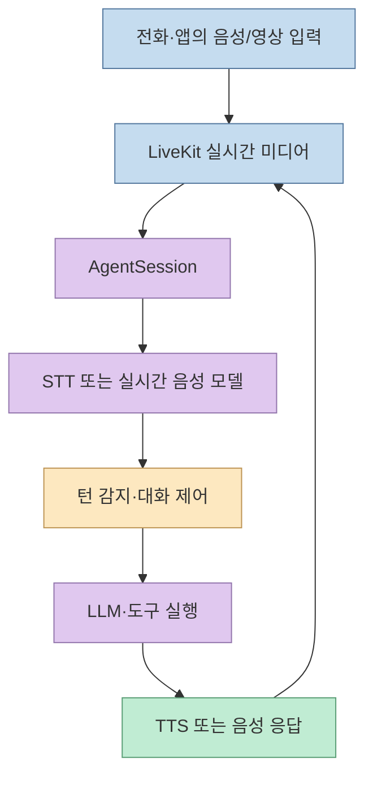
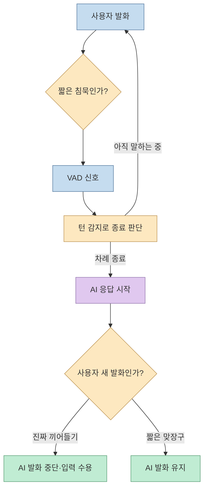
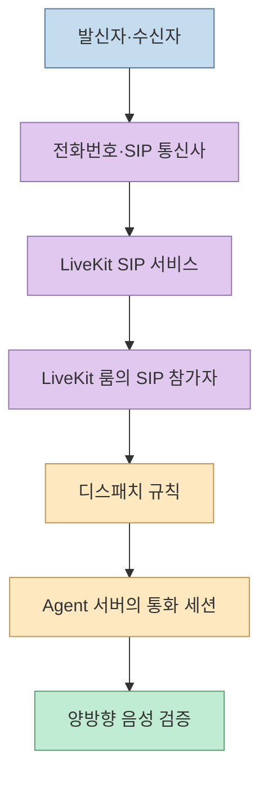
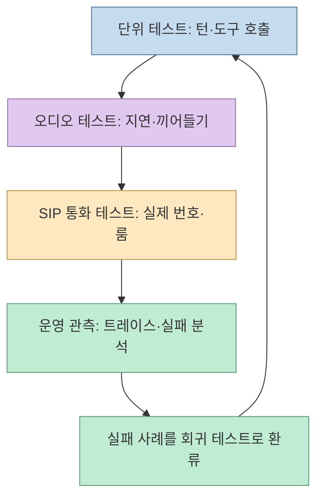

[X 게시글](https://x.com/Ryrenz/status/2106703125817991190)은 [LiveKit Agents](https://github.com/livekit/agents)를 "전화를 받고, 사람의 말을 듣고, 화면도 보는 AI"를 만드는 오픈소스 프레임워크로 소개한다. 음성 인식·언어 모델·음성 합성만 이어 붙이는 것보다 **언제 사용자가 말을 끝냈는지**, **언제 AI의 말을 끊어야 하는지**, **통화를 어떻게 연결하고 검증할지**가 더 어려운 문제라는 지적이 핵심이다. 다만 통화, 비디오, MCP, 자체 호스팅은 각각 필요한 구성요소와 지원 범위가 다르다.

<!--more-->

## Sources

- [원문 X 게시글](https://x.com/Ryrenz/status/2106703125817991190) — LiveKit Agents의 기능과 활용 가능성에 대한 소개
- [LiveKit Agents 공식 저장소](https://github.com/livekit/agents) · [AgentSession 문서](https://docs.livekit.io/agents/logic/sessions/) — 프레임워크와 세션 오케스트레이션
- [턴 감지](https://docs.livekit.io/agents/logic/turns/turn-detector/) · [턴 처리 튜닝](https://docs.livekit.io/agents/logic/turns/tuning/) — 사용자 발화 종료와 끼어들기
- [비디오 입력](https://docs.livekit.io/agents/multimodality/vision/video/) · [MCP 도구](https://docs.livekit.io/agents/logic/tools/mcp/) — 시각·도구 통합의 조건
- [SIP 자체 호스팅](https://docs.livekit.io/transport/self-hosting/sip-server/) · [테스트 개요](https://docs.livekit.io/testing/) · [자체 호스팅 비교](https://docs.livekit.io/transport/self-hosting/) — 전화, 회귀 검증, 배포 경계

**자료 범위:** X 페이지는 직접 접근이 차단돼 공개 트윗 JSON 경로로 전문을 확인했다. 공식 저장소와 문서는 웹에서 확인했다. 원문의 별·포크·이슈 수는 계속 변하는 지표라 설계 근거로 쓰지 않았다. 아래의 기능 설명은 공식 문서의 **현재 지원 조건**을 기준으로 한다.

## 1. LiveKit Agents가 해결하는 것은 모델 하나가 아닌 실시간 파이프라인이다

`AgentSession`은 사용자의 미디어·텍스트 입력을 받아 에이전트 로직, 도구 호출, 응답 생성과 출력까지 연결하는 **오케스트레이터**다. 일반적인 음성 경로에서는 음성 인식(STT), 언어 모델(LLM), 음성 합성(TTS)을 조합하고, 필요에 따라 실시간 음성 모델도 사용할 수 있다. 각 제공자를 플러그인이나 모델 설정으로 선택할 수 있지만, **어떤 제공자든 비용·지연·언어 지원·데이터 처리 조건이 같다는 뜻은 아니다**. [AgentSession 문서](https://docs.livekit.io/agents/logic/sessions/), [공식 저장소](https://github.com/livekit/agents)

## 2. "사용자가 말을 끝냈다"와 "AI의 말을 끊었다"는 별도 판단이다

말소리 유무를 보는 **VAD**만으로는 짧은 침묵이 생각 중인지 발화 종료인지 알기 어렵다. 공식 문서는 LiveKit의 턴 감지 모델이 음향 신호와 발화 의미를 함께 이용해 종료 시점을 판단한다고 설명한다. 예를 들어 사용자가 잠깐 멈췄다고 바로 AI가 말을 시작하는 문제를 줄이려는 것이다. 다만 원문이 말하는 특정 "transformer" 구조는 현재 턴 감지 문서에서 확인한 설명만으로 단정하지 않는다. 중요한 검증 대상은 모델 명칭보다 **턴 종료 오류율과 실제 대화 지연**이다. [턴 감지 문서](https://docs.livekit.io/agents/logic/turns/turn-detector/)

반대로 사용자가 AI 발화 도중 끼어들면 **interruption handling**이 AI 출력을 중단할지를 결정한다. 짧은 맞장구를 진짜 끼어들기로 오인하지 않도록 조정할 수도 있다. 두 기능은 연결돼 있지만 동일하지 않다. **턴 감지**는 사용자의 차례가 끝났는지, **끼어들기 감지**는 AI 차례에 사용자의 새 발화를 받아들일지를 판단한다. 실시간 모델이 자체 서버 측 턴 감지를 제공하는 경우에는 LiveKit의 턴 감지 설정이 그대로 적용되지 않을 수 있다. [턴 처리 튜닝](https://docs.livekit.io/agents/logic/turns/tuning/), [턴 감지 문서](https://docs.livekit.io/agents/logic/turns/turn-detector/)

현재 문서는 **전체 `v1` 턴 감지 모델을 LiveKit Inference에서 제공**하고, 자체 서버 운영 등에는 **로컬 CPU에서 실행 가능한 `v1-mini`**를 권한다. 전체 모델에 접근할 수 없으면 mini로 폴백할 수 있다. 따라서 "에이전트와 LiveKit 서버를 자체 호스팅한다"와 "턴 감지·STT·LLM·TTS를 포함한 모든 추론을 외부 연결 없이 자체 운영한다"는 별개의 주장이다. [턴 감지 문서](https://docs.livekit.io/agents/logic/turns/turn-detector/), [자체 호스팅 비교](https://docs.livekit.io/transport/self-hosting/)

## 3. 전화 수신·발신에는 SIP 인프라가 필요하다

LiveKit은 SIP를 통해 전화 통화를 실시간 룸에 연결할 수 있다. 그러나 "에이전트 코드 몇 줄"만으로 공중전화망의 번호가 생기거나 통화가 자동으로 연결되지는 않는다. 자체 호스팅에서는 **LiveKit 서버와 별도의 SIP 서버**, 번호·트렁크를 제공하는 **통신 사업자**, 수신 통화를 에이전트에 배정하는 **디스패치 규칙**이 필요하다. 발신도 트렁크와 대상 번호 설정, 에이전트 디스패치를 검증해야 한다. [SIP 서버 문서](https://docs.livekit.io/transport/self-hosting/sip-server/), [통화 테스트 문서](https://docs.livekit.io/telephony/testing/)

자체 SIP 서버 운영 시 문서는 SIP 신호 포트와 RTP 미디어 포트 범위를 인터넷에서 접근 가능하게 해야 한다고 설명한다. 이는 방화벽·인증·통신사 설정을 함께 다뤄야 한다는 뜻이다. 통화 테스트에서는 **SIP 참가자가 룸에 입장하는지**, **에이전트가 그 룸에 디스패치되는지**, **실제 양방향 음성이 들리는지**를 순서대로 확인한다. [SIP 서버 문서](https://docs.livekit.io/transport/self-hosting/sip-server/), [통화 테스트](https://docs.livekit.io/telephony/testing/)

## 4. "화면을 본다"와 "MCP를 붙인다"에도 범위가 있다

시각 입력은 **영상 트랙을 받는 것**과 **모델이 그 내용을 이해하는 것**으로 나뉜다. LiveKit은 영상 프레임을 샘플링해 대화 문맥에 넣거나, 영상 입력을 지원하는 실시간 모델과 연결하는 경로를 제공한다. 일반 STT-LLM-TTS 구성에서는 필요한 시점의 프레임을 골라 넣어야 하고, 라이브 영상 입력도 지원 모델이 필요하다. 오디오 전용 실시간 모델에 영상 입력을 켜면 프레임을 무시할 수 있다는 공식 경고가 있다. 프레임을 늘리면 지연과 토큰 비용도 늘 수 있다. [비디오 문서](https://docs.livekit.io/agents/multimodality/vision/video/)

MCP는 기존 도구를 음성 에이전트에 연결할 수 있게 해주지만, **Python Agents SDK의 기능**으로 안내돼 있다. 현재 문서는 `livekit-agents[mcp]` 의존성을 설치하고 `MCPToolset`을 `tools`에 넣는 방식을 권한다. 오래된 `mcp_servers` 인수는 폐기 예정이라고 명시한다. 즉 "이미 쓰던 MCP 서버를 바로 연결"한다는 말은 **인증, 네트워크 접근, 도구 권한과 결과 형식**까지 검토한 뒤에야 성립한다. 음성 상담 에이전트라면 외부 시스템을 변경하는 도구에 별도 확인 절차를 두는 편이 안전하다. [MCP 문서](https://docs.livekit.io/agents/logic/tools/mcp/)

## 5. 회귀 테스트와 자체 호스팅은 무엇이 남는가

LiveKit의 단위 테스트는 대화 턴별 **응답·도구 호출·핸드오프**를 검사할 수 있고, Python 문서에는 LLM 기반 `JudgeGroup`도 나온다. 이는 음성 에이전트의 로직을 반복 검증하는 기반이다. 다만 "모델 판사가 좋다고 평가했다"와 "실제 전화 통화가 성공했다"는 다르다. 통화 품질, 끼어들기, 잡음, 지연은 오디오 경로를 포함한 테스트가 필요하다. **Agent Simulations**는 시나리오에 따라 가상 사용자가 대화하고 LLM이 전체 결과를 평가하는 기능이지만, 문서상 **베타·LiveKit Cloud 실행**이다. [단위 테스트](https://docs.livekit.io/testing/unit-tests/), [시뮬레이션](https://docs.livekit.io/testing/simulations/)

LiveKit 서버와 Agent 서버는 자체 호스팅할 수 있고, SIP 서버도 별도 배포할 수 있다. 하지만 Cloud가 제공하는 **관리형 에이전트 호스팅·기본 추론·내장 관측성·시뮬레이션**이 자체 운영에 그대로 포함되는 것은 아니다. 자체 호스팅에서는 모델 제공자, 배포·스케일링, 로그·트레이스, 통화 비용과 개인정보 처리를 직접 설계해야 한다. 또 **Agents 프레임워크는 Apache-2.0**이지만, **LiveKit 턴 감지 모델에는 별도 모델 라이선스**가 적용된다. "전부 Apache-2.0"으로 단정하지 않는 편이 정확하다. [자체 호스팅 비교](https://docs.livekit.io/transport/self-hosting/), [Agents 저장소의 라이선스 안내](https://github.com/livekit/agents), [모델 라이선스](https://github.com/livekit/agents/blob/main/MODEL_LICENSE)

## 실전 적용 포인트

1. **텍스트 에이전트부터 검증한다.** 도구 호출과 응답 로직을 테스트한 뒤 STT·TTS를 붙여 지연과 턴 종료를 측정한다.
2. **실제 통화는 별도 단계로 둔다.** SIP 트렁크·번호·디스패치와 에이전트 워커를 연결하고 수신·발신 양방향으로 시험한다.
3. **턴 문제를 분류한다.** 사용자 말이 잘리면 턴 감지·최소 대기, AI가 맞장구에 끊기면 끼어들기 설정을 살핀다. 둘을 한 옵션으로 해결하려 하지 않는다.
4. **지원 범위를 명시한다.** 영상 인식은 모델과 프레임 경로, MCP는 Python 지원과 권한, 자체 호스팅은 추론 제공자·관측성·라이선스까지 확인한다.
5. **회귀 평가를 계층화한다.** 단위 테스트, 오디오 테스트, 실제 SIP 호출을 나눠 기록하고, LLM 판정은 운영 지표와 사람의 검토로 보완한다.

## 핵심 요약

- LiveKit Agents는 **실시간 미디어와 에이전트 세션을 엮는 프레임워크**다. STT·LLM·TTS 조합뿐 아니라 턴 제어·도구·배포를 다룬다.
- **턴 종료 판단과 AI 발화 중 끼어들기 판단은 별도 기능**이다. 자체 운영에서는 턴 감지 모델의 실행 위치도 확인해야 한다.
- **전화 통화에는 SIP·번호·트렁크·디스패치가 필요**하며, 영상 이해에는 프레임 전달과 지원 모델이 필요하다.
- **MCP의 권장 통합은 Python `MCPToolset`**이다. 단위 테스트는 가능하지만 Cloud의 시뮬레이션·관측성까지 자동으로 자체 호스팅되는 것은 아니다.

## 결론

원문의 강점은 음성 AI의 어려운 지점이 "좋은 모델 선택"만이 아니라 **턴 제어와 실시간 연결·검증의 엔지니어링**이라는 점을 짚은 데 있다. LiveKit Agents는 그 기반을 제공하지만, 전화번호부터 모델 추론·운영 관측까지 모든 것을 한 패키지로 해결하지는 않는다. 기능별 의존성과 테스트 범위를 분리하면 실제로 대화 가능한 음성 에이전트를 더 정확히 설계할 수 있다.
