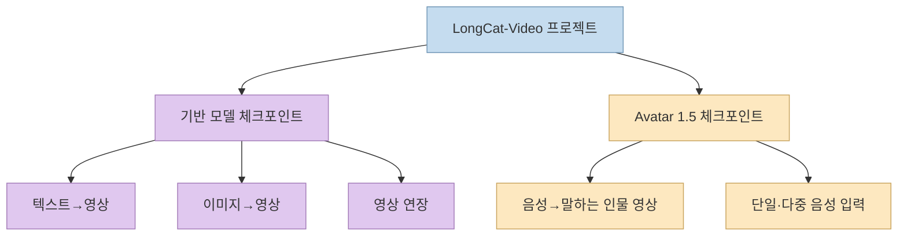
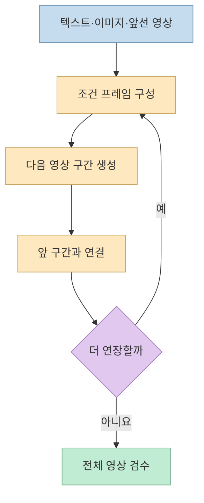
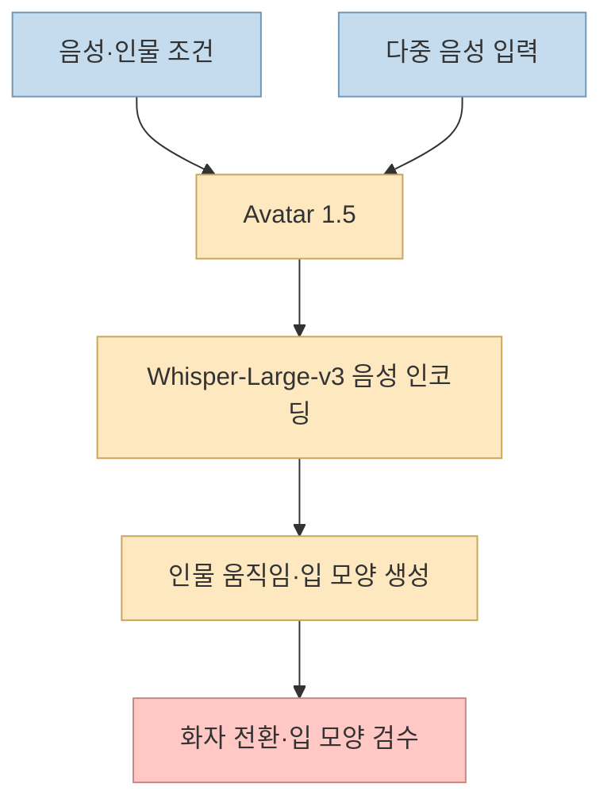
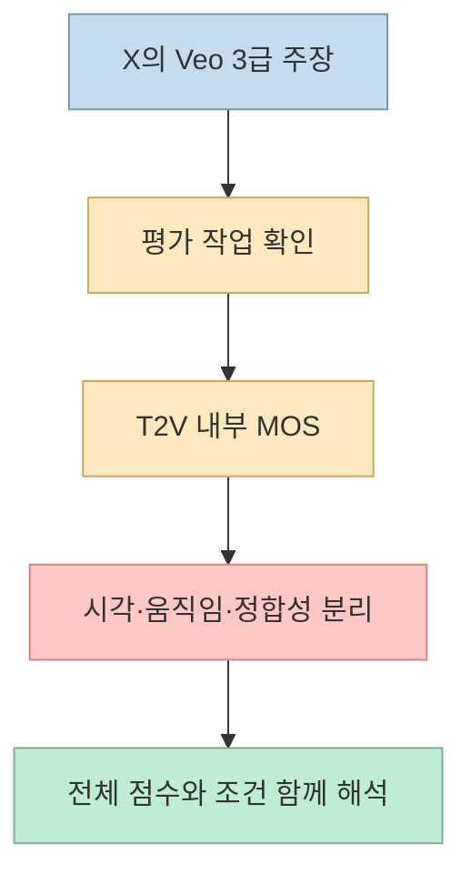
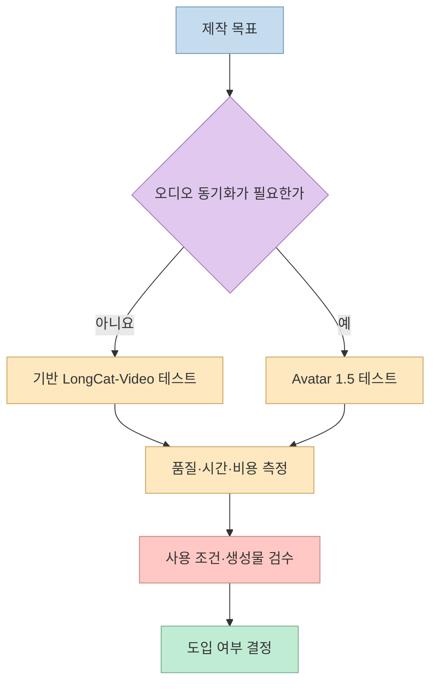

[돈벌고영의 X 게시물](https://x.com/Dontgiveup_26/status/2106524415353909566)은 Meituan의 `LongCat-Video`를 **13.6B 파라미터의 장편 영상 생성 오픈소스** 로 소개한다. 실제로 텍스트·이미지·기존 영상의 연장을 하나의 기반 모델에서 지원한다. 그러나 게시물의 “왜곡 0%”, “Veo 3급”, “립싱크까지 단일 모델”은 **공식 자료의 범위보다 넓게 읽힐 수 있다**. 이 글은 기반 모델과 음성 구동 Avatar 1.5를 분리해 기능·성능·라이선스를 확인한다. [원문](https://x.com/Dontgiveup_26/status/2106524415353909566), [공식 README](https://github.com/meituan-longcat/LongCat-Video)

<!--more-->

## Sources

- [입력 URL: 돈벌고영의 LongCat-Video 분석 게시물](https://x.com/Dontgiveup_26/status/2106524415353909566)
- [대화의 첫 게시물과 데모 영상](https://x.com/Dontgiveup_26/status/2106524412715667782)
- [LongCat-Video 공식 저장소](https://github.com/meituan-longcat/LongCat-Video)
- [LongCat-Video 기술 보고서](https://arxiv.org/abs/2510.22200)
- [LongCat-Video-Avatar 1.5 기술 보고서](https://arxiv.org/abs/2605.26486)
- [LongCat-Video 모델 카드](https://huggingface.co/meituan-longcat/LongCat-Video)
- [LongCat-Video-Avatar-1.5 모델 카드](https://huggingface.co/meituan-longcat/LongCat-Video-Avatar-1.5)
- [저장소 MIT 라이선스 전문](https://github.com/meituan-longcat/LongCat-Video/blob/main/LICENSE)

X 게시물 전문은 공개 게시물 데이터에서 확인했다. 기능·수치·라이선스는 프로젝트가 게시한 README, 두 기술 보고서와 모델 카드에 대조했다. 아래의 벤치마크는 **개발팀이 발표한 평가** 이며 이 글에서 모델을 직접 실행하거나 독립 재현한 결과는 아니다. [원문](https://x.com/Dontgiveup_26/status/2106524415353909566), [공식 README](https://github.com/meituan-longcat/LongCat-Video)

## 무엇이 하나이고 무엇이 다른가: 기반 모델과 Avatar 체크포인트

기반 **LongCat-Video** 는 13.6B 파라미터의 Diffusion Transformer 계열 모델이다. 같은 체크포인트로 **텍스트→영상(T2V), 이미지→영상(I2V), 기존 영상 이어 만들기(Video-Continuation)** 를 수행한다. 기술 보고서는 입력으로 주는 조건 프레임이 각각 **0개, 1개, 여러 개** 인 방식으로 세 작업을 통합했다고 설명한다. 즉 “세 영상 생성 작업을 한 모델에서 처리한다”는 요약은 맞다. [기반 모델 보고서](https://arxiv.org/html/2510.22200v2), [공식 README](https://github.com/meituan-longcat/LongCat-Video)

하지만 게시물은 여기에 **음성 립싱크** 를 묶어 “13.6B 단일 아키텍처”라고 표현한다. 공식 저장소의 다운로드 목록은 `LongCat-Video`, `LongCat-Video-Avatar`, `LongCat-Video-Avatar-1.5`를 **서로 다른 모델 가중치** 로 나열한다. Avatar 1.5는 음성 인코더를 Whisper-Large-v3로 바꾼 별도 음성 구동 모델이다. 같은 프로젝트·코드베이스에 들어 있다는 사실과 **하나의 체크포인트가 모든 작업을 한다** 는 주장은 다르다. [원문](https://x.com/Dontgiveup_26/status/2106524415353909566), [공식 README의 모델 목록](https://github.com/meituan-longcat/LongCat-Video), [Avatar 1.5 보고서](https://arxiv.org/abs/2605.26486)

이 구분은 설치할 때도 실질적이다. 저장소에는 기반 모델의 T2V·I2V·연장용 실행 파일과 Avatar용 실행 파일이 따로 있으며, 각 명령의 `--checkpoint_dir`도 다르다. 단순히 기반 모델을 내려받았다고 음성 립싱크 기능까지 준비된 것은 아니다. [공식 README의 실행 예시](https://github.com/meituan-longcat/LongCat-Video)

## 긴 영상은 어떻게 이어 붙이나: ‘무한·왜곡 0%’는 아니다

기반 모델은 **Video-Continuation을 사전학습 단계부터 포함** 한다. 시작 영상이나 앞서 생성한 구간을 조건으로 다음 구간을 만들기 때문에, 짧은 클립을 매번 독립적으로 생성해 수동 연결하는 방식과 다르다. 연구팀은 이 방식이 **몇 분 길이** 의 영상에서 색 드리프트와 품질 저하를 줄인다고 설명한다. 하지만 README나 논문이 **모든 길이에서 왜곡률 0%** 라는 수치 보증이나 **무제한 연장** 을 제시한 것은 아니다. 또한 “기존 비디오 AI는 5초만 넘으면 모두 무너진다”는 X 게시물의 일반화도 공식 비교 실험으로 입증되지 않는다. [원문](https://x.com/Dontgiveup_26/status/2106524415353909566), [기반 모델 보고서](https://arxiv.org/abs/2510.22200), [공식 README](https://github.com/meituan-longcat/LongCat-Video)

효율을 위해 보고서는 먼저 **480p·15fps** 로 영상을 만들고, 시간축·공간축을 정제해 **720p·30fps** 로 올리는 **coarse-to-fine** 방식을 설명한다. Block Sparse Attention은 특히 고해상도 단계의 계산을 줄이는 구성 요소다. 따라서 “720p 영상을 수 분 내 생성한다”는 표현은 프로젝트가 제시한 설계·성능 설명이지, 모든 GPU와 모든 영상 길이에서 같은 속도가 나온다는 뜻은 아니다. [기반 모델 보고서](https://arxiv.org/html/2510.22200v2), [공식 README](https://github.com/meituan-longcat/LongCat-Video)

## Avatar 1.5: Whisper, 다중 음성, 8스텝, INT8의 정확한 범위

**LongCat-Video-Avatar 1.5** 는 음성으로 인물 영상을 만드는 후속 체크포인트다. 공식 발표는 이전 Avatar에서 쓰던 Wav2Vec2 대신 **Whisper-Large-v3 음성 인코더** 를 도입했다고 설명한다. 단일 음성뿐 아니라 **여러 오디오 스트림** 을 입력하는 예시를 제공하며, 두 사람의 대화 같은 사용 사례를 겨냥한다. 그러나 “립싱크가 완벽하다”는 X 게시물의 단정과 달리, 보고서가 주장하는 것은 자체 평가에서의 향상·경쟁력이다. 실제 언어·음질·화자 전환별 정확도는 별도로 테스트해야 한다. [원문](https://x.com/Dontgiveup_26/status/2106524415353909566), [공식 README](https://github.com/meituan-longcat/LongCat-Video), [Avatar 1.5 보고서](https://arxiv.org/abs/2605.26486)

**8스텝 증류와 INT8 양자화** 도 Avatar 1.5의 선택적 실행·배포 기능으로 이해해야 한다. 보고서는 스텝 증류로 추론을 **8 NFE** 로 줄였다고 설명한다. README는 `--use_distill`과 `--use_int8` 옵션을 Avatar 1.5에 적용하며, INT8이 메모리 사용량을 줄이기 위한 기능이라고 안내한다. 이 숫자들을 기반 LongCat-Video의 모든 작업에 그대로 적용하거나, 특정 GPU에서의 속도·VRAM 절감률로 바꾸어 말할 근거는 없다. [Avatar 1.5 보고서](https://arxiv.org/abs/2605.26486), [공식 README의 Avatar 옵션](https://github.com/meituan-longcat/LongCat-Video)

## ‘Veo 3급’ 비교: 자체 평가의 어떤 점수가 비슷했나

공식 README는 **내부 Text-to-Video 평가** 에서 전체 품질의 MOS 평균을 **Veo 3 3.48, LongCat-Video 3.38** 로 제시한다. 시각 품질은 **3.23 대 3.25** 로 LongCat이 근소하게 높지만, 텍스트 정합성은 **3.99 대 3.76**, 움직임 품질은 **3.86 대 3.74** 로 Veo 3가 높다. 따라서 “모든 면에서 Veo 3를 능가했다”가 아니라 **팀의 특정 테스트에서 일부 차원은 비슷하고 전체 점수는 낮았다** 가 자료에 가까운 해석이다. [공식 README의 T2V MOS](https://github.com/meituan-longcat/LongCat-Video), [기반 모델 보고서](https://arxiv.org/abs/2510.22200)

Image-to-Video 평가도 별도로 읽어야 한다. README의 내부 비교에서 LongCat의 전체 품질 점수는 **3.17**, 비교 대상인 Wan 2.2 I2V는 **3.26** 이다. 이 수치는 연구팀이 공개한 프롬프트·평가 조건에 묶여 있으며, 다양한 제작 현장이나 최신 서비스 버전 전체로 일반화할 수 없다. **상용 모델과의 ‘대등 또는 우월’이라는 문구는 평가 항목·버전·데이터셋을 함께 써야 의미가 있다.** [공식 README의 I2V MOS](https://github.com/meituan-longcat/LongCat-Video), [기반 모델 보고서](https://arxiv.org/abs/2510.22200)

## MIT 라이선스: 상용 이용 가능과 ‘비용·책임 0’은 다르다

저장소는 코드에 **MIT 라이선스** 를 표시하고, README와 기반·Avatar 1.5 모델 카드 모두 **모델 가중치도 MIT로 배포** 한다고 밝힌다. MIT 라이선스는 사용·수정·배포·판매를 허용하므로 상용 서비스에 통합할 여지는 있다. 다만 라이선스 전문은 **저작권·허가 고지 유지** 를 요구한다. README는 Meituan의 **상표나 특허 사용 권리를 부여하지 않는다** 고도 명시한다. “상업적 100% 무료”라는 표현은 이런 조건, 인프라 비용, 입력·출력 콘텐츠의 권리 검토를 빠뜨리기 쉽다. [저장소 라이선스](https://github.com/meituan-longcat/LongCat-Video/blob/main/LICENSE), [기반 모델 카드](https://huggingface.co/meituan-longcat/LongCat-Video), [Avatar 1.5 모델 카드](https://huggingface.co/meituan-longcat/LongCat-Video-Avatar-1.5)

운영 관점에서는 세 가지를 따로 봐야 한다. **가중치를 사용할 권한** 은 라이선스로, **모델을 돌릴 비용** 은 하드웨어·서빙 구성으로, **생성물의 사용 적합성** 은 실제 데이터와 배포 맥락으로 판단한다. 모델 카드도 민감한 용도에서는 정확성·안전성·공정성을 평가하고 해당 요구사항을 확인하라고 안내한다. 이는 일반적인 실무 점검 항목이지 특정 서비스의 법적 적합성 판단을 대신하지 않는다. [기반 모델 카드](https://huggingface.co/meituan-longcat/LongCat-Video), [Avatar 1.5 모델 카드](https://huggingface.co/meituan-longcat/LongCat-Video-Avatar-1.5)

## 실전 적용 포인트

원문의 다섯 가지 활용처—긴 광고·영화 장면, 가상 인물, 2인 대화 영상, 상용 API 대체—를 검토할 때는 **먼저 필요한 체크포인트를 고른다**. 무음 장면의 T2V·I2V·연장은 기반 LongCat-Video, 음성에 맞춘 인물 영상은 Avatar 1.5가 출발점이다. 다음으로 공식 예제에서 짧은 샘플을 돌려 **얼굴·물체 일관성, 구간 경계, 색 변화, 입 모양·화자 전환, 생성 시간과 실제 VRAM** 을 기록해야 한다. 이는 공식 기능 목록과 X의 활용 제안에서 도출한 검증 순서다. [원문](https://x.com/Dontgiveup_26/status/2106524415353909566), [공식 README](https://github.com/meituan-longcat/LongCat-Video)

## 핵심 요약

- **13.6B 기반 모델** 은 T2V·I2V·영상 연장을 한 체크포인트에서 처리한다. **Avatar 1.5의 립싱크는 별도 가중치** 다. [기반 모델 보고서](https://arxiv.org/abs/2510.22200), [공식 README](https://github.com/meituan-longcat/LongCat-Video)
- 몇 분 길이의 영상과 색 안정성은 연구팀의 발표 성과지만, **무한 연장·왜곡률 0% 보증** 으로 읽으면 안 된다. [공식 README](https://github.com/meituan-longcat/LongCat-Video)
- “Veo 3급”은 **팀의 내부 T2V 평가** 에서 일부 지표가 근접했다는 뜻에 한정해야 한다. 전체 점수는 LongCat-Video가 낮다. [공식 README의 평가 결과](https://github.com/meituan-longcat/LongCat-Video)
- 코드·가중치의 MIT 배포는 확인되지만, **고지·상표·특허·서빙 비용·생성물 검토** 까지 사라지지는 않는다. [라이선스](https://github.com/meituan-longcat/LongCat-Video/blob/main/LICENSE), [모델 카드](https://huggingface.co/meituan-longcat/LongCat-Video)

## 결론

LongCat-Video의 중요한 성과는 **영상 생성과 연장을 하나의 기반 모델에 통합하고, 몇 분 길이의 생성 효율을 높이려는 설계** 다. 다만 X 게시물은 별도 Avatar 모델과 기반 모델을 합쳐 설명하고, 평가 수치를 절대적 성능 보증처럼 확대한다. 도입 여부는 화제성보다 **필요한 체크포인트, 내 영상에서의 품질, 실제 실행 비용, 사용 조건** 을 확인해 결정해야 한다.
